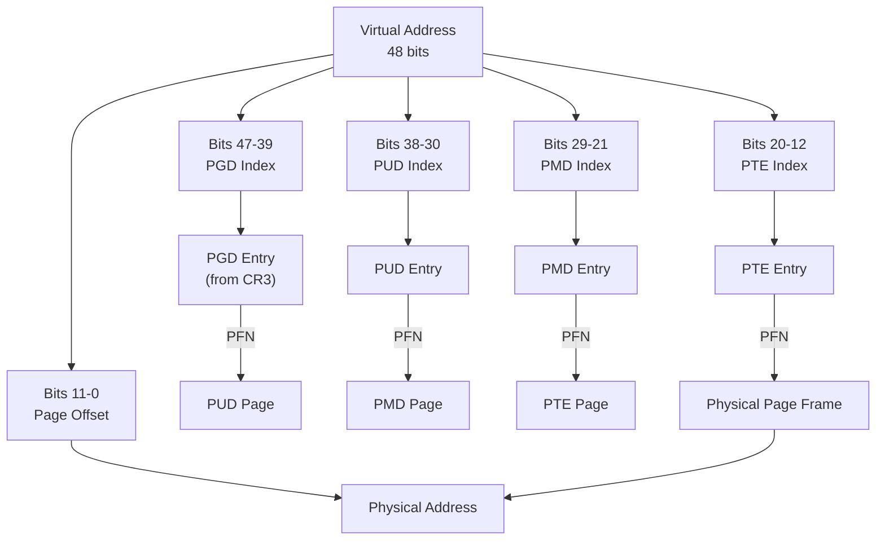
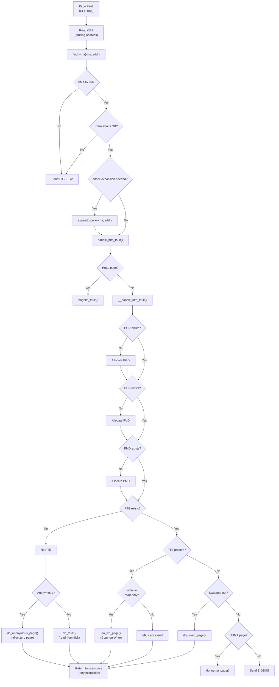
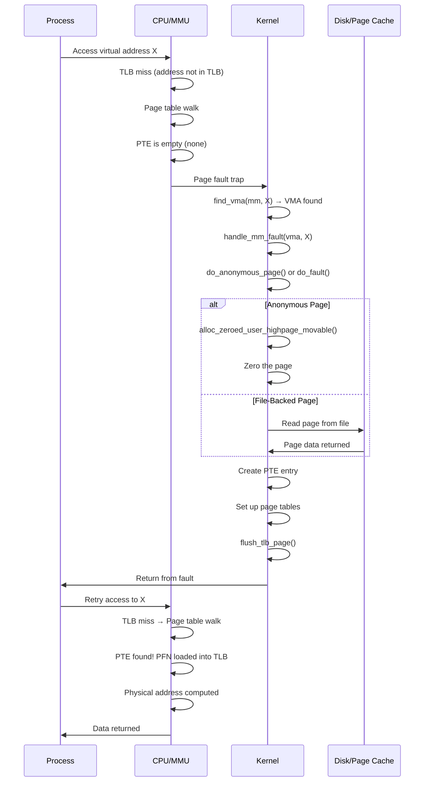

# Chapter 96: Paging and Page Tables

## Introduction

Paging is the mechanism by which virtual addresses are translated to physical addresses using a hierarchy of page tables. On modern x86-64 Linux, this is a 4-level (or 5-level) page table structure that enables efficient translation of 48-bit (or 57-bit) virtual addresses. This chapter provides a deep dive into the page table structure, page faults, and demand paging.

## 1. Intuition

### Why Page Tables?

The simplest approach to virtual-to-physical translation would be a flat array mapping every virtual page to a physical page frame. However, with 48-bit virtual addresses and 4KB pages, this would require 2^36 entries × 8 bytes = 512 GB just for the page table — more than most systems have in RAM!

The solution is a hierarchical page table structure. Only the portions of the address space that are actually in use need to have page table entries allocated. This is similar to how a book's index works — you don't list every possible word, only the ones that actually appear.

### The Tree Structure

Think of page tables as a tree. The root (PGD) has 512 children (PUDs), each of which has 512 children (PMDs), each of which has 512 children (PTEs), each of which points to a 4KB page frame. This means:

- Each PGD entry covers 512 GB
- Each PUD entry covers 1 GB
- Each PMD entry covers 2 MB
- Each PTE entry covers 4 KB

To translate a 48-bit virtual address:
1. Bits 47-39 → index into PGD (9 bits, 512 entries)
2. Bits 38-30 → index into PUD (9 bits, 512 entries)
3. Bits 29-21 → index into PMD (9 bits, 512 entries)
4. Bits 20-12 → index into PTE (9 bits, 512 entries)
5. Bits 11-0 → page offset (12 bits, 4096 bytes)

Total: 9+9+9+9+12 = 48 bits

## 2. Architecture

### 4-Level Page Table (x86-64)

```
Virtual Address (48-bit):
┌─────────┬─────────┬─────────┬─────────┬──────────────┐
│ PGD (9) │ PUD (9) │ PMD (9) │ PTE (9) │ Offset (12)  │
│ bits    │ bits    │ bits    │ bits    │ bits         │
│ 47-39   │ 38-30   │ 29-21   │ 20-12   │ 11-0         │
└────┬────┴────┬────┴────┬────┴────┬────┴──────────────┘
     │         │         │         │
     ▼         ▼         ▼         ▼
   ┌─────┐  ┌─────┐  ┌─────┐  ┌─────┐    ┌──────────┐
   │ PGD │→ │ PUD │→ │ PMD │→ │ PTE │→   │Page Frame│
   │512  │  │512  │  │512  │  │512  │    │  4 KB    │
   │entries│  │entries│  │entries│  │entries│    │          │
   └─────┘  └─────┘  └─────┘  └─────┘    └──────────┘
```

### 5-Level Page Tables (LA57)

With 57-bit virtual addresses (Ice Lake and later):

```
Virtual Address (57-bit):
┌─────────┬─────────┬─────────┬─────────┬─────────┬──────────────┐
│ PGD (9) │ P4D (9) │ PUD (9) │ PMD (9) │ PTE (9) │ Offset (12)  │
│ bits    │ bits    │ bits    │ bits    │ bits    │ bits         │
│ 56-48   │ 47-39   │ 38-30   │ 29-21   │ 20-12   │ 11-0         │
└────┬────┴────┬────┴────┬────┴────┬────┴────┬────┴──────────────┘
     │         │         │         │         │
     ▼         ▼         ▼         ▼         ▼
   ┌─────┐  ┌─────┐  ┌─────┐  ┌─────┐  ┌─────┐  ┌──────────┐
   │ PGD │→ │ P4D │→ │ PUD │→ │ PMD │→ │ PTE │→ │Page Frame│
   └─────┘  └─────┘  └─────┘  └─────┘  └─────┘  └──────────┘
```

### Linux Page Table Abstraction

Linux uses an architecture-independent abstraction with 5 levels, even on systems that only use 4 levels:

```c
/* include/linux/mm_types.h */
typedef struct { pgdval_t pgd; } pgd_t;     /* Page Global Directory */
typedef struct { p4dval_t p4d; } p4d_t;     /* Page 4 Directory (5-level) */
typedef struct { pudval_t pud; } pud_t;     /* Page Upper Directory */
typedef struct { pmdval_t pmd; } pmd_t;     /* Page Middle Directory */
typedef struct { pteval_t pte; } pte_t;     /* Page Table Entry */

/* pgtable.h provides the abstraction */
```

## 3. Kernel Implementation

### Page Table Entry Flags

Each page table entry contains both the physical address and control flags:

```c
/* x86-64 PTE format */
#define _PAGE_BIT_PRESENT    0   /* Page is present in memory */
#define _PAGE_BIT_RW         1   /* Read-only (0) or Read-write (1) */
#define _PAGE_BIT_USER       2   /* User accessible */
#define _PAGE_BIT_PWT        3   /* Page Write Through */
#define _PAGE_BIT_PCD        4   /* Page Cache Disable */
#define _PAGE_BIT_ACCESSED   5   /* Page has been accessed */
#define _PAGE_BIT_DIRTY      6   /* Page has been written to */
#define _PAGE_BIT_PSE        7   /* Page Size Extension (huge page) */
#define _PAGE_BIT_GLOBAL     8   /* Global TLB entry */
#define _PAGE_BIT_NX         63  /* No Execute */

#define _PAGE_PRESENT   (1UL << _PAGE_BIT_PRESENT)
#define _PAGE_RW        (1UL << _PAGE_BIT_RW)
#define _PAGE_USER      (1UL << _PAGE_BIT_USER)
#define _PAGE_ACCESSED  (1UL << _PAGE_BIT_ACCESSED)
#define _PAGE_DIRTY     (1UL << _PAGE_BIT_DIRTY)
#define _PAGE_PSE       (1UL << _PAGE_BIT_PSE)
#define _PAGE_GLOBAL    (1UL << _PAGE_BIT_GLOBAL)
#define _PAGE_NX        (1UL << _PAGE_BIT_NX)
```

### Page Table Walk (Kernel Code)

The kernel provides functions for walking the page table hierarchy:

```c
/* include/linux/pgtable.h */

/* Walk page tables for a given address in a given mm */
pgd_t *pgd_offset(struct mm_struct *mm, unsigned long address);
p4d_t *p4d_offset(pgd_t *pgd, unsigned long address);
pud_t *pud_offset(p4d_t *p4d, unsigned long address);
pmd_t *pmd_offset(pud_t *pud, unsigned long address);
pte_t *pte_offset_map(pmd_t *pmd, unsigned long address);

/* Check if entries are present */
static inline int pgd_present(pgd_t pgd);
static inline int p4d_present(p4d_t p4d);
static inline int pud_present(pud_t pud);
static inline int pmd_present(pmd_t pmd);
static inline int pte_present(pte_t pte);

/* Check if entries are none (not allocated) */
static inline int pgd_none(pgd_t pgd);
static inline int p4d_none(p4d_t p4d);
static inline int pud_none(pud_t pud);
static inline int pmd_none(pmd_t pmd);
static inline int pte_none(pte_t pte);

/* Extract physical address from PTE */
static inline unsigned long pte_pfn(pte_t pte);
static inline phys_addr_t pte_phys(pte_t pte);

/* Create a PTE from a PFN and flags */
static inline pte_t pfn_pte(unsigned long pfn, pgprot_t prot);
```

### Page Fault Handler

When the CPU encounters a page fault, control transfers to the kernel's page fault handler:

```c
/* arch/x86/mm/fault.c */
dotraplinkage void do_page_fault(struct pt_regs *regs, unsigned long error_code)
{
    unsigned long address = read_cr2();  /* faulting address */
    
    /* ... */
    
    __do_page_fault(regs, error_code, address);
}

static noinline void __do_page_fault(struct pt_regs *regs,
                                      unsigned long error_code,
                                      unsigned long address)
{
    struct vm_area_struct *vma;
    struct mm_struct *mm;
    unsigned int flags = FAULT_FLAG_DEFAULT;
    
    mm = current->mm;
    
    /* ... validation and flags setup ... */
    
    vma = find_vma(mm, address);
    if (unlikely(!vma)) {
        bad_area(regs, error_code, address);
        return;
    }
    
    /* Check address is within VMA */
    if (likely(vma->vm_start <= address))
        goto good_area;
    
    /* Check if stack can be expanded */
    if (unlikely(expand_stack(vma, address))) {
        bad_area(regs, error_code, address);
        return;
    }
    
good_area:
    /* Handle the fault */
    fault = handle_mm_fault(vma, address, flags, regs);
    
    /* Check result */
    if (unlikely(fault & VM_FAULT_ERROR)) {
        /* ... handle error ... */
    }
    
    /* ... */
}
```

### `handle_mm_fault` — The Core

```c
/* mm/memory.c */
vm_fault_t handle_mm_fault(struct vm_area_struct *vma,
                            unsigned long address,
                            unsigned int flags,
                            struct pt_regs *regs)
{
    vm_fault_t ret;
    
    /* ... */
    
    if (unlikely(is_vm_hugetlb_page(vma)))
        ret = hugetlb_fault(vma->vm_mm, vma, address, flags);
    else
        ret = __handle_mm_fault(vma, address, flags);
    
    return ret;
}

static vm_fault_t __handle_mm_fault(struct vm_area_struct *vma,
                                     unsigned long address,
                                     unsigned int flags)
{
    struct vm_fault vmf = {
        .vma = vma,
        .address = address & PAGE_MASK,
        .flags = flags,
        .pgoff = linear_page_index(vma, address),
        .gfp_mask = __get_fault_gfp_mask(vma),
    };
    
    struct mm_struct *mm = vma->vm_mm;
    pgd_t *pgd;
    p4d_t *p4d;
    vm_fault_t ret;
    
    /* Allocate PGD entry if needed */
    pgd = pgd_offset(mm, address);
    p4d = p4d_alloc(mm, pgd, address);
    if (!p4d)
        return VM_FAULT_OOM;
    
    /* Allocate PUD entry if needed */
    vmf.pud = pud_alloc(mm, p4d, address);
    if (!vmf.pud)
        return VM_FAULT_OOM;
    
    /* Allocate PMD entry if needed */
    vmf.pmd = pmd_alloc(mm, vmf.pud, address);
    if (!vmf.pmd)
        return VM_FAULT_OOM;
    
    /* Handle the fault at the PMD/PTE level */
    if (pmd_none(*vmf.pmd) && hugepage_vma_check(vma, vma->vm_flags,
                                                    true, true, true)) {
        /* Transparent huge page */
        ret = create_huge_pmd(&vmf);
    } else {
        ret = handle_pte_fault(&vmf);
    }
    
    return ret;
}
```

### `handle_pte_fault` — Detailed

```c
/* mm/memory.c */
static vm_fault_t handle_pte_fault(struct vm_fault *vmf)
{
    pte_t entry;
    
    if (unlikely(pmd_none(*vmf->pmd))) {
        /* Allocate page table page */
        vmf->pte = pte_alloc_map(vmf->vma->vm_mm, vmf->pmd, vmf->address);
        if (!vmf->pte)
            return VM_FAULT_OOM;
    }
    
    vmf->pte = pte_offset_map(vmf->pmd, vmf->address);
    vmf->orig_pte = *vmf->pte;
    
    if (pte_none(vmf->orig_pte)) {
        /* No PTE entry - anonymous or file page needed */
        pte_unmap(vmf->pte);
        if (vma_is_anonymous(vmf->vma))
            return do_anonymous_page(vmf);  /* Anonymous page fault */
        else
            return do_fault(vmf);           /* File-backed page fault */
    }
    
    if (!pte_present(vmf->orig_pte)) {
        /* PTE exists but page not present (swapped out or file-backed) */
        if (pte_protnone(vmf->orig_pte) && vma_is_accessible(vmf->vma))
            return do_numa_page(vmf);
        return do_swap_page(vmf);  /* Swap in the page */
    }
    
    /* Page is present but access violation */
    if (vmf->flags & FAULT_FLAG_WRITE) {
        if (!pte_write(vmf->orig_pte))
            return do_wp_page(vmf);  /* Copy-on-write */
    }
    
    /* Mark as accessed */
    entry = pte_mkyoung(vmf->orig_pte);
    if (ptep_set_access_flags(vmf->vma, vmf->address, vmf->pte,
                              entry, vmf->flags & FAULT_FLAG_WRITE)) {
        update_mmu_cache(vmf->vma, vmf->address, vmf->pte);
    }
    
    pte_unmap(vmf->pte);
    return 0;
}
```

## 4. Demand Paging

### How Demand Paging Works

When a process maps a file or allocates anonymous memory, Linux doesn't immediately allocate physical pages. Instead, it creates VMA entries and defers page allocation until the process actually accesses the memory.

```
Step 1: Process calls mmap() or malloc()
        → Kernel creates VMA (no physical pages allocated)

Step 2: Process accesses the mapped address
        → CPU triggers page fault (page not in page tables)

Step 3: Kernel page fault handler runs
        → Checks VMA permissions (is access allowed?)
        → Allocates physical page
        → Reads data from disk (for file-backed) or zeros (for anonymous)
        → Creates PTE mapping virtual → physical
        → Returns to user space

Step 4: CPU re-executes the instruction
        → TLB miss → page table walk → TLB fill
        → Memory access succeeds
```

### Anonymous Page Fault

For anonymous memory (heap, stack, `MAP_ANONYMOUS`):

```c
/* mm/memory.c */
static vm_fault_t do_anonymous_page(struct vm_fault *vmf)
{
    struct page *page;
    pte_t entry;
    
    /* Allocate a zero-filled page */
    page = alloc_zeroed_user_highpage_movable(vmf->vma, vmf->address);
    if (!page)
        return VM_FAULT_OOM;
    
    /* Create PTE entry */
    __SetPageUptodate(page);
    entry = mk_pte(page, vmf->vma->vm_page_prot);
    entry = pte_sw_mkyoung(entry);
    
    if (vma_is_writable(vmf->vma))
        entry = pte_mkwrite(pte_mkdirty(entry));
    
    /* Add to LRU list */
    page_add_new_anon_rmap(page, vmf->vma, vmf->address, false);
    lru_cache_add_inactive_or_unevictable(page, vmf->vma);
    
    /* Set the PTE */
    set_pte_at(vmf->vma->vm_mm, vmf->address, vmf->pte, entry);
    
    return 0;
}
```

### File-Backed Page Fault

For file-backed memory (shared libraries, `mmap` of files):

```c
/* mm/memory.c */
static vm_fault_t do_fault(struct vm_fault *vmf)
{
    struct vm_area_struct *vma = vmf->vma;
    vm_fault_t ret;
    
    /* ... */
    
    if (!vma->vm_ops->fault) {
        /* No fault handler - error */
        ret = VM_FAULT_SIGBUS;
    } else if (!(vmf->flags & FAULT_FLAG_WRITE)) {
        /* Read fault */
        ret = do_read_fault(vmf);
    } else if (!(vma->vm_flags & VM_SHARED)) {
        /* Private write fault (copy-on-write) */
        ret = do_cow_fault(vmf);
    } else {
        /* Shared write fault */
        ret = do_shared_fault(vmf);
    }
    
    return ret;
}

static vm_fault_t do_read_fault(struct vm_fault *vmf)
{
    struct vm_area_struct *vma = vmf->vma;
    
    /* Try page cache first */
    if (vma->vm_ops->map_pages && fault_around_bytes) {
        ret = do_fault_around(vmf);  /* Map surrounding pages too */
        if (ret)
            return ret;
    }
    
    /* Read from disk into page cache */
    ret = __do_fault(vmf);
    if (unlikely(ret & (VM_FAULT_ERROR | VM_FAULT_NOPMAP | VM_FAULT_RETRY)))
        return ret;
    
    /* Map the page */
    finish_fault(vmf);
    return ret;
}
```

### Copy-on-Write (COW)

When a process forks, parent and child share the same physical pages (marked read-only). A write causes a fault, and the kernel copies the page:

```c
/* mm/memory.c */
static vm_fault_t do_wp_page(struct vm_fault *vmf)
{
    struct vm_area_struct *vma = vmf->vma;
    
    /* ... */
    
    /* Allocate a new page */
    new_page = alloc_page_vma(GFP_HIGHUSER_MOVABLE, vma, vmf->address);
    if (!new_page)
        return VM_FAULT_OOM;
    
    /* Copy the old page to the new page */
    cow_user_page(new_page, vmf->page, vmf->address, vma);
    
    /* Update page tables to point to new page */
    entry = mk_pte(new_page, vma->vm_page_prot);
    entry = pte_mkwrite(pte_mkdirty(entry));
    
    set_pte_at_notify(mm, vmf->address, vmf->pte, entry);
    
    /* ... */
    
    return VM_FAULT_WRITE;
}
```

## 5. Page Table Operations

### Creating Page Table Entries

```c
/* Allocating a new page table page */
static inline pte_t *pte_alloc(struct mm_struct *mm, pmd_t *pmd,
                                unsigned long address)
{
    return pte_alloc_one(mm, address);
}

/* Setting a PTE */
static inline void set_pte_at(struct mm_struct *mm, unsigned long addr,
                               pte_t *ptep, pte_t pte)
{
    set_pte(ptep, pte);
}

/* Clearing a PTE */
static inline pte_t ptep_clear_flush(struct vm_area_struct *vma,
                                      unsigned long address, pte_t *ptep)
{
    pte_t pte = ptep_get_and_clear(vma->vm_mm, address, ptep);
    flush_tlb_page(vma, address);
    return pte;
}
```

### Page Table Entry Manipulation

```c
/* Creating PTEs */
pte_t mk_pte(struct page *page, pgprot_t pgprot)
{
    pte_t pte;
    pte_val(te) = page_to_pfn(page) << PAGE_SHIFT;
    pte_val(pte) |= pgprot_val(pgprot);
    return pte;
}

/* Modifying PTE flags */
static inline pte_t pte_mkwrite(pte_t pte)    { return pte_set_flags(pte, _PAGE_RW); }
static inline pte_t pte_wrprotect(pte_t pte)   { return pte_clear_flags(pte, _PAGE_RW); }
static inline pte_t pte_mkdirty(pte_t pte)      { return pte_set_flags(pte, _PAGE_DIRTY); }
static inline pte_t pte_mkclean(pte_t pte)      { return pte_clear_flags(pte, _PAGE_DIRTY); }
static inline pte_t pte_mkyoung(pte_t pte)      { return pte_set_flags(pte, _PAGE_ACCESSED); }
static inline pte_t pte_mkold(pte_t pte)        { return pte_clear_flags(pte, _PAGE_ACCESSED); }
static inline pte_t pte_mkexec(pte_t pte)       { return pte_clear_flags(pte, _PAGE_NX); }
static inline pte_t pte_mknexec(pte_t pte)      { return pte_set_flags(pte, _PAGE_NX); }
```

### TLB Flushing

When page tables are modified, the TLB must be flushed:

```c
/* Generic TLB flushing */
void flush_tlb_all(void);                    /* Flush all TLBs */
void flush_tlb_mm(struct mm_struct *mm);     /* Flush TLB for a process */
void flush_tlb_page(struct vm_area_struct *vma, unsigned long addr);  /* Flush one page */
void flush_tlb_range(struct vm_area_struct *vma, unsigned long start,
                     unsigned long end);     /* Flush a range */

/* Efficient PTE modification with TLB handling */
ptep_get_and_clear()    /* Clear PTE and return old value */
ptep_set_access_flags() /* Set PTE if it changed, flush if needed */
ptep_clear_flush()      /* Clear PTE and flush TLB */
```

## 6. Data Structures Summary

### Page Table Hierarchy

```
pgd_t[512]  →  PGD (one per process)
    │
    ├── pgd[0]   →  p4d_t[512]  →  P4D
    │       │
    │       ├── p4d[0]   →  pud_t[512]  →  PUD
    │       │       │
    │       │       ├── pud[0]   →  pmd_t[512]  →  PMD
    │       │       │       │
    │       │       │       ├── pmd[0]   →  pte_t[512]  →  PTE
    │       │       │       │       │
    │       │       │       │       ├── pte[0]   →  Page Frame (4KB)
    │       │       │       │       ├── pte[1]   →  Page Frame (4KB)
    │       │       │       │       └── ...
    │       │       │       └── ...
    │       │       └── ...
    │       └── ...
    └── ...
```

### Key Kernel Data Structures

```c
/* Page table page allocation tracking */
struct mm_struct {
    pgd_t *pgd;              /* Pointer to PGD (page global directory) */
    /* ... */
};

/* Each page table page is a regular page with:
 * - 512 entries (for x86-64)
 * - Each entry is 8 bytes
 * - Total: 4096 bytes = one page
 */
```

## 7. Mermaid Diagrams

### 4-Level Page Table Translation



### Page Fault Flow



### Demand Paging Timeline



## 8. Performance

### Page Fault Cost

Page faults are expensive operations:

| Type | Cost | Notes |
|------|------|-------|
| Minor fault (anonymous) | ~1-5 μs | Page already in memory, just needs mapping |
| Minor fault (file, cached) | ~2-10 μs | Page in page cache, just needs mapping |
| Major fault (file, not cached) | ~1-10 ms | Requires disk I/O |
| Major fault (swap) | ~1-50 ms | Requires swap I/O |

### Page Fault Reduction Strategies

1. **`madvise(MADV_WILLNEED)`**: Prefetch pages
2. **`mlock()`/`mlockall()`**: Lock pages in memory (no faults)
3. **Huge pages**: Fewer page faults for large allocations
4. **Prefaulting**: Access pages before they're needed
5. **`MAP_POPULATE`**: Pre-fault pages during `mmap()`

```c
/* MAP_POPULATE example */
void *ptr = mmap(NULL, size, PROT_READ | PROT_WRITE,
                 MAP_PRIVATE | MAP_ANONYMOUS | MAP_POPULATE, -1, 0);
/* All pages are faulted in immediately */
```

### Transparent Huge Pages (THP)

THP reduces page faults by using 2MB pages instead of 4KB:
- 512x fewer page faults for the same memory region
- Reduced TLB pressure
- But: potential memory waste and latency spikes during compaction

## 9. Security

### Page Table Isolation (PTI)

After Meltdown, Linux introduced Page Table Isolation (KPTI):

```bash
# Check if PTI is enabled
dmesg | grep -i pti
# or
grep pti /proc/cpuinfo
```

With PTI, the kernel maintains two sets of page tables:
- **Kernel page tables**: Full mapping of kernel and user space (used in kernel mode)
- **User page tables**: Minimal kernel mapping (used in user mode)

This prevents Meltdown attacks from reading kernel memory via speculative execution.

### No-Execute (NX) Protection

The NX bit prevents execution of data pages:

```c
/* Setting NX on data pages */
#define PAGE_KERNEL         __pgprot(_PAGE_PRESENT | _PAGE_RW | _PAGE_DIRTY | \
                                     _PAGE_ACCESSED | _PAGE_NX)
#define PAGE_KERNEL_EXEC    __pgprot(_PAGE_PRESENT | _PAGE_RW | _PAGE_DIRTY | \
                                     _PAGE_ACCESSED)
```

### W^X (Write XOR Execute)

Modern systems enforce that a page is either writable or executable, but not both:

```bash
# Check W^X enforcement
# PaX/grSecurity and SELinux can enforce this
```

## 10. Common Pitfalls

### 1. Assuming Page Faults Are Cheap

Page faults are expensive, especially major faults. Applications that access many previously unmapped pages will be slow.

### 2. Not Using MAP_POPULATE

For applications that need all pages immediately, `MAP_POPULATE` eliminates per-page fault overhead.

### 3. Ignoring TLB Flushing

Kernel code that modifies page tables must flush the TLB. Forgetting this causes stale translations and data corruption.

### 4. Huge Page Misalignment

Huge pages require alignment. A 2MB huge page must be aligned to a 2MB boundary.

### 5. Page Table Leaks

Kernel code that allocates page table pages must free them when the VMA is destroyed. Leaked page table pages waste memory.

## 11. Best Practices

1. **Use `MAP_POPULATE`** for small, immediately-needed mappings
2. **Use `madvise(MADV_HUGEPAGE)`** for regions that benefit from huge pages
3. **Monitor page fault rates** with `perf stat -e page-faults`
4. **Prefer `MAP_SHARED`** for read-heavy file mappings (better caching)
5. **Use `mlock()`** for latency-sensitive applications (avoids page faults)
6. **Profile TLB misses** to understand page table overhead
7. **Use `/proc/PID/smaps`** for detailed page table statistics
8. **Consider `madvise(MADV_SEQUENTIAL)`** for sequential access patterns

## 12. Exercises

### Exercise 1: Page Fault Counter

Write a C program that allocates a large array and measures the number of page faults (using `getrusage()`) during first access.

### Exercise 2: Page Table Walk

Write a kernel module that walks the page table for a given virtual address and prints each level's entry.

### Exercise 3: COW Demonstration

Write a program that demonstrates copy-on-write by forking and measuring when pages are duplicated.

### Exercise 4: MAP_POPULATE Benchmark

Compare the performance of `mmap` with and without `MAP_POPULATE` for different sizes.

### Exercise 5: Page Table Size

Write a program that maps varying amounts of memory and reports the page table overhead from `/proc/PID/status` (VmPTE, VmPMD fields).

## 13. References

1. **Linux Kernel Source**: `mm/memory.c`, `arch/x86/mm/fault.c`, `include/linux/pgtable.h`
2. **"Understanding the Linux Kernel"** by Daniel P. Bovet and Marco Cesati, Chapter 9
3. **"Linux Kernel Development"** by Robert Love, Chapter 15
4. **Intel 64 and IA-32 Architectures Software Developer's Manual**, Volume 3A, Chapter 4
5. **Linux Documentation**: `Documentation/vm/page_tables.rst`
6. **LWN.net**: "Five-level page tables"
7. **Linux man pages**: `mmap(2)`, `madvise(2)`, `getrusage(2)`
8. **"Meltdown: Reading Kernel Memory from User Space"** by Lipp et al.
