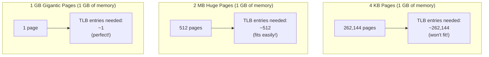
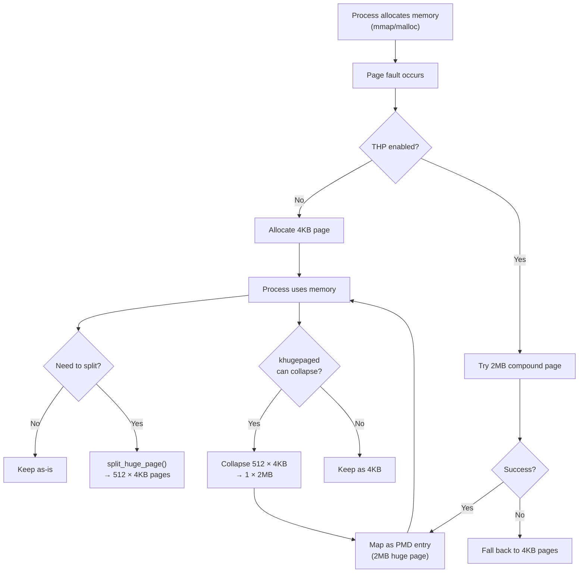
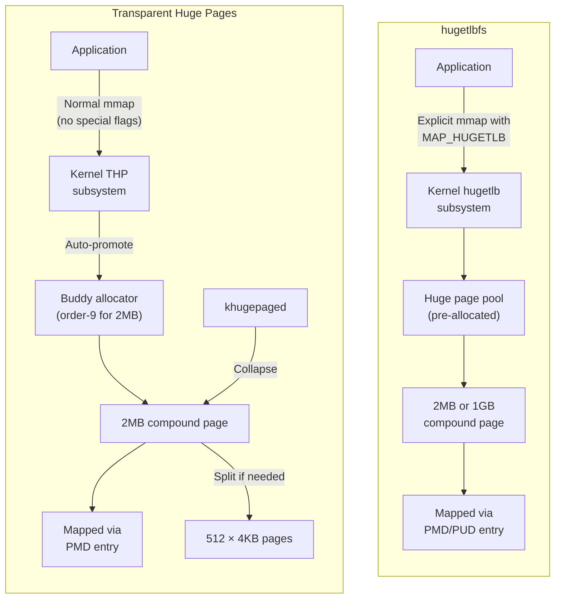

# Chapter 97: Huge Pages and THP

## Introduction

The default page size on x86-64 is 4 KB. While this granularity works well for general-purpose computing, applications with large memory footprints (databases, virtual machines, JVM heaps) suffer from excessive TLB misses and page fault overhead. Huge pages — 2 MB and 1 GB on x86-64 — dramatically reduce this overhead. Linux supports both explicit huge page allocation (hugetlbfs) and Transparent Huge Pages (THP), which automatically promotes small pages to huge pages without application changes.

## 1. Intuition

### The TLB Problem

The Translation Lookaside Buffer (TLB) caches virtual-to-physical translations. A typical CPU has:
- L1 dTLB: 64 entries
- L2 sTLB: 1536 entries

With 4 KB pages:
- 64 × 4 KB = 256 KB covered by L1 dTLB
- 1536 × 4 KB = 6 MB covered by L2 sTLB

With 2 MB huge pages:
- 64 × 2 MB = 128 MB covered by L1 dTLB
- 1536 × 2 MB = 3 GB covered by L2 sTLB

With 1 GB gigantic pages:
- 64 × 1 GB = 64 GB covered by L1 dTLB

For a 64 GB database workload, 4 KB pages require 16 million TLB entries (constant TLB misses), while 2 MB pages need only 32,768 entries (fits easily in TLB).

### Page Fault Reduction

With 4 KB pages, allocating 1 GB of memory causes 262,144 page faults. With 2 MB pages, only 512 faults. With 1 GB pages, just 1 fault. Each page fault costs 1-10 μs (minor) or 1-10 ms (major), so the savings are enormous.

### The Two Approaches

| Feature | hugetlbfs | THP |
|---------|-----------|-----|
| Explicit? | Yes (application requests) | No (automatic) |
| Page sizes | 2 MB, 1 GB | 2 MB (mostly) |
| File-backed? | Yes (hugetlbfs filesystem) | No (anonymous only by default) |
| Contiguous guarantee | Yes | No (may split) |
| Overhead | Predictable | Unpredictable (compaction) |
| Use case | Databases, VMs, DPDK | General workloads |

## 2. Architecture

### Huge Page Sizes on x86-64

The x86-64 MMU supports three page sizes:

| Size | Level | Flag | Use |
|------|-------|------|-----|
| 4 KB | PTE | — | Standard pages |
| 2 MB | PMD | PSE (bit 7) | Huge pages |
| 1 GB | PUD | PSE (bit 7) | Gigantic pages |

A 2 MB page is mapped by a single PMD entry with the PSE bit set (no PTE level needed). A 1 GB page is mapped by a single PUD entry with PSE set.

```
4 KB page:  PGD → PUD → PMD → PTE → 4 KB frame
2 MB page:  PGD → PUD → PMD → (PSE) → 2 MB frame
1 GB page:  PGD → PUD → (PSE) → 1 GB frame
```

### hugetlbfs

hugetlbfs is a RAM-based filesystem that provides huge page mappings:

```bash
# Mount hugetlbfs
mount -t hugetlbfs none /dev/hugepages

# Check available huge pages
cat /proc/meminfo | grep Huge
# HugePages_Total:    1024
# HugePages_Free:      512
# HugePages_Rsvd:      256
# HugePages_Surp:        0
# Hugepagesize:       2048 kB

# Allocate huge pages at boot (GRUB)
# hugepages=1024

# Allocate huge pages at runtime
echo 1024 > /proc/sys/vm/nr_hugepages

# Allocate 1 GB pages (gigantic pages)
echo 4 > /sys/kernel/mm/hugepages/hugepages-1048576kB/nr_hugepages
```

### Transparent Huge Pages (THP)

THP automatically promotes small pages to huge pages without application changes:

```bash
# Check THP status
cat /sys/kernel/mm/transparent_hugepage/enabled
# [always] madvise never

# Set THP mode
echo madvise > /sys/kernel/mm/transparent_hugepage/enabled

# THP modes:
# always   - Always try to use THP (default on many distros)
# madvise  - Only use THP for regions marked with madvise(MADV_HUGEPAGE)
# never    - Disable THP entirely
```

### THP Internals

When THP is enabled, the kernel:
1. On anonymous page fault: Allocates a 2 MB compound page instead of 4 KB pages
2. Uses `khugepaged` to periodically scan and collapse small pages into huge pages
3. Splits huge pages back to 4 KB when necessary (memory pressure, partial unmap)

## 3. Kernel Implementation

### hugetlbfs Page Allocation

```c
/* mm/hugetlb.c */

/* Allocate a huge page from the huge page pool */
struct page *alloc_huge_page(struct vm_area_struct *vma,
                              unsigned long addr, int avoid_reserve)
{
    struct hugepage_subpool *spool = subpool_vma(vma);
    struct hstate *h = hstate_vma(vma);
    struct page *page;
    long chg;
    
    /* Charge the subpool */
    chg = hugetlb_charge_cgroup(hstate_index(h), pages_per_huge_page(h));
    
    /* Allocate from the free list */
    page = dequeue_huge_page_node(h, 
            huge_node(vma, addr, gfp_mask, &mpol, &nodemask));
    
    if (!page) {
        /* Try to allocate from buddy system */
        page = alloc_buddy_huge_page(h, gfp_mask,
                huge_node(vma, addr, gfp_mask, &mpol, &nodemask),
                nodemask, false);
    }
    
    /* Set page flags */
    set_page_private(page, 0);
    
    return page;
}
```

### THP Allocation

```c
/* mm/huge_memory.c */

/* Allocate a transparent huge page */
struct page *thp_alloc(struct mm_struct *mm, struct vm_area_struct *vma,
                       unsigned long haddr, gfp_t gfp, int hugepage_flags)
{
    struct page *page;
    
    gfp |= __GFP_COMP | __GFP_NORETRY | __GFP_NOWARN;
    
    /* Try to allocate a 2 MB compound page */
    page = alloc_pages(gfp, HPAGE_PMD_ORDER);
    
    if (!page && (hugepage_flags & TRANSPARENT_HUGEPAGE_REQ_MADV)) {
        /* Fall back to 4 KB pages */
        return NULL;
    }
    
    return page;
}
```

### Creating a Huge PTE

```c
/* mm/huge_memory.c */

/* Create a transparent huge page mapping */
static vm_fault_t do_huge_pmd_anonymous_page(struct vm_fault *vmf)
{
    struct page *page;
    pmd_t entry;
    
    /* Allocate huge page */
    page = thp_alloc(vma->vm_mm, vmf->vma, haddr, gfp, hugepage_flags);
    if (!page)
        return VM_FAULT_FALLBACK;  /* Fall back to 4 KB pages */
    
    /* Clear the huge page */
    clear_huge_page(page, haddr, HPAGE_PMD_NR);
    
    /* Create PMD entry */
    __SetPageUptodate(page);
    entry = mk_huge_pmd(page, vmf->vma->vm_page_prot);
    
    if (vma_is_writable(vmf->vma))
        entry = pmd_mkdirty(pmd_mkwrite(entry));
    
    /* Add to rmap */
    page_add_new_anon_rmap(page, vmf->vma, haddr, true);
    
    /* Set PMD entry */
    set_pmd_at(vmf->vma->vm_mm, haddr, vmf->pmd, entry);
    
    return 0;
}
```

### THP Splitting

When a huge page needs to be split (e.g., memory compaction, partial unmap):

```c
/* mm/huge_memory.c */

/* Split a transparent huge page into 512 regular pages */
int split_huge_page_to_list(struct page *page, struct list_head *list)
{
    struct page *head = compound_head(page);
    struct anon_vma *anon_vma = NULL;
    int count, mapcount, ret;
    
    /* Can't split if pinned */
    if (PageAnon(head)) {
        anon_vma = page_anon_vma(head);
        /* ... lock ... */
    }
    
    /* Unmap the huge page from all page tables */
    try_to_unmap(head, TTU_RMAP_LOCKED);
    
    /* Split the compound page */
    __split_huge_page(head, list);
    
    /* ... */
    
    return ret;
}
```

### khugepaged

khugepaged is a kernel thread that periodically scans for regions that can be collapsed into huge pages:

```c
/* mm/khugepaged.c */

/* Main khugepaged loop */
static int khugepaged(void *none)
{
    struct khugepaged_mm_slot *mm_slot;
    
    set_freezable();
    
    while (!kthread_should_stop()) {
        /* Wait for work or timeout */
        wait_event_freezable_timeout(khugepaged_wait,
            kthread_should_stop() || khugepaged_has_work(),
            khugepaged_sleep_millisecs * HZ / 1000);
        
        /* Scan and collapse */
        while (khugepaged_has_work()) {
            mm_slot = khugepaged_next_mm_slot();
            
            /* Walk VMAs and try to collapse */
            collapse_pte_mapped_thp(mm_slot->mm, addr, /* ... */);
            
            /* ... */
        }
    }
    
    return 0;
}
```

## 4. Source Code References

### Key Source Files

- `mm/huge_memory.c` — THP implementation (PMD-level huge pages)
- `mm/hugetlb.c` — hugetlbfs implementation
- `mm/hugetlb_vmemmap.c` — HugeTLB vmemmap optimization
- `mm/khugepaged.c` — khugepaged collapse daemon
- `include/linux/huge_mm.h` — THP function declarations
- `include/linux/hugetlb.h` — hugetlb declarations

### Important Functions

```c
/* THP */
bool transparent_hugepage_active(struct vm_area_struct *vma);
vm_fault_t do_huge_pmd_anonymous_page(struct vm_fault *vmf);
int split_huge_page_to_list(struct page *page, struct list_head *list);
int hugepage_madvise(struct vm_area_struct *vma, unsigned long *vm_flags,
                     int advice);

/* hugetlb */
struct page *alloc_huge_page(struct vm_area_struct *vma,
                              unsigned long addr, int avoid_reserve);
int hugetlb_fault(struct mm_struct *mm, struct vm_area_struct *vma,
                  unsigned long address, unsigned int flags);
```

## 5. Data Structures

### Huge Page State (hstate)

```c
/* include/linux/hugetlb.h */
struct hstate {
    int next_nid_to_alloc;          /* NUMA node for next allocation */
    int next_nid_to_free;           /* NUMA node for next free */
    unsigned int order;             /* page order (9 for 2MB, 18 for 1GB) */
    unsigned int demote_order;      /* order to demote to */
    unsigned long mask;             /* mask for huge page alignment */
    unsigned long max_huge_pages;   /* max huge pages allowed */
    unsigned long nr_huge_pages;    /* current huge pages */
    unsigned long free_huge_pages;  /* free huge pages */
    unsigned long resv_huge_pages;  /* reserved huge pages */
    unsigned long surplus_huge_pages; /* surplus huge pages */
    unsigned long nr_overcommit_huge_pages;
    char name[HSTATE_NAME_LEN];    /* name (e.g., "2048kB") */
};
```

### Compound Page Structure

A huge page is a compound page — a group of contiguous pages treated as one:

```c
/* The first page (head) contains metadata */
struct page {
    unsigned long compound_head;     /* pointer to head page */
    unsigned char compound_dtor;     /* destructor index */
    unsigned char compound_order;    /* order (9 for 2MB) */
    atomic_t compound_mapcount;      /* PMD-level map count */
    atomic_t subpage_mapcount;       /* per-subpage map count (rmap) */
    struct page *first_page;         /* back-pointer from tail to head */
    /* ... */
};
```

### THP Configuration

```c
/* include/linux/huge_mm.h */
enum transparent_hugepage_flag {
    TRANSPARENT_HUGEPAGE_FLAG,
    TRANSPARENT_HUGEPAGE_REQ_MADV_FLAG,
    TRANSPARENT_HUGEPAGE_DEFRAG_DIRECT_FLAG,
    TRANSPARENT_HUGEPAGE_DEFRAG_KSWAPD_FLAG,
    TRANSPARENT_HUGEPAGE_DEFRAG_KCOMPACTD_FLAG,
    TRANSPARENT_HUGEPAGE_DEFRAG_REQ_MADV_FLAG,
    TRANSPARENT_HUGEPAGE_USE_ZERO_PAGE_FLAG,
    /* ... */
};
```

## 6. C/Assembly Examples

### Using hugetlbfs from C

```c
#include <stdio.h>
#include <stdlib.h>
#include <sys/mman.h>
#include <fcntl.h>
#include <unistd.h>
#include <string.h>

#define HUGEPAGE_SIZE (2 * 1024 * 1024)  /* 2 MB */

int main() {
    void *ptr;
    int fd;
    
    /* Method 1: mmap with MAP_HUGETLB */
    ptr = mmap(NULL, HUGEPAGE_SIZE, PROT_READ | PROT_WRITE,
               MAP_PRIVATE | MAP_ANONYMOUS | MAP_HUGETLB, -1, 0);
    
    if (ptr == MAP_FAILED) {
        perror("mmap MAP_HUGETLB");
        return 1;
    }
    
    printf("Huge page allocated at %p\n", ptr);
    
    /* Touch the memory */
    memset(ptr, 0, HUGEPAGE_SIZE);
    
    /* Method 2: hugetlbfs file */
    fd = open("/dev/hugepages/myfile", O_CREAT | O_RDWR, 0755);
    if (fd < 0) {
        perror("open hugetlbfs");
        munmap(ptr, HUGEPAGE_SIZE);
        return 1;
    }
    
    void *ptr2 = mmap(NULL, HUGEPAGE_SIZE, PROT_READ | PROT_WRITE,
                       MAP_SHARED, fd, 0);
    
    if (ptr2 != MAP_FAILED) {
        printf("hugetlbfs mapped at %p\n", ptr2);
        memset(ptr2, 0, HUGEPAGE_SIZE);
        munmap(ptr2, HUGEPAGE_SIZE);
    }
    
    close(fd);
    munmap(ptr, HUGEPAGE_SIZE);
    return 0;
}
```

### Using THP with madvise

```c
#include <stdio.h>
#include <stdlib.h>
#include <sys/mman.h>
#include <string.h>

#define SIZE (256 * 1024 * 1024)  /* 256 MB */

int main() {
    void *ptr;
    
    /* Allocate memory */
    ptr = mmap(NULL, SIZE, PROT_READ | PROT_WRITE,
               MAP_PRIVATE | MAP_ANONYMOUS, -1, 0);
    
    if (ptr == MAP_FAILED) {
        perror("mmap");
        return 1;
    }
    
    /* Request THP for this region */
    if (madvise(ptr, SIZE, MADV_HUGEPAGE) < 0) {
        perror("madvise MADV_HUGEPAGE");
    }
    
    /* Touch all pages to trigger THP allocation */
    memset(ptr, 0, SIZE);
    
    /* Check if THP was used */
    char cmd[256];
    snprintf(cmd, sizeof(cmd),
             "grep -A5 'AnonHugePages' /proc/%d/smaps | head -10",
             getpid());
    system(cmd);
    
    /* ... use the memory ... */
    
    munmap(ptr, SIZE);
    return 0;
}
```

### Checking THP Status Programmatically

```c
#include <stdio.h>
#include <stdlib.h>
#include <string.h>

int main() {
    FILE *fp;
    char line[256];
    
    /* Check global THP setting */
    fp = fopen("/sys/kernel/mm/transparent_hugepage/enabled", "r");
    if (fp) {
        fgets(line, sizeof(line), fp);
        printf("THP enabled: %s", line);
        fclose(fp);
    }
    
    /* Check THP defrag setting */
    fp = fopen("/sys/kernel/mm/transparent_hugepage/defrag", "r");
    if (fp) {
        fgets(line, sizeof(line), fp);
        printf("THP defrag: %s", line);
        fclose(fp);
    }
    
    /* Check huge page stats */
    fp = fopen("/proc/meminfo", "r");
    if (fp) {
        while (fgets(line, sizeof(line), fp)) {
            if (strstr(line, "Huge") || strstr(line, "AnonHuge"))
                printf("%s", line);
        }
        fclose(fp);
    }
    
    return 0;
}
```

## 7. Mermaid Diagrams

### Page Size Comparison



### THP Lifecycle



### hugetlbfs vs THP



## 8. Performance

### Benchmarking Huge Pages

```bash
# Measure TLB misses with 4KB pages
perf stat -e dTLB-load-misses,dTLB-store-misses ./app_4k_pages

# Measure with huge pages
perf stat -e dTLB-load-misses,dTLB-store-misses ./app_huge_pages

# Typical improvement: 2-10x reduction in TLB misses
```

### THP Latency Concerns

THP can cause latency spikes during:
- **Compaction**: kcompactd reorganizes memory to create contiguous regions
- **Splitting**: Splitting a huge page during memory pressure
- **Deferred splitting**: Splitting can be deferred and cause later latency

```bash
# Monitor THP events
cat /proc/vmstat | grep thp
# thp_fault_alloc     - THP allocations on fault
# thp_fault_fallback  - Times THP allocation failed, fell back to 4KB
# thp_collapse_alloc  - khugepaged collapses
# thp_split_page      - THP splits
# thp_split_page_failed - Failed splits

# Monitor compaction
cat /proc/vmstat | grep compact
```

### THP Tuning

```bash
# Disable THP compaction (reduce latency spikes)
echo defer+madvise > /sys/kernel/mm/transparent_hugepage/defrag

# Only enable THP for MADV_HUGEPAGE regions
echo madvise > /sys/kernel/mm/transparent_hugepage/enabled

# Disable khugepaged (for latency-sensitive apps)
echo 0 > /sys/kernel/mm/transparent_hugepage/khugepaged/pages_to_scan

# Per-process THP control
echo never > /proc/<PID>/thp_enabled
```

### Memory Overhead

Huge pages can waste memory due to internal fragmentation:
- A 2 MB huge page for a 100 KB allocation wastes 1.9 MB
- The `AnonHugePages` field in `/proc/PID/smaps` shows actual THP usage

```bash
# Check THP usage per process
cat /proc/<PID>/smaps | grep AnonHugePages
```

## 9. Security

### ASLR and Huge Pages

Huge pages have stricter alignment requirements, which can reduce ASLR entropy:
- 2 MB pages: alignment reduces entropy by ~9 bits (from 28 to ~19 bits for mmap)
- 1 GB pages: even more restrictive

### hugetlbfs Security

- hugetlbfs files have standard file permissions
- The `hugetlb_shm_group` sysctl controls which groups can use huge pages
- Huge pages are pinned and cannot be swapped (sensitive data stays in RAM)

```bash
# Set the group allowed to use huge pages
echo 1000 > /proc/sys/vm/hugetlb_shm_group
```

### Memory Overcommit

Huge pages are reserved at allocation time, not on demand. This means:
- Huge page allocation can fail even with sufficient free memory
- Overcommit doesn't apply to huge pages in the same way

## 10. Huge Page Fragmentation

Memory fragmentation is the primary enemy of huge page allocation. Even when the system has sufficient free memory, it may not have enough contiguous free pages to form a 2 MB huge page.

### How Fragmentation Occurs

```
Physical memory (16 pages, order-2 = 4 pages needed):
[F][U][F][U][F][U][F][U][F][U][F][U][F][U][F][U]
 F = Free, U = Used

All 8 free pages exist, but no 4 are contiguous!
Buddy system can't satisfy order-2 request.
```

### Compaction

The kernel runs compaction to defragment memory:

```bash
# Trigger compaction manually
echo 1 > /proc/sys/vm/compact_memory

# Monitor compaction
cat /proc/vmstat | grep compact
# compact_blocks_moved 12345
# compact_pages_moved 67890
# compact_pagemigrate_failed 12
# compact_stall 5
```

### Defrag Modes for THP

```bash
# THP defrag modes
cat /sys/kernel/mm/transparent_hugepage/defrag
# [always] defer defer+madvise madvise never

# always: Always compact (high latency, best THP allocation)
# defer: Compact in background (lower latency)
# defer+madvise: Background for MADV_HUGEPAGE, direct for others
# madvise: Only compact for MADV_HUGEPAGE regions
# never: Don't compact (some THP allocations will fail)
```

### CMA (Contiguous Memory Allocator)

For guaranteed huge page availability, use CMA:

```bash
# Reserve CMA region at boot
# In GRUB: cma=128M

# View CMA stats
cat /proc/meminfo | grep Cma
# CmaTotal:    131072 kB
# CmaFree:     102400 kB
```

### Per-Process THP Control

```bash
# Disable THP for specific process
echo never > /proc/<PID>/thp_enabled

# Check THP status for process
grep -i thp /proc/<PID>/smaps | head
```

### Huge Page Statistics

```bash
# View huge page statistics
cat /proc/vmstat | grep thp
# thp_fault_alloc - THP allocations on page fault
# thp_fault_fallback - THP allocation failures (fell back to 4KB)
# thp_collapse_alloc - khugepaged successful collapses
# thp_collapse_alloc_failed - khugepaged failed collapses
# thp_split_page - THP splits
# thp_split_page_failed - THP split failures

# Per-NUMA-node huge page info
cat /sys/devices/system/node/node*/hugepages/hugepages-2048kB/nr_hugepages
```

## 11. Common Pitfalls

### 1. Insufficient Huge Pages

```bash
# Check if huge page allocation failed
dmesg | grep -i huge
# "hugepagepool: Couldn't allocate hugepage"
```

### 2. THP Latency Spikes

For latency-sensitive applications (trading systems, real-time), THP can cause unpredictable pauses:

```bash
# Disable THP for latency-sensitive workloads
echo never > /sys/kernel/mm/transparent_hugepage/enabled
# Or per-process
madvise(addr, size, MADV_NOHUGEPAGE)
```

### 3. Memory Bloat from THP

THP can cause memory bloat when small allocations use 2 MB pages:

```bash
# Monitor actual vs allocated memory
grep AnonHugePages /proc/<PID>/smaps | awk '{sum+=$2} END {print sum " kB"}'
```

### 4. NUMA and Huge Pages

Huge pages must be allocated from a single NUMA node. If the node is fragmented, allocation fails even if total free memory is sufficient.

### 5. hugetlbfs Mount Permissions

Forgetting to mount hugetlbfs or set correct permissions:

```bash
mount -t hugetlbfs -o gid=1000,mode=0770 none /dev/hugepages
```

## 11. Best Practices

1. **Use hugetlbfs for guaranteed huge pages** (databases, VMs, DPDK)
2. **Use THP with `madvise` mode** for general workloads
3. **Disable THP for latency-sensitive applications**
4. **Pre-allocate huge pages at boot** for critical workloads
5. **Monitor THP events** (`/proc/vmstat thp_*`)
6. **Set `vm.nr_hugepages`** based on workload requirements
7. **Use `MADV_HUGEPAGE`** to hint THP for specific regions
8. **Use `MADV_NOHUGEPAGE`** to exclude regions from THP
9. **Profile TLB misses** to verify huge page effectiveness
10. **Consider NUMA placement** when allocating huge pages

## 12. Exercises

### Exercise 1: Huge Page Allocation

Write a C program that allocates 1 GB of memory using hugetlbfs and measures the time compared to regular 4 KB pages.

### Exercise 2: THP Demonstration

Write a program that allocates memory, uses `madvise(MADV_HUGEPAGE)`, and verifies THP usage from `/proc/PID/smaps`.

### Exercise 3: TLB Miss Comparison

Benchmark a memory-intensive workload with and without huge pages, measuring TLB misses with `perf`.

### Exercise 4: khugepaged Observation

Write a program that allocates many small pages and watches `/proc/vmstat` to observe khugepaged collapsing them into huge pages.

### Exercise 5: Huge Page Pool Sizing

Write a script that analyzes a system's memory usage and recommends appropriate huge page pool sizes.

## 13. References

1. **Linux Kernel Source**: `mm/huge_memory.c`, `mm/hugetlb.c`, `mm/khugepaged.c`
2. **"Understanding the Linux Kernel"** by Daniel P. Bovet and Marco Cesati
3. **Linux Documentation**: `Documentation/admin-guide/mm/transhuge.rst`
4. **Linux Documentation**: `Documentation/admin-guide/mm/hugetlbpage.rst`
5. **Linux man pages**: `mmap(2)`, `madvise(2)`, `hugetlb(7)`
6. **"Huge Pages: a Python library for hugepages"** — various papers on TLB optimization
7. **LWN.net**: "Transparent huge pages in 2.6.38"
8. **Intel 64 and IA-32 Architectures Software Developer's Manual**, Volume 3A
