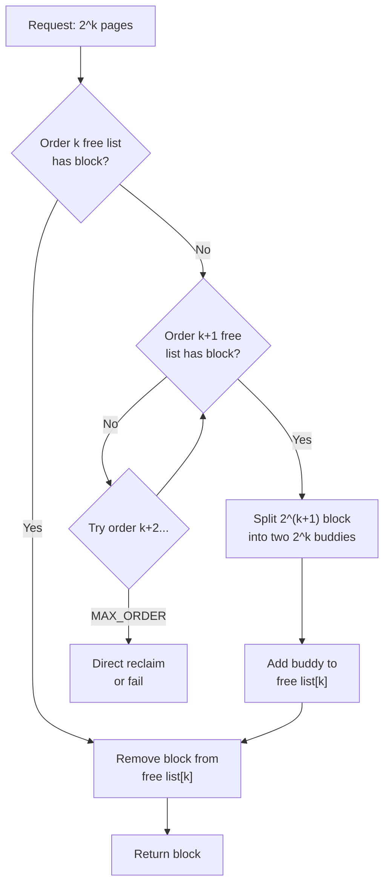
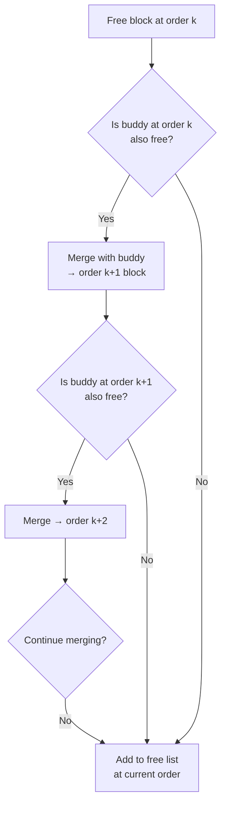
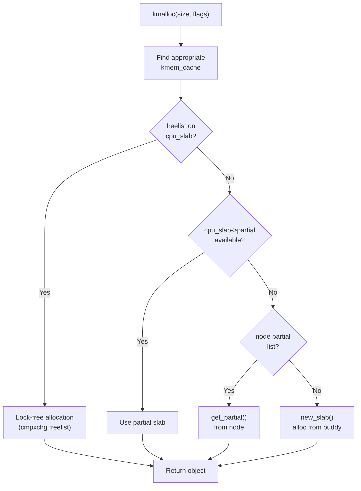

# Chapter 98: Memory Allocators

## Introduction

Linux has a layered memory allocation system. At the bottom, the buddy system manages physical page frames. Above it, slab allocators (SLAB, SLUB, SLOB) handle small kernel object allocations efficiently. For user space, `malloc()` ultimately requests memory from the kernel via `brk()` or `mmap()`. This chapter explores each layer, from the buddy system through `kmalloc` and `vmalloc`.

## 1. Intuition

### The Allocation Problem

Allocating memory seems simple — just find free pages. But several challenges exist:

1. **External fragmentation**: Free memory is scattered in small pieces
2. **Internal fragmentation**: Allocated blocks are larger than needed
3. **Performance**: Allocation must be fast (called millions of times per second)
4. **Cache efficiency**: Nearby allocations should be cache-friendly
5. **Concurrency**: Multiple CPUs allocating simultaneously

Linux solves these with a layered approach:

```
User Space:    malloc() / free()
                    │
                    ▼
C Library:     glibc allocator (ptmalloc2)
                    │
                    ▼
Kernel:        brk() / mmap() / munmap()
                    │
                    ▼
VMA Layer:     Virtual memory management
                    │
                    ▼
Page Allocator: Buddy system (page-granularity)
                    │
                    ▼
Slab Allocator: kmalloc / kmem_cache (sub-page)
                    │
                    ▼
Hardware:      Physical RAM
```

## 2. The Buddy System

### How It Works

The buddy system manages free page frames in power-of-2 sized blocks. Each zone has free lists for orders 0 through MAX_ORDER (typically 11, so blocks from 4 KB to 4 MB).

**Allocation**: When allocating 2^k pages, check the order-k free list. If empty, split a 2^(k+1) block into two "buddies" and use one. If that list is also empty, split a 2^(k+2) block, etc.

**Freeing**: When freeing 2^k pages, check if the buddy (the adjacent 2^k block) is also free. If so, merge them into a 2^(k+1) block and repeat.

```
Order 0:  [4KB] [4KB] [4KB] [4KB] [4KB] [4KB] [4KB] [4KB]
Order 1:  [8KB          ] [8KB          ] [8KB          ] [8KB          ]
Order 2:  [16KB                                ] [16KB                                ]
Order 3:  [32KB                                                                ]
...
Order 10: [4MB]
```

### Buddy Pair Calculation

Two blocks are buddies if they are:
- Same size
- Adjacent in physical address space
- Combined, they form a block of the next order

```c
/* Given a PFN and order, compute the buddy PFN */
static inline unsigned long buddy(unsigned long pfn, unsigned int order)
{
    return pfn ^ (1 << order);
}
```

For example, with order 0 (4 KB pages):
- PFN 0 and PFN 1 are buddies
- PFN 2 and PFN 3 are buddies
- PFN 4 and PFN 5 are buddies

With order 1 (8 KB blocks):
- PFN 0-1 and PFN 2-3 are buddies
- PFN 4-5 and PFN 6-7 are buddies

## 3. Kernel Implementation

### Buddy System Allocator

```c
/* mm/page_alloc.c */

/* Allocate pages from the buddy system */
struct page *__alloc_pages_nodemask(gfp_t gfp_mask, unsigned int order,
                                     int preferred_nid, nodemask_t *nodemask)
{
    struct page *page;
    struct alloc_context ac = {
        .zonelist = node_zonelist(preferred_nid, gfp_mask),
        .nodemask = nodemask,
        .migratetype = gfpflags_to_migratetype(gfp_mask),
    };
    
    /* Try each zone in the zonelist */
    page = get_page_from_freelist(alloc_gfp, order, alloc_flags, &ac);
    
    if (!page) {
        /* Direct reclaim if needed */
        page = __alloc_pages_slowpath(gfp_mask, order, &ac);
    }
    
    return page;
}

/* Core allocation function */
static struct page *get_page_from_freelist(gfp_t gfp_mask, unsigned int order,
                                            unsigned int alloc_flags,
                                            const struct alloc_context *ac)
{
    struct zoneref *z;
    struct zone *zone;
    struct page *page;
    
    for_next_zone_zonelist_nodemask(zone, z, ac->zonelist,
                                     ac->high_zoneidx, ac->nodemask) {
        /* Check watermarks */
        if (!zone_watermark_fast(zone, order, mark, ac_classzone_idx(ac),
                                  alloc_flags))
            continue;
        
        /* Try to allocate from this zone */
        page = rmqueue(ac->preferred_zoneref->zone, zone, order,
                       gfp_mask, alloc_flags, ac->migratetype);
        if (page) {
            /* ... set up page ... */
            return page;
        }
    }
    
    return NULL;
}

/* Remove a block from the free list */
static inline struct page *rmqueue(struct zone *preferred_zone,
                                    struct zone *zone, unsigned int order,
                                    gfp_t gfp_flags, unsigned int alloc_flags,
                                    int migratetype)
{
    struct page *page;
    
    if (likely(order == 0)) {
        /* Use per-cpu page list for order-0 (fast path) */
        page = rmqueue_pcplist(preferred_zone, zone, order,
                               gfp_flags, migratetype);
    } else {
        /* Use buddy system for higher orders */
        page = __rmqueue(zone, order, migratetype);
    }
    
    return page;
}

/* Remove from buddy free list */
static __always_inline struct page *__rmqueue(struct zone *zone,
                                                unsigned int order,
                                                int migratetype)
{
    struct page *page;
    
    /* Try preferred migrate type */
    page = __rmqueue_smallest(zone, order, migratetype);
    if (unlikely(!page)) {
        /* Fall back to other migrate types */
        page = __rmqueue_fallback(zone, order, migratetype);
    }
    
    return page;
}

/* Find and remove smallest available block */
static __always_inline struct page *__rmqueue_smallest(struct zone *zone,
                                                         unsigned int order,
                                                         int migratetype)
{
    unsigned int current_order;
    struct free_area *area;
    struct page *page;
    
    for (current_order = order; current_order < MAX_ORDER; ++current_order) {
        area = &(zone->free_area[current_order]);
        page = list_first_entry_or_null(&area->free_list[migratetype],
                                         struct page, lru);
        if (!page)
            continue;
        
        /* Remove from free list */
        list_del(&page->lru);
        rmv_page_order(page);
        area->nr_free--;
        
        /* Split down to requested order */
        expand(zone, page, order, current_order, migratetype);
        
        return page;
    }
    
    return NULL;
}

/* Split a larger block into smaller ones */
static inline void expand(struct zone *zone, struct page *page,
                           int low, int high, int migratetype)
{
    unsigned long size = 1 << high;
    
    while (high > low) {
        free_area--;
        high--;
        size >>= 1;
        
        /* Add the buddy half to the free list */
        list_add(&page[size].lru, &free_area->free_list[migratetype]);
        set_page_order(&page[size], high);
        free_area->nr_free++;
    }
}
```

### Freeing Pages

```c
/* mm/page_alloc.c */

/* Free pages back to the buddy system */
void __free_pages(struct page *page, unsigned int order)
{
    if (put_page_testzero(page))
        free_the_page(page, order);
}

static void free_the_page(struct page *page, unsigned int order)
{
    if (order == 0) {
        /* Use per-cpu free list for order-0 */
        free_unref_page(page);
    } else {
        /* Use buddy system for higher orders */
        __free_pages_ok(page, order);
    }
}

/* Core free function with buddy coalescing */
static void __free_pages_ok(struct page *page, unsigned int order)
{
    unsigned long pfn = page_to_pfn(page);
    struct zone *zone = page_zone(page);
    int migratetype;
    
    /* Get migrate type from page */
    migratetype = get_pfnblock_migratetype(page, pfn);
    
    /* Free to buddy system */
    free_one_page(zone, page, pfn, order, migratetype);
}

static void free_one_page(struct zone *zone, struct page *page,
                           unsigned long pfn, unsigned int order,
                           int migratetype)
{
    struct free_area *area = &zone->free_area[order];
    
    /* Merge with buddy blocks */
    while (order < MAX_ORDER - 1) {
        struct page *buddy;
        unsigned long buddy_pfn = buddy(pfn, order);
        
        buddy = page + (buddy_pfn - pfn);
        
        if (!page_is_buddy(page, buddy, order))
            break;
        
        /* Merge with buddy */
        list_del(&buddy->lru);
        area->nr_free--;
        rmv_page_order(buddy);
        
        /* Combined block starts at lower PFN */
        page = page + (buddy_pfn - pfn < 0 ? 0 : (buddy_pfn - pfn));
        pfn = min(pfn, buddy_pfn);
        order++;
        area = &zone->free_area[order];
    }
    
    /* Add merged block to free list */
    set_page_order(page, order);
    list_add(&page->lru, &area->free_list[migratetype]);
    area->nr_free++;
}
```

## 4. Slab Allocators

### Why Slab Allocation?

The buddy system allocates in page granularity (minimum 4 KB). Kernel objects are often much smaller (e.g., `struct task_struct` is ~6 KB, `struct inode` is ~600 bytes). Allocating a full page for each small object wastes memory.

Slab allocators sit on top of the buddy system and provide sub-page allocations.

### SLUB Allocator (Default)

SLUB is the default slab allocator in modern Linux:

```c
/* A slab is a contiguous set of pages containing objects */
struct slab {
    unsigned long __page_flags;
    struct kmem_cache *slab_cache;
    union {
        struct {
            union {
                struct list_head slab_list;  /* partial list linkage */
                struct rcu_head rcu_head;
            };
            void *freelist;                   /* pointer to first free object */
            /* ... */
        };
    };
    unsigned int inuse;        /* number of objects in use */
    unsigned int objects;      /* total objects in slab */
};
```

### SLUB Cache Structure

```c
/* include/linux/slub_def.h */
struct kmem_cache {
    struct kmem_cache_cpu __percpu *cpu_slab;  /* per-cpu slab */
    
    slab_flags_t flags;             /* cache flags */
    unsigned long min_partial;      /* min partial slabs to keep */
    unsigned int size;              /* object size including metadata */
    unsigned int object_size;       /* actual object size */
    unsigned int offset;            /* free pointer offset */
    
#ifdef CONFIG_SLUB_CPU_PARTIAL
    struct kmem_cache_partial *partial;  /* per-node partial list */
#endif
    
    struct kmem_cache_node *node[MAX_NUMNODES];  /* per-node data */
    
    /* ... constructor, destructor, name, etc. ... */
    const char *name;
    void (*ctor)(void *);
};
```

### Per-CPU Partial Lists

SLUB maintains per-CPU slabs for fast allocation without locking:

```c
struct kmem_cache_cpu {
    union {
        struct {
            void **freelist;        /* pointer to next free object */
            unsigned long tid;      /* transaction ID for cmpxchg */
        };
    };
    struct slab *slab;              /* current slab being allocated from */
#ifdef CONFIG_SLUB_CPU_PARTIAL
    struct slab *partial;           /* partial slab list */
#endif
};
```

### Allocation Path

```c
/* mm/slub.c */

/* Fast path: allocate from per-Cpu slab */
static inline void *slab_alloc(struct kmem_cache *s, gfp_t gfpflags,
                                unsigned long addr)
{
    void *object;
    unsigned long flags;
    struct kmem_cache_cpu *c;
    
    local_irq_save(flags);
    c = raw_cpu_ptr(s->cpu_slab);
    
    /* Fast path: object available in current slab */
    object = c->freelist;
    if (unlikely(!object || !freelist_frozen(c->slab))) {
        /* Slow path */
        object = __slab_alloc(s, gfpflags, addr, c);
    } else {
        /* Update freelist (lock-free via cmpxchg) */
        void *next_object = get_freepointer(s, object);
        c->freelist = next_object;
    }
    
    local_irq_restore(flags);
    
    return object;
}

/* Slow path: need to get a new slab */
static noinline void *__slab_alloc(struct kmem_cache *s, gfp_t gfpflags,
                                    unsigned long addr,
                                    struct kmem_cache_cpu *c)
{
    void *object;
    
    /* Check per-CPU partial list */
    if (c->partial) {
        c->slab = c->partial;
        c->partial = c->slab->next;
        c->freelist = c->slab->freelist;
        goto redo;
    }
    
    /* Check node partial list */
    object = get_partial(s, gfpflags, node, c);
    if (object)
        return object;
    
    /* Allocate a new slab from the buddy system */
    return new_slab(s, gfpflags, node);
}
```

### Free Path

```c
/* mm/slub.c */
static inline void slab_free(struct kmem_cache *s, struct slab *slab,
                              void *head, void *tail, int cnt)
{
    if (slab_free_hook(s, head))
        return;
    
    /* Fast path: same slab, just update freelist */
    if (slab == c->slab) {
        /* Lock-free via cmpxchg */
        set_freepointer(s, tail, c->freelist);
        c->freelist = head;
        return;
    }
    
    /* Slow path: different slab */
    __slab_free(s, slab, head, tail, cnt);
}
```

## 5. SLAB Allocator (Legacy)

The older SLAB allocator (not default since 2.6.23) uses per-object coloring and multiple free lists:

```c
/* SLAB structure (simplified) */
struct slab {
    struct list_head list;      /* full/partial/free list */
    unsigned long colouroff;    /* colour offset */
    void *s_mem;                /* first object */
    unsigned int inuse;         /* objects in use */
    kmem_bufctl_t free;         /* index of first free object */
};

struct kmem_cache {
    struct array_cache *array[MAX_NUMNODES];  /* per-node free arrays */
    unsigned int batchcount;    /* objects to transfer at once */
    unsigned int limit;         /* max objects in array */
    /* ... */
};
```

## 6. SLOB Allocator (Minimal)

SLOB is a simple allocator for memory-constrained systems (embedded):

```c
/* mm/slob.c */

/* SLOB uses a simple first-fit algorithm */
struct slob_block {
    slob_t units;               /* size in SLOB_UNITS */
    struct list_head list;      /* free list linkage */
};
```

SLOB is chosen when `CONFIG_SLOB` is set. It has minimal overhead but poor performance for large systems.

## 7. kmalloc

### Overview

`kmalloc` is the primary function for small kernel memory allocations:

```c
/* include/linux/slab.h */

/* Basic allocation */
void *kmalloc(size_t size, gfp_t flags);
void *kzalloc(size_t size, gfp_t flags);        /* zero-initialized */
void *kcalloc(size_t n, size_t size, gfp_t flags);  /* array allocation */

/* Aligned allocation */
void *kmalloc_aligned(size_t size, gfp_t flags, size_t align);

/* Node-aware allocation */
void *kmalloc_node(size_t size, gfp_t flags, int node);

/* Freeing */
void kfree(const void *ptr);
void kfree_sensitive(const void *ptr);  /* zero memory before freeing */
```

### kmalloc Size Classes

SLUB maintains caches for various size classes:

```bash
# View SLUB caches
cat /proc/slabinfo

# Or more readable:
slabtop

# Example output:
# OBJS ACTIVE  USE OBJ SIZE  SLABS OBJ/SLAB CACHE SIZE NAME
# 45678  45000  98%    0.10K   1142       40      4568K kernfs_node_cache
# 23456  23000  98%    0.19K   1118       21      4472K dentry
# 12345  12000  97%    0.64K    247       50      7904K inode_cache
#  6789   6500  95%    1.02K    226       30      7232K ext4_inode_cache
```

### GFP Flags

```c
/* include/linux/gfp.h */

/* Allocation modifiers */
#define __GFP_WAIT      0x01  /* Can wait and retry */
#define __GFP_HIGH      0x02  /* Can access emergency pools */
#define __GFP_IO        0x04  /* Can start disk I/O */
#define __GFP_FS        0x08  /* Can call filesystem code */
#define __GFP_ZERO      0x10  /* Return zeroed memory */
#define __GFP_NOWARN    0x20  /* Don't print failure warnings */
#define __GFP_RETRY_MAYFAIL 0x40  /* Retry but may fail */

/* Common combinations */
#define GFP_KERNEL      (__GFP_WAIT | __GFP_IO | __GFP_FS)  /* Can sleep */
#define GFP_ATOMIC      (__GFP_HIGH)  /* Cannot sleep (interrupt context) */
#define GFP_USER        (__GFP_WAIT | __GFP_IO | __GFP_FS)  /* For user space */
#define GFP_DMA         (__GFP_WAIT | __GFP_IO | __GFP_FS | __GFP_DMA)
#define GFP_HIGHUSER    (GFP_USER | __GFP_HIGHMEM)
```

### kmalloc Implementation

```c
/* mm/slub.c */
void *__kmalloc(size_t size, gfp_t flags)
{
    struct kmem_cache *s;
    void *ret;
    
    /* Find appropriate cache */
    if (size <= KMALLOC_MAX_CACHE_SIZE) {
        s = kmalloc_slab(size, flags);
        ret = slab_alloc(s, flags, _RET_IP_);
    } else {
        /* Large allocation: use page allocator directly */
        ret = kmalloc_large(size, flags);
    }
    
    return ret;
}

/* Map size to appropriate SLUB cache */
struct kmem_cache *kmalloc_slab(size_t size, gfp_t flags)
{
    int index;
    
    if (size <= 192) {
        /* Special sizes: 8, 16, 32, 64, 96, 128, 192 */
        index = size_index[size_index_elem(size)];
    } else {
        /* Power-of-2 sizes: 256, 512, 1024, 2048, ... */
        index = fls(size - 1);
    }
    
    return kmalloc_caches[index];
}
```

## 8. vmalloc

### Overview

`vmalloc` allocates virtually contiguous memory (not necessarily physically contiguous):

```c
/* include/linux/vmalloc.h */
void *vmalloc(unsigned long size);
void *vzalloc(unsigned long size);         /* zero-initialized */
void *vmalloc_node(unsigned long size, int node);
void *vmalloc_exec(unsigned long size);    /* executable (for modules) */
void *vmalloc_32(unsigned long size);      /* in 32-bit addressable range */
void vfree(const void *addr);
```

### vmalloc vs kmalloc

| Feature | kmalloc | vmalloc |
|---------|---------|---------|
| Physical contiguity | Yes | No |
| Virtual contiguity | Yes | Yes |
| Performance | Faster (direct map) | Slower (TLB overhead) |
| Max size | Limited by fragmentation | Limited by virtual space |
| Use case | DMA buffers, small objects | Large buffers, modules |
| Source | SLUB/SLAB | vmalloc area in kernel space |

### vmalloc Implementation

```c
/* mm/vmalloc.c */

void *vmalloc(unsigned long size)
{
    return __vmalloc_node(size, 1, GFP_KERNEL, NUMA_NO_NODE,
                          __builtin_return_address(0));
}

static void *__vmalloc_node(unsigned long size, unsigned long align,
                             gfp_t gfp_mask, int node,
                             const void *caller)
{
    struct vm_struct *area;
    void *addr;
    unsigned long real_size = size;
    
    /* Allocate vm_struct to track the mapping */
    area = __get_vm_area_node(real_size, align, VM_ALLOC | VM_MAP,
                               VMALLOC_START, VMALLOC_END,
                               node, gfp_mask, caller);
    
    if (!area)
        return NULL;
    
    /* Allocate pages and map them */
    addr = __vmalloc_area_node(area, gfp_mask, node);
    
    return addr;
}

/* Allocate pages and create page table mappings */
static void *__vmalloc_area_node(struct vm_struct *area, gfp_t gfp_mask,
                                  int node)
{
    struct page **pages;
    unsigned int nr_pages, array_size, i;
    
    nr_pages = (area->size - 1) >> PAGE_SHIFT;
    array_size = (nr_pages + 1) * sizeof(struct page *);
    
    /* Allocate array of page pointers */
    pages = __vmalloc_node(array_size + PAGE_SIZE, 1, gfp_mask, node,
                           area->caller);
    
    area->pages = pages;
    area->nr_pages = nr_pages;
    
    /* Allocate individual pages */
    for (i = 0; i < nr_pages; i++) {
        struct page *page;
        
        if (node == NUMA_NO_NODE)
            page = alloc_page(gfp_mask);
        else
            page = alloc_pages_node(node, gfp_mask, 0);
        
        if (!page) {
            /* Free already allocated pages */
            goto fail;
        }
        
        pages[i] = page;
    }
    
    /* Map pages into vmalloc area */
    if (map_vm_area(area, gfp_mask, &pages))
        goto fail;
    
    return area->addr;
}
```

## 9. Data Structures Summary

### Allocation Layer Hierarchy

```
┌──────────────────────────────────────────────────────────┐
│                    User Space                             │
│   malloc() / calloc() / realloc() / free()               │
│   (glibc ptmalloc2 / jemalloc / tcmalloc)                │
├──────────────────────────────────────────────────────────┤
│                    System Calls                           │
│   brk() / mmap() / munmap() / mremap()                  │
├──────────────────────────────────────────────────────────┤
│                    Kernel VMA Layer                        │
│   find_vma() / do_mmap() / do_munmap()                   │
├──────────────────────────────────────────────────────────┤
│                    Page Allocator                          │
│   alloc_pages() / __free_pages() / buddy system          │
│   Order 0-10 (4KB - 4MB)                                │
├──────────────────────────────────────────────────────────┤
│                    Slab Allocator                          │
│   kmalloc() / kfree() / kmem_cache_alloc()               │
│   SLUB (default) / SLAB / SLOB                           │
├──────────────────────────────────────────────────────────┤
│                    vmalloc                                 │
│   vmalloc() / vfree()                                     │
│   Virtually contiguous, physically scattered              │
├──────────────────────────────────────────────────────────┤
│                    Hardware                                │
│   Physical RAM (DIMMs)                                   │
└──────────────────────────────────────────────────────────┘
```

### Key Data Structures

```c
/* Per-zone buddy system */
struct zone {
    struct free_area free_area[MAX_ORDER + 1];
    /* ... */
};

/* Per-order free list */
struct free_area {
    struct list_head free_list[MIGRATE_TYPES];
    unsigned long nr_free;
};

/* SLUB per-cpu state */
struct kmem_cache_cpu {
    void **freelist;
    unsigned long tid;
    struct slab *slab;
    struct slab *partial;
};

/* vmalloc tracking */
struct vm_struct {
    struct vm_struct *next;
    void *addr;
    unsigned long size;
    unsigned long flags;
    struct page **pages;
    unsigned int nr_pages;
    phys_addr_t phys_addr;
    const void *caller;
};
```

## 10. C/Assembly Examples

### User-Space Malloc Internals

```c
#include <stdio.h>
#include <stdlib.h>
#include <string.h>
#include <malloc.h>

/* Demonstrate glibc allocator behavior */
int main() {
    struct mallinfo2 mi;
    
    printf("=== Initial state ===\n");
    mi = mallinfo2();
    printf("Total allocated: %zu bytes\n", mi.uordblks);
    printf("Total free: %zu bytes\n", mi.fordblks);
    
    /* Small allocation (uses sbrk/brk) */
    void *p1 = malloc(64);
    printf("\n=== After malloc(64) at %p ===\n", p1);
    mi = mallinfo2();
    printf("Total allocated: %zu bytes\n", mi.uordblks);
    
    /* Large allocation (uses mmap) */
    void *p2 = malloc(128 * 1024);
    printf("\n=== After malloc(128K) at %p ===\n", p2);
    mi = mallinfo2();
    printf("Total allocated: %zu bytes\n", mi.uordblks);
    
    /* Show the arena */
    malloc_stats();
    
    free(p1);
    free(p2);
    return 0;
}
```

### Kernel Module: kmalloc Example

```c
/* kernel module demonstrating kmalloc */
#include <linux/module.h>
#include <linux/slab.h>
#include <linux/gfp.h>

static int __init alloc_demo_init(void)
{
    void *small, *large, *page;
    
    /* Small allocation via SLUB */
    small = kmalloc(64, GFP_KERNEL);
    if (!small) return -ENOMEM;
    pr_info("kmalloc(64) = %p\n", small);
    
    /* Large allocation via SLUB */
    large = kmalloc(PAGE_SIZE, GFP_KERNEL);
    if (!large) { kfree(small); return -ENOMEM; }
    pr_info("kmalloc(%lu) = %p\n", PAGE_SIZE, large);
    
    /* Page allocation */
    page = (void *)__get_free_page(GFP_KERNEL);
    if (!page) { kfree(large); kfree(small); return -ENOMEM; }
    pr_info("get_free_page = %p\n", page);
    
    /* Print kmalloc size classes */
    pr_info("KMALLOC_MIN_SIZE = %d\n", KMALLOC_MIN_SIZE);
    pr_info("KMALLOC_MAX_SIZE = %d\n", KMALLOC_MAX_SIZE);
    
    /* Cleanup */
    free_page((unsigned long)page);
    kfree(large);
    kfree(small);
    
    return 0;
}

static void __exit alloc_demo_exit(void)
{
    pr_info("Module unloaded\n");
}

module_init(alloc_demo_init);
module_exit(alloc_demo_exit);
MODULE_LICENSE("GPL");
```

## 11. Mermaid Diagrams

### Buddy System Allocation



### Buddy System Free with Coalescing



### SLUB Allocation Path



### Allocator Layer Comparison


## 12. Performance

### Allocation Benchmarks

```bash
# Benchmark SLUB
perf stat -e cache-misses,cache-references ./alloc_benchmark

# Profile allocation hotspots
perf record -g ./my_program
perf report

# Monitor slab usage
slabtop -o -s c  # sorted by cache size
```

### SLUB Tuning

```bash
# View SLUB parameters
cat /sys/kernel/slab/kmalloc-64/cpu_partial    # per-CPU partial limit
cat /sys/kernel/slab/kmalloc-64/min_partial    # per-node partial limit

# Disable CPU partial lists (debugging)
echo 0 > /sys/kernel/slab/kmalloc-64/cpu_partial

# Enable SLUB debugging
echo 1 > /sys/kernel/slab/kmalloc-64/sanity_checks
```

### vmalloc Performance

vmalloc is slower than kmalloc due to:
- Page table manipulation (TLB flushes)
- Non-contiguous physical pages (cache effects)
- Per-page allocation overhead

```bash
# Benchmark kmalloc vs vmalloc
# (kernel module that measures allocation time)
```

## 13. Security

### SLUB Debugging

```bash
# Enable SLUB red-zones and poisoning
slub_debug=FZPU kmalloc-64

# F: Sanity checks
# Z: Red zoning
# P: Poisoning
# U: User tracking

# Boot parameter
slub_debug=FZPU
```

### Use-After-Free Detection

```bash
# KASAN (Kernel Address Sanitizer)
CONFIG_KASAN=y

# KFENCE (Kernel Electric Fence - low overhead)
CONFIG_KFENCE=y
# Sampling-based use-after-free and buffer overflow detection
```

### Double-Free Detection

SLUB tracks freed objects and can detect double-free:

```bash
# Enable SLUB debug
slub_debug=F
# Will catch double-free and report it
```

## 14. Common Pitfalls

### 1. GFP_KERNEL in Interrupt Context

```c
/* WRONG: GFP_KERNEL can sleep, but we're in interrupt context */
irqreturn_t my_irq_handler(int irq, void *dev) {
    void *buf = kmalloc(4096, GFP_KERNEL);  /* BUG! */
    /* ... */
}

/* CORRECT: Use GFP_ATOMIC in interrupt context */
irqreturn_t my_irq_handler(int irq, void *dev) {
    void *buf = kmalloc(4096, GFP_ATOMIC);  /* OK */
    /* ... */
}
```

### 2. kfree() Twice (Double Free)

```c
void *ptr = kmalloc(64, GFP_KERNEL);
kfree(ptr);
kfree(ptr);  /* Double free! → memory corruption */
```

### 3. Using vmalloc for DMA

```c
/* WRONG: vmalloc memory is not physically contiguous */
void *buf = vmalloc(4096);
dma_map_single(dev, buf, 4096, DMA_TO_DEVICE);  /* BUG! */

/* CORRECT: Use kmalloc for DMA buffers */
void *buf = kmalloc(4096, GFP_KERNEL | GFP_DMA);
dma_map_single(dev, buf, 4096, DMA_TO_DEVICE);  /* OK */
```

### 4. Forgetting to Free

```c
void my_function(void) {
    void *buf = kmalloc(4096, GFP_KERNEL);
    if (error_condition)
        return;  /* BUG: buf leaked! */
    /* ... */
    kfree(buf);
}
```

### 5. Wrong GFP Flags

```c
/* WRONG: Using __GFP_ZERO with vmalloc */
void *buf = vmalloc(4096);  /* vmalloc doesn't support __GFP_ZERO */

/* CORRECT: Use vzalloc */
void *buf = vzalloc(4096);
```

## 15. Best Practices

1. **Use `kmalloc` for small allocations** (< page size)
2. **Use `vmalloc` for large, non-DMA buffers**
3. **Use `kzalloc` when you need zeroed memory**
4. **Always check return values** of allocation functions
5. **Use appropriate GFP flags** (GFP_KERNEL for sleepable, GFP_ATOMIC for interrupt)
6. **Free in reverse order** of allocation (for error paths)
7. **Set pointers to NULL after freeing** to prevent use-after-free
8. **Use `kfree_sensitive`** for sensitive data (keys, passwords)
9. **Enable SLUB debugging** during development
10. **Monitor `/proc/slabinfo`** for memory leaks

## 16. Exercises

### Exercise 1: Buddy System Simulation

Implement a simple buddy system allocator in C that can allocate and free blocks of various orders.

### Exercise 2: kmalloc Size Classes

Write a kernel module that allocates objects of different sizes and shows which SLUB cache is used.

### Exercise 3: vmalloc vs kmalloc Benchmark

Write a kernel module that benchmarks `kmalloc` vs `vmalloc` for various sizes.

### Exercise 4: SLUB Cache Analysis

Write a script that parses `/proc/slabinfo` and identifies the top memory consumers.

### Exercise 5: Memory Leak Detector

Write a simple wrapper around `kmalloc`/`kfree` that tracks allocations and reports leaks.

## 17. References

1. **Linux Kernel Source**: `mm/page_alloc.c`, `mm/slub.c`, `mm/vmalloc.c`
2. **"Understanding the Linux Kernel"** by Daniel P. Bovet and Marco Cesati, Chapter 8
3. **"Linux Kernel Development"** by Robert Love, Chapter 12
4. **Linux Documentation**: `Documentation/vm/slub.rst`
5. **Linux man pages**: `malloc(3)`, `brk(2)`, `mmap(2)`
6. **"The SLUB Allocator"** by Christoph Lameter, LPC 2007
7. **LWN.net**: "SLUB: The unqueued slab allocator"
8. **"What Every Programmer Should Know About Memory"** by Ulrich Drepper
