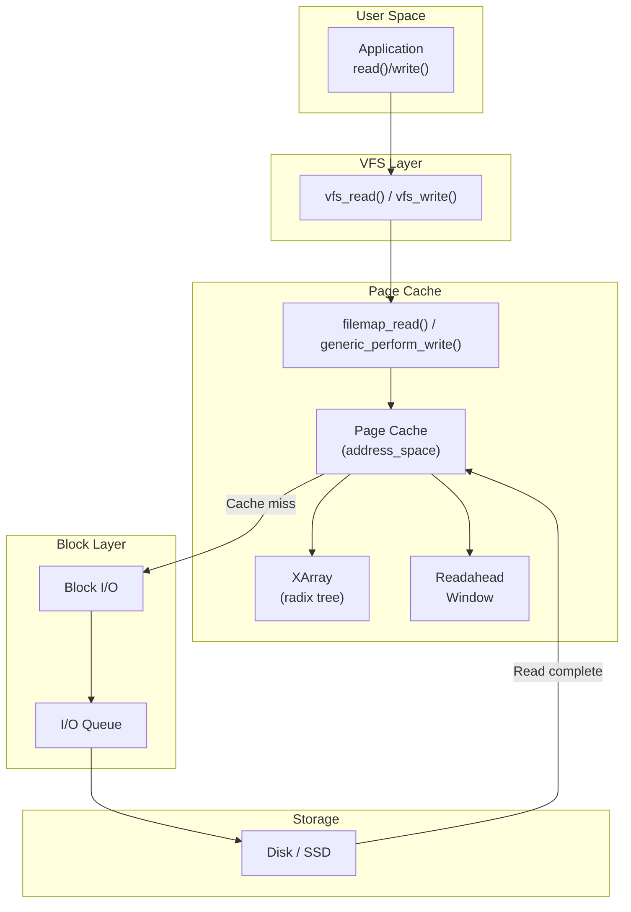
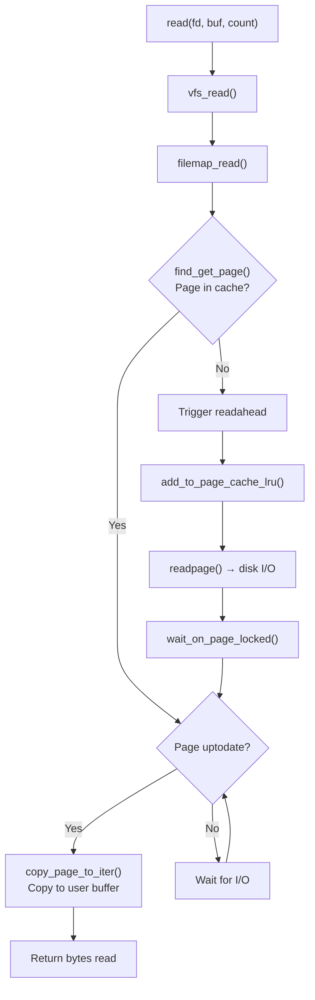
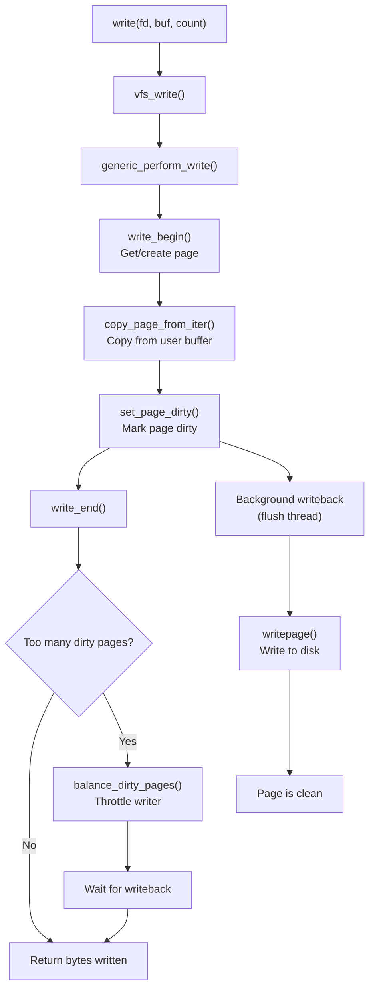
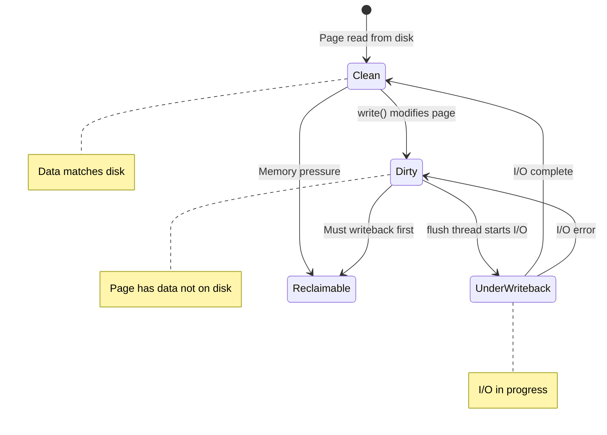

# Chapter 99: Page Cache

## Introduction

The page cache is one of the most important performance features in Linux. It caches recently accessed file data in RAM, dramatically reducing disk I/O. When a process reads a file, the kernel first checks the page cache — if the data is present, it returns immediately (cache hit). If not, it reads from disk and caches the result (cache miss). The page cache also handles buffered writes, accumulating dirty pages and writing them back to disk asynchronously.

## 1. Intuition

### The Library Analogy

Imagine a library where, instead of going to the shelves every time, a librarian keeps recently returned books on a desk near the entrance. Most people want recently used books, so this desk handles most requests without walking to the shelves. The page cache is this desk.

### Why Caching Matters

Disk access is millions of times slower than RAM:
- **RAM access**: ~100 ns
- **NVMe SSD**: ~10-100 μs (100-1000x slower)
- **HDD**: ~5-10 ms (50,000-100,000x slower)

Without the page cache, every file read would hit the disk. With caching, most reads are served from RAM at memory speed.

### Buffered vs Direct I/O

Linux provides two I/O modes:

| Mode | Behavior | Use Case |
|------|----------|----------|
| Buffered I/O | Uses page cache | Most applications |
| Direct I/O | Bypasses page cache | Databases (they manage their own cache) |
| Async I/O | Non-blocking, uses cache | High-performance servers |

```c
/* Buffered I/O (default) */
fd = open("file.txt", O_RDONLY);
read(fd, buf, 4096);  /* Goes through page cache */

/* Direct I/O */
fd = open("file.txt", O_RDONLY | O_DIRECT);
read(fd, buf, 4096);  /* Bypasses page cache */

/* Async I/O */
io_submit(ctx, &iocb);  /* Non-blocking */
```

## 2. Architecture

### Page Cache Structure

The page cache is organized by `address_space` structures, one per inode:

```c
/* include/linux/fs.h */
struct address_space {
    struct inode *host;             /* owning inode */
    struct xarray i_pages;          /* radix tree of cached pages */
    struct rw_semaphore invalidate_lock;
    gfp_t gfp_mask;                 /* allocation flags */
    atomic_t i_mmap_writable;       /* VM_SHARED mappings */
    struct rb_root_cached i_mmap;   /* tree of VMAs */
    unsigned long nrpages;          /* total pages in cache */
    unsigned long writeback_index;  /* writeback start point */
    const struct address_space_operations *a_ops;  /* operations */
    unsigned long flags;
    errseq_t wb_err;
    spinlock_t i_private_lock;
    struct list_head i_private_list;
};
```

### The XArray (Radix Tree)

The page cache uses an XArray (evolved from radix tree) to map file offsets to cached pages:

```
File offset (pgoff_t)  →  struct page *
     0         →  page_0
     1         →  page_1
     2         →  NULL (not cached)
     3         →  page_3
     ...
     1000000   →  page_1000000
```

```c
/* include/linux/xarray.h */
struct xarray {
    spin_lock_t xa_lock;
    gfp_t xa_flags;
    void __rcu *xa_head;  /* root node */
};
```

### Page Cache Operations

```c
/* include/linux/fs.h */
struct address_space_operations {
    int (*writepage)(struct page *, struct writeback_control *);
    int (*readpage)(struct file *, struct page *);
    int (*writepages)(struct address_space *, struct writeback_control *);
    int (*set_page_dirty)(struct page *);
    int (*readahead)(struct file *, struct address_space *,
                     struct file_ra_state *, struct list_head *);
    int (*write_begin)(struct file *, struct address_space *, loff_t,
                       unsigned, struct page **, void **);
    int (*write_end)(struct file *, struct address_space *, loff_t,
                     unsigned, unsigned, struct page *, void *);
    /* ... more operations ... */
};
```

## 3. Kernel Implementation

### Reading from the Page Cache

When a process calls `read()`, the kernel checks the page cache first:

```c
/* mm/filemap.c */

/* Read a page from the page cache (or create it) */
static vm_fault_t filemap_fault(struct vm_fault *vmf)
{
    struct mm_struct *mm = vmf->vma->vm_mm;
    struct file *file = vmf->vma->vm_file;
    struct address_space *mapping = file->f_mapping;
    struct file_ra_state *ra = &file->f_ra;
    struct page *page;
    pgoff_t index = vmf->pgoff;
    
    /* Look up the page in the cache */
    page = find_get_page(mapping, index);
    
    if (likely(page)) {
        /* Page found in cache */
        if (!page->mapping) {
            /* Page was invalidated, retry */
            goto retry_find;
        }
        
        /* Page is uptodate - map it */
        vmf->page = page;
        return VM_FAULT_LOCKED;
    }
    
    /* Page not in cache - read from disk */
    page = page_cache_alloc_readahead(mapping, index);
    if (!page)
        return VM_FAULT_OOM;
    
    /* Add to page cache */
    if (add_to_page_cache_lru(page, mapping, index, GFP_KERNEL)) {
        put_page(page);
        goto retry_find;
    }
    
    /* Read from disk */
    if (mapping->a_ops->readpage(file, page)) {
        goto retry_find;
    }
    
    /* Wait for I/O to complete */
    lock_page(page);
    
    if (unlikely(page->mapping != mapping)) {
        unlock_page(page);
        goto retry_find;
    }
    
    vmf->page = page;
    return VM_FAULT_LOCKED;
}
```

### Buffered Read Path

```c
/* fs/read_write.c → mm/filemap.c */

ssize_t vfs_read(struct file *file, char __user *buf, size_t count, loff_t *pos)
{
    ssize_t ret;
    
    if (file->f_op->read)
        ret = file->f_op->read(file, buf, count, pos);
    else
        ret = new_sync_read(file, buf, count, pos);
    
    return ret;
}

/* Generic file read */
ssize_t generic_file_read_iter(struct kiocb *iocb, struct iov_iter *iter)
{
    struct file *file = iocb->ki_filp;
    struct address_space *mapping = file->f_mapping;
    
    if (iocb->ki_flags & IOCB_DIRECT) {
        /* Direct I/O - bypass page cache */
        return mapping->a_ops->direct_IO(iocb, iter);
    }
    
    /* Buffered I/O - use page cache */
    return filemap_read(iocb, iter);
}

/* Read from page cache */
static ssize_t filemap_read(struct kiocb *iocb, struct iov_iter *iter)
{
    struct file *file = iocb->ki_filp;
    struct address_space *mapping = file->f_mapping;
    struct file_ra_state *ra = &file->f_ra;
    loff_t *ppos = &iocb->ki_pos;
    
    /* ... */
    
    for (;;) {
        struct page *page;
        pgoff_t index;
        pgoff_t last_index;
        
        index = *ppos >> PAGE_SHIFT;
        last_index = (iocb->ki_pos + iter->count - 1) >> PAGE_SHIFT;
        
        /* Find page in cache */
        page = find_get_page_flags(mapping, index, FGP_ACCESSED);
        
        if (!page) {
            /* Page not cached - trigger readahead */
            page_cache_sync_readahead(mapping, ra, file, index);
            page = find_get_page_flags(mapping, index, FGP_ACCESSED);
        }
        
        if (page) {
            /* Wait for page to be uptodate */
            if (!PageUptodate(page)) {
                wait_on_page_locked_killable(page);
            }
            
            /* Copy data to user buffer */
            copied = copy_page_to_iter(page, offset, bytes, iter);
            
            *ppos += copied;
            put_page(page);
        }
    }
}
```

### Buffered Write Path

```c
/* mm/filemap.c */

ssize_t generic_file_write_iter(struct kiocb *iocb, struct iov_iter *from)
{
    struct file *file = iocb->ki_filp;
    struct address_space *mapping = file->f_mapping;
    
    /* ... locking ... */
    
    ret = __generic_file_write_iter(iocb, from);
    
    return ret;
}

static ssize_t __generic_file_write_iter(struct kiocb *iocb,
                                          struct iov_iter *from)
{
    struct file *file = iocb->ki_filp;
    struct address_space *mapping = file->f_mapping;
    loff_t pos = iocb->ki_pos;
    ssize_t written = 0;
    
    if (iocb->ki_flags & IOCB_DIRECT) {
        /* Direct I/O */
        written = generic_file_direct_write(iocb, from);
    }
    
    /* Buffered write */
    written = generic_perform_write(file, from, pos);
    
    return written;
}

/* Write data to page cache */
static ssize_t generic_perform_write(struct file *file,
                                      struct iov_iter *i, loff_t pos)
{
    struct address_space *mapping = file->f_mapping;
    ssize_t written = 0;
    
    for (;;) {
        struct page *page;
        void *fsdata;
        pgoff_t index = pos >> PAGE_SHIFT;
        unsigned offset = pos & ~PAGE_MASK;
        unsigned bytes = min_t(unsigned long, PAGE_SIZE - offset,
                               iov_iter_count(i));
        
        /* Get or create page in cache */
        mapping->a_ops->write_begin(file, mapping, pos, bytes,
                                     &page, &fsdata);
        
        /* Copy data from user buffer to page */
        copied = copy_page_from_iter(page, offset, bytes, i);
        
        /* Mark page as dirty */
        set_page_dirty(page);
        
        /* Finish the write */
        mapping->a_ops->write_end(file, mapping, pos, bytes, copied,
                                   page, fsdata);
        
        written += copied;
        pos += copied;
    }
    
    return written;
}
```

### Readahead

Linux uses predictive readahead to reduce I/O latency:

```c
/* mm/readahead.c */

/* Sync readahead - triggered on cache miss */
void page_cache_sync_readahead(struct address_space *mapping,
                                struct file_ra_state *ra,
                                struct file *file, pgoff_t index)
{
    /* Don't readahead if disabled */
    if (ra->ra_pages == 0)
        return;
    
    /* Don't readahead past end of file */
    if (index > (i_size_read(mapping->host) - 1) >> PAGE_SHIFT)
        return;
    
    /* Do readahead */
    ondemand_readahead(mapping, ra, file, false, index);
}

/* Readahead algorithm */
static unsigned long ondemand_readahead(struct address_space *mapping,
                                         struct file_ra_state *ra,
                                         struct file *file,
                                         bool hit_readahead_marker,
                                         pgoff_t offset)
{
    unsigned long max_pages = ra->ra_pages;
    unsigned long req_size;
    pgoff_t start;
    
    /* Initial readahead */
    if (!ra->ra_pages)
        return 0;
    
    /* Sequential access detected */
    if (offset == ra->start + ra->size) {
        /* Continue sequential readahead */
        req_size = min(ra->size * 2, max_pages);
        start = offset;
    } else {
        /* Random access - small readahead */
        req_size = min(max_pages, 4UL);
        start = offset;
    }
    
    /* Update ra state */
    ra->start = start;
    ra->size = req_size;
    ra->async_size = req_size / 2;
    
    /* Perform readahead */
    ra_submit(ra, mapping, file);
    
    return req_size;
}
```

### Dirty Page Writeback

When pages are modified, they become "dirty" and must eventually be written back to disk:

```c
/* mm/page-writeback.c */

/* Mark a page dirty */
int set_page_dirty(struct page *page)
{
    if (page->mapping)
        return page->mapping->a_ops->set_page_dirty(page);
    return __set_page_dirty_no_writeback(page);
}

/* Balance dirty pages - throttle writers if too many dirty pages */
static void balance_dirty_pages(struct bdi_writeback *wb,
                                 unsigned long pages_dirtied)
{
    struct dirty_throttle_control *dom = &gdtc;
    unsigned long nr_reclaimable;
    
    for (;;) {
        /* Calculate dirty thresholds */
        unsigned long background_thresh;
        unsigned long dirty_thresh;
        
        global_dirty_limits(&background_thresh, &dirty_thresh);
        
        nr_reclaimable = global_node_page_state(NR_FILE_DIRTY) +
                         global_node_page_state(NR_WRITEBACK);
        
        /* If below threshold, don't throttle */
        if (nr_reclaimable < dirty_thresh)
            break;
        
        /* Throttle - wait for writeback */
        __set_current_state(TASK_KILLABLE);
        io_schedule_timeout(pause);
    }
}

/* Writeback daemon (flush kernel thread) */
int dirty_writeback_centisecs_handler(struct ctl_table *table, int write,
                                       void __user *buffer, size_t *ppos)
{
    /* ... */
    return 0;
}

/* Writeback worker */
static void wb_workfn(struct work_struct *work)
{
    struct bdi_writeback *wb = container_of(work, struct bdi_writeback,
                                             dwork.work);
    
    /* ... */
    
    wb_do_writeback(wb);
}

/* Write dirty pages */
long wb_do_writeback(struct bdi_writeback *wb)
{
    struct wb_writeback_work *work;
    long wrote = 0;
    
    /* Write expired dirty pages */
    wrote += wb_writeback(wb, &work);
    
    return wrote;
}
```

## 4. Dirty Page Management

### Dirty Thresholds

Linux maintains several dirty page thresholds:

```bash
# View dirty page settings
cat /proc/sys/vm/dirty_background_ratio   # % of total RAM for background writeback
cat /proc/sys/vm/dirty_ratio              # % of total RAM before throttling writers
cat /proc/sys/vm/dirty_expire_centisecs   # Time before dirty pages are written (30s)
cat /proc/sys/vm/dirty_writeback_centisecs # Writeback thread wakeup interval (5s)

# View current dirty page counts
grep -E "Dirty|Writeback" /proc/meminfo
# Dirty:           1234 kB
# Writeback:          0 kB
```

### Writeback Mechanisms

Dirty pages are written back by several mechanisms:

1. **Periodic writeback** (`flush` threads): Every `dirty_writeback_centisecs`
2. **Expiry writeback**: Pages dirty longer than `dirty_expire_centisecs`
3. **Threshold writeback**: When dirty pages exceed `dirty_background_ratio`
4. **Synchronous writeback**: When dirty pages exceed `dirty_ratio` (blocks writers)
5. **Explicit `fsync()`/`fdatasync()`**: Application-initiated
6. **Memory pressure**: When the system needs free pages

### The `flush` Kernel Threads

```bash
# View flush threads
ps aux | grep flush
# root         3   0.0  0.0      0     0 ?  I<   00:00   0:17 [kworker/0:1H]
# Each backing device has a flush thread
```

## 5. Source Code References

### Key Source Files

- `mm/filemap.c` — Page cache read/write operations
- `mm/readahead.c` — Readahead implementation
- `mm/page-writeback.c` — Dirty page writeback
- `mm/truncate.c` — Page cache truncation
- `include/linux/pagemap.h` — Page cache function declarations
- `include/linux/fs.h` — `address_space` and `address_space_operations`

### Important Functions

```c
/* Page cache lookup */
struct page *find_get_page(struct address_space *mapping, pgoff_t index);
struct page *find_get_page_flags(struct address_space *mapping,
                                  pgoff_t index, int fgp_flags);
struct page *pagecache_get_page(struct address_space *mapping,
                                 pgoff_t index, int fgp_flags, gfp_t gfp);

/* Page cache insertion */
int add_to_page_cache(struct page *page, struct address_space *mapping,
                       pgoff_t index, gfp_t gfp_mask);
int add_to_page_cache_lru(struct page *page, struct address_space *mapping,
                           pgoff_t index, gfp_t gfp_mask);

/* Dirty page management */
int set_page_dirty(struct page *page);
int set_page_dirty_lock(struct page *page);
void account_page_dirtied(struct page *page, struct address_space *mapping);

/* Writeback */
int write_one_page(struct page *page);
int sync_mapping_buffers(struct address_space *mapping);
```

## 6. C/Assembly Examples

### Monitoring Page Cache

```bash
# View page cache statistics
cat /proc/meminfo | grep -E "Cached|Buffers|Dirty|Writeback"
# Buffers:          123456 kB
# Cached:          2345678 kB
# Dirty:             12345 kB
# Writeback:             0 kB

# View page cache hit/miss ratios
cat /proc/vmstat | grep pgpg
# pgpgin 1234567
# pgpgout 2345678

# Per-file cache info
vmtouch /path/to/file
# Shows pages cached, pages in memory, etc.

# Clear page cache (for testing)
echo 1 > /proc/sys/vm/drop_caches  # drop page cache
echo 2 > /proc/sys/vm/drop_caches  # drop dentries and inodes
echo 3 > /proc/sys/vm/drop_caches  # drop all
```

### C Program: Page Cache Demonstration

```c
#include <stdio.h>
#include <stdlib.h>
#include <fcntl.h>
#include <unistd.h>
#include <sys/time.h>
#include <string.h>

#define FILE_SIZE (100 * 1024 * 1024)  /* 100 MB */
#define READ_SIZE (4096)

/* Demonstrate page cache behavior */
int main() {
    int fd;
    char *buf;
    struct timeval start, end;
    ssize_t bytes_read;
    off_t total = 0;
    
    buf = malloc(READ_SIZE);
    
    /* First: drop page cache (requires root) */
    system("echo 3 > /proc/sys/vm/drop_caches");
    
    /* Cold read - from disk */
    fd = open("testfile", O_RDONLY);
    gettimeofday(&start, NULL);
    
    while ((bytes_read = read(fd, buf, READ_SIZE)) > 0)
        total += bytes_read;
    
    gettimeofday(&end, NULL);
    close(fd);
    
    double cold_time = (end.tv_sec - start.tv_sec) +
                       (end.tv_usec - start.tv_usec) / 1000000.0;
    printf("Cold read: %.3f seconds (%.1f MB/s)\n",
           cold_time, (total / 1024.0 / 1024.0) / cold_time);
    
    /* Hot read - from page cache */
    fd = open("testfile", O_RDONLY);
    gettimeofday(&start, NULL);
    
    total = 0;
    while ((bytes_read = read(fd, buf, READ_SIZE)) > 0)
        total += bytes_read;
    
    gettimeofday(&end, NULL);
    close(fd);
    
    double hot_time = (end.tv_sec - start.tv_sec) +
                      (end.tv_usec - start.tv_usec) / 1000000.0;
    printf("Hot read:  %.3f seconds (%.1f MB/s)\n",
           hot_time, (total / 1024.0 / 1024.0) / hot_time);
    
    printf("Speedup:   %.1fx\n", cold_time / hot_time);
    
    free(buf);
    return 0;
}
```

### Kernel Module: Inspect Page Cache

```c
/* Kernel module to inspect page cache for a file */
#include <linux/module.h>
#include <linux/fs.h>
#include <linux/pagemap.h>
#include <linux/writeback.h>

static int __init pagecache_inspect_init(void)
{
    struct file *filp;
    struct address_space *mapping;
    struct page *page;
    pgoff_t index;
    unsigned long cached_pages = 0;
    unsigned long dirty_pages = 0;
    
    filp = filp_open("/tmp/testfile", O_RDONLY, 0);
    if (IS_ERR(filp)) {
        pr_err("Cannot open file\n");
        return PTR_ERR(filp);
    }
    
    mapping = filp->f_mapping;
    
    /* Walk the page cache */
    xa_lock(&mapping->i_pages);
    
    xa_for_each(&mapping->i_pages, index, page) {
        cached_pages++;
        if (PageDirty(page))
            dirty_pages++;
    }
    
    xa_unlock(&mapping->i_pages);
    
    pr_info("File: %s\n", "/tmp/testfile");
    pr_info("Cached pages: %lu (%lu KB)\n", cached_pages,
            cached_pages * (PAGE_SIZE / 1024));
    pr_info("Dirty pages: %lu (%lu KB)\n", dirty_pages,
            dirty_pages * (PAGE_SIZE / 1024));
    pr_info("Total cached: %lu pages in mapping\n",
            mapping->nrpages);
    
    filp_close(filp, NULL);
    return 0;
}

static void __exit pagecache_inspect_exit(void)
{
    pr_info("Module unloaded\n");
}

module_init(pagecache_inspect_init);
module_exit(pagecache_inspect_exit);
MODULE_LICENSE("GPL");
```

## 7. Mermaid Diagrams

### Page Cache Architecture



### Read Path Flow



### Write Path Flow



### Dirty Page Lifecycle



## 8. Performance

### Cache Hit Rate

```bash
# Monitor page cache hit rate
# Use cachestat BPF tool
sudo cachestat 1
# HITS   MISSES  DIRTIES HITRATIO  BUFFERS_MB  CACHED_MB
# 4567      123      456    97.3%          12       2048

# Per-file cache stats
vmtouch -v /path/to/file
#            Pages:  25600  ( 100M)
#          Cached:  25600  ( 100M)  100.0%
#          Missing:      0  (   0)    0.0%
#         Evicted:      0  (   0)
#         Faulted:      0  (   0)
```

### Readahead Tuning

```bash
# View/readahead settings
blockdev --getra /dev/sda  # readahead in 512-byte sectors

# Set readahead
blockdev --setra 4096 /dev/sda  # 2 MB readahead

# Per-file readahead
fcntl(fd, F_SET_READAHEAD, 256);  /* 256 pages = 1 MB */
```

### Dirty Page Tuning

```bash
# For write-heavy workloads
echo 40 > /proc/sys/vm/dirty_background_ratio   # 40% background
echo 80 > /proc/sys/vm/dirty_ratio              # 80% before throttle
echo 3000 > /proc/sys/vm/dirty_expire_centisecs  # 30 seconds
echo 500 > /proc/sys/vm/dirty_writeback_centisecs # 5 seconds

# For low-latency writeback
echo 5 > /proc/sys/vm/dirty_background_ratio
echo 10 > /proc/sys/vm/dirty_ratio
echo 100 > /proc/sys/vm/dirty_expire_centisecs  # 1 second
```

## 9. Security

### Cache Side Channels

The page cache can be used for side-channel attacks:

- **Flush+Reload**: Detect if another process accessed a specific file page
- **Prime+Probe**: Infer cache access patterns

```bash
# Mitigation: disable page cache sharing for sensitive files
# Use O_DIRECT to bypass page cache
# Use cgroups to isolate page cache per container
```

### File Content Leaking

- Old page cache data can leak between processes if pages aren't cleared
- `MAP_PRIVATE` mappings get copy-on-write, isolating modifications
- Sensitive files should use `O_DIRECT` or be cleared after use

### tmpfs and Shared Memory

```bash
# tmpfs uses page cache
mount -t tmpfs -o size=1G tmpfs /dev/shm
# Data in /dev/shm is in page cache and can be swapped
```

## 10. Common Pitfalls

### 1. Assuming write() Means "On Disk"

`write()` only puts data in the page cache (dirty). Data is on disk only after `fsync()` or writeback.

```c
write(fd, data, len);
close(fd);  /* Data may NOT be on disk yet! */
/* Use fsync(fd) to guarantee */
```

### 2. Not Using O_DIRECT for Databases

Databases that manage their own cache should use `O_DIRECT` to avoid double-caching.

### 3. Dropping Caches in Production

```bash
# This is for TESTING ONLY
echo 3 > /proc/sys/vm/drop_caches
# Never do this in production - it destroys performance
```

### 4. Ignoring Dirty Page Limits

Write-heavy applications can accumulate dirty pages, causing sudden writeback storms and latency spikes.

### 5. Memory Pressure and Cache Eviction

Under memory pressure, the kernel evicts page cache pages. This can cause unexpected I/O for previously-cached files.

## 11. Best Practices

1. **Use buffered I/O** for most applications (let the kernel manage caching)
2. **Use `O_DIRECT`** for databases and applications with their own cache
3. **Call `fsync()`** when data durability is required
4. **Tune dirty page ratios** for write-heavy workloads
5. **Use `madvise(MADV_SEQUENTIAL)`** for sequential file access
6. **Use `posix_fadvise(POSIX_FADV_WILLNEED)`** to prefetch
7. **Use `posix_fadvise(POSIX_FADV_DONTNEED)`** to drop cache for large reads
8. **Monitor page cache hit rate** to verify caching effectiveness
9. **Use `readahead()` system call** for predictable access patterns
10. **Consider `fallocate()`** for pre-allocating file space

## 12. Exercises

### Exercise 1: Cache Hit Rate Measurement

Write a C program that reads a file multiple times and measures the page cache hit rate.

### Exercise 2: Readahead Effectiveness

Compare read performance with different readahead settings using `blockdev --setra`.

### Exercise 3: Dirty Page Behavior

Write a program that writes data and monitors dirty page count from `/proc/meminfo`.

### Exercise 4: O_DIRECT vs Buffered

Benchmark `O_DIRECT` vs buffered I/O for sequential and random access patterns.

### Exercise 5: Page Cache Invalidation

Write a program that uses `posix_fadvise()` to manage cache for a large file scan.

## 13. References

1. **Linux Kernel Source**: `mm/filemap.c`, `mm/readahead.c`, `mm/page-writeback.c`
2. **"Understanding the Linux Kernel"** by Daniel P. Bovet and Marco Cesati, Chapter 15
3. **"Linux Kernel Development"** by Robert Love, Chapter 15
4. **Linux Documentation**: `Documentation/admin-guide/sysctl/vm.rst`
5. **Linux man pages**: `read(2)`, `write(2)`, `fsync(2)`, `posix_fadvise(2)`
6. **LWN.net**: "A new approach to writeback"
7. **"Systems Performance"** by Brendan Gregg, Chapter 9
8. **"The page cache"** — kernel documentation
