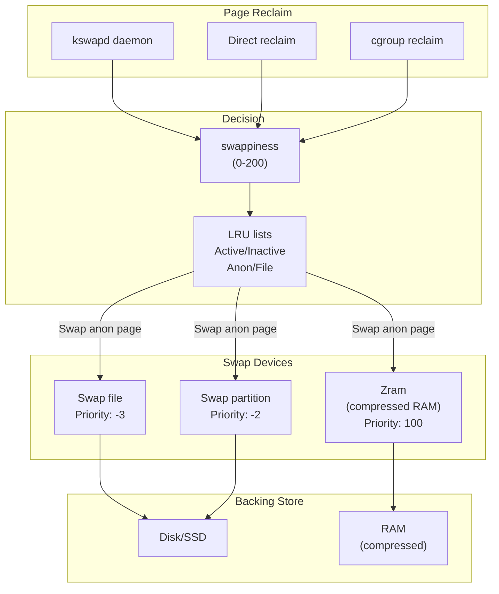
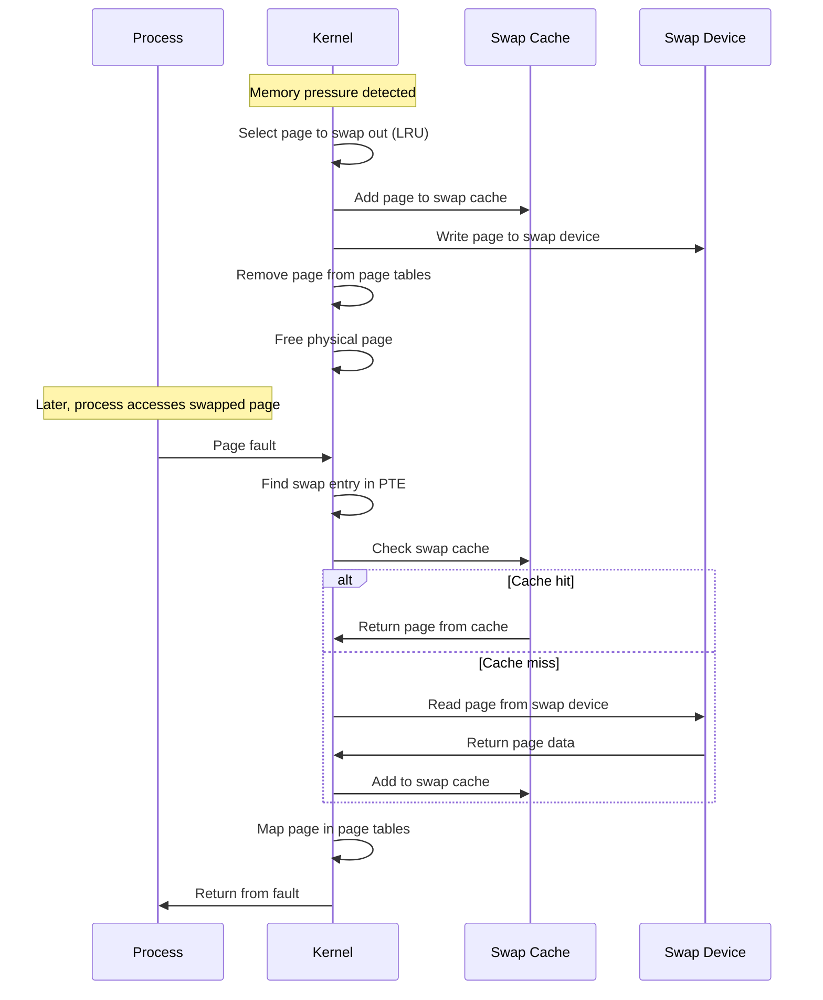
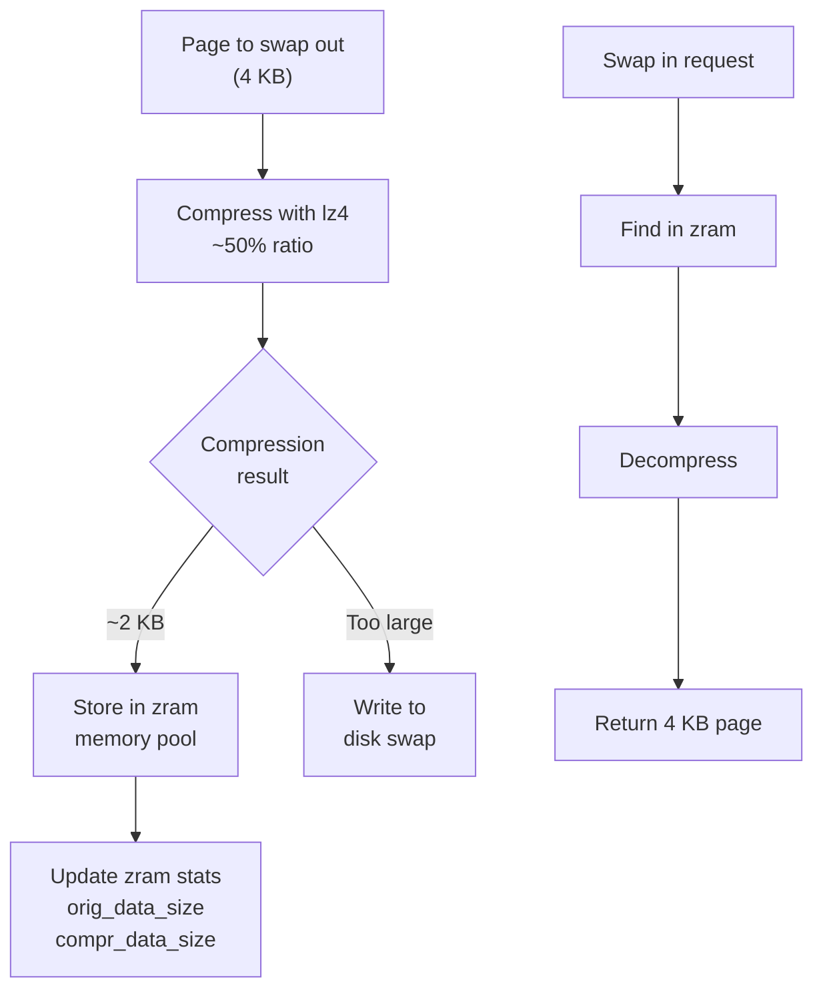

# Chapter 100: Swap and Swappiness

## Introduction

Swap space extends physical memory by using disk (or compressed RAM) as a backing store for anonymous memory. When the system runs low on RAM, the kernel can swap out rarely-used pages to free memory for active workloads. The `swappiness` parameter controls how aggressively the kernel favors swapping out anonymous pages versus reclaiming file-backed pages. This chapter covers swap partitions/files, swappiness tuning, and modern alternatives like zswap and zram.

## 1. Intuition

### Why Swap?

Physical RAM is finite. When the system needs more memory than it has, it has two options:

1. **Kill processes** (OOM killer) — destructive
2. **Swap out pages** — allows overcommit, keeps processes alive

Swap is essentially a safety net. It allows the system to handle temporary memory spikes without killing processes.

### The Cost of Swap

Swap space is much slower than RAM:
- **RAM access**: ~100 ns
- **NVMe SSD**: ~10-100 μs (100-1000x slower)
- **HDD**: ~5-10 ms (50,000-100,000x slower)
- **Zram (compressed RAM)**: ~1-10 μs (10-100x slower than RAM, but much faster than disk)

Heavy swapping (thrashing) destroys performance. The goal is to use swap as a safety net, not as regular memory.

### What Gets Swapped?

- **Anonymous pages**: Heap, stack, `MAP_ANONYMOUS` mappings
- **Not swapped**: File-backed pages (they can be re-read from disk), kernel memory, locked pages (`mlock()`)

## 2. Architecture

### Swap Subsystem Overview

```
┌─────────────────────────────────────────────────────────┐
│                    Memory Pressure                        │
│   (kswapd, direct reclaim, cgroup limits)               │
└─────────────────────────┬───────────────────────────────┘
                          │
                          ▼
┌─────────────────────────────────────────────────────────┐
│                    Page Reclaim                           │
│   LRU scanning, swap tendency (swappiness)              │
└───────┬───────────────────────────────────┬─────────────┘
        │                                   │
        ▼                                   ▼
┌───────────────────┐           ┌───────────────────────┐
│  Swap out         │           │  File page reclaim    │
│  (anonymous pages)│           │  (discard clean,      │
│                   │           │   writeback dirty)    │
└───────┬───────────┘           └───────────────────────┘
        │
        ▼
┌─────────────────────────────────────────────────────────┐
│                    Swap Devices                          │
│   ┌──────────┐  ┌──────────┐  ┌──────────┐            │
│   │ Partition │  │ Swap File│  │  Zram    │            │
│   │ /dev/sdb2 │  │ /swapfile│  │ /dev/zram0│           │
│   └──────────┘  └──────────┘  └──────────┘            │
└─────────────────────────────────────────────────────────┘
```

### Swap Devices

Linux supports multiple swap devices with priorities:

```bash
# View swap devices
swapon --show
# NAME      TYPE      SIZE  USED  PRIO
# /dev/sdb2 partition   8G    2G    -2
# /swapfile file        4G  512M    -3
# /dev/zram0 partition   4G  256M   100

# Higher priority = used first
# zram (priority 100) is used before disk swap (priority -2)
```

### Swap Cache

When a page is swapped out, it's first placed in the swap cache. This allows fast swap-in if the page is accessed again before being reclaimed:

```c
/* include/linux/swap.h */
struct swap_info_struct {
    unsigned long flags;
    short prio;                     /* swap priority */
    struct file *swap_file;         /* backing file/device */
    struct block_device *bdev;      /* block device */
    struct percpu_cluster __percpu *percpu_cluster;
    struct swap_cluster_info *cluster_info;
    struct swap_cluster_list free_clusters;
    unsigned int lowest_bit;        /* first available slot */
    unsigned int highest_bit;       /* last available slot */
    unsigned int pages;             /* total pages */
    unsigned int inuse_pages;       /* pages in use */
    unsigned int cluster_next;      /* next cluster to try */
    unsigned int cluster_nr;        /* free clusters left */
    /* ... */
};
```

## 3. Kernel Implementation

### Swap Out (Page to Disk)

```c
/* mm/vmscan.c → mm/swap_state.c */

/* Add a page to swap */
int add_to_swap(struct page *page, struct list_head *list)
{
    swp_entry_t entry;
    struct swap_info_struct *si;
    
    /* Allocate a swap slot */
    entry = get_swap_page(page);
    if (!entry.val)
        return 0;
    
    /* Add to swap cache */
    si = swap_info_get(entry);
    add_to_swap_cache(page, entry, GFP_ATOMIC);
    
    /* Mark page as swap-backed */
    SetPageSwapCache(page);
    
    return 1;
}

/* Write page to swap device */
int swap_writepage(struct page *page, struct writeback_control *wbc)
{
    struct swap_info_struct *sis = page_swap_info(page);
    
    /* For zram, compress and store in memory */
    if (sis->flags & SWP_BLKDEV) {
        /* Write to block device */
        return swap_writepage_bdev(page, wbc, sis);
    }
    
    return 0;
}
```

### Swap In (Disk to Page)

```c
/* mm/swap_state.c → mm/memory.c */

/* Read a page from swap */
struct page *swap_readpage(swp_entry_t entry, bool do_poll)
{
    struct page *page;
    struct swap_info_struct *sis;
    
    /* Allocate a page */
    page = alloc_page(GFP_HIGHUSER_MOVABLE);
    
    /* Add to swap cache */
    add_to_swap_cache(page, entry, GFP_KERNEL);
    
    /* Read from swap device */
    sis = swap_info_get(entry);
    
    if (sis->flags & SWP_BLKDEV) {
        /* Read from block device */
        swap_readpage_bdev(page, sis);
    }
    
    /* Wait for I/O completion */
    wait_on_page_locked(page);
    
    /* Remove from swap cache */
    delete_from_swap_cache(page);
    
    return page;
}
```

### Swappiness

The `swappiness` parameter (0-200, default 60) controls the balance between reclaiming anonymous pages (swap) and file-backed pages (page cache):

```c
/* mm/vmscan.c */

/* Calculate scan balance between anon and file LRU lists */
static void get_scan_count(struct lruvec *lruvec, struct scan_control *sc,
                            unsigned long *nr)
{
    struct mem_cgroup *memcg = lruvec_memcg(lruvec);
    unsigned long ap, fp;
    enum scan_balance scan_balance;
    int swappiness = mem_cgroup_swappiness(memcg);
    
    /* Determine scan balance */
    if (!sc->may_swap || !get_nr_swap_pages()) {
        /* Can't swap - only reclaim file pages */
        scan_balance = SCAN_FILE;
    } else if (swappiness == 0) {
        /* Don't swap unless absolutely necessary */
        scan_balance = SCAN_FILE;
    } else if (sc->priority == 0) {
        /* Extreme pressure - reclaim everything */
        scan_balance = SCAN_EQUAL;
    } else {
        /* Normal case - balance based on swappiness */
        scan_balance = SCAN_FRACT;
    }
    
    /* Calculate scan ratios */
    if (scan_balance == SCAN_FRACT) {
        /* ap: anon priority, fp: file priority */
        ap = swappiness * (total_cost_anon + 1);
        ap /= total_cost_anon + total_cost_file + 1;
        fp = total_cost_file - ap;
        
        /* Apply to each LRU list */
        /* ... */
    }
}
```

### Swappiness Values

| Value | Behavior |
|-------|----------|
| 0 | Avoid swapping unless absolutely necessary (OOM risk) |
| 1-59 | Prefer keeping file pages, swap if needed |
| 60 | Default - balanced |
| 61-99 | Prefer swapping over dropping page cache |
| 100-200 | Aggressively swap (max 100 in older kernels) |

## 4. Zram

### What is Zram?

Zram creates a compressed block device in RAM. Instead of swapping to disk, pages are compressed and stored in RAM. This is much faster than disk swap and effectively increases memory capacity by 2-3x through compression.

```
Normal swap:
  Anonymous page → Disk (slow)

Zram swap:
  Anonymous page → Compress → Store in RAM (fast)
  ~50% compression ratio → 4 GB zram ≈ 8 GB effective swap
```

### Zram Configuration

```bash
# Load zram module
modprobe zram num_devices=1

# Configure zram device
echo lz4 > /sys/block/zram0/comp_algorithm  # compression algorithm
echo 4G > /sys/block/zram0/disksize         # uncompressed size
mkswap /dev/zram0
swapon -p 100 /dev/zram0                     # high priority

# Enable writeback to disk (for cold pages)
echo /dev/sdb2 > /sys/block/zram0/backing_dev

# View zram stats
cat /sys/block/zram0/mm_stat
# orig_data_size  compr_data_size  mem_used_total  mem_limit  ...
# 1073741824      536870912        600000000       0          ...
```

### Zram in systemd

```bash
# /etc/systemd/zram-generator.conf
[zram0]
zram-size = ram / 2
compression-algorithm = lz4
swap-priority = 100
fs-type = swap
```

## 5. Zswap

### What is Zswap?

Zswap is a compressed write-back cache for swap. It sits in front of a swap device and compresses pages before they hit disk:

```
Normal swap:
  Page → Disk

Zswap:
  Page → Compress → RAM cache (if space)
                   → Disk (if cache full)
```

### Zswap Configuration

```bash
# Enable zswap
echo 1 > /sys/module/zswap/parameters/enabled

# Set compression algorithm
echo lz4 > /sys/module/zswap/parameters/compressor

# Set zpool backend (zbud, z3fold, zsmalloc)
echo z3fold > /sys/module/zswap/parameters/zpool

# Set max pool size (% of total RAM)
echo 20 > /sys/module/zswap/parameters/max_pool_percent

# View zswap stats
cat /sys/kernel/debug/zswap/pool_total_size
cat /sys/kernel/debug/zswap/stored_pages
cat /sys/kernel/debug/zswap/duplicate_entry
```

### Zswap vs Zram

| Feature | Zswap | Zram |
|---------|-------|------|
| Role | Swap front-end cache | Swap backend |
| Backing | Requires real swap device | Self-contained |
| Compression | Only for pages going to swap | All pages |
| Memory source | Uses page pool | Entire block device |
| Use case | Systems with existing swap | Embedded, low-RAM |

## 6. Source Code References

### Key Source Files

- `mm/swap_state.c` — Swap cache operations
- `mm/swapfile.c` — Swap device management
- `mm/vmscan.c` — Page reclaim and swappiness logic
- `mm/zswap.c` — Zswap implementation
- `drivers/block/zram/zram_drv.c` — Zram driver
- `include/linux/swap.h` — Swap data structures

### Important Functions

```c
/* Swap allocation */
swp_entry_t get_swap_page(struct page *page);
int add_to_swap(struct page *page, struct list_head *list);
int add_to_swap_cache(struct page *page, swp_entry_t entry, gfp_t gfp);

/* Swap I/O */
int swap_writepage(struct page *page, struct writeback_control *wbc);
int swap_readpage(swp_entry_t entry, bool do_poll);

/* Swap space management */
int swapon(const char *path, int swap_flags);
int swapoff(const char *path);

/* Swappiness */
int vm_swappiness;  /* global swappiness */
int mem_cgroup_swappiness(struct mem_cgroup *memcg);
```

## 7. Data Structures

### Swap Entry Format

```c
/* include/linux/swap.h */
typedef struct {
    unsigned long val;
} swp_entry_t;

/* Swap entry layout:
 * bits 0-5:  type (swap device type)
 * bits 6-57: offset (page offset in swap device)
 */
```

### Swap Cache

The swap cache is a page cache for swap devices:

```c
/* When a page is swapped out:
 * 1. Allocate a swap entry (slot on swap device)
 * 2. Add page to swap cache (indexed by swap entry)
 * 3. Write page to swap device
 * 4. Remove page from process page tables
 * 5. Page can now be reclaimed
 *
 * When a swapped page is accessed:
 * 1. Page fault occurs
 * 2. Look up swap entry in PTE
 * 3. Check swap cache first (if recently accessed)
 * 4. If not in cache, read from swap device
 * 5. Add to swap cache and process page tables
 */
```

## 8. C/Assembly Examples

### Checking Swap Usage

```bash
# View swap usage
free -h
#               total        used        free      shared  buff/cache   available
# Mem:           15Gi       8.2Gi       2.1Gi       512Mi       5.1Gi       6.8Gi
# Swap:          8.0Gi       2.0Gi       6.0Gi

# Detailed swap info
swapon --show
cat /proc/swaps

# Per-process swap usage
for pid in /proc/[0-9]*; do
    name=$(cat $pid/comm 2>/dev/null)
    swap=$(awk '/VmSwap/{print $2}' $pid/status 2>/dev/null)
    if [ "$swap" -gt 0 ] 2>/dev/null; then
        echo "$name ($pid): ${swap} kB swap"
    fi
done | sort -t: -k2 -n -r | head -20

# Total swap usage per process
grep -H 'VmSwap' /proc/*/status 2>/dev/null | awk -F'[:  ]+' '{print $NF, $2}' | sort -rn | head
```

### C Program: Swap Monitoring

```c
#include <stdio.h>
#include <stdlib.h>
#include <string.h>
#include <unistd.h>

/* Monitor swap usage */
int main() {
    FILE *fp;
    char line[256];
    unsigned long swap_total = 0, swap_free = 0, swap_cached = 0;
    
    fp = fopen("/proc/meminfo", "r");
    if (!fp) {
        perror("fopen");
        return 1;
    }
    
    while (fgets(line, sizeof(line), fp)) {
        if (sscanf(line, "SwapTotal: %lu kB", &swap_total) == 1)
            continue;
        if (sscanf(line, "SwapFree: %lu kB", &swap_free) == 1)
            continue;
        if (sscanf(line, "SwapCached: %lu kB", &swap_cached) == 1)
            continue;
    }
    fclose(fp);
    
    printf("Swap Total:     %8lu kB (%.1f GB)\n",
           swap_total, swap_total / 1048576.0);
    printf("Swap Used:      %8lu kB (%.1f GB)\n",
           swap_total - swap_free, (swap_total - swap_free) / 1048576.0);
    printf("Swap Free:      %8lu kB (%.1f GB)\n",
           swap_free, swap_free / 1048576.0);
    printf("Swap Cached:    %8lu kB (%.1f GB)\n",
           swap_cached, swap_cached / 1048576.0);
    printf("Usage:          %8.1f%%\n",
           100.0 * (swap_total - swap_free) / swap_total);
    
    return 0;
}
```

### Setting Swappiness

```bash
# View current swappiness
cat /proc/sys/vm/swappiness

# Set swappiness (temporary)
echo 10 > /proc/sys/vm/swappiness

# Set swappiness (permanent)
echo "vm.swappiness = 10" >> /etc/sysctl.d/99-swap.conf
sysctl -p /etc/sysctl.d/99-swap.conf

# Per-cgroup swappiness
echo 10 > /sys/fs/cgroup/memory/mygroup/memory.swappiness
```

## 9. Mermaid Diagrams

### Swap Subsystem Architecture



### Swap In/Swap Out Flow



### Zram Compression Flow



## 10. Performance

### Swap Sizing

Proper swap sizing depends on the workload:

| Workload | Recommended Swap | Notes |
|----------|-----------------|-------|
| Desktop | 1-2x RAM | For hibernation support |
| Server (no hibernate) | 0.5-1x RAM | Safety net only |
| Database server | 0.25-0.5x RAM | Minimize swap usage |
| Embedded with zram | 0.5x RAM | Compressed, effective 1-2x |
| VM host | 1x RAM | For overcommit |

```bash
# Create swap file
sudo fallocate -l 8G /swapfile
sudo chmod 600 /swapfile
sudo mkswap /swapfile
sudo swapon /swapfile

# Make permanent in /etc/fstab
/swapfile  none  swap  sw  0  0

# Create encrypted swap
sudo cryptsetup open --type plain /dev/sdb2 cryptswap
sudo mkswap /dev/mapper/cryptswap
sudo swapon /dev/mapper/cryptswap
```

### Swap Monitoring

```bash
# Real-time swap monitoring
vmstat 1 | awk '{print $7, $8}'  # si, so columns

# Per-process swap usage (top consumers)
for pid in $(ls /proc/ | grep -E '^[0-9]+$'); do
    swap=$(awk '/VmSwap/{print $2}' /proc/$pid/status 2>/dev/null)
    if [ "$swap" -gt 0 ] 2>/dev/null; then
        name=$(cat /proc/$pid/comm 2>/dev/null)
        echo "$swap kB  $name ($pid)"
    fi
done | sort -rn | head -20

# Total swap usage by process
grep -H VmSwap /proc/*/status 2>/dev/null | \
    awk -F'[:  ]+' '$NF > 0 {print $NF, $2}' | sort -rn
```

### Swap Thrashing

When swap usage is high, the system "thrashes" — constantly swapping pages in and out:

```bash
# Monitor swap activity
vmstat 1
# procs -----------memory---------- ---swap-- -----io---- -system-- ------cpu-----
#  r  b   swpd   free   buff  cache   si   so    bi    bo   in   cs us sy id wa st
#  1  2 512000  10240  20480 102400  100  200   500  1000  1000 2000 50 10 30 10  0
# High si/so = thrashing

# Monitor with sar
sar -W 1
# 00:00:01  pswpin/s pswpout/s
# 00:00:02    100.00    200.00
```

### Swappiness Tuning Guidelines

| Workload | Recommended swappiness |
|----------|----------------------|
| Database servers | 0-10 (prefer OOM over swap) |
| Web servers | 10-30 |
| Desktop systems | 60 (default) |
| Embedded with zram | 100 |
| Memory-constrained | 100+ |

### Zram Performance

```bash
# Benchmark zram
dd if=/dev/zero of=/dev/zram0 bs=4K count=100000
cat /sys/block/zram0/mm_stat
# Shows compression ratio, memory usage, etc.

# Compare compression algorithms
for algo in lzo lz4 zstd; do
    echo $algo > /sys/block/zram0/comp_algorithm
    # Run benchmark...
done
```

## 11. Security

### Swap Encryption

Swap can contain sensitive data (passwords, keys). Always encrypt swap:

```bash
# Encrypted swap partition
cryptsetup open --type plain /dev/sdb2 cryptswap
mkswap /dev/mapper/cryptswap
swapon /dev/mapper/cryptswap

# /etc/crypttab
cryptswap  /dev/sdb2  /dev/urandom  swap,cipher=aes-xts-plain64,size=256

# Encrypted swap file
# Use systemd-swap or manual cryptsetup
```

### Swap and Cgroups

```bash
# Limit swap usage per cgroup
echo 1073741824 > /sys/fs/cgroup/memory/mygroup/memory.memsw.limit_in_bytes

# Disable swap for a cgroup
echo 0 > /sys/fs/cgroup/memory/mygroup/memory.swappiness
```

### Sensitive Data in Swap

```c
/* Use mlock() to prevent sensitive pages from being swapped */
mlock(password, strlen(password));

/* Or use mlockall() for entire process */
mlockall(MCL_CURRENT | MCL_FUTURE);

/* Use MADV_DONTNEED to zero pages before swap */
madvise(addr, size, MADV_DONTNEED);
```

## 12. Common Pitfalls

### 1. No Swap Space

Running without swap can cause OOM kills on memory spikes:

```bash
# Always have at least some swap
# Even 1 GB provides a safety net
```

### 2. Swappiness Too Low

Setting swappiness to 0 can cause OOM kills when the page cache is full:

```bash
# swappiness=0 doesn't disable swap entirely
# It only avoids swapping when possible
# OOM can still happen
```

### 3. Swap on HDD

HDD swap is extremely slow. Use SSD or zram:

```bash
# SSD swap is 100x faster than HDD swap
# Zram is even faster (no disk I/O at all)
```

### 4. Swap File on Btrfs

Older Btrfs had issues with swap files. Modern Btrfs (5.0+) supports them:

```bash
# Btrfs swap file requirements:
# - No compression
# - No COW
# - No snapshot
chattr +C /swapfile
btrfs property set /swapfile compression none
```

### 5. Not Monitoring Swap

```bash
# Always monitor swap usage
# High swap usage = performance degradation
# High swap I/O = immediate action needed
```

## 13. Best Practices

### Swap Configuration Decision Tree

```
Is this a desktop/laptop?
├── Yes → Use zram (swap-size = ram/2, lz4)
│         Enable hibernate? → Add swap partition = RAM size
└── No (server)
    ├── Is this a database server?
    │   ├── Yes → Minimal swap (1-4 GB), swappiness=0-10
    │   │         Use mlock() for critical buffers
    │   └── No → Continue
    ├── Is this a container host?
    │   ├── Yes → Set memory.swap.max per cgroup
    │   │         Use zram for host swap
    │   └── No → Continue
    └── General server
        ├── Use SSD swap (1-2x RAM)
        ├── Set swappiness=10-30
        └── Monitor swap usage
```

### Swap Monitoring Checklist

```bash
# Daily swap health check
#!/bin/bash
echo "=== Swap Usage ==="
free -h | grep Swap

echo "\n=== Swap Activity (last minute) ==="
vmstat 1 3 | tail -1 | awk '{print "si: "$7" so: "$8}'

echo "\n=== Top Swap Consumers ==="
for pid in $(ls /proc/ | grep -E '^[0-9]+$'); do
    swap=$(awk '/VmSwap/{print $2}' /proc/$pid/status 2>/dev/null)
    if [ "$swap" -gt 1024 ] 2>/dev/null; then
        name=$(cat /proc/$pid/comm 2>/dev/null)
        echo "${swap} kB  $name ($pid)"
    fi
done | sort -rn | head -5

echo "\n=== Zram Stats (if applicable) ==="
if [ -f /sys/block/zram0/mm_stat ]; then
    cat /sys/block/zram0/mm_stat
fi
```

### Common Swap Configurations

```bash
# Configuration 1: Server with zram
echo lz4 > /sys/block/zram0/comp_algorithm
echo 4G > /sys/block/zram0/disksize
mkswap /dev/zram0
swapon -p 100 /dev/zram0
echo 10 > /proc/sys/vm/swappiness

# Configuration 2: Desktop with hibernate
sudo fallocate -l 16G /swapfile
sudo chmod 600 /swapfile
sudo mkswap /swapfile
sudo swapon /swapfile
echo 60 > /proc/sys/vm/swappiness

# Configuration 3: Container host
# Per-container limits
echo 536870912 > /sys/fs/cgroup/container1/memory.swap.max  # 512MB
echo 0 > /sys/fs/cgroup/container2/memory.swap.max  # No swap
```

1. **Always have swap** — even a small amount provides a safety net
2. **Use zram** for desktop/embedded systems (fast, no disk wear)
3. **Use SSD for swap** if disk swap is needed
4. **Encrypt swap** to protect sensitive data
5. **Set swappiness** based on workload (0-10 for servers, 60 for desktop)
6. **Monitor swap usage** with `vmstat`, `sar`, `free`
7. **Size swap appropriately** — 1-2x RAM for traditional, less for zram
8. **Use cgroup limits** to prevent individual containers from hogging swap
9. **Consider zswap** for systems with existing disk swap
10. **Use `mlock()`** for latency-sensitive or sensitive data

## 14. Exercises

### Exercise 1: Swap Performance

Compare swap performance on HDD, SSD, and zram using a memory-intensive workload.

### Exercise 2: Swappiness Tuning

Run a workload with different swappiness values (0, 30, 60, 100) and measure performance.

### Exercise 3: Zram Setup

Configure zram with different compression algorithms and measure the effective memory expansion.

### Exercise 4: Swap Monitoring

Write a script that monitors swap usage and alerts when it exceeds a threshold.

### Exercise 5: Swap Encryption

Set up encrypted swap and verify that data is not readable from the raw device.

## 15. References

1. **Linux Kernel Source**: `mm/swap_state.c`, `mm/swapfile.c`, `mm/vmscan.c`
2. **"Understanding the Linux Kernel"** by Daniel P. Bovet and Marco Cesati, Chapter 17
3. **Linux Documentation**: `Documentation/admin-guide/sysctl/vm.rst`
4. **Linux man pages**: `swapon(2)`, `swapoff(2)`, `mlock(2)`
5. **LWN.net**: "Zswap: a compressed page cache for swap"
6. **"Systems Performance"** by Brendan Gregg, Chapter 7
7. **Zram documentation**: `Documentation/blockdev/zram.rst`
8. **"Swap Management"** — kernel documentation
