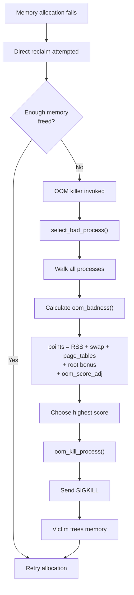
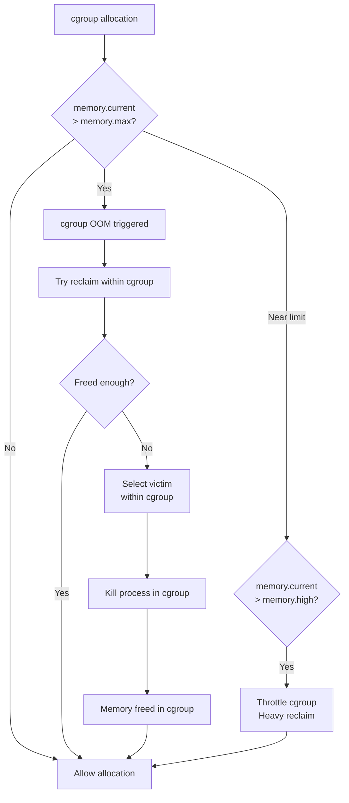
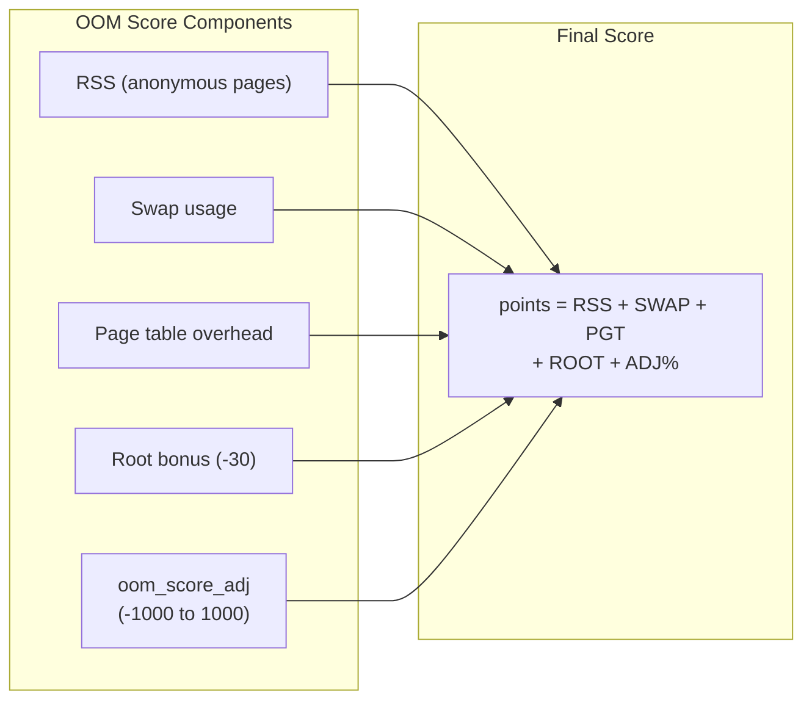

# Chapter 101: The OOM Killer

## Introduction

When the system runs critically low on memory and all other recovery mechanisms (page reclaim, swap) have been exhausted, the kernel invokes the Out-Of-Memory (OOM) killer. The OOM killer selects and kills a process to free memory and prevent a system-wide deadlock. This chapter explores the OOM killer's decision algorithm, tuning mechanisms, cgroup-aware OOM handling, and memory.max/memory.high controls.

## 1. Intuition

### Why Kill Processes?

Without the OOM killer, a system that runs out of memory would deadlock — processes waiting for memory that will never be freed, because the processes holding memory are also waiting. The OOM killer breaks this deadlock by sacrificing a process.

### The Decision

The OOM killer tries to kill the "worst" process — the one that:
1. Uses the most memory
2. Is least important
3. Will free the most memory when killed

The scoring system (`oom_score`) balances these factors.

### OOM Flow

```
1. Memory allocation fails
2. Direct reclaim can't free enough pages
3. OOM killer invoked
4. Select victim based on oom_score
5. Send SIGKILL to victim
6. Victim exits, frees memory
7. Retry the allocation
```

## 2. Architecture

### OOM Killer Triggers

The OOM killer is triggered when:

1. **Out of memory**: `__alloc_pages_slowpath()` fails after direct reclaim
2. **Memory cgroup limit**: `memory.max` exceeded in a cgroup
3. **Kernel memory allocation**: `__GFP_NOFAIL` allocation can't be satisfied
4. **Network buffer allocation**: Socket buffer allocation fails

### OOM Context Types

```c
/* include/linux/oom.h */
enum oom_constraint {
    CONSTRAINT_NONE,        /* System-wide OOM */
    CONSTRAINT_MEMORY_CGROUP,  /* cgroup OOM */
    CONSTRAINT_MEMPOLICY,   /* NUMA policy OOM */
    CONSTRAINT_CPUSET,      /* cpuset OOM */
};
```

## 3. Kernel Implementation

### OOM Killer Invocation

```c
/* mm/oom_kill.c */

/* Main OOM killer entry point */
void out_of_memory(struct oom_control *oc)
{
    unsigned long freed = 0;
    
    /* Check if we should panic instead */
    if (sysctl_panic_on_oom == 2)
        panic("Out of memory");
    
    /* Try to recover from OOM */
    if (oc->gfp_mask & __GFP_RETRY_MAYFAIL) {
        /* Don't kill, just fail the allocation */
        return;
    }
    
    /* Select a victim */
    if (!select_bad_process(oc)) {
        /* No killable process found */
        dump_header(oc, NULL);
        panic("Out of memory and no killable processes...");
    }
    
    /* Kill the selected victim */
    oom_kill_process(oc, "Out of memory");
    
    /* ... */
}

/* Select the process to kill */
static bool select_bad_process(struct oom_control *oc)
{
    oc->chosen_points = LONG_MIN;
    
    /* Walk all processes and score them */
    for_each_process(p) {
        if (oom_unkillable_task(p))
            continue;
        
        /* Calculate OOM score */
        long points = oom_badness(p, oc);
        
        if (points > oc->chosen_points) {
            oc->chosen = p;
            oc->chosen_points = points;
        }
    }
    
    return oc->chosen != NULL;
}
```

### OOM Score Calculation

```c
/* mm/oom_kill.c */

/* Calculate OOM score for a process */
long oom_badness(struct task_struct *p, unsigned long totalpages)
{
    long points;
    long adj;
    
    /* Start with the process's RSS + swap + page table usage */
    points = get_mm_rss(p->mm) +
             get_mm_counter(p->mm, MM_SWAPENTS) +
             get_mm_counter(p->mm, MM_PGTABLES);
    
    /* Add root bonus (root processes are less likely to be killed) */
    if (has_capability_noaudit(p, CAP_SYS_ADMIN) ||
        has_capability_noaudit(p, CAP_SYS_RAWIO))
        points -= 30;
    
    /* Apply oom_score_adj (-1000 to 1000) */
    adj = p->signal->oom_score_adj;
    
    if (adj == OOM_SCORE_ADJ_MIN) {
        /* -1000 = never kill */
        return LONG_MIN;
    }
    
    /* adj ranges from -1000 to 1000 */
    /* Apply as a percentage of totalpages */
    points += (totalpages * adj) / 1000;
    
    return points > 0 ? points : 1;
}
```

### Killing the Process

```c
/* mm/oom_kill.c */

static void oom_kill_process(struct oom_control *oc, const char *message)
{
    struct task_struct *victim = oc->chosen;
    struct task_struct *p;
    struct task_struct *t = victim;
    
    /* Print OOM info */
    pr_err("%s: Killed process %d (%s) total-vm:%lukB, anon-rss:%lukB\n",
           message, victim->pid, victim->comm,
           K(get_mm_total_pages(victim->mm)),
           K(get_mm_counter(victim->mm, MM_ANONPAGES)));
    
    /* Send SIGKILL to the victim and all its threads */
    do_send_sig_info(SIGKILL, SEND_SIG_PRIV, victim, PIDTYPE_PID);
    
    /* Also kill all threads of the victim */
    for_each_thread(victim, t) {
        if (t->flags & PF_KTHREAD)
            continue;
        do_send_sig_info(SIGKILL, SEND_SIG_PRIV, t, PIDTYPE_PID);
    }
    
    /* Mark the victim as killed */
    victim->signal->oom_score_adj = OOM_SCORE_ADJ_MIN;
}
```

### Cgroup OOM

```c
/* mm/memcontrol.c */

/* Memory cgroup OOM handler */
static bool mem_cgroup_oom(struct mem_cgroup *memcg, gfp_t gfp_mask,
                            int order)
{
    struct oom_control oc = {
        .zonelist = NULL,
        .nodemask = NULL,
        .memcg = memcg,
        .gfp_mask = gfp_mask,
        .order = order,
    };
    
    /* Try to reclaim within the cgroup */
    if (mem_cgroup_reclaim(memcg, gfp_mask, order))
        return true;
    
    /* Can't reclaim - OOM within cgroup */
    mem_cgroup_out_of_memory(memcg, gfp_mask, order);
    return false;
}

/* Cgroup OOM - kill within cgroup */
static void mem_cgroup_out_of_memory(struct mem_cgroup *memcg,
                                      gfp_t gfp_mask, int order)
{
    struct oom_control oc = {
        .memcg = memcg,
        .gfp_mask = gfp_mask,
        .order = order,
        .constraint = CONSTRAINT_MEMORY_CGROUP,
    };
    
    /* Select and kill within the cgroup */
    select_bad_process(&oc);
    if (oc.chosen)
        oom_kill_process(&oc, "Memory cgroup out of memory");
}
```

## 4. OOM Score Adjustment

### `/proc/PID/oom_score`

The kernel calculates and exposes the OOM score:

```bash
# View OOM score for all processes
for pid in /proc/[0-9]*; do
    name=$(cat $pid/comm 2>/dev/null)
    score=$(cat $pid/oom_score 2>/dev/null)
    adj=$(cat $pid/oom_score_adj 2>/dev/null)
    if [ -n "$score" ] && [ "$score" -gt 0 ] 2>/dev/null; then
        echo "$score $adj $name"
    fi
done | sort -rn | head -20
```

### `/proc/PID/oom_score_adj`

Adjust the OOM score (-1000 to 1000):

```bash
# Never kill this process (e.g., SSH daemon)
echo -1000 > /proc/$(pidof sshd)/oom_score_adj

# Always kill this process first (e.g., memory hog)
echo 1000 > /proc/$(pidof memory_hog)/oom_score_adj

# Default value
echo 0 > /proc/$(pidof process)/oom_score_adj
```

### Special Values

| Value | Meaning |
|-------|---------|
| -1000 | OOM killer ignores this process (OOM_SCORE_ADJ_MIN) |
| -1000 to -1 | Less likely to be killed |
| 0 | Default |
| 1 to 1000 | More likely to be killed |
| 1000 | Always killed first (OOM_SCORE_ADJ_MAX) |

### Systemd Service Configuration

```ini
# /etc/systemd/system/myservice.service
[Service]
# Protect from OOM killer
OOMScoreAdjust=-900

# Or make it a preferred victim
OOMScoreAdjust=500
```

## 5. Memory Cgroup Controls

### memory.high (Soft Limit)

`memory.high` is the primary mechanism for memory control. When exceeded, the cgroup is heavily throttled and memory is reclaimed:

```bash
# Set memory.high (in bytes)
echo 1073741824 > /sys/fs/cgroup/mygroup/memory.high  # 1 GB

# View current usage
cat /sys/fs/cgroup/mygroup/memory.current

# View high events
cat /sys/fs/cgroup/mygroup/memory.events
# low 0
# high 15      ← exceeded 15 times
# max 0
# oom 0
# oom_kill 0
```

### memory.max (Hard Limit)

`memory.max` is the hard limit. When exceeded, the cgroup's OOM killer activates:

```bash
# Set memory.max (in bytes)
echo 2147483648 > /sys/fs/cgroup/mygroup/memory.max  # 2 GB

# Set memory.max to "max" (no limit)
echo max > /sys/fs/cgroup/mygroup/memory.max
```

### memory.swap.max

Controls swap usage per cgroup:

```bash
# Limit swap to 512 MB
echo 536870912 > /sys/fs/cgroup/mygroup/memory.swap.max

# Disable swap for this cgroup
echo 0 > /sys/fs/cgroup/mygroup/memory.swap.max
```

### Cgroup OOM Events

```bash
# View OOM events
cat /sys/fs/cgroup/mygroup/memory.events
# low 0       ← memory.low breached
# high 0      ← memory.high breached
# max 0       ← memory.max breached
# oom 0       ← OOM detected
# oom_kill 0  ← process killed by OOM
# oom_group_kill 0  ← group killed

# View OOM details
cat /sys/fs/cgroup/mygroup/memory.events.local
```

### Cgroup v2 Memory Configuration Example

```bash
# Create a cgroup
mkdir /sys/fs/cgroup/myapp

# Set limits
echo 4294967296 > /sys/fs/cgroup/myapp/memory.max      # 4 GB hard limit
echo 3221225472 > /sys/fs/cgroup/myapp/memory.high     # 3 GB soft limit
echo 2147483648 > /sys/fs/cgroup/myapp/memory.low      # 2 GB guaranteed
echo 0 > /sys/fs/cgroup/myapp/memory.swap.max          # no swap

# Add process to cgroup
echo $PID > /sys/fs/cgroup/myapp/cgroup.procs

# Monitor
watch -n 1 cat /sys/fs/cgroup/myapp/memory.current
```

## 6. Source Code References

### Key Source Files

- `mm/oom_kill.c` — OOM killer implementation
- `mm/memcontrol.c` — Memory cgroup (memory.max, memory.high)
- `include/linux/oom.h` — OOM data structures
- `fs/proc/base.c` — `/proc/PID/oom_score` and `oom_score_adj`

### Important Functions

```c
/* OOM killer */
void out_of_memory(struct oom_control *oc);
long oom_badness(struct task_struct *p, unsigned long totalpages);
void oom_kill_process(struct oom_control *oc, const char *message);

/* Cgroup OOM */
bool mem_cgroup_oom(struct mem_cgroup *memcg, gfp_t gfp_mask, int order);
void mem_cgroup_out_of_memory(struct mem_cgroup *memcg, gfp_t gfp_mask, int order);
```

## 7. Data Structures

### OOM Control Structure

```c
/* include/linux/oom.h */
struct oom_control {
    struct zonelist *zonelist;      /* allocation zonelist */
    nodemask_t *nodemask;           /* NUMA node mask */
    struct mem_cgroup *memcg;       /* memory cgroup (if cgroup OOM) */
    gfp_t gfp_mask;                 /* allocation flags */
    int order;                      /* allocation order */
    unsigned long totalpages;       /* total pages in system */
    struct task_struct *chosen;     /* selected victim */
    long chosen_points;             /* victim's OOM score */
    enum oom_constraint constraint; /* OOM constraint type */
};
```

### Cgroup Memory Events

```c
/* mm/memcontrol.c */
enum memory_event {
    MEMORY_LOW,
    MEMORY_HIGH,
    MEMORY_MAX,
    MEMORY_OOM,
    MEMORY_OOM_KILL,
    MEMORY_OOM_GROUP_KILL,
    NR_MEMORY_EVENTS,
};
```

## 8. C/Assembly Examples

### Monitoring OOM Events

```bash
# System-wide OOM events
dmesg | grep -i "out of memory\|oom\|killed process"

# Recent OOM kills
journalctl -k | grep -i oom

# OOM kill count
cat /proc/vmstat | grep oom_kill

# Per-cgroup OOM events
find /sys/fs/cgroup -name "memory.events" -exec grep -H "oom_kill" {} \;
```

### C Program: OOM Score Reader

```c
#include <stdio.h>
#include <stdlib.h>
#include <string.h>
#include <dirent.h>
#include <ctype.h>

/* Read and display OOM scores for all processes */
int main() {
    DIR *proc;
    struct dirent *entry;
    
    proc = opendir("/proc");
    if (!proc) {
        perror("opendir /proc");
        return 1;
    }
    
    printf("%-8s %-6s %-6s %s\n", "PID", "SCORE", "ADJ", "COMMAND");
    printf("%-8s %-6s %-6s %s\n", "---", "-----", "---", "-------");
    
    while ((entry = readdir(proc)) != NULL) {
        if (!isdigit(entry->d_name[0]))
            continue;
        
        char path[256];
        char name[256] = "?";
        int score = 0, adj = 0;
        FILE *fp;
        
        /* Read command name */
        snprintf(path, sizeof(path), "/proc/%s/comm", entry->d_name);
        fp = fopen(path, "r");
        if (fp) {
            fgets(name, sizeof(name), fp);
            name[strcspn(name, "\n")] = 0;
            fclose(fp);
        }
        
        /* Read OOM score */
        snprintf(path, sizeof(path), "/proc/%s/oom_score", entry->d_name);
        fp = fopen(path, "r");
        if (fp) {
            fscanf(fp, "%d", &score);
            fclose(fp);
        }
        
        /* Read OOM score adjustment */
        snprintf(path, sizeof(path), "/proc/%s/oom_score_adj", entry->d_name);
        fp = fopen(path, "r");
        if (fp) {
            fscanf(fp, "%d", &adj);
            fclose(fp);
        }
        
        if (score > 0)
            printf("%-8s %-6d %-6d %s\n", entry->d_name, score, adj, name);
    }
    
    closedir(proc);
    return 0;
}
```

### C Program: OOM Score Adjuster

```c
#include <stdio.h>
#include <stdlib.h>
#include <fcntl.h>
#include <unistd.h>
#include <string.h>

/* Adjust OOM score for a process */
int main(int argc, char *argv[]) {
    char path[256];
    char value[16];
    int fd;
    
    if (argc != 3) {
        fprintf(stderr, "Usage: %s <PID> <oom_score_adj>\n", argv[0]);
        fprintf(stderr, "  adj: -1000 (never kill) to 1000 (always kill)\n");
        return 1;
    }
    
    int pid = atoi(argv[1]);
    int adj = atoi(argv[2]);
    
    if (adj < -1000 || adj > 1000) {
        fprintf(stderr, "Error: adj must be -1000 to 1000\n");
        return 1;
    }
    
    snprintf(path, sizeof(path), "/proc/%d/oom_score_adj", pid);
    snprintf(value, sizeof(value), "%d\n", adj);
    
    fd = open(path, O_WRONLY);
    if (fd < 0) {
        perror("open");
        return 1;
    }
    
    if (write(fd, value, strlen(value)) < 0) {
        perror("write");
        close(fd);
        return 1;
    }
    
    close(fd);
    printf("Set oom_score_adj for PID %d to %d\n", pid, adj);
    return 0;
}
```

### Kernel Module: OOM Notification

```c
/* Kernel module that registers for OOM notifications */
#include <linux/module.h>
#include <linux/oom.h>
#include <linux/notifier.h>

static int oom_notify(struct notifier_block *nb, unsigned long action,
                      void *data)
{
    struct oom_control *oc = data;
    
    pr_warn("OOM event: victim PID=%d (%s), score=%ld\n",
            oc->chosen ? oc->chosen->pid : 0,
            oc->chosen ? oc->chosen->comm : "none",
            oc->chosen_points);
    
    return NOTIFY_OK;
}

static struct notifier_block oom_notifier = {
    .notifier_call = oom_notify,
    .priority = 100,
};

static int __init oom_monitor_init(void)
{
    register_oom_notifier(&oom_notifier);
    pr_info("OOM monitor loaded\n");
    return 0;
}

static void __exit oom_monitor_exit(void)
{
    unregister_oom_notifier(&oom_notifier);
    pr_info("OOM monitor unloaded\n");
}

module_init(oom_monitor_init);
module_exit(oom_monitor_exit);
MODULE_LICENSE("GPL");
```

## 9. Mermaid Diagrams

### OOM Killer Decision Flow



### Cgroup OOM Flow



### OOM Score Calculation



## 10. Performance

### OOM Killer Overhead

The OOM killer itself has minimal overhead, but:
- OOM kills can cause service disruption
- Frequent OOM kills indicate insufficient memory
- OOM kill logging can generate I/O

### earlyoom: Userspace OOM Killer

The kernel OOM killer activates very late, when the system is already in trouble. `earlyoom` is a userspace daemon that monitors memory and kills processes before the system becomes unresponsive:

```bash
# Install earlyoom
sudo apt install earlyoom
sudo systemctl enable earlyoom

# Configure earlyoom
# /etc/default/earlyoom
EARLYOOM_ARGS="-m 5 -s 5 -n --prefer '(^|/)(sshd|systemd)$' --avoid '(^|/)(init|bash)$'"

# -m 5: Trigger when 5% RAM free
# -s 5: Trigger when 5% swap free
# -n: Enable notifications
# --prefer: Prefer killing these processes
# --avoid: Avoid killing these processes
```

### Memory Pressure Monitoring

```bash
# Monitor memory pressure (PSI - Pressure Stall Information)
cat /proc/pressure/memory
# some avg10=0.00 avg60=0.00 avg300=0.00 total=0
# full avg10=0.00 avg60=0.00 avg300=0.00 total=0

# some = at least one task stalled on memory
# full = all tasks stalled on memory

# Set up memory pressure notifications
# Using cgroup v2 memory.pressure

echo "1000000 100000" > /sys/fs/cgroup/mygroup/memory.pressure
# Notify when 10% stall over 100ms window

# Monitor with systemd
# /etc/systemd/oomd.conf
[OOM]
SwapUsedLimit=90%
DefaultMemoryPressureLimit=80%
DefaultMemoryPressureDurationSec=30
```

### Preventing OOM

```bash
# Reserve memory for critical processes
echo -1000 > /proc/$(pidof sshd)/oom_score_adj

# Use cgroups to isolate workloads
# Set memory.max to prevent runaway processes

# Use memory.low for guaranteed memory
echo 1073741824 > /sys/fs/cgroup/critical/memory.low  # 1 GB guaranteed
```

### OOM Tuning

```bash
# Disable OOM killer (system will panic instead)
echo 1 > /proc/sys/vm/panic_on_oom

# Panic on OOM with specific order
echo "1" > /proc/sys/vm/panic_on_oom

# Dump OOM state
echo 1 > /proc/sys/vm/oom_dump_tasks

# OOM kill allocating task (instead of scanning)
echo 1 > /proc/sys/vm/oom_kill_allocating_task
```

## 11. Security

### OOM and Service Availability

- SSH daemon (`sshd`) should have `oom_score_adj = -1000`
- Monitoring agents should be protected from OOM
- Critical system services should have negative OOM scores

### Cgroup Isolation

```bash
# Isolate different services
# Each service gets its own cgroup with memory.max
# One service's OOM doesn't affect others

# Example: Web server + database on same machine
echo 8589934592 > /sys/fs/cgroup/webserver/memory.max   # 8 GB
echo 17179869184 > /sys/fs/cgroup/database/memory.max    # 16 GB
```

### OOM DoS Protection

```bash
# Limit total memory usage to prevent system-wide OOM
# Use cgroups for all user workloads
# Set reasonable memory.max limits
```

## 12. Common Pitfalls

### 1. Not Protecting Critical Services

```bash
# WRONG: sshd has default OOM score
# If system runs low on memory, sshd might be killed
# You lose access to fix the problem!

# CORRECT: Protect sshd
echo -1000 > /proc/$(pidof sshd)/oom_score_adj
```

### 2. Setting oom_score_adj Too Low

Setting everything to -1000 means the OOM killer has no good victims and may panic.

### 3. Ignoring Cgroup OOM

Cgroup OOM kills are silent by default. Always monitor `memory.events`:

```bash
# Check for cgroup OOM kills
cat /sys/fs/cgroup/*/memory.events | grep oom_kill
```

### 4. Not Monitoring OOM Events

```bash
# Always monitor OOM events
dmesg | grep -i oom
journalctl -k | grep -i oom
```

### 5. Overcommit and OOM

```bash
# Check overcommit settings
cat /proc/sys/vm/overcommit_memory
# 0 = heuristic (default)
# 1 = always overcommit
# 2 = never overcommit (strict)

cat /proc/sys/vm/overcommit_ratio
# 50 (default) - allows commit up to 50% swap + RAM
```

## 13. Best Practices

1. **Protect critical services** with `oom_score_adj = -1000`
2. **Use cgroups** to isolate workloads and prevent cascading OOM
3. **Set memory.max** for all user-facing services
4. **Monitor OOM events** in system logs
5. **Use memory.low** for guaranteed memory allocations
6. **Disable swap for containers** that shouldn't swap (`memory.swap.max = 0`)
7. **Set reasonable limits** — don't over-protect (prevents OOM from working)
8. **Use systemd's OOMScoreAdjust** for service management
9. **Test OOM scenarios** in development
10. **Consider earlyoom** for userspace OOM handling

## 14. OOM Monitoring and Response

### Real-Time OOM Monitoring

```bash
# Monitor OOM events in real-time
journalctl -f -k | grep -i oom

# Systemd journal query for OOM events
journalctl -k --since "1 hour ago" | grep -i "oom\|killed process"

# Parse OOM kill details from dmesg
dmesg | grep -A 20 "Out of memory" | grep -E "Killed process|oom_score|total-vm|anon-rss"

# Count OOM kills over time
watch -n 5 'dmesg | grep -c "Killed process"'
```

### OOM Response Script

```bash
#!/bin/bash
# oom-monitor.sh - Monitor and respond to OOM events
LOG_FILE="/var/log/oom-events.log"

tail -f /var/log/kern.log | while read line; do
    if echo "$line" | grep -q "Out of memory"; then
        timestamp=$(date '+%Y-%m-%d %H:%M:%S')
        victim=$(echo "$line" | grep -oP 'Killed process \K[0-9]+')
        process=$(echo "$line" | grep -oP '\(\K[^)]+')
        
        echo "[$timestamp] OOM Kill: PID=$victim ($process)" >> "$LOG_FILE"
        
        # Send notification
        logger -p daemon.crit "OOM kill detected: $process (PID $victim)"
        
        # Optional: restart critical services
        # systemctl restart myservice
    fi
done
```

### Cgroup Memory Monitoring

```bash
# Monitor all cgroup memory usage and OOM events
for cg in /sys/fs/cgroup/*/; do
    name=$(basename "$cg")
    current=$(cat "$cg/memory.current" 2>/dev/null)
    max=$(cat "$cg/memory.max" 2>/dev/null)
    oom_kill=$(grep oom_kill "$cg/memory.events" 2>/dev/null | awk '{print $2}')
    
    if [ "$oom_kill" -gt 0 ] 2>/dev/null; then
        echo "WARNING: $name has $oom_kill OOM kills"
    fi
    
    if [ "$max" != "max" ] && [ "$current" -gt 0 ] 2>/dev/null; then
        usage_pct=$((current * 100 / max))
        if [ "$usage_pct" -gt 80 ]; then
            echo "WARNING: $name at ${usage_pct}% memory limit"
        fi
    fi
done
```

## 15. Exercises

### Exercise 1: OOM Simulation

Write a program that allocates memory in a loop until OOM. Observe which process gets killed.

### Exercise 2: OOM Score Manipulation

Write a script that sets different OOM scores for multiple processes and simulates OOM.

### Exercise 3: Cgroup OOM

Set up a cgroup with memory.max and trigger a cgroup OOM. Observe the behavior.

### Exercise 4: OOM Monitoring

Write a monitoring script that detects OOM kills and reports the victim process.

### Exercise 5: OOM Protection

Configure a system with protected critical services and verify they survive OOM scenarios.

## 16. References

1. **Linux Kernel Source**: `mm/oom_kill.c`, `mm/memcontrol.c`
2. **"Understanding the Linux Kernel"** by Daniel P. Bovet and Marco Cesati
3. **Linux Documentation**: `Documentation/admin-guide/sysctl/vm.rst`
4. **Linux Documentation**: `Documentation/admin-guide/cgroup-v2.rst`
5. **Linux man pages**: `proc(5)`, `oom_score(5)`
6. **LWN.net**: "Out of memory management"
7. **"Systems Performance"** by Brendan Gregg
8. **earlyoom**: https://github.com/rfjakob/earlyoom
9. **PSI documentation**: `Documentation/accounting/psi.rst`
