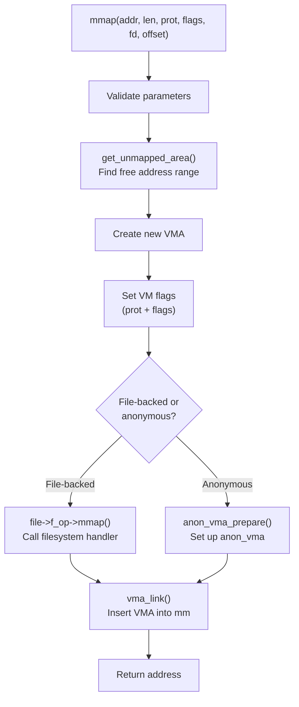
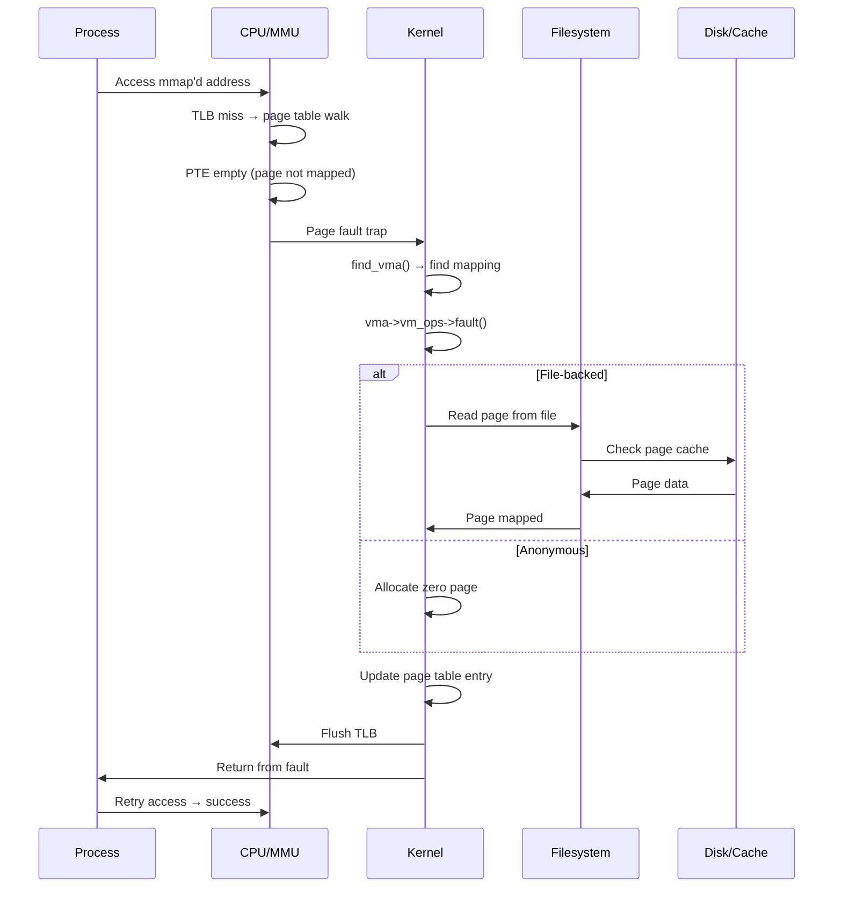
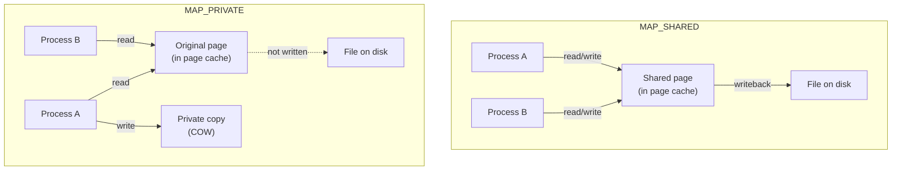
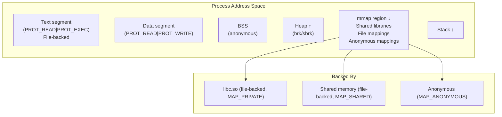

# Chapter 102: Memory Mapping

## Introduction

Memory mapping is a mechanism that maps files or devices into a process's address space, allowing file I/O through ordinary memory operations. The `mmap()` system call creates these mappings, while `munmap()` removes them. This chapter explores `mmap()`, `munmap()`, `brk()`, `mprotect()`, and the differences between `MAP_SHARED` and `MAP_PRIVATE` mappings.

## 1. Intuition

### Why Memory Mapping?

Traditional file I/O uses `read()` and `write()` system calls, which require:
1. System call overhead (user → kernel → user transitions)
2. Data copying (kernel buffer → user buffer)
3. Explicit offset management

Memory mapping eliminates these by:
1. Mapping the file directly into the process's address space
2. Allowing the CPU to access file data via normal load/store instructions
3. Using the page cache directly (no extra copy)
4. Letting the MMU handle page faults transparently

### The Mental Model

Think of `mmap()` as creating a window into a file:

```
Before mmap:
  Process address space:  [code][data][heap][stack]
  File on disk:           [data.................]

After mmap:
  Process address space:  [code][data][heap][stack][file_mapping]
                                         ↑
  File on disk:           [data.................]
                                         ↑
  Page cache:             [cached_pages_from_file]
```

The file mapping region shows the file's contents. Accessing an address in this region triggers a page fault if the page isn't cached, reads the data from disk, and maps it.

## 2. Architecture

### mmap() System Call

```c
#include <sys/mman.h>

void *mmap(void *addr, size_t length, int prot, int flags,
           int fd, off_t offset);
```

**Parameters**:
- `addr`: Hint address (usually NULL for kernel to choose)
- `length`: Size of mapping
- `prot`: Protection flags (`PROT_READ`, `PROT_WRITE`, `PROT_EXEC`, `PROT_NONE`)
- `flags`: Mapping flags (`MAP_SHARED`, `MAP_PRIVATE`, `MAP_ANONYMOUS`, etc.)
- `fd`: File descriptor (or -1 for anonymous)
- `offset`: File offset (must be page-aligned)

### Mapping Types

#### File-Backed Mappings

```c
/* Map a file into memory */
int fd = open("data.bin", O_RDWR);
void *ptr = mmap(NULL, file_size, PROT_READ | PROT_WRITE,
                 MAP_SHARED, fd, 0);

/* Access file data through pointer */
int *data = (int *)ptr;
data[0] = 42;  /* Writes directly to file (eventually) */

/* Changes are visible to other processes mapping the same file */
```

#### Anonymous Mappings

```c
/* Map anonymous memory (no file backing) */
void *ptr = mmap(NULL, 4096, PROT_READ | PROT_WRITE,
                 MAP_PRIVATE | MAP_ANONYMOUS, -1, 0);

/* This is zero-filled memory, like malloc() */
memset(ptr, 0, 4096);
```

### MAP_SHARED vs MAP_PRIVATE

| Feature | MAP_SHARED | MAP_PRIVATE |
|---------|-----------|-------------|
| Changes visible to others? | Yes | No (copy-on-write) |
| Written back to file? | Yes | No (copy-on-write) |
| Use case | IPC, shared files | Process-private data |
| Kernel behavior | Modifies page cache | Creates private copy |

```
MAP_SHARED:
  Process A ──┐
              ├──→ Same page cache pages ──→ File on disk
  Process B ──┘

MAP_PRIVATE:
  Process A ──→ Original page cache ──→ File on disk
  Process A writes → Copy-on-write → Private copy (not written to file)
```

### brk() and sbrk()

`brk()` adjusts the program break (end of the heap):

```c
#include <unistd.h>

int brk(void *addr);
void *sbrk(intptr_t increment);
```

```
Before brk(addr):
  [data][heap........]

After brk(addr) with larger addr:
  [data][heap................]  ← expanded
                                ↑ addr (new program break)
```

### mprotect()

`mprotect()` changes protection on existing mappings:

```c
#include <sys/mman.h>

int mprotect(void *addr, size_t len, int prot);
```

```c
/* Make a region read-only */
mprotect(ptr, size, PROT_READ);

/* Make a region no-access (guard page) */
mprotect(guard_page, PAGE_SIZE, PROT_NONE);

/* Make code executable */
mprotect(code_region, size, PROT_READ | PROT_EXEC);
```

### munmap()

`munmap()` removes a mapping:

```c
#include <sys/mman.h>

int munmap(void *addr, size_t length);
```

## 3. Kernel Implementation

### mmap() Implementation

```c
/* mm/mmap.c */

SYSCALL_DEFINE6(mmap, unsigned long, addr, unsigned long, len,
                unsigned long, prot, unsigned long, flags,
                unsigned long, fd, unsigned long, pgoff)
{
    struct file *file = NULL;
    unsigned long retval;
    
    if (!(flags & MAP_ANONYMOUS)) {
        /* File-backed mapping */
        file = fget(fd);
        if (!file)
            return -EBADF;
    }
    
    retval = vm_mmap_pgoff(file, addr, len, prot, flags, pgoff);
    
    if (file)
        fput(file);
    
    return retval;
}

unsigned long vm_mmap_pgoff(struct file *file, unsigned long addr,
                             unsigned long len, unsigned long prot,
                             unsigned long flags, unsigned long pgoff)
{
    unsigned long ret;
    struct mm_struct *mm = current->mm;
    
    /* ... locking ... */
    
    ret = do_mmap(file, addr, len, prot, flags, 0, pgoff, &populate, NULL);
    
    /* ... */
    
    return ret;
}

/* Core mmap implementation */
unsigned long do_mmap(struct file *file, unsigned long addr,
                      unsigned long len, unsigned long prot,
                      unsigned long flags, unsigned long pgoff,
                      unsigned long *populate, struct list_head *uf)
{
    struct mm_struct *mm = current->mm;
    struct vm_area_struct *vma;
    unsigned long vm_flags;
    
    /* Align length to page boundary */
    len = PAGE_ALIGN(len);
    
    /* Check for overflow */
    if (!len)
        return -EINVAL;
    
    /* Calculate VM flags from prot and flags */
    vm_flags = calc_vm_prot_bits(prot) | calc_vm_flag_bits(flags);
    
    /* Find a free address if not specified */
    addr = get_unmapped_area(file, addr, len, pgoff, flags);
    if (IS_ERR_VALUE(addr))
        return addr;
    
    /* Create VMA */
    vma = kmem_cache_alloc(vm_area_cachep, GFP_KERNEL);
    if (!vma)
        return -ENOMEM;
    
    vma->vm_mm = mm;
    vma->vm_start = addr;
    vma->vm_end = addr + len;
    vma->vm_flags = vm_flags;
    vma->vm_page_prot = vm_get_page_prot(vm_flags);
    vma->vm_pgoff = pgoff;
    
    if (file) {
        vma->vm_file = get_file(file);
        vma->vm_ops = file->f_mapping->a_ops->mmap_ops;
        /* Call file-specific mmap handler */
        if (file->f_op->mmap)
            file->f_op->mmap(file, vma);
    } else if (flags & MAP_ANONYMOUS) {
        /* Anonymous mapping */
        vma->vm_ops = &anon_vm_ops;
    }
    
    /* Insert VMA into the address space */
    vma_link(mm, vma, prev, rb_link, rb_parent);
    
    return addr;
}
```

### munmap() Implementation

```c
/* mm/mmap.c */

SYSCALL_DEFINE2(munmap, unsigned long, addr, size_t, len)
{
    return __vm_munmap(addr, len, true);
}

int __vm_munmap(unsigned long start, size_t len, bool downgrade)
{
    struct mm_struct *mm = current->mm;
    struct list_head uf = LIST_HEAD_INIT(uf);
    int ret;
    
    /* ... locking ... */
    
    ret = do_munmap(mm, start, len, &uf);
    
    /* ... */
    
    return ret;
}

/* Core munmap implementation */
int do_munmap(struct mm_struct *mm, unsigned long start,
              size_t len, struct list_head *uf)
{
    unsigned long end;
    struct vm_area_struct *vma, *prev, *last;
    
    /* Align to page boundary */
    start = start & PAGE_MASK;
    len = PAGE_ALIGN(len);
    end = start + len;
    
    /* Find the first VMA in the range */
    vma = find_vma(mm, start);
    if (!vma || vma->vm_start >= end)
        return 0;  /* Nothing to unmap */
    
    /* Split VMAs at boundaries if needed */
    if (vma->vm_start < start) {
        /* Split at start */
        split_vma(mm, vma, start, 1);
    }
    
    /* Unmap the range */
    detach_vmas_to_be_unmapped(mm, vma, prev, end);
    
    /* Unmap pages and free page tables */
    unmap_region(mm, vma, prev, start, end);
    
    /* Remove VMAs and free */
    remove_vma_list(mm, vma);
    
    return 0;
}
```

### brk() Implementation

```c
/* mm/mmap.c */

SYSCALL_DEFINE1(brk, unsigned long, brk)
{
    unsigned long retval;
    unsigned long newbrk, oldbrk;
    struct mm_struct *mm = current->mm;
    struct vm_area_struct *next;
    
    /* Align to page boundary */
    newbrk = PAGE_ALIGN(brk);
    oldbrk = PAGE_ALIGN(mm->brk);
    
    if (oldbrk == newbrk) {
        mm->brk = brk;
        return brk;
    }
    
    /* Check if expanding or contracting */
    if (brk <= mm->brk) {
        /* Contracting */
        if (!do_munmap(mm, newbrk, oldbrk - newbrk, &uf))
            goto set_brk;
    } else {
        /* Expanding */
        /* Check if we can expand the existing VMA */
        next = find_vma(mm, oldbrk);
        if (next && next->vm_start == oldbrk &&
            !vma_growsup(next->vm_prev, newbrk)) {
            /* Can expand existing VMA */
            if (can_expand(mm, oldbrk, newbrk)) {
                next->vm_start = oldbrk;
                mm->brk = brk;
                return brk;
            }
        }
        
        /* Create new VMA */
        if (do_brk_flags(oldbrk, newbrk - oldbrk, 0, &uf) < 0)
            return mm->brk;
    }
    
set_brk:
    mm->brk = brk;
    return brk;
}
```

### mprotect() Implementation

```c/* mm/mprotect.c */

SYSCALL_DEFINE3(mprotect, unsigned long, start, size_t, len,
                unsigned long, prot)
{
    return do_mprotect(start, len, prot, true);
}

static int do_mprotect(unsigned long start, size_t len,
                        unsigned long prot, bool downgrade)
{
    struct mm_struct *mm = current->mm;
    struct vm_area_struct *vma, *prev;
    unsigned long end;
    pgoff_t pgoff;
    
    start = start & PAGE_MASK;
    len = PAGE_ALIGN(len);
    end = start + len;
    
    /* Walk through VMAs in the range */
    for (vma = find_vma(mm, start); vma && vma->vm_start < end;
         vma = vma->vm_next) {
        
        unsigned long newflags;
        
        /* Calculate new flags */
        newflags = calc_vm_prot_bits(prot);
        newflags |= (vma->vm_flags & ~(VM_READ | VM_WRITE | VM_EXEC));
        
        /* Update page protection */
        change_protection(mm, vma, start, min(end, vma->vm_end),
                          newflags, 0);
        
        start = vma->vm_end;
    }
    
    return 0;
}
```

## 4. Source Code References

### Key Source Files

- `mm/mmap.c` — `mmap()`, `munmap()`, `brk()` implementation
- `mm/mprotect.c` — `mprotect()` implementation
- `mm/mremap.c` — `mremap()` implementation
- `include/linux/mm.h` — Core VM function declarations
- `include/linux/mman.h` — mmap flag definitions
- `arch/x86/kernel/sys_x86_64.c` — x86-64 specific mmap area calculation

### Important Functions

```c
/* mmap */
unsigned long do_mmap(struct file *file, unsigned long addr,
                      unsigned long len, unsigned long prot,
                      unsigned long flags, unsigned long pgoff,
                      unsigned long *populate, struct list_head *uf);

/* munmap */
int do_munmap(struct mm_struct *mm, unsigned long start,
              size_t len, struct list_head *uf);

/* brk */
SYSCALL_DEFINE1(brk, unsigned long, brk);

/* mprotect */
int do_mprotect(unsigned long start, size_t len,
                unsigned long prot, bool downgrade);
```

## 5. Data Structures

### VMA Flags for mmap

```c
/* include/linux/mman.h */

/* Protection flags → VM flags */
#define calc_vm_prot_bits(prot) ( \
    ((prot & PROT_READ)  ? VM_READ  : 0) | \
    ((prot & PROT_WRITE) ? VM_WRITE : 0) | \
    ((prot & PROT_EXEC)  ? VM_EXEC  : 0) \
)

/* mmap flags → VM flags */
#define calc_vm_flag_bits(flags) ( \
    ((flags & MAP_SHARED)  ? VM_SHARED  : 0) | \
    ((flags & MAP_DENYWRITE) ? VM_DENYWRITE : 0) | \
    ((flags & MAP_LOCKED)  ? VM_LOCKED  : 0) | \
    /* ... */ \
)
```

### Mapping Types

```c
/* include/uapi/asm-generic/mman-common.h */

/* Protection flags */
#define PROT_NONE       0x0   /* No access */
#define PROT_READ       0x1   /* Read */
#define PROT_WRITE      0x2   /* Write */
#define PROT_EXEC       0x4   /* Execute */

/* Mapping flags */
#define MAP_SHARED      0x01  /* Share changes */
#define MAP_PRIVATE     0x02  /* Private copy-on-write */
#define MAP_FIXED       0x10  /* Exact address */
#define MAP_ANONYMOUS   0x20  /* Anonymous mapping */
#define MAP_NORESERVE   0x40  /* Don't reserve swap */
#define MAP_GROWSDOWN   0x100 /* Stack-like segment */
#define MAP_LOCKED      0x2000 /* Lock pages */
#define MAP_POPULATE    0x8000 /* Pre-fault pages */
#define MAP_HUGETLB     0x40000 /* Huge page mapping */
```

## 6. C/Assembly Examples

### Basic mmap Usage

```c
#include <stdio.h>
#include <stdlib.h>
#include <sys/mman.h>
#include <sys/stat.h>
#include <fcntl.h>
#include <unistd.h>
#include <string.h>

int main() {
    int fd;
    struct stat st;
    void *ptr;
    
    /* File-backed mapping */
    fd = open("testfile", O_RDWR | O_CREAT, 0644);
    ftruncate(fd, 4096);
    fstat(fd, &st);
    
    ptr = mmap(NULL, st.st_size, PROT_READ | PROT_WRITE,
               MAP_SHARED, fd, 0);
    
    if (ptr == MAP_FAILED) {
        perror("mmap");
        return 1;
    }
    
    /* Write through mapping */
    strcpy((char *)ptr, "Hello from mmap!");
    printf("Written: %s\n", (char *)ptr);
    
    /* Ensure written to disk */
    msync(ptr, st.st_size, MS_SYNC);
    
    munmap(ptr, st.st_size);
    close(fd);
    
    /* Anonymous mapping */
    ptr = mmap(NULL, 4096, PROT_READ | PROT_WRITE,
               MAP_PRIVATE | MAP_ANONYMOUS, -1, 0);
    
    if (ptr != MAP_FAILED) {
        memset(ptr, 0, 4096);
        printf("Anonymous mapping at %p\n", ptr);
        munmap(ptr, 4096);
    }
    
    return 0;
}
```

### Copy-on-Write Demonstration

```c
#include <stdio.h>
#include <stdlib.h>
#include <sys/mman.h>
#include <string.h>
#include <unistd.h>
#include <sys/wait.h>

int main() {
    void *ptr;
    
    /* Create private mapping */
    ptr = mmap(NULL, 4096, PROT_READ | PROT_WRITE,
               MAP_PRIVATE | MAP_ANONYMOUS, -1, 0);
    
    /* Write data */
    strcpy((char *)ptr, "Original data");
    
    printf("Before fork: %s\n", (char *)ptr);
    
    if (fork() == 0) {
        /* Child: modify the mapping */
        strcpy((char *)ptr, "Child's data");
        printf("Child after write: %s\n", (char *)ptr);
        exit(0);
    }
    
    wait(NULL);
    
    /* Parent: data unchanged (COW) */
    printf("Parent after fork: %s\n", (char *)ptr);
    
    munmap(ptr, 4096);
    return 0;
}
```

### mprotect Example

```c
#include <stdio.h>
#include <stdlib.h>
#include <sys/mman.h>
#include <signal.h>
#include <setjmp.h>

static jmp_buf jump_buffer;

static void segfault_handler(int sig) {
    longjmp(jump_buffer, 1);
}

int main() {
    void *ptr;
    
    /* Allocate memory */
    ptr = mmap(NULL, 4096, PROT_READ | PROT_WRITE,
               MAP_PRIVATE | MAP_ANONYMOUS, -1, 0);
    
    /* Write data */
    *(int *)ptr = 42;
    printf("Value: %d\n", *(int *)ptr);
    
    /* Make read-only */
    mprotect(ptr, 4096, PROT_READ);
    printf("Made read-only\n");
    
    /* Try to write - will segfault */
    signal(SIGSEGV, segfault_handler);
    
    if (setjmp(jump_buffer) == 0) {
        *(int *)ptr = 100;  /* This will fault */
        printf("Write succeeded (unexpected)\n");
    } else {
        printf("Caught segfault on write to read-only page\n");
    }
    
    /* Restore write permission */
    mprotect(ptr, 4096, PROT_READ | PROT_WRITE);
    *(int *)ptr = 100;
    printf("After restore: %d\n", *(int *)ptr);
    
    munmap(ptr, 4096);
    return 0;
}
```

### brk() Demonstration

```c
#include <stdio.h>
#include <unistd.h>
#include <sys/types.h>

int main() {
    void *initial_brk, *new_brk;
    
    /* Get current program break */
    initial_brk = sbrk(0);
    printf("Initial brk: %p\n", initial_brk);
    
    /* Extend heap by 4096 bytes */
    if (sbrk(4096) == (void *)-1) {
        perror("sbrk");
        return 1;
    }
    
    new_brk = sbrk(0);
    printf("New brk: %p\n", new_brk);
    printf("Heap extended by: %ld bytes\n",
           (long)(new_brk - initial_brk));
    
    /* Use the memory */
    int *arr = (int *)initial_brk;
    for (int i = 0; i < 1024; i++)
        arr[i] = i;
    
    printf("arr[0] = %d, arr[1023] = %d\n", arr[0], arr[1023]);
    
    /* Shrink heap back */
    brk(initial_brk);
    printf("Heap restored to: %p\n", sbrk(0));
    
    return 0;
}
```

## 7. Mermaid Diagrams

### mmap Flow



### Page Fault on mmap Region



### MAP_SHARED vs MAP_PRIVATE



### Memory Layout with mmap



## 8. Performance

### mmap vs read/write

| Aspect | mmap | read/write |
|--------|------|------------|
| System calls | 1 (mmap) + 0 for access | 1 per read/write |
| Data copying | Zero-copy (direct access) | Kernel → user copy |
| Random access | Direct pointer arithmetic | lseek + read |
| Sequential scan | Good (with readahead) | Good |
| Small files | Overhead of VMA setup | Simple |
| Large files | Excellent (page cache) | Good (buffered) |

### mmap Performance Tips

```c
/* Pre-fault pages */
mmap(NULL, size, PROT_READ | PROT_WRITE,
     MAP_PRIVATE | MAP_ANONYMOUS | MAP_POPULATE, -1, 0);

/* Hint for sequential access */
madvise(ptr, size, MADV_SEQUENTIAL);

/* Hint for random access */
madvise(ptr, size, MADV_RANDOM);

/* Hint that we'll need pages soon */
madvise(ptr, size, MADV_WILLNEED);

/* Hint that we don't need pages anymore */
madvise(ptr, size, MADV_DONTNEED);

/* Use huge pages */
madvise(ptr, size, MADV_HUGEPAGE);
```

### MAP_POPULATE

```c
/* Without MAP_POPULATE: page faults on first access */
ptr = mmap(NULL, size, PROT_READ | PROT_WRITE,
           MAP_PRIVATE | MAP_ANONYMOUS, -1, 0);
memset(ptr, 0, size);  /* Many page faults here */

/* With MAP_POPULATE: all pages faulted during mmap */
ptr = mmap(NULL, size, PROT_READ | PROT_WRITE,
           MAP_PRIVATE | MAP_ANONYMOUS | MAP_POPULATE, -1, 0);
/* No page faults on first access */
```

## 9. Security

### W^X Enforcement

Modern systems enforce that pages cannot be both writable and executable:

```c
/* WRONG: PROT_WRITE | PROT_EXEC */
ptr = mmap(NULL, size, PROT_WRITE | PROT_EXEC, ...);
/* May be rejected on hardened systems */

/* CORRECT: Separate regions */
code = mmap(NULL, size, PROT_READ | PROT_EXEC, ...);
data = mmap(NULL, size, PROT_READ | PROT_WRITE, ...);
```

### MAP_FIXED Dangers

```c
/* DANGEROUS: MAP_FIXED overwrites existing mappings */
mmap(0x400000, 4096, PROT_READ | PROT_WRITE,
     MAP_FIXED | MAP_ANONYMOUS, -1, 0);
/* May overwrite code, data, or other mappings */

/* SAFER: Use MAP_FIXED_NOREPLACE (Linux 4.17+) */
mmap(0x400000, 4096, PROT_READ | PROT_WRITE,
     MAP_FIXED_NOREPLACE | MAP_ANONYMOUS, -1, 0);
/* Fails if address already in use */
```

### ASLR and mmap

```bash
# ASLR randomizes mmap base address
cat /proc/sys/kernel/randomize_va_space
# 2 = full randomization (default)

# View mmap base for a process
cat /proc/<PID>/maps | head -1
```

### Guard Pages

```c
/* Create a guard page to detect overflow */
void *region = mmap(NULL, size + PAGE_SIZE, PROT_NONE,
                    MAP_PRIVATE | MAP_ANONYMOUS, -1, 0);

/* Make the usable portion read-write */
mprotect(region, size, PROT_READ | PROT_WRITE);

/* The last page remains PROT_NONE - any access faults */
```

## 10. Common Pitfalls

### 1. Forgetting munmap()

```c
/* Memory leak: never munmap'd */
ptr = mmap(NULL, size, ...);
/* ... use ptr ... */
return;  /* Bug: munmap(ptr, size) missing */
```

### 2. Using mmap After munmap

```c
ptr = mmap(NULL, size, ...);
munmap(ptr, size);
*ptr = 42;  /* Bug: segfault (or worse, silent corruption) */
```

### 3. Not Checking MAP_FAILED

```c
ptr = mmap(NULL, size, ...);
/* WRONG: check for NULL */
if (!ptr) { /* Bug: mmap returns MAP_FAILED, not NULL */ }

/* CORRECT: check for MAP_FAILED */
if (ptr == MAP_FAILED) { perror("mmap"); }
```

### 4. Non-Aligned Offset

```c
/* WRONG: offset not page-aligned */
mmap(NULL, 4096, PROT_READ, MAP_SHARED, fd, 100);

/* CORRECT: align to page boundary */
mmap(NULL, 4096, PROT_READ, MAP_SHARED, fd, 0);
```

### 5. File Truncation After mmap

```c
ptr = mmap(NULL, st.st_size, PROT_READ, MAP_SHARED, fd, 0);
ftruncate(fd, 0);  /* DANGER: accessing ptr now causes SIGBUS */
```

## 11. Best Practices

1. **Always check for MAP_FAILED** after mmap
2. **Always munmap** when done with a mapping
3. **Use MAP_PRIVATE** unless sharing is needed
4. **Use MAP_POPULATE** for immediate access patterns
5. **Use madvise()** to hint the kernel about access patterns
6. **Use MAP_FIXED_NOREPLACE** instead of MAP_FIXED
7. **Use msync()** to ensure shared mappings are written to disk
8. **Consider using huge pages** for large mappings
9. **Use guard pages** to detect buffer overflows
10. **Prefer mmap over read/write** for random access patterns

## 12. Exercises

### Exercise 1: File Mapper

Write a C program that maps a file, modifies it through the mapping, and verifies the changes are written to disk.

### Exercise 2: Shared Memory IPC

Write two programs that communicate through a shared mmap'd file.

### Exercise 3: Copy-on-Write

Demonstrate copy-on-write behavior with fork() and MAP_PRIVATE.

### Exercise 4: mmap vs read/write Benchmark

Compare performance of mmap vs read/write for random access patterns.

### Exercise 5: Memory Protection

Write a program that uses mprotect() to create read-only and no-access regions.

## 13. References

1. **Linux Kernel Source**: `mm/mmap.c`, `mm/mprotect.c`, `mm/mremap.c`
2. **"Understanding the Linux Kernel"** by Daniel P. Bovet and Marco Cesati, Chapter 9
3. **"Linux Kernel Development"** by Robert Love, Chapter 15
4. **Linux man pages**: `mmap(2)`, `munmap(2)`, `brk(2)`, `mprotect(2)`, `madvise(2)`
5. **Linux Documentation**: `Documentation/vm/mmap.rst`
6. **LWN.net**: "MAP_FIXED and MAP_FIXED_NOREPLACE"
7. **"Advanced Programming in the UNIX Environment"** by W. Richard Stevens
8. **"The Linux Programming Interface"** by Michael Kerrisk
