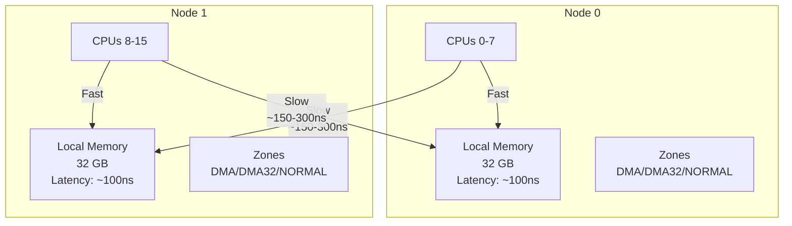
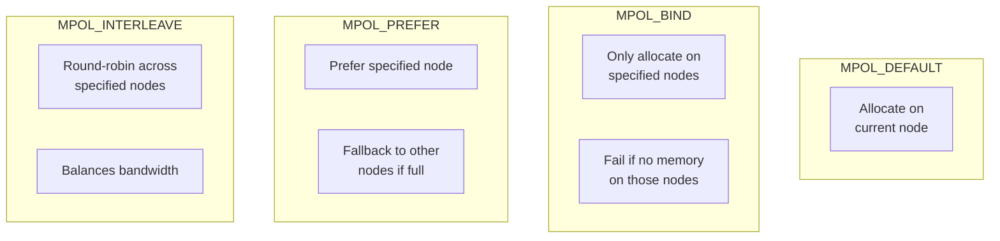
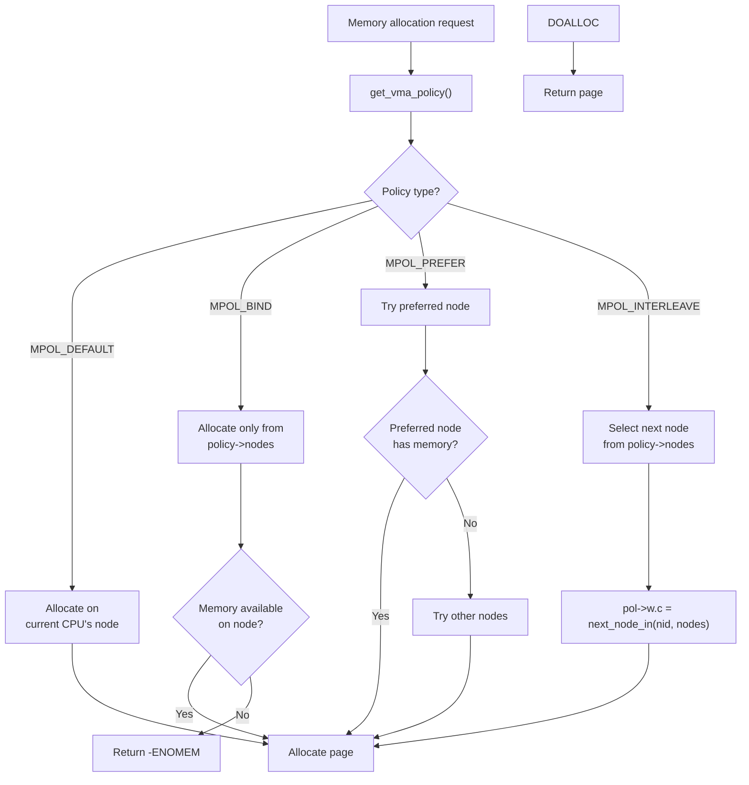

# Chapter 103: NUMA Memory Policies

## Introduction

Non-Uniform Memory Access (NUMA) systems have multiple memory nodes, each with different access latencies depending on which CPU is accessing which memory. A CPU accessing its local memory is fast (~100 ns), while accessing remote memory is slower (~150-300 ns). NUMA memory policies allow applications to control which nodes their memory is allocated on, optimizing for locality. This chapter covers `mbind()`, `set_mempolicy()`, and the various policy modes.

## 1. Intuition

### The NUMA Problem

Imagine a company with offices in two cities. Each office has its own filing cabinet (local memory). Accessing your own city's cabinet is fast, but requesting files from the other city requires a courier (remote access). NUMA policies decide which filing cabinet to use for each document.

```
Node 0 (City A):                Node 1 (City B):
┌─────────────────┐            ┌─────────────────┐
│ CPU 0-7         │            │ CPU 8-15        │
│ Local Memory    │            │ Local Memory    │
│ (32 GB, fast)   │            │ (32 GB, fast)   │
└────────┬────────┘            └────────┬────────┘
         │                              │
         └──────── Interconnect ────────┘
                   (slower)
```

### Why Policies Matter

Without NUMA policies, the kernel uses "local allocation" by default — allocating memory on the same node as the CPU. But this isn't always optimal:

- **Striping**: Spreading memory across nodes can balance bandwidth
- **Binding**: Forcing memory to a specific node ensures consistency
- **Preferred**: Prefer a node but allow fallback

## 2. Architecture

### NUMA Topology

```bash
# View NUMA topology
numactl --hardware
# available: 2 nodes (0-1)
# node 0 cpus: 0 1 2 3 4 5 6 7
# node 0 size: 32768 MB
# node 0 free: 12345 MB
# node 1 cpus: 8 9 10 11 12 13 14 15
# node 1 size: 32768 MB
# node 1 free: 23456 MB
# node distances:
# node   0   1
#   0:  10  21
#   1:  21  10

# View detailed NUMA info
lstopo  # from hwloc package
# or
cat /sys/devices/system/node/node*/meminfo
```

### NUMA Distance Matrix

The distance matrix describes relative access latency:

```
Distance matrix:
         node0  node1
node0:     10     21
node1:     21     10

10 = local access (baseline)
21 = remote access (~2x slower)
```

### Memory Policy Types

| Policy | Description | Use Case |
|--------|-------------|----------|
| `MPOL_DEFAULT` | Use system default (local allocation) | Most applications |
| `MPOL_BIND` | Only allocate from specified nodes | Strict locality |
| `MPOL_PREFER` | Prefer specified node, fallback allowed | Best-effort locality |
| `MPOL_INTERLEAVE` | Round-robin across nodes | Bandwidth-intensive |
| `MPOL_WEIGHTED` | Weighted interleave | Custom bandwidth tuning |

## 3. Kernel Implementation

### set_mempolicy()

`set_mempolicy()` sets the memory policy for the calling thread:

```c
#include <numaif.h>

int set_mempolicy(int mode, const unsigned long *nodemask,
                  unsigned long maxnode);
```

**Modes**:
- `MPOL_DEFAULT`: Default policy (local allocation)
- `MPOL_BIND`: Bind to specified nodes
- `MPOL_PREFER`: Prefer first specified node
- `MPOL_INTERLEAVE`: Interleave across nodes

```c
/* Set interleave policy for all future allocations */
unsigned long nodemask = 0x3;  /* Nodes 0 and 1 */
set_mempolicy(MPOL_INTERLEAVE, &nodemask, 2);

/* All subsequent memory allocations will be interleaved */
void *ptr = malloc(1024 * 1024);  /* Allocated across nodes */
```

### mbind()

`mbind()` sets the policy for specific address ranges:

```c
#include <numaif.h>

int mbind(void *addr, unsigned long len, int mode,
          const unsigned long *nodemask, unsigned long maxnode,
          unsigned int flags);
```

```c
/* Bind a specific memory region to node 1 */
void *ptr = mmap(NULL, 1024 * 1024, PROT_READ | PROT_WRITE,
                 MAP_PRIVATE | MAP_ANONYMOUS, -1, 0);

unsigned long nodemask = 0x2;  /* Node 1 only */
mbind(ptr, 1024 * 1024, MPOL_BIND, &nodemask, 2, 0);

/* All pages in this region will be on node 1 */
```

### Kernel Implementation

```c
/* mm/mempolicy.c */

/* Set memory policy for current process */
SYSCALL_DEFINE3(set_mempolicy, int, mode, unsigned long __user *, nmask,
                unsigned long, maxnode)
{
    return kernel_set_mempolicy(mode, nmask, maxnode);
}

int kernel_set_mempolicy(int mode, unsigned long __user *nmask,
                          unsigned long maxnode)
{
    struct mempolicy *new, *old;
    unsigned long nodes;
    
    /* Parse nodemask from user space */
    if (nmask) {
        if (get_nodes(&nodes, nmask, maxnode))
            return -EFAULT;
    } else {
        nodes = 0;
    }
    
    /* Create new policy */
    new = mpol_new(mode, nodes);
    if (IS_ERR(new))
        return PTR_ERR(new);
    
    /* Replace current policy */
    old = current->mempolicy;
    current->mempolicy = new;
    
    if (old)
        mpol_put(old);
    
    return 0;
}

/* Bind memory to specific nodes */
SYSCALL_DEFINE6(mbind, unsigned long, start, unsigned long, len,
                unsigned long, mode, unsigned long __user *, nmask,
                unsigned long, maxnode, unsigned int, flags)
{
    return kernel_mbind(start, len, mode, nmask, maxnode, flags);
}

int kernel_mbind(unsigned long start, unsigned long len,
                  unsigned long mode, unsigned long __user *nmask,
                  unsigned long maxnode, unsigned int flags)
{
    struct mempolicy *new;
    unsigned long nodes;
    int err;
    
    /* Parse nodemask */
    if (nmask) {
        if (get_nodes(&nodes, nmask, maxnode))
            return -EFAULT;
    } else {
        nodes = 0;
    }
    
    /* Create new policy */
    new = mpol_new(mode, nodes);
    if (IS_ERR(new))
        return PTR_ERR(new);
    
    /* Apply to address range */
    err = mbind_range(start, len, new);
    
    mpol_put(new);
    return err;
}
```

### Policy Application During Allocation

```c
/* mm/mempolicy.c */

/* Get the effective policy for an address */
struct mempolicy *get_vma_policy(struct vm_area_struct *vma,
                                  unsigned long addr)
{
    struct mempolicy *pol = NULL;
    
    /* Check VMA policy first */
    if (vma)
        pol = vma->vm_policy;
    
    /* Fall back to task policy */
    if (!pol)
        pol = current->mempolicy;
    
    return pol;
}

/* Apply policy during page allocation */
int policy_node(gfp_t gfp, struct mempolicy *pol, int nd)
{
    switch (pol->mode) {
    case MPOL_DEFAULT:
        return nd;  /* Use default node */
        
    case MPOL_BIND:
        /* Must use nodes in the nodemask */
        return first_node(pol->nodes);
        
    case MPOL_PREFER:
        /* Prefer first node, fallback to nd */
        return first_node(pol->nodes);
        
    case MPOL_INTERLEAVE:
        /* Round-robin */
        return interleave_node(pol);
        
    default:
        return nd;
    }
}
```

### Interleave Implementation

```c
/* mm/mempolicy.c */

/* Interleave allocation across nodes */
static unsigned long interleave_nodes(struct mempolicy *pol)
{
    unsigned long nid;
    
    /* Use round-robin counter */
    nid = pol->w.c ++ ;
    if (nid >= MAX_NUMNODES)
        nid = pol->w.c = 0;
    
    /* Find next node in nodemask */
    nid = next_node_in(nid, pol->nodes);
    if (nid >= MAX_NUMNODES)
        nid = first_node(pol->nodes);
    
    pol->w.c = nid;
    return nid;
}
```

## 4. Source Code References

### Key Source Files

- `mm/mempolicy.c` — NUMA policy implementation
- `include/uapi/linux/mempolicy.h` — Policy mode definitions
- `include/linux/mempolicy.h` — Internal policy structures
- `mm/migrate.c` — Page migration between nodes

### Important Functions

```c
/* Policy management */
int kernel_set_mempolicy(int mode, unsigned long __user *nmask,
                          unsigned long maxnode);
int kernel_mbind(unsigned long start, unsigned long len,
                  unsigned long mode, unsigned long __user *nmask,
                  unsigned long maxnode, unsigned int flags);
int kernel_get_mempolicy(int __user *policy, unsigned long __user *nmask,
                          unsigned long maxnode, unsigned long addr,
                          unsigned long flags);

/* Policy lookup */
struct mempolicy *get_vma_policy(struct vm_area_struct *vma,
                                  unsigned long addr);
int policy_node(gfp_t gfp, struct mempolicy *pol, int nd);
```

## 5. Data Structures

### Memory Policy Structure

```c
/* include/linux/mempolicy.h */
struct mempolicy {
    atomic_t refcnt;
    unsigned short mode;           /* MPOL_DEFAULT, BIND, PREFER, etc. */
    unsigned short flags;          /* MPOL_F_STATIC_NODES, etc. */
    
    union {
        nodemask_t nodes;          /* node mask */
        nodemask_t cpuset_mems_allowed;  /* cpuset constraint */
    };
    
    union {
        nodemask_t user_nodemask;  /* user-specified mask */
        struct {
            short preferred_node;  /* for MPOL_PREFER */
        } p;
        struct {
            unsigned long c;       /* interleave counter */
        } w;
    };
};
```

### VMA Policy

```c
struct vm_area_struct {
    /* ... */
    struct mempolicy *vm_policy;   /* per-VMA memory policy */
    /* ... */
};
```

### NUMA Node Structure

```c
typedef struct pglist_data {
    struct zone node_zones[MAX_NR_ZONES];
    struct zonelist node_zonelists[MAX_ZONELISTS];
    int nr_zones;
    unsigned long node_start_pfn;
    unsigned long node_present_pages;
    unsigned long node_spanned_pages;
    int node_id;
    /* ... */
} pg_data_t;
```

## 6. C/Assembly Examples

### Using numactl

```bash
# Bind process to node 0
numactl --cpunodebind=0 --membind=0 ./application

# Interleave memory across all nodes
numactl --interleave=all ./application

# Prefer node 1 (fallback to 0 if full)
numactl --preferred=1 ./application

# Show NUMA statistics for a command
numactl --hardware ./application
```

### C Program: NUMA Policy Manipulation

```c
#include <stdio.h>
#include <stdlib.h>
#include <numaif.h>
#include <numa.h>
#include <sys/mman.h>
#include <string.h>

int main() {
    if (numa_available() < 0) {
        printf("NUMA not available\n");
        return 1;
    }
    
    int max_nodes = numa_max_node() + 1;
    printf("NUMA nodes: %d\n", max_nodes);
    
    /* Get current policy */
    int mode;
    unsigned long nodemask = 0;
    unsigned long maxnode = max_nodes + 1;
    
    get_mempolicy(&mode, &nodemask, maxnode, NULL, 0);
    printf("Current policy: %d\n", mode);
    
    /* Set interleave policy */
    nodemask = (1 << max_nodes) - 1;  /* All nodes */
    set_mempolicy(MPOL_INTERLEAVE, &nodemask, maxnode);
    printf("Set interleave policy\n");
    
    /* Allocate memory - will be interleaved */
    size_t size = 4 * 1024 * 1024;  /* 4 MB */
    void *ptr = mmap(NULL, size, PROT_READ | PROT_WRITE,
                     MAP_PRIVATE | MAP_ANONYMOUS, -1, 0);
    
    if (ptr == MAP_FAILED) {
        perror("mmap");
        return 1;
    }
    
    /* Touch all pages */
    memset(ptr, 0, size);
    
    /* Get policy for the mapping */
    get_mempolicy(&mode, &nodemask, maxnode, ptr, 0);
    printf("Mapping policy: %d\n", mode);
    
    /* Check where pages actually are */
    int status[max_nodes];
    memset(status, 0, sizeof(status));
    
    unsigned long page_size = numa_pagesize();
    for (unsigned long i = 0; i < size; page_size) {
        int node = -1;
        get_mempolicy(&node, NULL, 0, (char *)ptr + i,
                      MPOL_F_NODE | MPOL_F_ADDR);
        if (node >= 0 && node < max_nodes)
            status[node]++;
    }
    
    printf("Page distribution:\n");
    for (int i = 0; i < max_nodes; i++)
        printf("  Node %d: %d pages\n", i, status[i]);
    
    /* Bind specific region to node 0 */
    nodemask = 1;  /* Node 0 only */
    mbind((char *)ptr + size/2, size/2, MPOL_BIND, &nodemask,
          maxnode, 0);
    
    /* Set preferred policy */
    set_mempolicy(MPOL_PREFER, &nodemask, maxnode);
    
    munmap(ptr, size);
    return 0;
}
```

### C Program: NUMA Statistics

```c
#include <stdio.h>
#include <stdlib.h>
#include <string.h>
#include <numa.h>
#include <numaif.h>

/* Display NUMA statistics */
int main() {
    FILE *fp;
    char line[256];
    
    printf("=== NUMA Hardware Info ===\n");
    
    fp = popen("numactl --hardware", "r");
    if (fp) {
        while (fgets(line, sizeof(line), fp))
            printf("%s", line);
        pclose(fp);
    }
    
    printf("\n=== NUMA Statistics ===\n");
    
    fp = popen("numastat", "r");
    if (fp) {
        while (fgets(line, sizeof(line), fp))
            printf("%s", line);
        pclose(fp);
    }
    
    printf("\n=== Per-Node Memory Info ===\n");
    
    for (int node = 0; node <= numa_max_node(); node++) {
        char path[256];
        snprintf(path, sizeof(path),
                 "/sys/devices/system/node/node%d/meminfo", node);
        
        fp = fopen(path, "r");
        if (fp) {
            printf("Node %d:\n", node);
            while (fgets(line, sizeof(line), fp))
                printf("  %s", line);
            fclose(fp);
        }
    }
    
    return 0;
}
```

## 7. Mermaid Diagrams

### NUMA Architecture



### NUMA Policy Types



### Memory Allocation with NUMA Policy



## 8. Performance

### NUMA Performance Impact

```bash
# Measure NUMA impact
numactl --membind=0 ./benchmark  # Local only
numactl --membind=1 ./benchmark  # Remote only
numactl --interleave=all ./benchmark  # Interleaved

# Typical results:
# Local:   100 ns per access
# Remote:  150-300 ns per access
# Interleave: Between the two
```

### NUMA-Aware Allocation

```bash
# Use libnuma for NUMA-aware allocation
#include <numa.h>

/* Allocate on specific node */
void *ptr = numa_alloc_onnode(size, node);

/* Allocate locally */
void *ptr = numa_alloc_local(size);

/* Allocate interleaved */
void *ptr = numa_alloc_interleaved(size);

/* Free */
numa_free(ptr, size);
```

### Monitoring NUMA Balance

```bash
# NUMA balancing (automatic)
cat /proc/sys/kernel/numa_balancing
# 1 = enabled (default)

# NUMA balancing settings
cat /proc/sys/kernel/numa_balancing_scan_delay_ms
cat /proc/sys/kernel/numa_balancing_scan_period_min_ms
cat /proc/sys/kernel/numa_balancing_scan_period_max_ms
cat /proc/sys/kernel/numa_balancing_scan_size_mb

# Disable NUMA balancing (for explicit policy control)
echo 0 > /proc/sys/kernel/numa_balancing
```

### NUMA Statistics

```bash
# View NUMA hit/miss statistics
numastat
# node0   node1
# numa_hit         1234567  2345678
# numa_miss          12345    23456
# numa_foreign       23456    12345
# interleave_hit     12345    12345
# local_node       1234567  2345678
# other_node         12345    23456

# Per-process NUMA stats
cat /proc/<PID>/numa_maps
```

## 9. Security

### NUMA Isolation

NUMA policies can be used for security isolation:

```bash
# Isolate security-sensitive workloads to specific nodes
numactl --membind=0 --cpunodebind=0 ./secure_app

# Prevent memory from being allocated on untrusted nodes
```

### Cgroup NUMA Controls

```bash
# Set allowed nodes for a cgroup
echo 0-1 > /sys/fs/cgroup/mygroup/cpuset.mems

# Set memory policy for a cgroup
echo interleave > /sys/fs/cgroup/mygroup/memory.numa_stat
```

### NUMA and Containers

```bash
# Docker NUMA constraints
docker run --cpuset-cpus="0-7" --cpuset-mems="0" myimage

# Kubernetes NUMA topology manager
# Configured via kubelet flags
```

## 10. NUMA Balancing

### Automatic NUMA Balancing

Linux includes automatic NUMA balancing that migrates pages to the node where they're most frequently accessed:

```bash
# Check if NUMA balancing is enabled
cat /proc/sys/kernel/numa_balancing
# 1 = enabled (default)

# NUMA balancing settings
cat /proc/sys/kernel/numa_balancing_scan_delay_ms      # 1000
cat /proc/sys/kernel/numa_balancing_scan_period_min_ms  # 1000
cat /proc/sys/kernel/numa_balancing_scan_period_max_ms  # 60000
cat /proc/sys/kernel/numa_balancing_scan_size_mb        # 256

# Disable NUMA balancing (for explicit policy control)
echo 0 > /proc/sys/kernel/numa_balancing

# Monitor NUMA migrations
cat /proc/vmstat | grep numa
# numa_hit 12345678
# numa_miss 123456
# numa_foreign 123456
# numa_interleave 12345
# numa_local 12345678
# numa_other 123456
# numa_pte_updates 123456
# numa_huge_pte_updates 12345
# numa_hint_faults 123456
# numa_hint_faults_local 123400
# numa_pages_migrated 12345
```

### NUMA Balancing Overhead

NUMA balancing has overhead from:
- Periodic scanning of address spaces
- Page migration (copying pages between nodes)
- TLB shootdowns during migration

For workloads with explicit NUMA policies, disabling automatic balancing can improve performance:

```bash
# Disable for workloads with explicit NUMA policies
echo 0 > /proc/sys/kernel/numa_balancing
```

### NUMA-Aware Application Design

```c
/* Design patterns for NUMA-aware applications */

/* Pattern 1: Thread-local allocation */
void *alloc_local(size_t size) {
    return numa_alloc_onnode(size, numa_node_of_cpu(sched_getcpu()));
}

/* Pattern 2: First-touch policy */
/* Memory is allocated on the node that first touches it */
#pragma omp parallel for
for (int i = 0; i < n; i++) {
    array[i] = 0;  /* First touch: allocated on the thread's node */
}

/* Pattern 3: Interleave for shared data */
/* Shared read-only data benefits from interleaving */
void *shared_data = mmap(NULL, size, PROT_READ | PROT_WRITE,
                          MAP_PRIVATE | MAP_ANONYMOUS, -1, 0);
unsigned long nodemask = (1 << numa_max_node()) - 1;
set_mempolicy(MPOL_INTERLEAVE, &nodemask, numa_max_node() + 1);
memset(shared_data, 0, size);  /* Pages interleaved across nodes */
```

### Measuring NUMA Performance Impact

```bash
# Use numastat to see per-node memory distribution
numastat -p <PID>

# Use perf to measure NUMA-related events
perf stat -e node-loads,node-load-misses,node-stores,node-store-misses ./app

# Use likwid for detailed NUMA analysis
likwid-perfctr -g MEM -C 0-7 ./app
```

## 11. Common Pitfalls

### 1. Ignoring NUMA Topology

```bash
# WRONG: Running without NUMA awareness
./application  # May allocate all memory on one node

# CORRECT: Use numactl for explicit control
numactl --interleave=all ./application
```

### 2. MPOL_BIND Failures

```bash
# MPOL_BIND fails if specified nodes have no memory
# Use MPOL_PREFER for best-effort locality
```

### 3. Single-Threaded Interleave

Interleaving only helps with bandwidth, not latency. For single-threaded apps, local allocation is better.

### 4. Not Monitoring NUMA Stats

```bash
# Always check for NUMA misses
numastat | grep miss
# High miss count indicates suboptimal policy
```

### 5. Automatic NUMA Balancing Overhead

NUMA balancing can cause migration overhead for workloads that intentionally use remote memory.

## 12. Best Practices

### NUMA Policy Selection Guide

| Workload Type | Recommended Policy | Rationale |
|---------------|-------------------|----------|
| Single-threaded app | MPOL_DEFAULT (local) | Best latency for single-thread |
| Multi-threaded, shared data | MPOL_INTERLEAVE | Balances bandwidth |
| Database (per-socket) | MPOL_BIND | Strict locality |
| In-memory cache | MPOL_INTERLEAVE | Distributes bandwidth |
| Latency-sensitive | MPOL_BIND + cpuset | Guaranteed locality |
| Batch processing | MPOL_DEFAULT | Let kernel decide |

### NUMA Configuration for Common Workloads

```bash
# Database (e.g., PostgreSQL)
numactl --interleave=all postgres -D /data
# Databases benefit from interleaved memory

# Web server (e.g., nginx)
numactl --cpunodebind=0 --membind=0 nginx
# Bind to single node for consistent latency

# JVM application
numactl --interleave=all java -Xmx16g -jar app.jar
# Java heaps benefit from interleaved allocation

# In-memory cache (e.g., Redis)
numactl --cpunodebind=0 --membind=0 redis-server
# Redis is single-threaded, benefits from local memory

# HPC application
numactl --interleave=all mpirun -np 16 ./hpc_app
# MPI applications benefit from balanced memory
```

### NUMA Monitoring Dashboard

```bash
#!/bin/bash
# numa-monitor.sh - NUMA monitoring script

echo "=== NUMA Memory Usage ==="
numastat | grep -E "Node|Total"

echo "\n=== NUMA Hit/Miss Ratio ==="
for node in 0 1; do
    hit=$(numastat | grep "node $node" | awk '{print $2}')
    miss=$(numastat | grep "node $node" | awk '{print $3}')
    if [ "$hit" -gt 0 ] 2>/dev/null; then
        ratio=$(echo "scale=2; $hit * 100 / ($hit + $miss)" | bc)
        echo "Node $node: ${ratio}% local hits"
    fi
done

echo "\n=== Per-Process NUMA Distribution ==="
ps -eo pid,comm | tail -n +2 | while read pid comm; do
    numa_maps=$(cat /proc/$pid/numa_maps 2>/dev/null | grep -c "^N")
    if [ "$numa_maps" -gt 0 ] 2>/dev/null; then
        echo "$pid ($comm): $numa_maps NUMA mappings"
    fi
done | sort -t: -k2 -rn | head -10
```

1. **Use `numactl`** for explicit NUMA control
2. **Bind memory-intensive apps** to specific nodes
3. **Use interleave** for bandwidth-intensive workloads
4. **Monitor NUMA statistics** regularly
5. **Disable automatic NUMA balancing** when using explicit policies
6. **Use libnuma** for NUMA-aware allocation in applications
7. **Consider NUMA topology** when designing multi-threaded applications
8. **Use `numactl --hardware`** to understand your system's topology
9. **Profile with `numastat`** to verify policy effectiveness
10. **Use cgroup NUMA controls** for container isolation

## 13. Exercises

### Exercise 1: NUMA Topology

Use `numactl --hardware` and `lstopo` to map your system's NUMA topology.

### Exercise 2: Policy Comparison

Benchmark the same workload with different NUMA policies (default, bind, interleave).

### Exercise 3: mbind Usage

Write a program that uses `mbind()` to place different data structures on different nodes.

### Exercise 4: NUMA Statistics

Write a script that monitors NUMA hit/miss ratios and alerts on high miss rates.

### Exercise 5: NUMA-Aware Allocator

Implement a simple NUMA-aware memory allocator using libnuma.

## 14. References

1. **Linux Kernel Source**: `mm/mempolicy.c`, `mm/migrate.c`
2. **"Understanding the Linux Kernel"** by Daniel P. Bovet and Marco Cesati
3. **Linux Documentation**: `Documentation/admin-guide/mm/numa_memory_policy.rst`
4. **Linux man pages**: `set_mempolicy(2)`, `mbind(2)`, `numactl(8)`
5. **"NUMA Deep Dive"** — various Intel/AMD technical papers
6. **libnuma**: NUMA-aware allocation library
7. **LWN.net**: "NUMA memory policies"
8. **"Systems Performance"** by Brendan Gregg, Chapter 7
