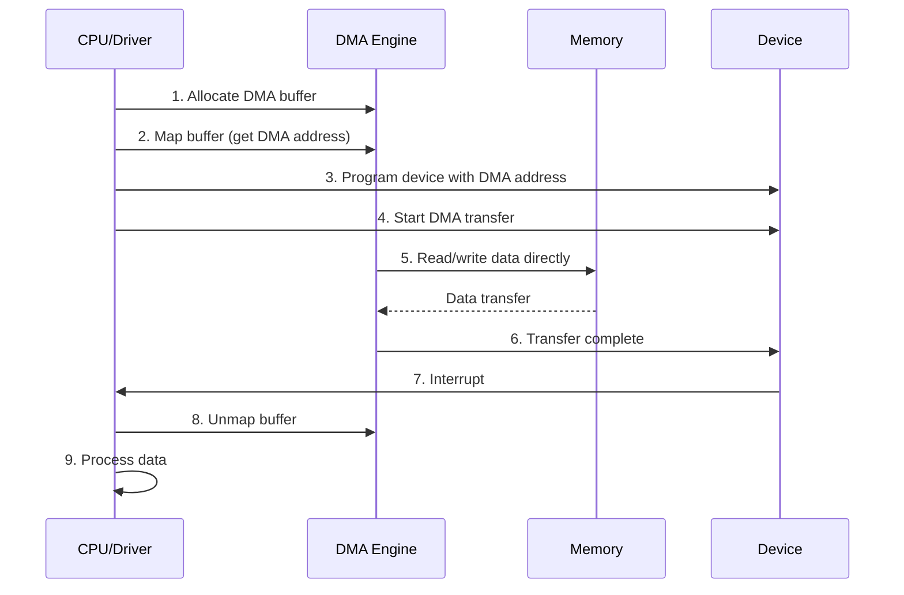
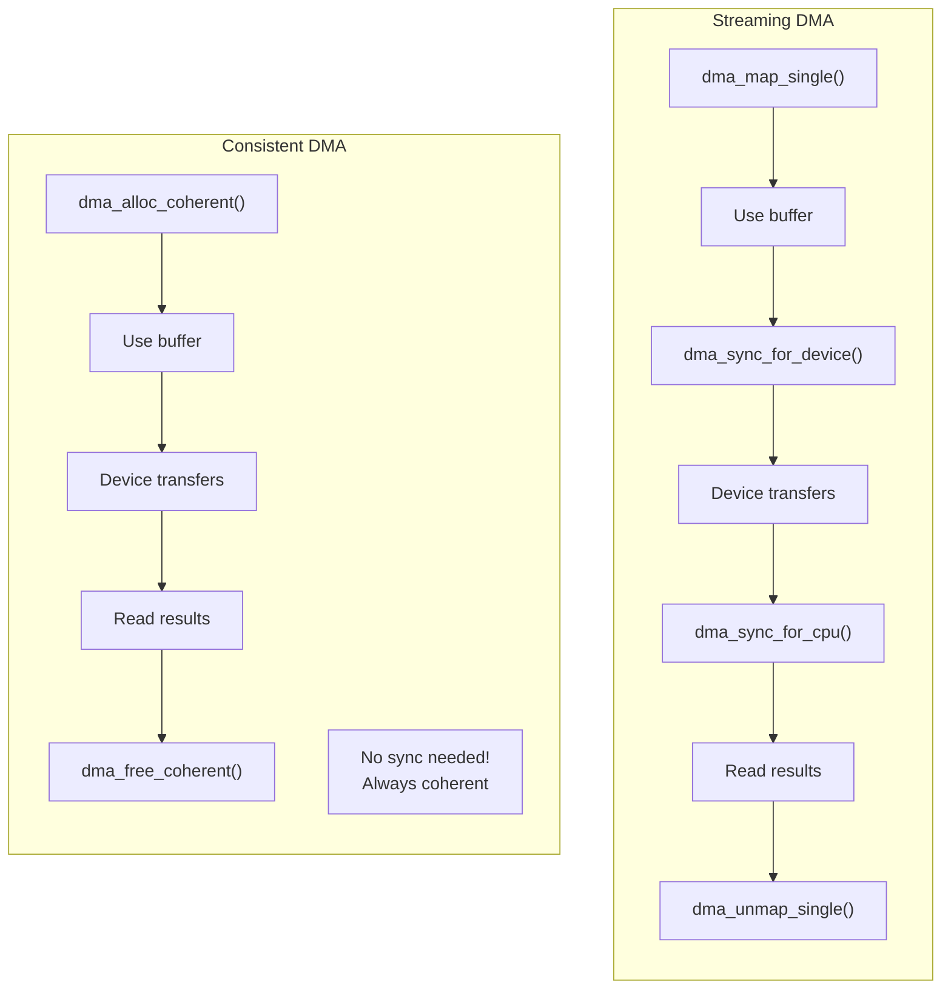
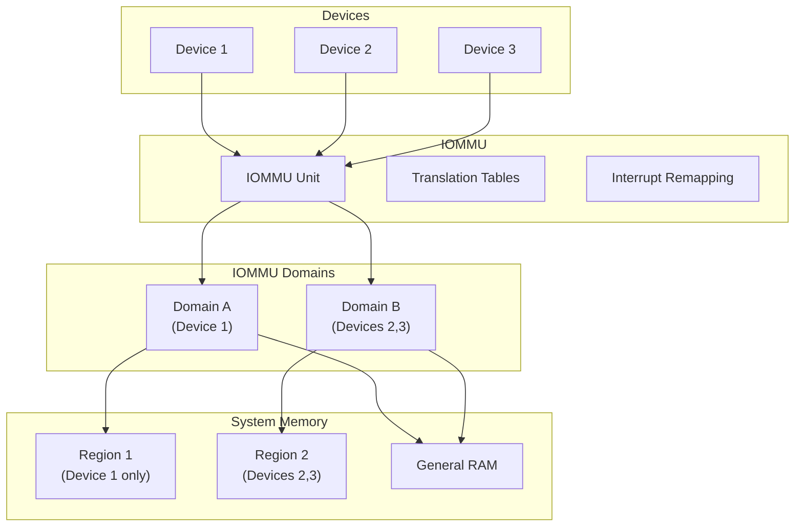
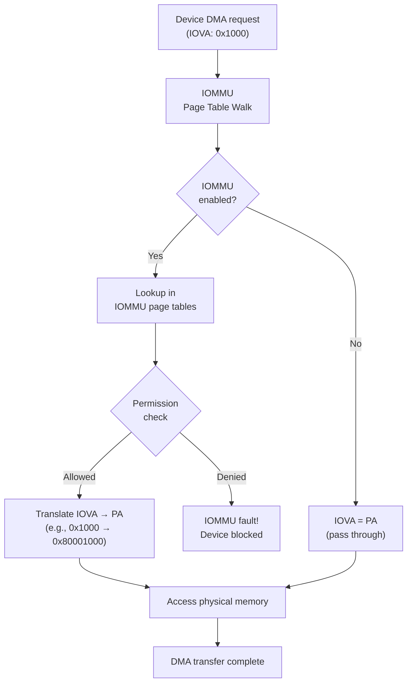

# Chapter 104: DMA — Direct Memory Access

## Introduction

Direct Memory Access (DMA) allows hardware devices to transfer data directly to and from memory without CPU intervention. This dramatically improves I/O performance, as the CPU can continue other work while data transfers occur. However, DMA introduces complexity around memory coherency, cache management, and physical address requirements. This chapter explores DMA pools, streaming and consistent mappings, and the IOMMU.

## 1. Intuition

### Why DMA?

Without DMA, every byte of I/O data must pass through the CPU:

```
Without DMA:
  Device → CPU (read byte) → CPU (write to memory) → repeat
  CPU is busy 100% of the time during transfer

With DMA:
  CPU: "Device, transfer 1 MB from your buffer to memory address X"
  Device: [transfers data directly, CPU is free]
  Device: "Done! Here's an interrupt."
  CPU: [handles completion, 1% of the time]
```

### DMA Flow

```
1. Driver allocates DMA buffer
2. Driver programs device with buffer's physical address
3. Device reads/writes directly to/from that physical address
4. Device sends interrupt when transfer is complete
5. Driver processes the data
```

### The Physical Address Problem

DMA devices typically work with physical addresses, not virtual addresses. But:
- Kernel virtual addresses are not physical addresses
- User virtual addresses are definitely not physical addresses
- The kernel must provide the correct physical address to the device

## 2. Architecture

### DMA Mapping Types

Linux provides two types of DMA mappings:

| Type | Lifetime | Coherency | Use Case |
|------|----------|-----------|----------|
| Streaming | Temporary (per-transfer) | Explicit sync | Network packets, disk I/O |
| Consistent (Coherent) | Long-lived | Always coherent | Control structures, descriptors |

### DMA Address Types

```c
/* include/linux/dma-mapping.h */

/* DMA address (bus address seen by device) */
typedef u64 dma_addr_t;

/* DMA mapping result */
struct dma_map_ops {
    void *(*alloc)(struct device *dev, size_t size,
                   dma_addr_t *dma_handle, gfp_t gfp,
                   unsigned long attrs);
    void (*free)(struct device *dev, size_t size,
                 void *vaddr, dma_addr_t dma_handle,
                 unsigned long attrs);
    dma_addr_t (*map_page)(struct device *dev, struct page *page,
                           unsigned long offset, size_t size,
                           enum dma_data_direction dir,
                           unsigned long attrs);
    void (*unmap_page)(struct device *dev, dma_addr_t dma_handle,
                       size_t size, enum dma_data_direction dir,
                       unsigned long attrs);
    int (*map_sg)(struct device *dev, struct scatterlist *sg,
                  int nents, enum dma_data_direction dir,
                  unsigned long attrs);
    void (*unmap_sg)(struct device *dev, struct scatterlist *sg,
                     int nents, enum dma_data_direction dir,
                     unsigned long attrs);
    /* ... more operations ... */
};
```

### DMA Directions

```c
/* include/linux/dma-direction.h */
enum dma_data_direction {
    DMA_BIDIRECTIONAL = 0,  /* Both read and write */
    DMA_TO_DEVICE = 1,      /* CPU → Device (write) */
    DMA_FROM_DEVICE = 2,    /* Device → CPU (read) */
    DMA_NONE = 3,           /* No transfer */
};
```

### DMA Pools

DMA pools provide small, consistent DMA memory allocations:

```c
/* include/linux/dmapool.h */

/* Create a DMA pool */
struct dma_pool *dma_pool_create(const char *name, struct device *dev,
                                  size_t size, size_t align,
                                  size_t boundary);

/* Allocate from pool */
void *dma_pool_alloc(struct dma_pool *pool, gfp_t mem_flags,
                     dma_addr_t *handle);

/* Free to pool */
void dma_pool_free(struct dma_pool *pool, void *vaddr,
                   dma_addr_t addr);

/* Destroy pool */
void dma_pool_destroy(struct dma_pool *pool);
```

## 3. Kernel Implementation

### Streaming DMA Mappings

```c
/* include/linux/dma-mapping.h */

/* Map a single buffer for DMA */
dma_addr_t dma_map_single(struct device *dev, void *ptr,
                           size_t size, enum dma_data_direction dir);

/* Unmap a single buffer */
void dma_unmap_single(struct device *dev, dma_addr_t addr,
                       size_t size, enum dma_data_direction dir);

/* Map a page for DMA */
dma_addr_t dma_map_page(struct device *dev, struct page *page,
                         unsigned long offset, size_t size,
                         enum dma_data_direction dir);

/* Unmap a page */
void dma_unmap_page(struct device *dev, dma_addr_t addr,
                     size_t size, enum dma_data_direction dir);
```

### DMA Sync Operations

```c
/* Sync DMA buffer for CPU access */
void dma_sync_single_for_cpu(struct device *dev, dma_addr_t addr,
                              size_t size, enum dma_data_direction dir);

/* Sync DMA buffer for device access */
void dma_sync_single_for_device(struct device *dev, dma_addr_t addr,
                                 size_t size, enum dma_data_direction dir);

/* Sync a page */
void dma_sync_single_range_for_cpu(struct device *dev, dma_addr_t addr,
                                    unsigned long offset, size_t size,
                                    enum dma_data_direction dir);
```

### Typical DMA Transfer Pattern

```c
/* Network driver DMA example */
static int my_net_xmit(struct sk_buff *skb, struct net_device *dev)
{
    struct my_priv *priv = netdev_priv(dev);
    dma_addr_t dma_addr;
    
    /* Map the buffer for DMA (CPU → Device) */
    dma_addr = dma_map_single(&dev->dev, skb->data, skb->len,
                               DMA_TO_DEVICE);
    
    if (dma_mapping_error(&dev->dev, dma_addr)) {
        dev_kfree_skb(skb);
        return NETDEV_TX_BUSY;
    }
    
    /* Program the device */
    priv->tx_desc->addr = dma_addr;
    priv->tx_desc->len = skb->len;
    priv->tx_desc->ctrl = TX_DESC_CTRL_GO;
    
    /* Start transfer */
    writel(TX_START, priv->regs + TX_START_REG);
    
    return NETDEV_TX_OK;
}

/* DMA completion interrupt */
static irqreturn_t my_irq_handler(int irq, void *dev_id)
{
    struct my_priv *priv = dev_id;
    
    /* Unmap DMA buffer */
    dma_unmap_single(&priv->dev->dev, priv->tx_desc->addr,
                     priv->tx_desc->len, DMA_TO_DEVICE);
    
    /* Free the skb */
    dev_kfree_skb(priv->tx_skb);
    
    return IRQ_HANDLED;
}
```

### Consistent DMA Mappings

```c
/* Allocate consistent (coherent) DMA memory */
void *dma_alloc_coherent(struct device *dev, size_t size,
                          dma_addr_t *dma_handle, gfp_t gfp);

/* Free consistent DMA memory */
void dma_free_coherent(struct device *dev, size_t size,
                        void *vaddr, dma_addr_t dma_handle);
```

### DMA Pool Implementation

```c
/* kernel/dma/pool.c */

/* DMA pool structure */
struct dma_pool {
    struct list_head page_list;     /* list of pool pages */
    spinlock_t lock;
    size_t blocks_per_page;         /* blocks per page */
    size_t size;                    /* block size */
    struct device *dev;             /* associated device */
    size_t allocation;              /* allocation size */
    size_t boundary;                /* boundary constraint */
    char name[32];                  /* pool name */
};

/* Allocate from DMA pool */
void *dma_pool_alloc(struct dma_pool *pool, gfp_t mem_flags,
                     dma_addr_t *handle)
{
    unsigned long flags;
    struct dma_page *page;
    int offset;
    void *retval;
    
    spin_lock_irqsave(&pool->lock, flags);
    
    /* Find a page with free blocks */
    list_for_each_entry(page, &pool->page_list, page_list) {
        if (page->offset < pool->blocks_per_page)
            goto found;
    }
    
    /* Allocate a new page */
    spin_unlock_irqrestore(&pool->lock, flags);
    page = pool_alloc_page(pool, mem_flags);
    if (!page)
        return NULL;
    
    spin_lock_irqsave(&pool->lock, flags);
    list_add(&page->page_list, &pool->page_list);
    
found:
    /* Get next free block */
    offset = page->offset;
    page->offset = *((int *)(page->vaddr + offset * pool->size));
    retval = page->vaddr + offset * pool->size;
    *handle = page->dma + offset * pool->size;
    
    spin_unlock_irqrestore(&pool->lock, flags);
    
    return retval;
}
```

### Scatter-Gather DMA

For transferring data from multiple non-contiguous buffers:

```c
/* include/linux/scatterlist.h */

struct scatterlist {
    unsigned long page_link;
    unsigned int offset;
    unsigned int length;
    dma_addr_t dma_address;
    unsigned int dma_length;
};

/* Map scatter-gather list for DMA */
int dma_map_sg(struct device *dev, struct scatterlist *sg,
               int nents, enum dma_data_direction dir);

/* Unmap scatter-gather list */
void dma_unmap_sg(struct device *dev, struct scatterlist *sg,
                   int nents, enum dma_data_direction dir);

/* Iterate over mapped scatter-gather entries */
#define for_each_sg(sg, nents, i)  \
    for (i = 0; i < nents; i++, sg = sg_next(sg))

/* Get DMA address and length for a scatter-gather entry */
dma_addr_t sg_dma_address(struct scatterlist *sg);
unsigned int sg_dma_len(struct scatterlist *sg);
```

### Scatter-Gather Example

```c
/* Block driver using scatter-gather DMA */
static int my_block_transfer(struct request *req)
{
    struct bio_vec bvec;
    struct bvec_iter iter;
    struct scatterlist sg[MAX_SG_ENTRIES];
    int nents, i;
    
    /* Build scatter-gather list from request */
    sg_init_table(sg, MAX_SG_ENTRIES);
    
    i = 0;
    __rq_for_each_bio(bio, req) {
        bio_for_each_segment(bvec, bio, iter) {
            sg_set_page(&sg[i], bvec.bv_page, bvec.bv_len,
                        bvec.bv_offset);
            i++;
        }
    }
    
    nents = i;
    
    /* Map for DMA */
    nents = dma_map_sg(&dev->dev, sg, nents, DMA_TO_DEVICE);
    
    if (nents == 0) {
        /* Mapping failed */
        return -EIO;
    }
    
    /* Program device with scatter-gather list */
    for_each_sg(sg, nents, i) {
        dma_addr_t addr = sg_dma_address(sg);
        unsigned int len = sg_dma_len(sg);
        
        /* Set up DMA descriptor */
        priv->desc[i].addr = addr;
        priv->desc[i].len = len;
        priv->desc[i].next = &priv->desc[i + 1];
    }
    
    /* Start DMA transfer */
    start_dma(priv);
    
    return 0;
}
```

## 4. IOMMU

### What is the IOMMU?

The IOMMU (I/O Memory Management Unit) provides:
1. **Address translation**: Device virtual → physical address translation
2. **Isolation**: Prevents devices from accessing arbitrary memory
3. **DMA remapping**: Allows devices to use virtual addresses for DMA

```
Without IOMMU:
  Device → Physical Address → Memory (any address accessible)

With IOMMU:
  Device → Device Virtual Address → IOMMU → Physical Address → Memory
  (IOMMU restricts which addresses the device can access)
```

### IOMMU Architecture

```
┌─────────────────────────────────────────────────────────────┐
│                    System Memory                             │
│   ┌──────────┐  ┌──────────┐  ┌──────────┐                 │
│   │ Device A │  │ Device B │  │ General  │                 │
│   │ DMA      │  │ DMA      │  │ Memory   │                 │
│   │ Buffers  │  │ Buffers  │  │          │                 │
│   └──────────┘  └──────────┘  └──────────┘                 │
└─────────────────────────────────────────────────────────────┘
         ↑              ↑              ↑
         │              │              │
    ┌────┴────┐   ┌────┴────┐         │
    │ IOMMU   │   │ IOMMU   │         │
    │ Domain A│   │ Domain B│         │
    │ (isolate│   │ (isolate│         │
    │  dev A) │   │  dev B) │         │
    └────┬────┘   └────┬────┘         │
         │              │              │
    ┌────┴──────────────┴──────────────┴────┐
    │            IOMMU Hardware              │
    │  Intel VT-d / AMD-Vi                   │
    └───────────────────────────────────────┘
```

### IOMMU Configuration

```bash
# Check if IOMMU is enabled
dmesg | grep -i iommu
# AMD-Vi: AMD IOMMUv2 functionality not available on this system
# Intel(R) Virtualization Technology for Directed I/O

# Enable IOMMU in GRUB
# For Intel: intel_iommu=on
# For AMD: amd_iommu=on

# View IOMMU groups
ls /sys/kernel/iommu_groups/

# View devices in IOMMU groups
for g in $(ls /sys/kernel/iommu_groups/); do
    echo "IOMMU Group $g:"
    ls /sys/kernel/iommu_groups/$g/devices/
done
```

### IOMMU API

```c
/* include/linux/iommu.h */

/* Get IOMMU domain for a device */
struct iommu_domain *iommu_domain_alloc(struct bus_type *bus);

/* Map a region in the IOMMU domain */
int iommu_map(struct iommu_domain *domain, unsigned long iova,
              phys_addr_t paddr, size_t size, int prot);

/* Unmap a region */
size_t iommu_unmap(struct iommu_domain *domain, unsigned long iova,
                    size_t size);

/* Attach device to domain */
int iommu_attach_device(struct iommu_domain *domain,
                         struct device *dev);

/* Detach device from domain */
void iommu_detach_device(struct iommu_domain *domain,
                          struct device *dev);
```

### DMA-API with IOMMU

When an IOMMU is present, the DMA API transparently handles the translation:

```c
/* The DMA API automatically handles IOMMU translation */

/* Map for DMA - IOMMU will translate */
dma_addr_t dma_addr = dma_map_single(dev, vaddr, size, DMA_TO_DEVICE);

/* The device sees an I/O virtual address */
/* The IOMMU translates it to the physical address */
/* The device can only access memory that has been explicitly mapped */

/* Unmap - removes IOMMU mapping */
dma_unmap_single(dev, dma_addr, size, DMA_TO_DEVICE);
```

## 5. Source Code References

### Key Source Files

- `kernel/dma/mapping.c` — DMA mapping implementation
- `kernel/dma/pool.c` — DMA pool implementation
- `kernel/dma/coherent.c` — Consistent DMA memory
- `kernel/dma/contiguous.c` — CMA (Contiguous Memory Allocator)
- `drivers/iommu/iommu.c` — IOMMU core
- `include/linux/dma-mapping.h` — DMA API declarations
- `include/linux/iommu.h` — IOMMU API declarations

### Important Functions

```c
/* Streaming DMA */
dma_addr_t dma_map_single(struct device *dev, void *ptr,
                           size_t size, enum dma_data_direction dir);
void dma_unmap_single(struct device *dev, dma_addr_t addr,
                       size_t size, enum dma_data_direction dir);

/* Consistent DMA */
void *dma_alloc_coherent(struct device *dev, size_t size,
                          dma_addr_t *dma_handle, gfp_t gfp);
void dma_free_coherent(struct device *dev, size_t size,
                        void *vaddr, dma_addr_t dma_handle);

/* Scatter-gather */
int dma_map_sg(struct device *dev, struct scatterlist *sg,
               int nents, enum dma_data_direction dir);
void dma_unmap_sg(struct device *dev, struct scatterlist *sg,
                   int nents, enum dma_data_direction dir);

/* DMA sync */
void dma_sync_single_for_cpu(struct device *dev, dma_addr_t addr,
                              size_t size, enum dma_data_direction dir);
void dma_sync_single_for_device(struct device *dev, dma_addr_t addr,
                                 size_t size, enum dma_data_direction dir);
```

## 6. Data Structures

### DMA Pool Structure

```c
/* kernel/dma/pool.c */
struct dma_pool {
    struct list_head page_list;
    spinlock_t lock;
    size_t blocks_per_page;
    size_t size;
    struct device *dev;
    size_t allocation;
    size_t boundary;
    char name[32];
};

struct dma_page {
    struct list_head page_list;
    void *vaddr;
    dma_addr_t dma;
    unsigned int in_use;
    unsigned int offset;
};
```

### Scatterlist Structure

```c
/* include/linux/scatterlist.h */
struct scatterlist {
    unsigned long page_link;        /* page and flags */
    unsigned int offset;            /* offset in page */
    unsigned int length;            /* length */
    dma_addr_t dma_address;         /* DMA address (after map_sg) */
    unsigned int dma_length;        /* DMA length (after map_sg) */
};

/* Helper macros */
#define sg_page(sg)     ((struct page *)((sg)->page_link & ~0x3))
#define sg_dma_address(sg) ((sg)->dma_address)
#define sg_dma_len(sg)     ((sg)->dma_length)
```

### IOMMU Domain

```c
/* include/linux/iommu.h */
struct iommu_domain {
    unsigned type;
    const struct iommu_ops *ops;
    unsigned long pgsize_bitmap;    /* supported page sizes */
    iommu_fault_handler_t handler;
    void *handler_token;
    /* ... */
};
```

## 7. C/Assembly Examples

### DMA Buffer Allocation

```c
#include <linux/module.h>
#include <linux/dma-mapping.h>
#include <linux/slab.h>

static int __init dma_demo_init(void)
{
    struct device *dev = &my_device->dev;
    void *vaddr;
    dma_addr_t dma_handle;
    
    /* Allocate coherent DMA memory */
    vaddr = dma_alloc_coherent(dev, 4096, &dma_handle, GFP_KERNEL);
    if (!vaddr) {
        pr_err("DMA allocation failed\n");
        return -ENOMEM;
    }
    
    pr_info("Virtual address: %p\n", vaddr);
    pr_info("DMA address: %pad\n", &dma_handle);
    
    /* Use the buffer */
    memset(vaddr, 0, 4096);
    
    /* Free */
    dma_free_coherent(dev, 4096, vaddr, dma_handle);
    
    return 0;
}
```

### Streaming DMA Example

```c
#include <linux/module.h>
#include <linux/dma-mapping.h>
#include <linux/skbuff.h>

/* Network driver DMA example */
static netdev_tx_t my_xmit(struct sk_buff *skb, struct net_device *dev)
{
    struct my_priv *priv = netdev_priv(dev);
    dma_addr_t dma;
    
    /* Map for DMA (CPU → Device) */
    dma = dma_map_single(&dev->dev, skb->data, skb->len, DMA_TO_DEVICE);
    
    if (dma_mapping_error(&dev->dev, dma)) {
        dev->stats.tx_dropped++;
        dev_kfree_skb(skb);
        return NETDEV_TX_OK;
    }
    
    /* Store for later unmap */
    priv->tx_dma = dma;
    priv->tx_skb = skb;
    
    /* Program device */
    my_write_desc(priv, dma, skb->len);
    
    /* Start DMA */
    my_start_tx(priv);
    
    return NETDEV_TX_OK;
}

/* Completion handler */
static void my_tx_complete(struct my_priv *priv)
{
    /* Unmap */
    dma_unmap_single(&priv->dev->dev, priv->tx_dma,
                     priv->tx_skb->len, DMA_TO_DEVICE);
    
    /* Free skb */
    dev_kfree_skb_irq(priv->tx_skb);
}
```

### DMA Pool Usage

```c
#include <linux/module.h>
#include <linux/dmapool.h>

static struct dma_pool *my_pool;

static int __init pool_demo_init(void)
{
    struct device *dev = &my_device->dev;
    void *vaddr;
    dma_addr_t dma;
    
    /* Create a DMA pool for small allocations */
    my_pool = dma_pool_create("my_pool", dev,
                               64,    /* block size */
                               64,    /* alignment */
                               0);    /* boundary */
    
    if (!my_pool) {
        pr_err("Failed to create DMA pool\n");
        return -ENOMEM;
    }
    
    /* Allocate from pool */
    vaddr = dma_pool_alloc(my_pool, GFP_KERNEL, &dma);
    if (!vaddr) {
        pr_err("Pool allocation failed\n");
        dma_pool_destroy(my_pool);
        return -ENOMEM;
    }
    
    pr_info("Pool alloc: vaddr=%p, dma=%pad\n", vaddr, &dma);
    
    /* Use the buffer */
    memset(vaddr, 0, 64);
    
    /* Free to pool */
    dma_pool_free(my_pool, vaddr, dma);
    
    return 0;
}

static void __exit pool_demo_exit(void)
{
    dma_pool_destroy(my_pool);
}

module_init(pool_demo_init);
module_exit(pool_demo_exit);
MODULE_LICENSE("GPL");
```

## 8. Mermaid Diagrams

### DMA Transfer Flow



### Streaming vs Consistent DMA



### IOMMU Architecture



### DMA Address Translation



## 9. Performance

### DMA Performance Characteristics

| DMA Type | Latency | Coherency | Use Case |
|----------|---------|-----------|----------|
| Streaming | Low | Manual sync | High-throughput transfers |
| Consistent | Medium | Automatic | Control structures |
| Pool | Low | Automatic | Small frequent allocations |
| CMA | Medium | Varies | Large contiguous buffers |
| SG | Lowest | Manual | Multi-buffer transfers |

### DMA Performance Tips

1. **Use scatter-gather** for fragmented buffers (fewer mappings)
2. **Use DMA pools** for small, frequent allocations
3. **Minimize mapping/unmapping** (reuse mappings when possible)
4. **Use consistent DMA** for control structures (avoid sync overhead)
5. **Align buffers** to cache line boundaries (avoid false sharing)
6. **Use CMA** for large contiguous buffers

### DMA Benchmarking

```bash
# Measure DMA bandwidth
# Use specific driver benchmarks or custom test modules

# Monitor DMA operations
perf stat -e dma:* ./benchmark
# or
perf record -e dma:* -a sleep 10
```

## 10. Security

### DMA Attacks

Without IOMMU, DMA devices can access any physical memory:

```
Malicious device → DMA read → Access kernel memory → Data exfiltration
```

### IOMMU Protection

IOMMU prevents unauthorized DMA access:

```bash
# Enable IOMMU
intel_iommu=on  # Intel
amd_iommu=on    # AMD

# Strict IOMMU mode
iommu=strict  # Unmap immediately after use (safer, slower)

# Passthrough mode (no protection)
iommu=passthrough  # NEVER use in production
```

### DMA Isolation

```bash
# IOMMU groups enforce device isolation
# Devices in the same group can access each other's memory
# Use ACS (Access Control Services) for finer granularity

# Check IOMMU groups
for d in /sys/kernel/iommu_groups/*/devices/*; do
    echo "$(basename $d): $(basename $(dirname $(dirname $d)))"
done
```

### Secure DMA Practices

1. **Always use IOMMU** in production
2. **Use `iommu=strict`** for maximum isolation
3. **Validate DMA addresses** before passing to devices
4. **Use bounce buffers** for untrusted devices
5. **Limit DMA regions** per device

## 11. Common Pitfalls

### 1. Forgetting dma_unmap_single()

```c
dma_addr_t dma = dma_map_single(dev, buf, size, DMA_TO_DEVICE);
/* ... use dma ... */
/* BUG: forgot dma_unmap_single() */
/* Resource leak, potential coherency issues */
```

### 2. Wrong DMA Direction

```c
/* WRONG: Device reading from buffer */
dma_map_single(dev, buf, size, DMA_FROM_DEVICE);
/* Should be DMA_TO_DEVICE for device reading */

/* WRONG: Device writing to buffer */
dma_map_single(dev, buf, size, DMA_TO_DEVICE);
/* Should be DMA_FROM_DEVICE for device writing */
```

### 3. Accessing Buffer After Map (Without Sync)

```c
dma_addr_t dma = dma_map_single(dev, buf, size, DMA_TO_DEVICE);
buf[0] = 42;  /* BUG: buffer is mapped for device, not CPU */
/* Must unmap or sync_for_cpu first */
```

### 4. Using Streaming DMA for Long-Lived Buffers

```c
/* WRONG: Streaming DMA for persistent buffer */
dma_addr_t dma = dma_map_single(dev, buf, size, DMA_TO_DEVICE);
/* Buffer used for entire device lifetime */
/* Should use dma_alloc_coherent() instead */
```

### 5. Ignoring dma_mapping_error()

```c
dma_addr_t dma = dma_map_single(dev, buf, size, DMA_TO_DEVICE);
/* WRONG: Don't check for error */
program_device(dev, dma);  /* May use invalid address */

/* CORRECT: Check for error */
if (dma_mapping_error(dev, dma)) {
    /* Handle error */
    return -EIO;
}
```

## 12. Best Practices

1. **Always check dma_mapping_error()** after mapping
2. **Always unmap** when done with streaming DMA
3. **Use the correct direction** (TO_DEVICE, FROM_DEVICE, BIDIRECTIONAL)
4. **Sync for CPU/device access** with streaming DMA
5. **Use consistent DMA** for control structures
6. **Use DMA pools** for small allocations
7. **Use scatter-gather** for fragmented buffers
8. **Enable IOMMU** for device isolation
9. **Align buffers** to cache line boundaries
10. **Use CMA** for large contiguous buffers

## 13. Exercises

### Exercise 1: DMA Pool

Write a kernel module that creates a DMA pool, allocates and frees blocks, and verifies the DMA addresses.

### Exercise 2: Streaming DMA

Write a kernel module that demonstrates streaming DMA mapping with proper sync operations.

### Exercise 3: Scatter-Gather DMA

Implement scatter-gather DMA for a multi-buffer transfer.

### Exercise 4: IOMMU Configuration

Configure IOMMU on a system and verify device isolation.

### Exercise 5: DMA Performance

Benchmark different DMA allocation strategies (coherent, streaming, pool, CMA).

## 14. References

1. **Linux Kernel Source**: `kernel/dma/mapping.c`, `kernel/dma/pool.c`, `drivers/iommu/iommu.c`
2. **"Linux Device Drivers"** by Jonathan Corbet, Alessandro Rubini, Greg Kroah-Hartman, Chapter 15
3. **Linux Documentation**: `Documentation/DMA-API-HOWTO.txt`
4. **Linux Documentation**: `Documentation/DMA-API.txt`
5. **Linux man pages**: `dma_alloc_coherent(9)`, `dma_map_single(9)`
6. **"Intel Virtualization Technology for Directed I/O"** — Intel VT-d specification
7. **AMD IOMMU Specification**
8. **LWN.net**: "DMA and IOMMU"
