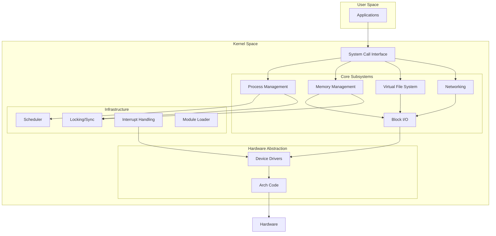
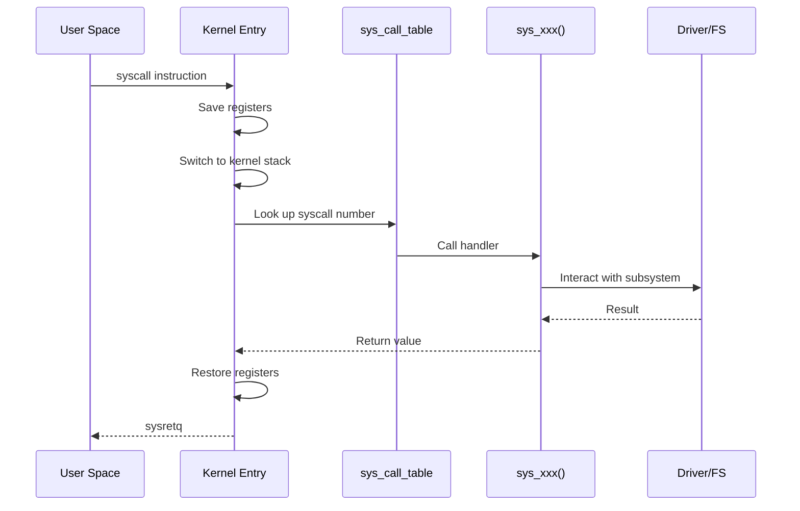
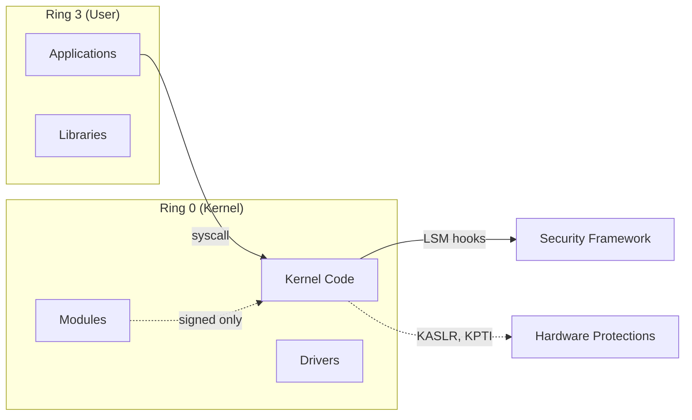

# Chapter 105: Kernel Architecture Overview

## Intuition

The Linux kernel is the beating heart of the operating system — the single program that has complete control over the hardware and mediates every interaction between user-space applications and the physical machine. Understanding its architecture is like learning the blueprint of a cathedral: once you see how the nave, transept, and apse fit together, every detail of the structure makes sense.

The kernel's primary job is to provide **abstraction**. A program should not need to know whether it writes to an SSD or an HDD, whether the network card is from Intel or Broadcom, or whether the CPU has 4 or 128 cores. The kernel presents uniform interfaces — file descriptors, sockets, virtual memory — that hide this complexity. Beneath those interfaces lies one of the most sophisticated pieces of software ever written.

Linux adopts a **monolithic** architecture, meaning the entire kernel runs in a single address space with full hardware access. This contrasts with microkernels (like Mach or seL4) where most services run in user-space servers connected by message passing. The monolithic choice trades modularity for raw performance: a system call or interrupt can be handled without crossing address-space boundaries.

However, Linux is not a *pure* monolith. Loadable kernel modules (LKMs) allow drivers and subsystems to be loaded and unloaded at runtime, providing the flexibility of a modular design without the overhead of a microkernel. Linus Torvalds famously debated Andy Tanenbaum on this topic in 1992 — and history has validated the pragmatic monolithic approach for general-purpose operating systems.

## Architecture

### High-Level Organization

The Linux kernel can be decomposed into several logical layers:

```
┌─────────────────────────────────────────────────┐
│              User-Space Applications             │
├─────────────────────────────────────────────────┤
│            System Call Interface (SCI)           │
├────────────┬────────────┬───────────┬───────────┤
│  Process   │  Memory    │   VFS /   │  Network  │
│ Management │ Management │ Filesys.  │  Stack    │
├────────────┼────────────┼───────────┼───────────┤
│  Scheduler │  VM / MM   │  Block I/O│  Socket   │
│            │  Subsystem │  Layer    │  Layer    │
├────────────┴────────────┴───────────┴───────────┤
│           Device Drivers / Bus Frameworks        │
├─────────────────────────────────────────────────┤
│         Architecture-Dependent Code (arch/)      │
├─────────────────────────────────────────────────┤
│              Hardware (CPU, Memory, I/O)         │
└─────────────────────────────────────────────────┘
```

### Design Principles

1. **Everything is a file** (or at least a file descriptor). Devices, sockets, pipes, and even processes (`/proc`) expose file-like interfaces. This unifying metaphor simplifies the API surface enormously.

2. **Mechanism, not policy**. The kernel provides the *means* to do something (e.g., `mmap()` for memory mapping) but leaves the *policy* (what to map, when, and why) to user space. This keeps the kernel small and flexible.

3. **Copy-on-write and lazy allocation**. The kernel defers expensive operations until they are truly needed. `fork()` duplicates page tables but shares physical pages until one side writes. `malloc()` reserves virtual address space but doesn't allocate physical pages until a page fault occurs.

4. **Avoidance of fixed limits**. Unlike early Unix with its fixed-size arrays for processes or open files, Linux uses dynamic data structures (radix trees, hash tables, linked lists) that scale with available memory.

5. **Pragmatism over purity**. Linux incorporates ideas from many operating systems — BSD networking, SVR4 streams, Solaris threading — without dogmatically following any single tradition.

### Monolithic vs. Microkernel

| Aspect | Monolithic (Linux) | Microkernel (seL4, Mach) |
|--------|-------------------|-------------------------|
| Address space | Single kernel space | Separate address spaces per service |
| IPC overhead | Function calls | Message passing (context switches) |
| Fault isolation | Poor (any crash is fatal) | Good (server crash is recoverable) |
| Performance | Excellent | Overhead from IPC |
| Complexity | High but contained | Lower per component, higher overall |
| Debugging | Harder | Easier per component |

Linux mitigates the isolation weakness through:
- **Kernel Address Space Layout Randomization (KASLR)**
- **Control-flow integrity (CFI)**
- **Stack protectors and hardened builds**
- **Module signing** to prevent loading of untrusted code

### Subsystem Boundaries

The kernel is organized into subsystems, each responsible for a well-defined domain:

- **Process management**: scheduling, process creation/destruction, signals, cgroups
- **Memory management**: virtual memory, page allocation, slab allocator, page cache
- **Virtual File System (VFS)**: abstraction layer over all filesystems
- **Networking**: protocol stack (TCP/IP), socket layer, netfilter
- **Block I/O**: block device layer, I/O schedulers, device mapper
- **Device drivers**: character, block, network, USB, PCI, etc.
- **Security**: LSM framework, capabilities, SELinux/AppArmor hooks
- **Arch**: architecture-specific code (x86, ARM, RISC-V, etc.)

Each subsystem has its own directory under the kernel source tree and its own set of internal APIs.

## Kernel Implementation

### The System Call Interface

The boundary between user space and kernel space is the system call interface. On x86-64, a system call is initiated via the `syscall` instruction:

```c
// Simplified system call path (x86-64)
// User space: write(1, "hello", 5)
// Translates to:
//   rax = __NR_write (1)
//   rdi = 1 (fd)
//   rsi = "hello" (buf)
//   rdx = 5 (count)
//   syscall
```

The kernel entry point is `entry_SYSCALL_64` in `arch/x86/entry/entry_64.S`, which:
1. Saves user-space registers
2. Loads the kernel stack pointer
3. Calls `do_syscall_64()` via the `sys_call_table`
4. Restores registers and returns to user space via `sysretq`

### The Process Model

Every process is represented by `struct task_struct` (defined in `include/linux/sched.h`), one of the largest structures in the kernel. It contains:

```c
struct task_struct {
    struct thread_info      thread_info;
    volatile long           state;          // -1 unrunnable, 0 runnable, >0 stopped
    void                    *stack;
    refcount_t              usage;
    unsigned int            flags;          // PF_* flags
    unsigned int            ptrace;
    int                     on_rq;
    int                     prio;
    int                     static_prio;
    int                     normal_prio;
    unsigned int            rt_priority;
    const struct sched_class *sched_class;
    struct sched_entity     se;
    struct sched_rt_entity  rt;
    struct sched_dl_entity  dl;
    struct mm_struct        *mm;            // Memory descriptor
    struct mm_struct        *active_mm;
    struct fs_struct        *fs;            // Filesystem info
    struct files_struct     *files;         // Open file table
    struct signal_struct    *signal;
    struct sighand_struct   *sighand;
    sigset_t                blocked;
    pid_t                   pid;
    pid_t                   tgid;
    struct task_struct __rcu *real_parent;
    struct task_struct      *parent;
    struct list_head        children;
    struct list_head        sibling;
    // ... hundreds more fields
};
```

### The Virtual Filesystem (VFS)

VFS defines a set of abstract objects:

- **superblock**: represents a mounted filesystem
- **inode**: represents a file (metadata)
- **dentry**: represents a directory entry (name-to-inode mapping)
- **file**: represents an open file (per-process state)

Each filesystem (ext4, XFS, Btrfs, etc.) implements these interfaces:

```c
struct file_operations {
    struct module *owner;
    loff_t (*llseek)(struct file *, loff_t, int);
    ssize_t (*read)(struct file *, char __user *, size_t, loff_t *);
    ssize_t (*write)(struct file *, const char __user *, size_t, loff_t *);
    __poll_t (*poll)(struct file *, struct poll_table_struct *);
    long (*unlocked_ioctl)(struct file *, unsigned int, unsigned long);
    int (*mmap)(struct file *, struct vm_area_struct *);
    int (*open)(struct inode *, struct file *);
    int (*release)(struct inode *, struct file *);
    // ...
};
```

### Memory Management Architecture

Linux uses a multi-layered memory management design:

1. **Buddy allocator**: manages physical pages in power-of-2 sizes
2. **Slab allocator** (SLUB): handles small allocations (kmalloc)
3. **vmalloc**: allocates virtually contiguous but physically non-contiguous memory
4. **Page cache**: caches file data in memory
5. **Buffer cache**: caches disk blocks
6. **Swap**: moves cold pages to disk

The virtual address space (on x86-64) is split:

```
0x0000000000000000 ─ 0x00007FFFFFFFFFFF  User space (128 TiB)
0xFFFF800000000000 ─ 0xFFFFFFFFFFFFFFFF  Kernel space (128 TiB)
  ├── direct mapping of all physical memory
  ├── vmalloc area
  ├── kernel text/module area
  └── fixmap area
```

## Source Code References

| File | Description |
|------|-------------|
| `init/main.c` | `start_kernel()` — kernel entry point |
| `include/linux/sched.h` | `task_struct` definition |
| `kernel/sched/core.c` | Scheduler core |
| `mm/memory.c` | Page fault handling |
| `fs/open.c` | `sys_open()` implementation |
| `arch/x86/entry/entry_64.S` | x86-64 syscall entry |
| `include/linux/fs.h` | VFS structures |
| `mm/page_alloc.c` | Buddy allocator |
| `mm/slub.c` | SLUB slab allocator |
| `net/socket.c` | Socket layer |

## Data Structures

### Core Kernel Data Structures

```c
// Linked list (include/linux/list.h)
struct list_head {
    struct list_head *next, *prev;
};

// Red-black tree (include/linux/rbtree.h)
struct rb_node {
    unsigned long  __rb_parent_color;
    struct rb_node *rb_right;
    struct rb_node *rb_left;
} __attribute__((aligned(sizeof(long))));

// Radix tree / XArray (include/linux/xarray.h)
struct xarray {
    spinlock_t      xa_lock;
    gfp_t           xa_flags;
    void __rcu      *xa_head;
};

// Hash table (include/linux/hashtable.h)
#define DEFINE_HASHTABLE(name, bits) \
    struct hlist_head name[1 << (bits)]

// Work queue (include/linux/workqueue.h)
struct work_struct {
    atomic_long_t data;
    struct list_head entry;
    work_func_t func;
};
```

## Diagrams

### Kernel Subsystem Interaction



### System Call Flow



## Performance

### Key Performance Characteristics

1. **System call overhead**: ~100-200ns on modern hardware (dominated by `syscall`/`sysret` and register save/restore)
2. **Context switch**: ~1-5μs depending on TLB flush requirements
3. **Page fault**: ~1-10μs for minor, ~100μs+ for major (requires disk I/O)
4. **Interrupt latency**: ~1-5μs from hardware signal to handler entry

### Performance-Relevant Design Choices

- **Direct mapping**: The kernel directly maps all physical memory into its address space, avoiding page table overhead for kernel memory access
- **Per-CPU data**: Extensive use of per-CPU variables to avoid cache-line bouncing
- **Lock-free algorithms**: RCU for read-heavy paths, lock-free lists and queues
- **Huge pages**: 2MB and 1GB pages reduce TLB pressure for large workloads
- **NUMA awareness**: Memory allocation and scheduling are NUMA-aware

## Security

### Kernel Security Mechanisms

1. **Capabilities**: Fine-grained privilege model replacing the monolithic root/non-root distinction
2. **LSM (Linux Security Modules)**: Hook-based framework for SELinux, AppArmor, etc.
3. **KASLR**: Randomizes kernel load address to prevent ROP attacks
4. **SMEP/SMAP**: Prevents kernel from executing/accessing user-space memory
5. **Stack canaries**: Detect stack buffer overflows
6. **KPTI**: Kernel Page-Table Isolation (Meltdown mitigation)
7. **Retpolines**: Spectre v2 mitigation
8. **Control-flow integrity (CFI)**: Indirect call validation
9. **Lockdown LSM**: Restricts kernel self-modification in secure boot mode

### Security Boundaries



## Common Pitfalls

1. **Confusing the kernel with the OS**: The kernel is one component; the OS includes user-space tools (coreutils, systemd, etc.)
2. **Assuming "monolithic" means "unstructured"**: Linux is highly modular despite running in a single address space
3. **Ignoring architecture-specific code**: A significant portion of the kernel is arch-specific; "the kernel" on ARM differs from x86
4. **Overlooking the role of user-space drivers**: Not all drivers are in the kernel — GPU drivers (Mesa), FUSE filesystems, and DPDK networking run in user space
5. **Treating the kernel as static**: The kernel is a living project with ~30 million lines of code, changing at ~10,000 patches per release

## Best Practices

1. **Read the source**: The kernel source is the ultimate documentation. Use `lxr.linux.no` or `elixir.bootlin.com` for browsing.
2. **Start with a subsystem**: Don't try to understand the whole kernel at once. Pick a subsystem (e.g., scheduler, VFS) and go deep.
3. **Use tracing**: `ftrace`, `perf`, and `bpftrace` let you observe kernel behavior in production without modifying source.
4. **Follow the coding style**: `scripts/checkpatch.pl` enforces the kernel's style (tabs, 80 columns, specific naming conventions).
5. **Read commit messages**: Kernel commit messages are often mini-essays explaining *why* a change was made.

## Exercises

1. **Explore the source**: Clone the kernel source (`git clone git://git.kernel.org/pub/scm/linux/kernel/git/torvalds/linux.git`) and find the definition of `task_struct`. How many fields does it have?

2. **Trace a system call**: Use `strace ls` and count how many system calls a simple `ls` makes. Categorize them (file, memory, process).

3. **Measure context switch cost**: Write a program that uses two processes communicating via a pipe and measure round-trip time. Compare with kernel documentation.

4. **Module vs. built-in**: Compile a simple kernel module and load it. Then build the same code into the kernel. Compare boot-time availability.

5. **Read MAINTAINERS**: Pick a subsystem you're interested in and find its maintainers, mailing list, and source files.

## References

1. Love, R. *Linux Kernel Development*, 3rd Edition. Addison-Wesley, 2010.
2. Bovet, D. P., and Cesati, M. *Understanding the Linux Kernel*, 3rd Edition. O'Reilly, 2005.
3. Torvalds, L. "Linux is Obsolete" — Tanenbaum-Torvalds debate, comp.os.minix, 1992.
4. `Documentation/process/how-to.rst` — Kernel development process guide.
5. `Documentation/admin-guide/README.rst` — Kernel build instructions.
6. https://elixir.bootlin.com/linux/latest/source — Online kernel source browser.
7. https://kernelnewbies.org/ — Community for kernel newcomers.
8. `Documentation/architecture/` — Architecture-specific documentation.
