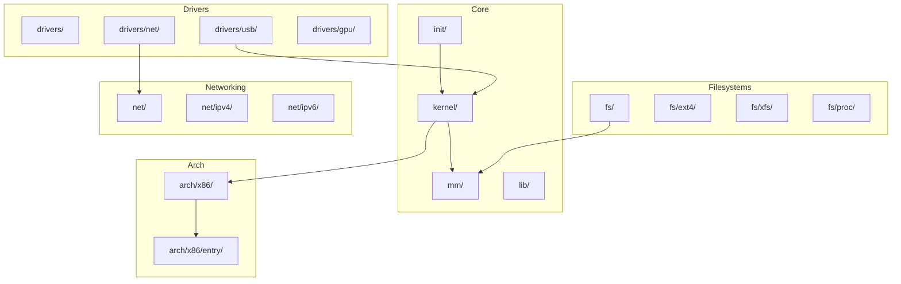
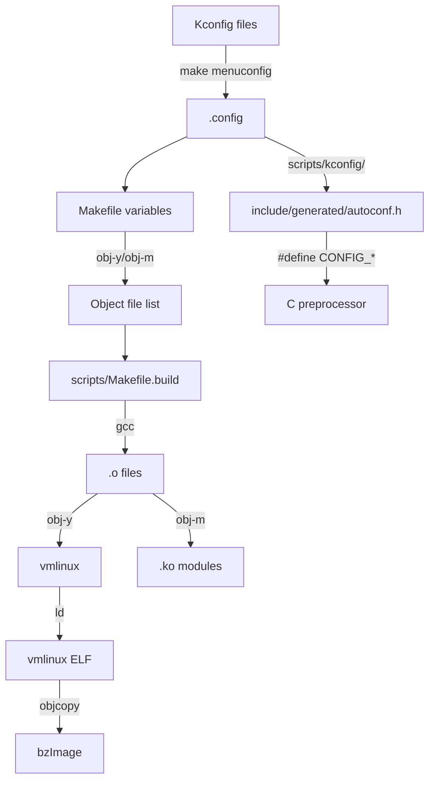

# Chapter 106: Source Tree Structure

## Intuition

The Linux kernel source tree is one of the largest and most actively developed codebases in the world, with over 30 million lines of code across thousands of files. Navigating it can feel overwhelming at first — like walking into a library with no catalog system. But the tree has a logical organization that, once understood, lets you find anything from a device driver to a scheduler algorithm with predictable directory lookups.

The source tree structure reflects the kernel's architectural decomposition. Each top-level directory corresponds roughly to a subsystem or architectural concern. The build system (`Kconfig`, `Kbuild`) ensures that tens of thousands of configuration options can be combined to produce kernels ranging from tiny embedded systems (a few hundred KB) to full-featured desktop/server kernels (many MB).

Understanding the source tree structure is the first skill any kernel developer needs. Whether you're reading code to understand behavior, writing a driver, fixing a bug, or submitting a patch, knowing *where* to look is half the battle.

## Architecture

### Top-Level Directory Layout

```
linux/
├── arch/           # Architecture-specific code
│   ├── x86/
│   ├── arm/
│   ├── arm64/
│   ├── riscv/
│   ├── mips/
│   └── ...
├── block/          # Block I/O layer
├── certs/          # Certificates for module signing
├── crypto/         # Cryptographic API
├── Documentation/  # Kernel documentation (RST format)
├── drivers/        # Device drivers (largest directory)
├── fs/             # Filesystems
├── include/        # Header files
├── init/           # Kernel initialization
├── ipc/            # Inter-process communication
├── kernel/         # Core kernel subsystems
├── lib/            # Helper library routines
├── mm/             # Memory management
├── net/            # Networking stack
├── samples/        # Example code
├── scripts/        # Build scripts and tools
├── security/       # Security framework (LSM)
├── sound/          # Audio subsystem
├── tools/          # User-space tools (perf, bpftool, etc.)
├── usr/            # initramfs support
├── virt/           # Virtualization (KVM)
├── COPYING         # License (GPLv2)
├── CREDITS         # Contributors
├── Kbuild          # Top-level Kbuild file
├── Kconfig         # Top-level Kconfig
├── MAINTAINERS     # Subsystem maintainer list
├── Makefile        # Top-level Makefile
└── README          # Build instructions
```

### The `arch/` Directory

Each supported architecture has its own directory under `arch/`. The x86 directory is the most complex:

```
arch/x86/
├── boot/           # Boot code (setup.bin, bzImage)
│   ├── compressed/ # Kernel decompression
│   └── ...
├── configs/        # Defconfig files
├── crypto/         # Architecture-specific crypto
├── entry/          # Entry/exit code (syscall, interrupt)
├── events/         # Performance monitoring (perf)
├── include/        # Arch-specific headers
├── kernel/         # Core arch code (process, signal, time)
├── kvm/            # KVM hypervisor support
├── lib/            # Arch-optimized library functions
├── math-emu/       # FPU emulation
├── mm/             # Arch-specific memory management
├── net/            # Arch-specific networking (BPF JIT)
├── pci/            # PCI quirks
├── platform/       # Platform-specific code
├── power/          # Power management
├── tools/          # Arch-specific tools
├── vdso/           # Virtual dynamic shared object
├── video/          # Framebuffer
└── xen/            # Xen hypervisor support
```

### The `drivers/` Directory

This is the largest directory, organized by device type:

```
drivers/
├── ata/            # SATA/PATA
├── base/           # Core driver model (bus, device, driver)
├── block/          # Block devices
├── bluetooth/      # Bluetooth
├── char/           # Character devices
├── clk/            # Clock framework
├── dma/            # DMA engines
├── gpu/            # GPU drivers (i915, amdgpu, nouveau)
├── hid/            # Human interface devices
├── hwmon/          # Hardware monitoring
├── hwspinlock/     # Hardware spinlocks
├── i2c/            # I2C bus
├── iio/            # Industrial I/O
├── input/          # Input subsystem
├── irqchip/        # Interrupt controllers
├── leds/           # LED subsystem
├── md/             # Software RAID
├── media/          # Media (V4L2, DVB)
├── misc/           # Miscellaneous devices
├── mmc/            # MMC/SD
├── mtd/            # Memory technology devices (flash)
├── net/            # Network device drivers
├── nvdimm/         # Non-volatile memory
├── nvme/           # NVMe
├── of/             # Device Tree helpers
├── pci/            # PCI subsystem
├── phy/            # PHY drivers
├── pinctrl/        # Pin control
├── platform/       # Platform drivers
├── power/          # Power supply
├── pwm/            # Pulse-width modulation
├── remoteproc/     # Remote processor
├── reset/          # Reset controllers
├── rpmsg/          # Remote processor messaging
├── rtc/            # Real-time clock
├── scsi/           # SCSI
├── soc/            # SoC-specific code
├── sound/          # Audio (ALSA)
├── spi/            # SPI bus
├── target/         # SCSI target
├── thermal/        # Thermal management
├── tty/            # TTY/serial
├── usb/            # USB
├── vfio/           # Virtual function I/O
├── video/          # Framebuffer
├── virt/           # Virtio
├── watchdog/       # Watchdog timers
└── w1/             # 1-Wire bus
```

### The `kernel/` Directory

Core kernel subsystems:

```
kernel/
├── bpf/            # BPF subsystem
├── cgroup/         # Control groups
├── debug/          # Debugging helpers
├── events/         # Event tracing infrastructure
├── irq/            # Interrupt handling
├── livepatch/      # Kernel live patching
├── locking/        # Locking primitives
├── power/          # Power management (suspend, hibernate)
├── printk/         # printk and logging
├── rcu/            # RCU implementation
├── sched/          # Scheduler
├── signal.c        # Signal handling
├── sys.c           # System call implementations
├── sys_ni.c        # Not-implemented syscall stubs
├── task_work.c     # Task work mechanism
├── time/           # Timekeeping
├── trace/          # Tracing infrastructure
└── workqueue.c     # Work queues
```

### The `fs/` Directory

```
fs/
├── ext4/           # ext4 filesystem
├── xfs/            # XFS filesystem
├── btrfs/          # Btrfs filesystem
├── nfs/            # NFS client
├── nfsv4/          # NFSv4 client
├── overlayfs/      # Overlay filesystem (containers)
├── proc/           # /proc filesystem
├── sysfs/          # /sys filesystem
├── debugfs/        # Debug filesystem
├── fuse/           # FUSE (user-space filesystems)
├── fat/            # FAT/exFAT
├── ntfs3/          # NTFS
├── cifs/           # SMB/CIFS
├── io_uring.c      # io_uring interface
├── namei.c         # Path lookup
├── open.c          # open() implementation
├── read_write.c    # read()/write() implementations
├── dcache.c        # Dentry cache
├── inode.c         # Inode management
└── super.c         # Superblock management
```

## Kernel Implementation

### Kconfig — Configuration System

The Kconfig system allows the kernel to be highly configurable. There are over 15,000 configuration options. Each is defined in a `Kconfig` file within the relevant source directory.

#### Kconfig Syntax

```kconfig
# Simple boolean option
config DEBUG_KERNEL
    bool "Kernel debugging"
    help
      Say Y here if you want to debug kernel issues.

# Tristate (can be y, m, or n)
config EXT4_FS
    tristate "The Extended 4 (ext4) filesystem"
    select CRC32
    depends on BLOCK
    help
      This is the journaling filesystem from ext3, with
      support for larger files and filesystems.

# Integer option
config NR_CPUS
    int "Maximum number of CPUs"
    range 2 8192
    default 8 if X86_64
    default 4

# String option
config DEFAULT_HOSTNAME
    string "Default hostname"
    default "(none)"

# Choice (radio buttons)
choice
    prompt "Default CPU frequency governor"
    default CPU_FREQ_GOV_SCHEDUTIL
    config CPU_FREQ_GOV_PERFORMANCE
        bool "performance"
    config CPU_FREQ_GOV_SCHEDUTIL
        bool "schedutil"
endchoice

# Menu structure
menu "Power management options"
    depends on PM

    config PM_SLEEP
        bool "Allow suspend/resume and hibernation"
        depends on SUSPEND || HIBERNATE_CALLBACKS
        ...

endmenu
```

#### Kconfig Dependencies

Options can depend on other options:

```kconfig
config FOO
    bool "Foo support"
    depends on BAR && BAZ
    select QUUX if BAZ
    imply QUUX2

# depends on: option only visible if dependency is met
# select: force-enable another option when this is enabled
# imply: suggest enabling another option (can be overridden)
```

### Kbuild — Build System

The kernel uses a two-phase build system:

1. **Configuration phase**: `make menuconfig` processes Kconfig files to generate `.config`
2. **Build phase**: `make` processes Makefiles to build the kernel image

#### Makefile Structure

Each directory has a `Makefile` that tells Kbuild what to build:

```makefile
# drivers/usb/Makefile
obj-$(CONFIG_USB)           += core/
obj-$(CONFIG_USB_STORAGE)   += storage/
obj-$(CONFIG_USB_SERIAL)    += serial/

# Simple object file
obj-$(CONFIG_FOO) += foo.o

# Object from multiple source files
obj-$(CONFIG_BAR) += bar.o
bar-objs := bar_main.o bar_helper.o bar_utils.o

# Host program (build-time tool)
hostprogs := gen_init_cpio
always := $(hostprogs)
```

The `obj-y` (built-in), `obj-m` (module), and `obj-n` (not built) conventions come from the config value:
- `CONFIG_FOO=y` → `obj-y += foo.o`
- `CONFIG_FOO=m` → `obj-m += foo.o`
- `CONFIG_FOO=n` → `obj-n += foo.o` (effectively ignored)

### MAINTAINERS File

The `MAINTAINERS` file maps code areas to responsible developers:

```
THE REST
    M:  Linus Torvalds <torvalds@linux-foundation.org>
    L:  linux-kernel@vger.kernel.org
    S:  Buried alive in reporters
    W:  https://www.kernel.org
    T:  git git://git.kernel.org/pub/scm/linux/kernel/git/torvalds/linux.git
    F:  *
    F:  */

EXT4 FILE SYSTEM
    M:  Theodore Ts'o <tytso@mit.edu>
    M:  Andreas Dilger <adilger.kernel@dilger.ca>
    L:  linux-ext4@vger.kernel.org
    S:  Maintained
    W:  https://ext4.wiki.kernel.org
    T:  git git://git.kernel.org/pub/scm/linux/kernel/git/tytso/ext4.git
    F:  fs/ext4/
    F:  include/linux/ext4*
    F:  fs/jbd2/

X86 ARCHITECTURE (32-BIT AND 64-BIT)
    M:  Thomas Gleixner <tglx@linutronix.de>
    M:  Ingo Molnar <mingo@redhat.com>
    M:  Borislav Petkov <bp@alien8.de>
    M:  Dave Hansen <dave.hansen@linux.intel.com>
    L:  x86@kernel.org
    S:  Maintained
    T:  git git://git.kernel.org/pub/scm/linux/kernel/git/tip/tip.git x86/core
    F:  arch/x86/
```

The `scripts/get_maintainer.pl` tool parses this file:

```bash
# Find who to send a patch to
scripts/get_maintainer.pl -f drivers/net/ethernet/intel/e1000e/
```

### Config Generation Workflow

```bash
# Start with architecture defaults
make defconfig          # Generate default config
make tinyconfig         # Minimal config
make allnoconfig        # All options disabled
make allyesconfig       # All options enabled

# Or use a vendor defconfig
cp arch/x86/configs/x86_64_defconfig .config

# Interactive configuration
make menuconfig         # ncurses-based TUI
make xconfig           # Qt-based GUI
make gconfig           # GTK-based GUI

# Fine-tune
scripts/config --enable EXT4_FS
scripts/config --module USB_STORAGE
scripts/config --disable DEBUG_KERNEL

# Build
make -j$(nproc)
make modules -j$(nproc)
```

## Source Code References

| File | Description |
|------|-------------|
| `Makefile` | Top-level build orchestration |
| `Kconfig` | Top-level configuration menu |
| `scripts/kconfig/` | Kconfig parser and tools |
| `scripts/Makefile.build` | Core build rules |
| `scripts/Makefile.lib` | Helper macros |
| `scripts/get_maintainer.pl` | MAINTAINERS parser |
| `scripts/checkpatch.pl` | Coding style checker |
| `scripts/decode_stacktrace.sh` | Symbolize kernel oops |
| `arch/x86/Makefile` | x86-specific build rules |
| `Documentation/kbuild/` | Kbuild documentation |

## Data Structures

### Build System Internals

The build system tracks dependencies through several files:

```bash
# .config — Current configuration
CONFIG_64BIT=y
CONFIG_X86_64=y
CONFIG_SMP=y
CONFIG_MODULES=y
CONFIG_EXT4_FS=m
# ... thousands more

# include/generated/autoconf.h — C header version of .config
#define CONFIG_64BIT 1
#define CONFIG_X86_64 1
#define CONFIG_SMP 1
#define CONFIG_MODULES 1
#define CONFIG_EXT4_FS_MODULE 1

# .tmp_versions/*.mod — Module tracking
drivers/usb/storage/usb-storage.ko
```

### Kconfig Internal Representation

The Kconfig parser builds a tree of `menu` and `symbol` nodes:

```c
// Internal Kconfig representation (simplified)
struct symbol {
    const char *name;
    enum symbol_type type;      // S_BOOLEAN, S_TRISTATE, S_INT, etc.
    struct property *prop;      // Properties (prompt, default, depends, etc.)
    struct expr_value rev_dep;  // Reverse dependencies
    int flags;
    // ...
};

struct menu {
    struct symbol *sym;
    struct property *prompt;
    struct menu *parent;
    struct menu *list;          // Children
    struct menu *next;          // Sibling
    // ...
};
```

## Diagrams

### Source Tree Dependency Graph



### Build System Flow



## Performance

### Build Performance

The kernel build system is optimized for parallelism:

```bash
# Parallel build with all CPUs
make -j$(nproc)

# For memory-constrained systems
make -j4

# Incremental builds only rebuild changed files
# Dependency tracking via .*.d files
make

# Ccache integration
export CC="ccache gcc"
make -j$(nproc)
```

Build times (approximate on a modern 16-core machine):
- Full build: 5-15 minutes
- Incremental (single file): 1-5 seconds
- Module build: 2-10 minutes

### Build Optimization Flags

```makefile
# In top-level Makefile
KBUILD_CFLAGS   := -Wall -Wundef -Werror=strict-prototypes \
                   -Wno-trigraphs \
                   -fno-strict-aliasing \
                   -fno-common \
                   -fshort-wchar \
                   -fno-PIE \
                   -Werror=implicit-function-declaration \
                   -Werror=implicit-int \
                   -Wno-format-security \
                   -std=gnu11

# Optimization levels
ifdef CONFIG_CC_OPTIMIZE_FOR_PERFORMANCE
KBUILD_CFLAGS += -O2
else ifdef CONFIG_CC_OPTIMIZE_FOR_SIZE
KBUILD_CFLAGS += -Os
endif
```

## Security

### Secure Build Practices

1. **Module signing**: Modules must be signed to load on secure-boot systems
2. **Reproducible builds**: `CONFIG_BUILD_SALT` and deterministic timestamps
3. **Compiler hardening**: Stack protectors, FORTIFY_SOURCE, CFI
4. **Defconfig auditing**: Review `defconfig` files for security-relevant options

### Configuration Security Options

```kconfig
# Key security options
config SECURITY
    bool "Enable different security models"
    select SECURITYFS

config SECURITY_SELINUX
    tristate "NSA SELinux Support"
    depends on SECURITY
    select AUDIT

config HARDENED_USERCOPY
    bool "Harden memory copies between kernel and userspace"
    default y

config INIT_STACK_ALL_ZERO
    bool "Force all heap and stack variables to be zeroed"
    default GCC_PLUGIN_STACKLEAK || INIT_STACK_ALL_ZERO
```

## Common Pitfalls

1. **Editing generated files**: `include/generated/` and `include/config/` are auto-generated; edits will be overwritten
2. **Forgetting `make clean`**: After changing `.config` significantly, a clean build avoids stale object files
3. **Ignoring `scripts/checkpatch.pl`**: Patches that don't pass checkpatch will be rejected by maintainers
4. **Not reading `Documentation/`**: The kernel has extensive documentation; reading it saves hours of code archaeology
5. **Using absolute paths in Makefiles**: Always use Kbuild variables (`$(src)`, `$(obj)`) instead of hard-coded paths

## Best Practices

1. **Use `git log` to explore**: `git log --oneline fs/ext4/` shows recent changes to ext4
2. **Use `cscope` or `ctags`**: Index the source tree for fast symbol lookup
3. **Read MAINTAINERS first**: Before working on any subsystem, know who maintains it
4. **Use `scripts/decode_stacktrace.sh`**: Convert kernel oops addresses to source lines
5. **Start with `scripts/checkpatch.pl`**: Always run it before submitting patches
6. **Use `make W=1`**: Enable extra compiler warnings during development
7. **Explore with `make cscope`**: Generate cscope database for the kernel

## Exercises

1. **Directory exploration**: How many `.c` files are in the kernel source? Use `find` to count them.
2. **Kconfig exploration**: Find all Kconfig options related to "scheduler" using `grep`.
3. **MAINTAINERS lookup**: Find the maintainer for the VFS layer using `get_maintainer.pl`.
4. **Build a minimal kernel**: Use `make tinyconfig` and see what options are enabled. Compare with `make defconfig`.
5. **Trace a build**: Run `make V=1` on a single file to see the exact compiler invocation.
6. **Module dependencies**: Run `make modules_prepare` and examine what files it generates.

## References

1. `Documentation/kbuild/` — Comprehensive Kbuild documentation.
2. `Documentation/kbuild/kconfig.rst` — Kconfig language specification.
3. `Documentation/process/submitting-patches.rst` — Patch submission guide.
4. `Documentation/process/coding-style.rst` — Kernel coding style.
5. Love, R. *Linux Kernel Development*, Chapter 2.
6. https://kernel.org/doc/html/latest/kbuild/ — Online Kbuild docs.
7. `scripts/checkpatch.pl` — Coding style checker (read its embedded docs).
