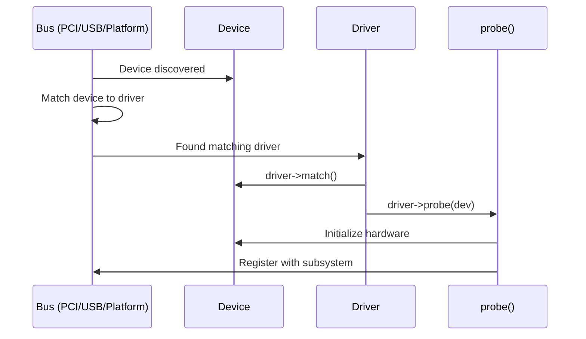

# Chapter 107: Kernel Subsystems

## Intuition

The Linux kernel is not a monolithic blob of undifferentiated code — it is a carefully organized collection of subsystems, each responsible for a specific domain of operating system functionality. Understanding these subsystems is like understanding the organs of a body: each has a specific function, but they all work together to keep the system alive.

Every application you run — from a simple `ls` to a complex database server — exercises multiple kernel subsystems simultaneously. When you read a file, the VFS layer resolves the path, the page cache checks if the data is in memory, the block I/O layer issues requests to the storage driver, and the scheduler decides which process runs while waiting for I/O. These subsystems are deeply interconnected, yet each maintains a clear boundary of responsibility.

This chapter provides an overview of the major kernel subsystems, their responsibilities, key data structures, and how they interact. Think of it as a map of the kernel landscape — detailed enough to navigate, but not so detailed that you get lost in the weeds.

## Architecture

### Subsystem Map

```mermaid
graph TB
    subgraph "Process Management"
        SCHED[Scheduler]
        CGROUP[Cgroups]
        SIGNAL[Signals]
        FORK[Process Creation]
        NAMESPACE[Namespaces]
    end

    subgraph "Memory Management"
        VM[Virtual Memory]
        PAGE[Page Allocator]
        SLAB[Slab Allocator]
        PCACHE[Page Cache]
        SWAP[Swap]
    end

    subgraph "Filesystems"
        VFS[VFS Layer]
        EXT4[ext4]
        XFS[XFS]
        BTRFS[Btrfs]
        PROC[/proc]
        SYSFS[/sys]
    end

    subgraph "Networking"
        SOCK[Socket Layer]
        TCP[TCP/IP]
        NETFILTER[Netfilter]
        BRIDGE[Bridging]
    end

    subgraph "Block I/O"
        BIO[Block Layer]
        IOSCHED[I/O Scheduler]
        DM[Device Mapper]
        MD[MD/RAID]
    end

    subgraph "Security"
        LSM[LSM Framework]
        CAPS[Capabilities]
        SELINUX[SELinux]
        SECCOMP[seccomp]
    end

    subgraph "Drivers"
        PCI[PCI]
        USB[USB]
        CHAR[Char Devices]
        NETDEV[Net Devices]
    end

    SCHED --> FORK
    SCHED --> CGROUP
    VFS --> EXT4
    VFS --> PCACHE
    EXT4 --> BIO
    BIO --> IOSCHED
    SOCK --> TCP
    TCP --> NETDEV
    LSM --> CAPS
```

## Scheduler Subsystem

The scheduler determines which process runs on each CPU at any given time. It lives in `kernel/sched/`.

### Key Files

| File | Purpose |
|------|---------|
| `kernel/sched/core.c` | Core scheduler logic |
| `kernel/sched/fair.c` | CFS (Completely Fair Scheduler) |
| `kernel/sched/rt.c` | Real-time scheduler |
| `kernel/sched/deadline.c` | Deadline scheduler |
| `kernel/sched/stop.c` | Stop-task scheduler (highest priority) |
| `kernel/sched/stats.c` | Scheduler statistics |
| `kernel/sched/cputime.c` | CPU time accounting |

### Scheduler Classes

```c
// include/linux/sched.h
struct sched_class {
    const struct sched_class *next;

    void (*enqueue_task)  (struct rq *rq, struct task_struct *p, int flags);
    void (*dequeue_task)  (struct rq *rq, struct task_struct *p, int flags);
    void (*yield_task)    (struct rq *rq);
    void (*check_preempt_curr)(struct rq *rq, struct task_struct *p, int flags);

    struct task_struct *(*pick_next_task)(struct rq *rq);
    void (*put_prev_task)(struct rq *rq, struct task_struct *p);
    void (*set_next_task)(struct rq *rq, struct task_struct *p, bool first);

    int  (*select_task_rq)(struct task_struct *p, int task_cpu, int sd_flag, int flags);
    void (*task_tick)     (struct rq *rq, struct task_struct *p, int queued);
    void (*task_fork)     (struct task_struct *p);
    void (*task_dead)     (struct task_struct *p);
    // ...
};
```

The scheduler classes are ordered by priority:

1. **stop_sched_class** — Stop tasks (migration, highest priority)
2. **dl_sched_class** — SCHED_DEADLINE tasks
3. **rt_sched_class** — SCHED_FIFO and SCHED_RR tasks
4. **fair_sched_class** — SCHED_NORMAL and SCHED_BATCH (CFS)
5. **idle_sched_class** — Idle tasks (lowest priority)

### Run Queue

Each CPU has its own run queue (`struct rq`):

```c
struct rq {
    raw_spinlock_t      lock;
    unsigned int        nr_running;

    struct cfs_rq       cfs;        // CFS run queue
    struct rt_rq        rt;         // RT run queue
    struct dl_rq        dl;         // Deadline run queue

    struct task_struct  *curr;      // Currently running task
    struct task_struct  *idle;      // Idle task for this CPU
    struct task_struct  *stop;      // Stop task

    u64                 clock;
    u64                 clock_task;
    // ...
};
```

## Memory Management Subsystem

The memory management subsystem (`mm/`) handles virtual memory, physical page allocation, and the page cache.

### Key Files

| File | Purpose |
|------|---------|
| `mm/memory.c` | Page fault handling, page table management |
| `mm/page_alloc.c` | Buddy allocator (physical pages) |
| `mm/slub.c` | SLUB slab allocator |
| `mm/vmalloc.c` | vmalloc (virtually contiguous) |
| `mm/mmap.c` | Virtual memory areas (VMA) management |
| `mm/filemap.c` | Page cache operations |
| `mm/swap.c` | Swap management |
| `mm/oom_kill.c` | Out-of-memory killer |
| `mm/memcontrol.c` | Memory cgroup controller |
| `mm/huge_memory.c` | Transparent huge pages |
| `mm/migrate.c` | Page migration |

### Key Data Structures

```c
// Virtual memory area
struct vm_area_struct {
    unsigned long vm_start;
    unsigned long vm_end;
    struct mm_struct *vm_mm;
    pgprot_t vm_page_prot;
    unsigned long vm_flags;
    struct rb_node vm_rb;               // Red-black tree node
    union {
        struct {
            struct list_head list;
            void *parent;
            struct vm_area_struct *head;
        } shared;
        struct anon_vma_name *anon_name;
    };
    const struct vm_operations_struct *vm_ops;
    unsigned long vm_pgoff;
    struct file *vm_file;
    void *vm_private_data;
    atomic_t vm_refcount;
};

// Memory descriptor (per-process)
struct mm_struct {
    struct {
        struct vm_area_struct *mmap;        // List of VMAs
        struct rb_root mm_rb;               // Red-black tree of VMAs
        // ...
    } __randomize_layout;
    pgd_t *pgd;                             // Page global directory
    atomic_t mm_users;
    atomic_t mm_count;
    atomic_long_t nr_ptes;
    int map_count;
    unsigned long total_vm;
    unsigned long locked_vm;
    unsigned long data_vm;
    unsigned long exec_vm;
    // ...
};
```

### Allocation Layers

```
User malloc()/mmap()
        │
        ▼
   VMA management (mmap.c)
        │
        ▼
   Page fault handler (memory.c)
        │
        ▼
   Buddy allocator (page_alloc.c)  ← Physical pages
        │
        ▼
   Slab allocator (slub.c)         ← Small objects (kmalloc)
        │
        ▼
   Page cache (filemap.c)          ← File data caching
        │
        ▼
   Swap (swap_state.c)             ← Cold page eviction
```

## Virtual Filesystem (VFS)

The VFS is the abstraction layer between system calls and actual filesystems.

### Key Files

| File | Purpose |
|------|---------|
| `fs/namei.c` | Path lookup (open, stat, etc.) |
| `fs/open.c` | open(), close() implementations |
| `fs/read_write.c` | read(), write() implementations |
| `fs/inode.c` | Inode management |
| `fs/dcache.c` | Dentry cache |
| `fs/super.c` | Superblock management |
| `fs/char_dev.c` | Character device support |
| `fs/block_dev.c` | Block device support |

### VFS Object Hierarchy

```c
// Superblock — represents a mounted filesystem
struct super_block {
    struct list_head s_list;
    dev_t s_dev;
    unsigned char s_blocksize_bits;
    unsigned long s_blocksize;
    loff_t s_maxbytes;
    struct file_system_type *s_type;
    const struct super_operations *s_op;
    struct dentry *s_root;
    struct rw_semaphore s_umount;
    // ...
};

// Inode — represents a file (metadata)
struct inode {
    umode_t i_mode;
    unsigned short i_opflags;
    kuid_t i_uid;
    kgid_t i_gid;
    unsigned int i_flags;
    const struct inode_operations *i_op;
    struct super_block *i_sb;
    struct address_space *i_mapping;
    unsigned long i_ino;
    union {
        const unsigned int i_nlink;
        unsigned int __i_nlink;
    };
    dev_t i_rdev;
    loff_t i_size;
    struct timespec64 __i_atime;
    struct timespec64 __i_mtime;
    struct timespec64 __i_ctime;
    const struct file_operations *i_fop;
    // ...
};

// Dentry — directory entry (name-to-inode mapping)
struct dentry {
    unsigned int d_flags;
    seqcount_t d_seq;
    struct hlist_bl_node d_hash;
    struct dentry *d_parent;
    struct qstr d_name;
    struct inode *d_inode;
    unsigned char d_iname[DNAME_INLINE_LEN];
    struct lockref d_lockref;
    const struct dentry_operations *d_op;
    struct super_block *d_sb;
    unsigned long d_time;
    void *d_fsdata;
    union {
        struct list_head d_lru;
        wait_queue_head_t *d_wait;
    };
    struct list_head d_child;
    struct list_head d_subdirs;
    // ...
};

// File — represents an open file (per-process)
struct file {
    union {
        struct llist_node f_llist;
        struct rcu_head f_rcuhead;
        unsigned int f_iocb_flags;
    };
    struct path f_path;
    struct inode *f_inode;
    const struct file_operations *f_op;
    spinlock_t f_lock;
    atomic_long_t f_count;
    unsigned int f_flags;
    fmode_t f_mode;
    struct mutex f_pos_lock;
    loff_t f_pos;
    struct fown_struct f_owner;
    void *private_data;
    struct address_space *f_mapping;
    // ...
};
```

## Networking Subsystem

The networking stack (`net/`) implements the TCP/IP protocol suite and socket layer.

### Key Files

| File | Purpose |
|------|---------|
| `net/socket.c` | Socket layer |
| `net/core/sock.c` | Socket structures |
| `net/core/dev.c` | Network device layer |
| `net/ipv4/tcp.c` | TCP protocol |
| `net/ipv4/tcp_input.c` | TCP receive path |
| `net/ipv4/tcp_output.c` | TCP transmit path |
| `net/ipv4/ip_input.c` | IP receive |
| `net/ipv4/ip_output.c` | IP transmit |
| `net/ipv4/udp.c` | UDP protocol |
| `net/ipv6/` | IPv6 |
| `net/netfilter/` | Netfilter (iptables/nftables) |

### Networking Layer Model

```c
// Socket buffer — the fundamental networking data unit
struct sk_buff {
    union {
        struct {
            struct sk_buff *next;
            struct sk_buff *prev;
            union {
                struct net_device *dev;
                // ...
            };
        };
        struct rb_node rbnode;
        struct list_head list;
    };

    unsigned long _skb_refdst;
    void (*destructor)(struct sk_buff *skb);
    unsigned int len;
    unsigned int data_len;
    __u16 mac_len;
    __u16 hdr_len;

    __u16 queue_mapping;
    __u8 cloned: 1;
    __u8 ip_summed: 2;
    __u8 nohdr: 1;
    __u8 pkt_type: 3;
    __u8 pfmemalloc: 1;

    __u32 hash;
    __be16 vlan_proto;
    __u16 vlan_tci;

    // Protocol headers
    union {
        __u8 __pkt_type_offset[0];
        __u8 pkt_type: 3;
    };
    __u8 ignore_df: 1;
    __u8 dst_pending_confirm: 1;
    __u8 ip_summed: 2;
    __u8 ooo_okay: 1;

    // Data pointers
    unsigned char *head;
    unsigned char *data;
    unsigned char *tail;
    unsigned char *end;

    // Protocol-specific headers
    union {
        struct tcphdr *th;
        struct udphdr *uh;
        struct iphdr *iph;
        // ...
    };
};
```

## Block I/O Subsystem

The block I/O layer (`block/`) mediates between filesystems and block device drivers.

### Key Files

| File | Purpose |
|------|---------|
| `block/blk-core.c` | Block layer core |
| `block/blk-mq.c` | Multi-queue block layer |
| `block/blk-mq-sched.c` | MQ scheduler interface |
| `block/elevator.c` | I/O scheduler framework |
| `block/mq-deadline.c` | Deadline scheduler |
| `block/bfq-iosched.c` | BFQ scheduler |
| `block/kyber-iosched.c` | Kyber scheduler |
| `block/bio.c` | Bio structure handling |
| `block/blk-map.c` | Request mapping |
| `drivers/md/dm.c` | Device mapper |

### Block I/O Data Structures

```c
// Bio — block I/O request
struct bio {
    struct bio *bi_next;
    struct block_device *bi_bdev;
    unsigned int bi_opf;        // Operation and flags
    unsigned short bi_flags;
    unsigned short bi_ioprio;
    unsigned short bi_write_hint;
    blk_status_t bi_status;
    atomic_t __bi_remaining;

    struct bvec_iter bi_iter;
    bio_end_io_t *bi_end_io;
    void *bi_private;

    unsigned short bi_vcnt;
    unsigned short bi_max_vecs;
    atomic_t __bi_cnt;
    struct bio_vec *bi_io_vec;
    // ...
};

// Request — represents an I/O request to a device
struct request {
    struct request_queue *q;
    struct blk_mq_ctx *mq_ctx;
    struct blk_mq_hw_ctx *mq_hctx;
    unsigned int cmd_flags;
    req_flags_t rq_flags;
    int tag;
    int internal_tag;
    unsigned int __data_len;
    sector_t __sector;
    struct bio *bio;
    struct bio *biotail;
    // ...
};
```

## Security Subsystem

The security subsystem provides the Linux Security Module (LSM) framework.

### Key Files

| File | Purpose |
|------|---------|
| `security/security.c` | LSM framework core |
| `security/selinux/` | SELinux implementation |
| `security/apparmor/` | AppArmor implementation |
| `security/smack/` | Smack implementation |
| `security/tomoyo/` | TOMOYO implementation |
| `security/yama/` | Yama (ptrace restrictions) |
| `security/landlock.c` | Landlock (sandboxing) |
| `include/linux/security.h` | LSM hooks |

### LSM Hooks

```c
struct security_hook_list {
    struct hlist_node list;
    struct hlist_head *head;
    union security_list_options hook;
    const struct lsm_id *lsmid;
};

// Example hooks (from include/linux/security.h)
struct security_hook_heads {
    struct hlist_head binder_set_context_mgr;
    struct hlist_head binder_transaction;
    struct hlist_head ptrace_access_check;
    struct hlist_head capget;
    struct hlist_head capset;
    struct hlist_head capable;
    struct hlist_head quotactl;
    struct hlist_head quota_on;
    struct hlist_head syslog;
    struct hlist_head settime;
    struct hlist_head vm_enough_memory;
    struct hlist_head bprm_creds_for_exec;
    struct hlist_head bprm_committing_creds;
    struct hlist_head bprm_committed_creds;
    struct hlist_head inode_permission;
    struct hlist_head inode_create;
    struct hlist_head inode_link;
    struct hlist_head inode_unlink;
    // ... hundreds more
};
```

## Device Drivers Subsystem

The driver subsystem provides the device model and driver framework.

### Key Files

| File | Purpose |
|------|---------|
| `drivers/base/core.c` | Device model core |
| `drivers/base/bus.c` | Bus abstraction |
| `drivers/base/driver.c` | Driver binding |
| `drivers/base/class.c` | Device classes |
| `drivers/base/platform.c` | Platform devices |
| `drivers/pci/` | PCI subsystem |
| `drivers/usb/core/` | USB core |

### Device Model

```c
// Device
struct device {
    struct kobject kobj;
    struct device *parent;
    struct device_private *p;
    const char *init_name;
    const struct device_type *type;
    struct bus_type *bus;
    struct device_driver *driver;
    void *platform_data;
    void *driver_data;
    struct dev_links_info links;
    struct dev_pm_info power;
    struct dev_pm_domain *pm_domain;
    // ...
};

// Driver
struct device_driver {
    const char *name;
    struct bus_type *bus;
    struct module *owner;
    const struct of_device_id *of_match_table;
    const struct acpi_device_id *acpi_match_table;
    int (*probe)(struct device *dev);
    void (*remove)(struct device *dev);
    void (*shutdown)(struct device *dev);
    const struct dev_pm_ops *pm;
    // ...
};

// Bus type
struct bus_type {
    const char *name;
    const char *dev_name;
    struct device *dev_root;
    const struct attribute_group **bus_groups;
    const struct attribute_group **dev_groups;
    const struct attribute_group **drv_groups;
    int (*match)(struct device *dev, struct device_driver *drv);
    int (*uevent)(struct device *dev, struct kobj_uevent_env *env);
    int (*probe)(struct device *dev);
    void (*remove)(struct device *dev);
    // ...
};
```

## Kernel Implementation

### Subsystem Interactions

The following example traces a `read()` system call through multiple subsystems:

```c
// 1. System call entry (VFS)
ssize_t vfs_read(struct file *file, char __user *buf, size_t count, loff_t *pos)
{
    ssize_t ret;

    if (!(file->f_mode & FMODE_READ))
        return -EBADF;
    if (!(file->f_op->read || file->f_op->read_iter))
        return -EINVAL;
    if (unlikely(!access_ok(buf, count)))
        return -EFAULT;

    ret = rw_verify_area(READ, file, pos, count);
    if (ret)
        return ret;

    // 2. Call filesystem-specific read
    if (file->f_op->read_iter)
        ret = new_sync_read(file, buf, count, pos);
    else
        ret = file->f_op->read(file, buf, count, pos);

    // 3. Accounting
    if (ret > 0) {
        fsnotify_access(file);
        add_rchar(current, ret);
    }
    inc_syscr(current);

    return ret;
}

// 4. Page cache lookup (mm/filemap.c)
static ssize_t generic_file_read_iter(struct kiocb *iocb, struct iov_iter *iter)
{
    // Check page cache first
    // If miss, allocate page and read from disk
    // Memory management + block I/O involved
}

// 5. Block I/O submission (block/blk-core.c)
void submit_bio(struct bio *bio)
{
    // Through I/O scheduler
    // To device driver
}
```

## Source Code References

| Subsystem | Key Entry Points | Directory |
|-----------|-----------------|-----------|
| Scheduler | `schedule()`, `wake_up_process()` | `kernel/sched/` |
| Memory | `do_page_fault()`, `__alloc_pages()` | `mm/` |
| VFS | `do_sys_open()`, `vfs_read()` | `fs/` |
| Networking | `sock_sendmsg()`, `tcp_v4_rcv()` | `net/` |
| Block I/O | `submit_bio()`, `blk_mq_submit_bio()` | `block/` |
| Security | `security_inode_permission()`, `cap_capable()` | `security/` |
| Drivers | `driver_probe_device()`, `platform_probe()` | `drivers/base/` |

## Diagrams

### Subsystem Interaction During File Read

```mermaid
sequenceDiagram
    participant APP as Application
    participant VFS as VFS
    participant FS as Filesystem (ext4)
    participant MM as Memory Mgmt
    participant BLK as Block I/O
    participant DRV as Driver

    APP->>VFS: read(fd, buf, count)
    VFS->>VFS: File descriptor lookup
    VFS->>FS: file->f_op->read_iter()
    FS->>MM: find_get_pages_range()
    alt Page in cache
        MM-->>FS: Page found
        FS-->>VFS: Data copied
    else Page not in cache
        MM->>MM: page_cache_sync_readahead()
        MM->>BLK: submit_bio()
        BLK->>BLK: I/O scheduler
        BLK->>DRV: request queue
        DRV-->>BLK: I/O complete
        BLK-->>MM: Page updated
        MM-->>FS: Data available
        FS-->>VFS: Data copied
    end
    VFS-->>APP: Return bytes read
```



### Device Model Binding



## Performance

### Subsystem-Specific Performance Considerations

| Subsystem | Key Metric | Typical Value |
|-----------|-----------|---------------|
| Scheduler | Context switch time | 1-5 μs |
| Memory | Page fault (minor) | 0.5-2 μs |
| Memory | Page fault (major) | 100-10000 μs |
| VFS | Path lookup (cached) | 0.1-1 μs |
| Networking | TCP round-trip (local) | 50-200 μs |
| Block I/O | NVMe latency | 10-100 μs |
| Block I/O | HDD latency | 5000-15000 μs |

## Security

### Subsystem Security Boundaries

Each subsystem has its own security considerations:

1. **Scheduler**: Side-channel attacks (Spectre) via scheduling decisions
2. **Memory**: KSM (Kernel Same-page Merging) can leak information across VMs
3. **VFS**: TOCTOU (Time-of-check-to-time-of-use) races in path lookup
4. **Networking**: Buffer overflows in protocol parsing
5. **Block I/O**: Data integrity (checksums, barriers)
6. **Drivers**: DMA attacks, firmware security

## Common Pitfalls

1. **Assuming subsystems are independent**: They are deeply interconnected; changes in one often affect others
2. **Ignoring subsystem boundaries**: Putting code in the wrong subsystem leads to design problems
3. **Not understanding the call chain**: A single system call may traverse 5+ subsystems
4. **Overlooking lock ordering**: Cross-subsystem locks must follow a strict ordering to avoid deadlocks
5. **Confusing interfaces with implementations**: VFS defines interfaces; ext4/XFS/Btrfs implement them differently

## Best Practices

1. **Understand the hot paths**: Focus on the code paths that execute most frequently
2. **Use tracing**: `ftrace` and `bpftrace` can instrument any subsystem boundary
3. **Read the headers**: `include/linux/` contains the interfaces between subsystems
4. **Follow the data flow**: Trace how data moves from user space through each subsystem to hardware
5. **Study the locking**: Each subsystem has its own locking conventions; learn them before modifying code

## Exercises

1. **Trace a read()**: Use `strace -e trace=read` and `bpftrace` to follow a `read()` call through the kernel
2. **Scheduler classes**: Write a program that runs at different scheduler priorities and measure latency
3. **Page cache**: Use `vmtouch` to check page cache status of files; read the same file twice and compare times
4. **Block I/O tracing**: Use `blktrace` to observe I/O requests to a storage device
5. **LSM hooks**: List all LSM hooks available in the kernel and categorize them by subsystem

## References

1. Love, R. *Linux Kernel Development*, 3rd Edition.
2. Bovet, D. P., and Cesati, M. *Understanding the Linux Kernel*, 3rd Edition.
3. `Documentation/scheduler/` — Scheduler documentation.
4. `Documentation/mm/` — Memory management documentation.
5. `Documentation/filesystems/vfs.rst` — VFS documentation.
6. `Documentation/networking/` — Networking documentation.
7. `Documentation/block/` — Block I/O documentation.
8. `Documentation/security/` — Security documentation.
