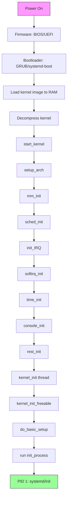
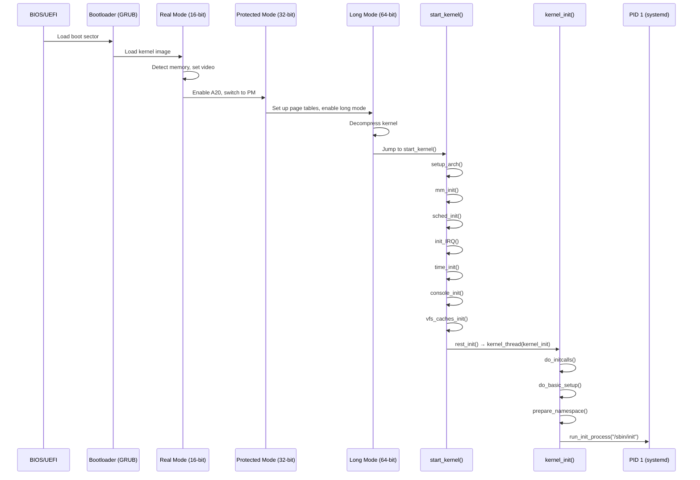
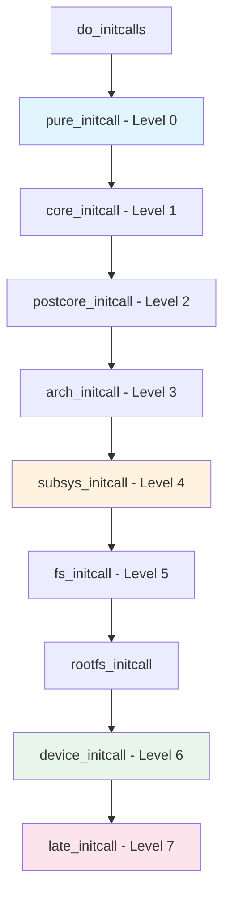

# Chapter 108: Boot Process and Kernel Initialization

## Intuition

When you press the power button on a computer, an extraordinary chain of events begins. The firmware (BIOS or UEFI) wakes up the hardware, loads a bootloader from disk, and hands control to the Linux kernel. The kernel then performs one of the most complex initialization sequences in all of software — setting up memory management, initializing every CPU core, registering interrupts, mounting the root filesystem, and ultimately launching the first user-space process.

Understanding the boot process is like understanding the first chapter of a novel: everything that follows depends on it. If you're debugging a boot failure, optimizing boot time, or porting Linux to new hardware, you need to know exactly what happens, in what order, and why.

The kernel's initialization is split into two phases: **early init** (before the scheduler is running, interrupts are disabled, only one CPU is active) and **late init** (after `rest_init()` spawns the first kernel threads and eventually the init process). The transition between these phases is one of the most critical moments in the system's lifetime.

## Architecture

### Boot Flow Overview



### Architecture-Specific Boot

The earliest boot code is architecture-specific:

**x86 Boot Path:**
```
arch/x86/boot/header.S       # Boot protocol header
arch/x86/boot/main.c         # Real-mode C code
arch/x86/boot/pm.c           # Protected-mode entry
arch/x86/boot/compressed/head_64.S  # Long-mode entry
arch/x86/kernel/head_64.S    # Kernel entry point
init/main.c                  # start_kernel() [generic]
```

**ARM64 Boot Path:**
```
arch/arm64/kernel/head.S     # Primary entry point
arch/arm64/kernel/setup.c    # Architecture setup
init/main.c                  # start_kernel() [generic]
```

## Kernel Implementation

### The x86 Boot Sequence in Detail

#### Phase 1: Real Mode (16-bit)

The BIOS loads the first 512 bytes (boot sector) of the boot device. This jumps to the kernel's real-mode setup code:

```asm
# arch/x86/boot/header.S (simplified)
    .code16
    .section ".bstext", "ax"

    # Boot protocol header (Linux boot protocol)
    .globl hdr
hdr:
    setup_sects: .byte 0            # Filled in by build
    root_flags:  .word 0
    syssize:     .long 0
    ram_size:    .word 0
    vid_mode:    .word 0
    root_dev:    .word 0
    boot_flag:   .word 0xAA55       # Boot signature

    # Jump to start
    jmp start_of_setup
```

The real-mode code:
1. Sets up the stack
2. Calls BIOS to detect memory map
3. Sets up video mode
4. Enables A20 line (for >1MB memory access)
5. Switches to protected mode

#### Phase 2: Protected Mode (32-bit)

```asm
# arch/x86/boot/pm.c (simplified)
static void go_to_protected_mode(void)
{
    realmode_switch_hook();
    if (enable_a20()) goto die;
    reset_coprocessor();
    mask_all_interrupts();
    setup_idt();
    setup_gdt();
    protected_mode_jump(boot_params.hdr.code32_start,
                        (u32)&boot_params + (ds() << 4));
}
```

#### Phase 3: Long Mode (64-bit)

```asm
# arch/x86/boot/compressed/head_64.S (simplified)
    .code32
SYM_FUNC_START(startup_32)
    # Set up basic page tables for 64-bit transition
    # Identity map first 4GB
    leal pgtable(%ebx), %edi
    xorl %eax, %eax
    movl $(BOOT_INIT_PGT_SIZE/4), %ecx
    rep stosl

    # Enable PAE and PGE
    movl $(X86_CR4_PAE | X86_CR4_PGE), %eax
    movl %eax, %cr4

    # Load page table
    leal pgtable(%ebx), %eax
    movl %eax, %cr3

    # Enable long mode (EFER.LME)
    movl $MSR_EFER, %ecx
    rdmsr
    btsl $_EFER_LME, %eax
    wrmsr

    # Enable paging (CR0.PG)
    movl $(X86_CR0_PG | X86_CR0_PE), %eax
    movl %eax, %cr0

    # Jump to 64-bit code
    ljmp $(__KERNEL_CS), $(startup_64)
SYM_FUNC_END(startup_32)
```

#### Phase 4: Kernel Decompression

The compressed kernel (`bzImage`) is decompressed:

```c
// arch/x86/boot/compressed/misc.c
asmlinkage __visible void *extract_kernel(
    void *rmode, unsigned char *output)
{
    // Choose decompressor (gzip, bzip2, LZMA, XZ, LZ4, ZSTD)
    // Decompress kernel to 'output' address
    // Return entry point
}
```

### start_kernel() — The Main Entry Point

After decompression, control passes to `start_kernel()` in `init/main.c`:

```c
// init/main.c (simplified and annotated)
asmlinkage __visible void __init start_kernel(void)
{
    char *command_line;
    char *after_dashes;

    set_task_stack_end_magic(&init_task);  // Mark stack end
    smp_setup_processor_id();               // Identify boot CPU
    debug_objects_early_init();             // Debug object tracking

    // 1. Boot vector initialization
    cgroup_init_early();

    // 2. IRQs disabled, notify subsystems
    local_irq_disable();
    early_boot_irqs_disabled = true;

    /*
     * Interrupts are still disabled. Do necessary setups,
     * then enable them.
     */

    // 3. Architecture-specific setup
    setup_arch(&command_line);

    // 4. Setup basic mm
    mm_init_cpumask(&init_mm);

    setup_command_line(command_line);
    setup_per_cpu_areas();

    // 5. Scheduler initialization
    sched_init();

    // 6. IRQ subsystem
    irq_init();
    softirq_init();

    // 7. Time subsystem
    time_init();

    // 8. Console for early output
    console_init();

    // 9. Locking infrastructure
    lockdep_init();

    // 10. More initialization
    local_irq_enable();     // NOW interrupts are on

    // Memory management fully initialized
    vfs_caches_init();

    // Rest of init
    proc_root_init();
    cpuset_init();
    cgroup_init();

    // Architecture-specific late init
    arch_post_acpi_subsys_init();
    sfi_init_late();

    // 11. Final arch setup, then spawn init
    arch_call_rest_init();

    // We should never reach here
    panic("Out of memory");
}
```

### Key Initialization Functions

#### setup_arch() — Architecture-Specific Setup

```c
// arch/x86/kernel/setup.c
void __init setup_arch(char **cmdline_p)
{
    // 1. Copy boot parameters
    memcpy(&boot_params, ...);

    // 2. Early memory detection
    e820__memory_setup();

    // 3. Parse kernel command line (early part)
    setup_command_line(boot_command_line);

    // 4. Reserve memory regions
    reserve_standard_io_resources();

    // 5. SMP setup
    prefill_possible_map();

    // 6. APIC setup
    init_apic_mappings();

    // 7. TSC calibration
    tsc_init();

    // 8. Parse ACPI tables
    acpi_boot_init();

    // 9. NUMA setup
    x86_numa_init();

    // 10. Paging initialization
    init_mem_mapping();

    // 11. EFI runtime services
    efi_init();
}
```

#### mm_init() — Memory Initialization

```c
// init/main.c (simplified)
static void __init mm_init(void)
{
    page_ext_init_flatmem();
    report_meminit();
    mem_init();          // Free bootmem allocator pages
    kmem_cache_init();   // Initialize slab allocator
    kmemleak_init();
    pgtable_init();
    vmalloc_init();      // Initialize vmalloc
}
```

#### sched_init() — Scheduler Initialization

```c
// kernel/sched/core.c (simplified)
void __init sched_init(void)
{
    int i, j;

    // Initialize runqueues for each CPU
    for_each_possible_cpu(i) {
        struct rq *rq;

        rq = cpu_rq(i);
        raw_spin_lock_init(&rq->lock);
        rq->nr_running = 0;
        rq->clock = 0;
        rq->clock_task = 0;

        // Initialize CFS run queue
        init_cfs_rq(&rq->cfs);
        // Initialize RT run queue
        init_rt_rq(&rq->rt);
        // Initialize deadline run queue
        init_dl_rq(&rq->dl);
    }

    // Set up scheduler class hierarchy
    for_each_possible_cpu(i) {
        struct rq *rq = cpu_rq(i);
        rq->sd = NULL;
        rq->rd = NULL;
    }

    // Initialize scheduler domains
    init_sched_fair_class();

    scheduler_running = 1;
}
```

### rest_init() — Transition to User Space

After `start_kernel()` completes, `rest_init()` is called:

```c
// init/main.c
noinline void __ref rest_init(void)
{
    struct task_struct *tsk;
    int pid;

    // 1. Start the kernel_init thread (becomes PID 1)
    rcu_read_lock();
    tsk = find_task_by_pid_ns(pid, &init_pid_ns);
    rcu_read_unlock();

    pid = kernel_thread(kernel_init, NULL, CLONE_FS);

    // 2. Start kthreadd (PID 2) — manages kernel threads
    pid = kernel_thread(kthreadd, NULL, CLONE_FS | CLONE_FILES);

    // 3. Become the idle task (PID 0)
    /*
     * We can't call schedule() until the scheduler is fully
     * initialized, so just spin.
     */
    cpu_startup_entry(CPUHP_ONLINE);
}
```

### kernel_init() — The Init Thread

```c
// init/main.c
static int __ref kernel_init(void *unused)
{
    // Wait for kthreadd to be ready
    wait_for_completion(&kthreadd_done);

    kernel_init_freeable();

    // Free init memory
    free_initmem();

    // Transition to user space
    if (ramdisk_execute_command)
        run_init_process(ramdisk_execute_command);

    if (execute_command)
        run_init_process(execute_command);

    // Try standard init paths
    if (!run_init_process("/sbin/init") ||
        !run_init_process("/etc/init") ||
        !run_init_process("/bin/init") ||
        !run_init_process("/bin/sh"))
        return 0;

    panic("No working init found.");
}

static noinline void __init kernel_init_freeable(void)
{
    // Wait for all CPUs to come online
    wait_for_completion(&kthreadd_done);

    // Do basic setup (drivers, filesystems, etc.)
    do_basic_setup();

    // Prepare namespace
    prepare_namespace();

    // Load default modules
    load_default_modules();
}
```

### do_basic_setup() — Driver and Subsystem Init

```c
// init/main.c
static void __init do_basic_setup(void)
{
    // 1. Initialize cpuset
    cpuset_init_smp();

    // 2. Run all initcalls
    do_initcalls();

    // 3. Initialize random number generator
    random_int_secret_init();

    // 4. Driver init
    driver_init();

    // 5. Initialize irq domains
    init_irq_proc();

    // 6. Initialize perf
    perf_event_init();

    // 7. Initialize user-space helper
    usermodehelper_init();
}
```

### Initcall Levels

The kernel uses initcalls to initialize subsystems in a defined order:

```c
// include/linux/init.h
#define pure_initcall(fn)       __define_initcall(fn, 0)
#define core_initcall(fn)       __define_initcall(fn, 1)
#define core_initcall_sync(fn)  __define_initcall(fn, 1s)
#define postcore_initcall(fn)   __define_initcall(fn, 2)
#define postcore_initcall_sync(fn) __define_initcall(fn, 2s)
#define arch_initcall(fn)       __define_initcall(fn, 3)
#define arch_initcall_sync(fn)  __define_initcall(fn, 3s)
#define subsys_initcall(fn)     __define_initcall(fn, 4)
#define subsys_initcall_sync(fn) __define_initcall(fn, 4s)
#define fs_initcall(fn)         __define_initcall(fn, 5)
#define fs_initcall_sync(fn)    __define_initcall(fn, 5s)
#define rootfs_initcall(fn)     __define_initcall(fn, rootfs)
#define device_initcall(fn)     __define_initcall(fn, 6)
#define device_initcall_sync(fn) __define_initcall(fn, 6s)
#define late_initcall(fn)       __define_initcall(fn, 7)
#define late_initcall_sync(fn)  __define_initcall(fn, 7s)

#define __initcall(fn) device_initcall(fn)
```

Initcall order:

| Level | Name | Purpose |
|-------|------|---------|
| 0 | `pure_initcall` | Purely functional, no dependencies |
| 1 | `core_initcall` | Core kernel infrastructure |
| 2 | `postcore_initcall` | After core, before arch |
| 3 | `arch_initcall` | Architecture-specific |
| 4 | `subsys_initcall` | Subsystems (bus, driver model) |
| 5 | `fs_initcall` | Filesystems |
| rootfs | `rootfs_initcall` | Root filesystem |
| 6 | `device_initcall` | Device drivers (most drivers) |
| 7 | `late_initcall` | Final initialization |

## Source Code References

| File | Description |
|------|-------------|
| `init/main.c` | `start_kernel()`, `rest_init()`, `kernel_init()` |
| `arch/x86/boot/header.S` | x86 boot protocol header |
| `arch/x86/boot/main.c` | Real-mode C code |
| `arch/x86/boot/pm.c` | Protected-mode switch |
| `arch/x86/boot/compressed/head_64.S` | 64-bit decompression entry |
| `arch/x86/kernel/head_64.S` | 64-bit kernel entry |
| `arch/x86/kernel/setup.c` | `setup_arch()` for x86 |
| `include/linux/init.h` | Initcall macros |
| `kernel/sched/core.c` | `sched_init()` |
| `mm/mem_init.c` | `mem_init()` |

## Data Structures

### Boot Parameters

```c
// arch/x86/include/asm/bootparam.h
struct boot_params {
    struct screen_info screen_info;
    struct apm_bios_info apm_bios_info;
    struct ist_info ist_info;
    __u64 acpi_rsdp_addr;
    __u8 _pad[8];
    __u8 hd0_info[16];
    __u8 hd1_info[16];
    struct sys_desc_table sys_desc_table;
    struct olpc_ofw_header olpc_ofw_header;
    __u32 ext_ramdisk_image;
    __u32 ext_ramdisk_size;
    __u32 ext_cmd_line_ptr;
    // ...
    struct setup_header hdr;
    // ...
};
```

### Early Memory Map

```c
// include/linux/e820.h
struct e820_table {
    __u32 nr_entries;
    struct e820_entry entries[E820_MAX_ENTRIES];
};

struct e820_entry {
    __u64 addr;
    __u64 size;
    __u32 type;
};
```

## Diagrams

### Complete Boot Sequence



### Initcall Execution Flow



## Performance

### Boot Time Optimization

Boot time is critical for embedded systems and user experience. Key optimization areas:

1. **Kernel compression**: Choose faster decompression (LZ4 vs. XZ)
2. **Initcall optimization**: Use `initcall_blacklist` to skip unnecessary initcalls
3. **Deferred initialization**: Use `deferred_probe` for non-critical drivers
4. **Parallel initialization**: Async probe for device drivers
5. **Kernel size**: Smaller kernel = faster decompression and less I/O

```bash
# Boot time analysis
systemd-analyze                    # Overall boot time
systemd-analyze blame              # Per-unit timing
bootchart                          # Visual boot chart

# Kernel timing
dmesg | grep "Linux version"       # Kernel start
dmesg | grep "Freeing"             # Init memory freed
dmesg | grep "initcall"            # Initcall timing (initcall_debug)
```

### Boot Time Measurement

```c
// In kernel, initcall timing is automatic with initcall_debug
// Each initcall prints its duration:
// [    0.123456] initcall serial8250_init+0x0/0x1a0 returned 0 after 1234 usecs

// Custom timing in start_kernel():
static noinline void __init start_kernel(void)
{
    u64 t0, t1;

    t0 = local_clock();
    setup_arch(&command_line);
    t1 = local_clock();
    pr_info("setup_arch took %llu ns\n", t1 - t0);
    // ...
}
```

## Security

### Secure Boot Chain

1. **UEFI Secure Boot**: Firmware verifies bootloader signature
2. **Bootloader verification**: GRUB verifies kernel image signature
3. **Kernel lockdown**: `lockdown=confidentiality` prevents kernel self-modification
4. **Module signing**: Only signed modules can load
5. **init verification**: The kernel can verify the init binary

### Kernel Command Line Security

```bash
# Security-relevant kernel parameters
lockdown=confidentiality    # Enable kernel lockdown
module.sig_enforce=1        # Enforce module signatures
init=/sbin/init             # Prevent init= override
panic=10                    # Auto-reboot on panic
slub_debug=FZPU             # Memory allocator debugging
```

## Common Pitfalls

1. **Assuming BIOS is simple**: Modern UEFI firmware is a small OS in itself, with its own drivers and services
2. **Forgetting architecture differences**: x86, ARM, RISC-V boot sequences are completely different
3. **Ignoring initcall ordering**: A driver initialized at the wrong level may fail because its dependencies aren't ready
4. **Not reserving memory**: Boot-time memory reservations that overlap with kernel memory cause crashes
5. **Assuming init is always PID 1**: In containers, PID 1 may be any program
6. **Overlooking boot parameters**: Many kernel features are controlled via command-line parameters

## Best Practices

1. **Use `initcall_debug`**: Enable during development to see which initcalls take too long
2. **Respect initcall levels**: Place your driver at the correct initcall level
3. **Use `deferred_probe`**: For drivers that depend on other drivers not yet initialized
4. **Test with `initcall_blacklist`**: Verify your system boots with specific initcalls disabled
5. **Measure boot time**: Use `bootchart` or `systemd-analyze` regularly
6. **Use `earlycon`**: Get console output before the real console is initialized
7. **Parse `dmesg` carefully**: The kernel logs tell the story of the boot process

## Exercises

1. **Boot timing**: Enable `initcall_debug` and find the five slowest initcalls on your system
2. **Command line**: Add `initcall_debug` and `loglevel=8` to your kernel command line and observe the output
3. **initcall levels**: Write a simple kernel module that registers an initcall at each level and verify execution order
4. **Boot analysis**: Use `systemd-analyze plot > boot.svg` to visualize your boot process
5. **Kernel decompression**: Compare boot times with different compression algorithms (gzip, LZ4, XZ)
6. **Early console**: Set up `earlycon` on a serial port and capture early boot messages

## References

1. `Documentation/admin-guide/kernel-parameters.rst` — Kernel command-line parameters.
2. `Documentation/x86/boot.rst` — x86 boot protocol.
3. Love, R. *Linux Kernel Development*, Chapter 1.
4. `init/main.c` — The source of truth for boot sequence.
5. `Documentation/process/changes.rst` — Minimum software requirements.
6. `Documentation/driver-api/driver-model/probe.rst` — Deferred probing.
7. https://www.kernel.org/doc/html/latest/admin-guide/ — Kernel administration guide.
