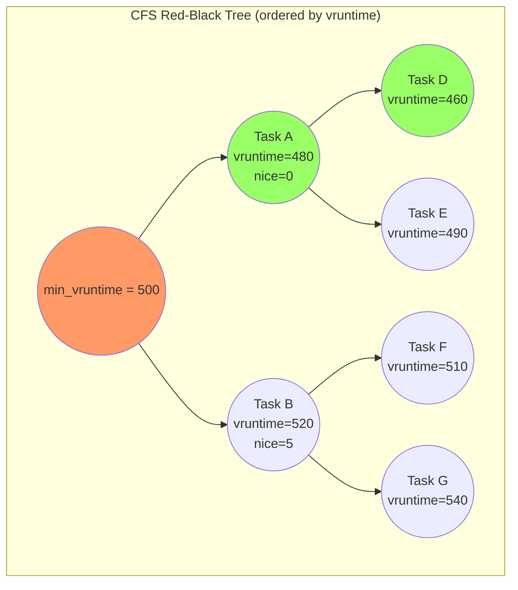
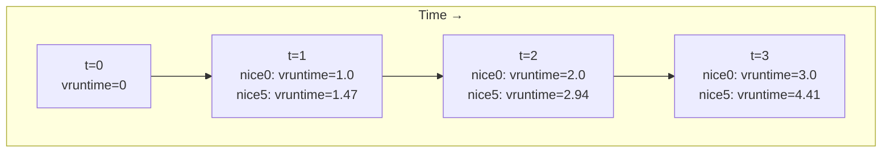
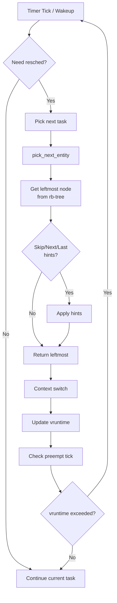

# Chapter 109: CFS — The Completely Fair Scheduler

## Intuition

Imagine you're sharing a pizza with friends. A perfectly fair approach would be to give each person a slice proportional to how hungry they are — someone twice as hungry gets twice as much pizza. The Completely Fair Scheduler (CFS) applies exactly this principle to CPU time: every runnable process should receive CPU time proportional to its weight (priority), and the scheduler's job is to track how far each process has deviated from this ideal.

The key insight of CFS is the concept of **virtual runtime** (`vruntime`). Every process maintains a running count of how much CPU time it has consumed, scaled by its priority. A high-priority process's vruntime grows slowly (because its time is "worth more"), while a low-priority process's vruntime grows quickly. The scheduler always picks the process with the lowest vruntime — the one that has been most "starved" relative to its fair share.

This elegant design eliminates the complex heuristics of older schedulers (O(1) scheduler's interactivity bonuses, priority recalculation) and replaces them with a single, mathematically sound metric. The result is a scheduler that is both fair and responsive, with predictable O(log n) scheduling decisions.

CFS has been the default scheduler for `SCHED_NORMAL` tasks since Linux 2.6.23 (2007). It was designed by Ingo Molnár and is implemented in `kernel/sched/fair.c`.

## Architecture

### Design Principles

1. **Fairness**: Every task gets CPU time proportional to its weight
2. **Proportional sharing**: Weight determines share, not absolute time
3. **Smooth scheduling**: No sudden priority changes or interactivity heuristics
4. **Scalability**: O(log n) scheduling decisions via red-black tree
5. **Low latency**: Target latency determines maximum scheduling delay

### Key Concepts

```
                  CPU Time
                     │
    ┌────────────────┼────────────────┐
    │                │                │
 Task A (weight 1024) │ Task B (weight 1024) │ Task C (weight 2048)
    │                │                │
  25% CPU          25% CPU          50% CPU
    │                │                │
 vruntime grows   vruntime grows   vruntime grows
 at rate 1.0      at rate 1.0      at rate 0.5
```

### Weight Mapping

CFS maps nice values (-20 to +19) to weights using a geometric series:

```c
// kernel/sched/core.c
const int sched_prio_to_weight[40] = {
 /* -20 */     88761,     71755,     56483,     46273,     36291,
 /* -15 */     29154,     23254,     18705,     14949,     11916,
 /* -10 */      9548,      7620,      6100,      4904,      3906,
 /*  -5 */      3121,      2501,      1991,      1586,      1277,
 /*   0 */      1024,       820,       655,       526,       423,
 /*   5 */       335,       272,       215,       172,       137,
 /*  10 */       110,        87,        70,        56,        45,
 /*  15 */        36,        29,        23,        18,        15,
};

// Inverse values (for vruntime calculation)
const u32 sched_prio_to_wmult[40] = {
 /* -20 */     48388,     59856,     76040,     92818,    118348,
 /* -15 */    147320,    184698,    229616,    287308,    360437,
 /* -10 */    449829,    563644,    704093,    875809,   1099582,
 /*  -5 */   1376151,   1717300,   2157191,   2708050,   3363326,
 /*   0 */   4194304,   5237765,   6557202,   8165337,  10153587,
 /*   5 */  12820798,  15790321,  19976592,  24970740,  31350126,
 /*  10 */  39045157,  49367440,  61356676,  76695844,  95443717,
 /*  15 */ 119304647, 148102320, 186737708, 238609294, 286331153,
};
```

The relationship is:
```
weight = 1024 × (1.25)^(-nice)
vruntime_delta = real_time_delta × weight_of_default / weight_of_task
```

## Kernel Implementation

### Core Data Structures

#### sched_entity — Per-Task Scheduling Entity

```c
// include/linux/sched.h
struct sched_entity {
    struct load_weight      load;           // Task weight
    struct rb_node          run_node;       // Red-black tree node
    struct list_head        group_node;     // Group scheduling
    unsigned int            on_rq;          // Is it on a run queue?

    u64                     exec_start;     // When last started running
    u64                     sum_exec_runtime; // Total execution time
    u64                     vruntime;       // Virtual runtime
    u64                     prev_sum_exec_runtime; // Previous sum_exec_runtime

    u64                     nr_migrations;  // Number of CPU migrations

    // Statistics
    struct sched_statistics statistics;

    // For group scheduling
    int                     depth;
    struct sched_entity     *parent;
    struct cfs_rq           *cfs_rq;        // Run queue this entity is on
    struct cfs_rq           *my_q;          // Run queue this entity owns (group)
};
```

#### cfs_rq — CFS Run Queue

```c
// kernel/sched/sched.h
struct cfs_rq {
    struct load_weight      load;           // Total load on this rq
    unsigned int            nr_running;     // Number of runnable tasks

    u64                     exec_clock;     // Total execution clock
    u64                     min_vruntime;   // Minimum vruntime (leftmost)

    struct rb_root_cached   tasks_timeline; // Red-black tree of tasks
    struct sched_entity     *curr;          // Currently running entity
    struct sched_entity     *next;          // Next to run
    struct sched_entity     *last;          // Last to run
    struct sched_entity     *skip;          // Skip this entity

    // For group scheduling
    struct rq               *rq;            // Back-pointer to rq

    // Load tracking
    struct sched_avg        avg;
    u64                     runnable_load_avg;
    u64                     blocked_load_avg;
    // ...
};
```

### The Red-Black Tree

CFS uses a red-black tree to organize runnable tasks by `vruntime`:

```c
// kernel/sched/fair.c
static void enqueue_entity(struct cfs_rq *cfs_rq,
                           struct sched_entity *se, int flags)
{
    // Update vruntime
    update_curr(cfs_rq);

    if (!(flags & ENQUEUE_WAKEUP) || (flags & ENQUEUE_WAKING))
        se->vruntime += cfs_rq->min_vruntime;

    // Update load average
    update_load_avg(cfs_rq, se, UPDATE_TG);

    // Insert into red-black tree
    if (se->on_rq) {
        // Already on rq, just update position
        __enqueue_entity(cfs_rq, se);
    } else {
        // New entity, add to tree
        account_entity_enqueue(cfs_rq, se);
        __enqueue_entity(cfs_rq, se);
    }

    se->on_rq = 1;
    cfs_rq->nr_running++;
}

static void __enqueue_entity(struct cfs_rq *cfs_rq,
                             struct sched_entity *se)
{
    struct rb_node **link = &cfs_rq->tasks_timeline.rb_root.rb_node;
    struct rb_node *parent = NULL;
    struct sched_entity *entry;
    bool leftmost = true;

    // Find insertion point
    while (*link) {
        parent = *link;
        entry = rb_entry(parent, struct sched_entity, run_node);

        if (entity_before(se, entry)) {
            link = &parent->rb_left;
        } else {
            link = &parent->rb_right;
            leftmost = false;
        }
    }

    // Insert and rebalance
    rb_link_node(&se->run_node, parent, link);
    rb_insert_color_cached(&se->run_node,
                           &cfs_rq->tasks_timeline, leftmost);
}
```

### Pick Next Task

```c
// kernel/sched/fair.c
static struct sched_entity *pick_next_entity(struct cfs_rq *cfs_rq,
                                             struct sched_entity *curr)
{
    struct sched_entity *left = __pick_first_entity(cfs_rq);
    struct sched_entity *se;

    // If there's no left entity, nothing to run
    if (!left)
        return NULL;

    // If current entity is still leftmost, it continues
    if (!curr || entity_before(left, curr))
        se = left;
    else
        se = curr;

    // Handle skip, next, last hints
    se = pick_next_entity(cfs_rq, se);

    return se;
}

// Pick the leftmost entity (lowest vruntime)
struct sched_entity *__pick_first_entity(struct cfs_rq *cfs_rq)
{
    struct rb_node *left = rb_first_cached(&cfs_rq->tasks_timeline);

    if (!left)
        return NULL;

    return rb_entry(left, struct sched_entity, run_node);
}
```

### update_curr() — The Heart of CFS

```c
// kernel/sched/fair.c
static void update_curr(struct cfs_rq *cfs_rq)
{
    struct sched_entity *curr = cfs_rq->curr;
    u64 now = rq_clock_task(rq_of(cfs_rq));
    u64 delta_exec;

    if (unlikely(!curr))
        return;

    // Calculate real execution time since last update
    delta_exec = now - curr->exec_start;
    if (unlikely((s64)delta_exec <= 0))
        return;

    curr->exec_start = now;
    curr->sum_exec_runtime += delta_exec;

    // Calculate vruntime delta
    // vruntime += delta_exec × (NICE_0_LOAD / weight)
    curr->vruntime += calc_delta_fair(delta_exec, curr);

    // Update min_vruntime
    update_min_vruntime(cfs_rq);

    // Update load tracking
    update_curr_cfs_rq(cfs_rq);
}

// Convert real time to virtual time
static u64 calc_delta_fair(u64 delta, struct sched_entity *se)
{
    if (unlikely(se->load.weight != NICE_0_LOAD))
        delta = __calc_delta(delta, NICE_0_LOAD, &se->load);

    return delta;
}

// Core vruntime calculation
static u64 __calc_delta(u64 delta_exec, u64 weight,
                        struct load_weight *lw)
{
    u64 fact = scale_load_down(weight);
    int shift = WMULT_SHIFT;

    // delta_exec × weight / lw->weight
    // Using fixed-point arithmetic to avoid overflow
    __update_inv_weight(lw);

    if (unlikely(fact >> 32)) {
        while (fact >> 32) {
            fact >>= 1;
            shift--;
        }
    }

    fact = mul_u32_u32(fact, lw->inv_weight);

    while (fact >> 32) {
        fact >>= 1;
        shift--;
    }

    return mul_u64_u32_shr(delta_exec, fact, shift);
}
```

### Scheduling Latency Target

CFS uses a target latency to determine time slices:

```c
// kernel/sched/fair.c

/*
 * Targeted preemption latency for CPU-bound tasks:
 * (default: 6ms * (1 + ilog(ncpus)), units: nanoseconds)
 */
unsigned int sysctl_sched_latency = 6000000ULL;
static unsigned int normalized_sysctl_sched_latency = 6000000ULL;

/*
 * Minimal preemption granularity:
 * (default: 0.75ms * (1 + ilog(ncpus)), units: nanoseconds)
 */
unsigned int sysctl_sched_min_granularity = 750000ULL;
static unsigned int normalized_sysctl_sched_min_granularity = 750000ULL;

/*
 * Wakeup preemption granularity:
 * (default: 1ms, units: nanoseconds)
 */
unsigned int sysctl_sched_wakeup_granularity = 1000000ULL;
static unsigned int normalized_sysctl_sched_wakeup_granularity = 1000000ULL;

// Time slice calculation
static u64 sched_slice(struct cfs_rq *cfs_rq, struct sched_entity *se)
{
    u64 slice;
    u64 period = __sched_period(cfs_rq->nr_running + !se->on_rq);

    // slice = period × se_weight / total_weight
    slice = __calc_delta(period, se->load.weight, &cfs_rq->load);

    // Enforce minimum granularity
    if (slice < sysctl_sched_min_granularity)
        slice = sysctl_sched_min_granularity;

    return slice;
}

static u64 __sched_period(unsigned long nr_running)
{
    if (unlikely(nr_running > sched_nr_latency))
        return nr_running * sysctl_sched_min_granularity;
    else
        return sysctl_sched_latency;
}
```

### Scheduler Tick

```c
// kernel/sched/fair.c
static void task_tick_fair(struct rq *rq, struct task_struct *curr,
                           int queued)
{
    struct cfs_rq *cfs_rq;
    struct sched_entity *se = &curr->se;

    for_each_sched_entity(se) {
        cfs_rq = cfs_rq_of(se);
        entity_tick(cfs_rq, se, queued);
    }
}

static void entity_tick(struct cfs_rq *cfs_rq,
                        struct sched_entity *curr, int queued)
{
    // Update current entity's runtime
    update_curr(cfs_rq);

    // Check if we need to reschedule
    if (cfs_rq->nr_running > 1)
        check_preempt_tick(cfs_rq, curr);
}

static void check_preempt_tick(struct cfs_rq *cfs_rq,
                                struct sched_entity *curr)
{
    u64 ideal_runtime, delta_exec;
    struct sched_entity *se;
    s64 delta;

    // Calculate ideal runtime for this entity
    ideal_runtime = sched_slice(cfs_rq, curr);

    // Actual runtime consumed
    delta_exec = curr->sum_exec_runtime - curr->prev_sum_exec_runtime;

    // If consumed more than ideal, reschedule
    if (delta_exec > ideal_runtime) {
        resched_curr(rq_of(cfs_rq));
        return;
    }

    // Check minimum granularity
    if (delta_exec < sysctl_sched_min_granularity)
        return;

    // Check if leftmost entity has lower vruntime
    se = __pick_first_entity(cfs_rq);
    delta = curr->vruntime - se->vruntime;

    if (delta > ideal_runtime)
        resched_curr(rq_of(cfs_rq));
}
```

### Wake-up Preemption

```c
// kernel/sched/fair.c
static void check_preempt_wakeup(struct rq *rq, struct task_struct *p,
                                  int wake_flags)
{
    struct task_struct *curr = rq->curr;
    struct sched_entity *se = &curr->se, *pse = &p->se;
    struct cfs_rq *cfs_rq = task_cfs_rq(curr);
    int scale = cfs_rq->nr_running >= sched_nr_latency;
    int next_buddy_marked = 0;

    // Don't preempt if same task
    if (unlikely(se == pse))
        return;

    // Update current task's vruntime
    update_curr(cfs_rq);

    // Check if wakeup entity's vruntime is sufficiently lower
    // than current entity's vruntime
    if (wakeup_preempt_entity(se, pse) == 1) {
        // Preempt current task
        goto preempt;
    }

    return;

preempt:
    resched_curr(rq);
}

static int wakeup_preempt_entity(struct sched_entity *curr,
                                  struct sched_entity *se)
{
    s64 gran, vdiff = curr->vruntime - se->vruntime;

    if (vdiff <= 0)
        return -1;

    // Apply wakeup granularity
    gran = sysctl_sched_wakeup_granularity;
    gran = calc_delta_fair(gran, se);

    if (vdiff > gran)
        return 1;

    return 0;
}
```

## Source Code References

| File | Description |
|------|-------------|
| `kernel/sched/fair.c` | CFS implementation (~7000 lines) |
| `kernel/sched/core.c` | Scheduler core |
| `kernel/sched/sched.h` | Internal scheduler structures |
| `include/linux/sched.h` | Task structures |
| `kernel/sched/features.h` | Sched features (debug knobs) |
| `kernel/sched/stats.c` | Scheduler statistics |
| `kernel/sched/debug.c` | Debugfs interface |

## Data Structures

### Runtime Tracking

```c
// Per-entity scheduling statistics
struct sched_statistics {
    u64     wait_start;         // When task started waiting
    u64     wait_max;           // Maximum wait time
    u64     wait_count;         // Number of waits
    u64     wait_sum;           // Total wait time

    u64     iowait_count;       // I/O wait count
    u64     iowait_sum;         // I/O wait time

    u64     sleep_start;        // When task went to sleep
    u64     sleep_max;          // Maximum sleep time
    u64     sum_sleep_runtime;  // Total sleep time

    u64     block_start;        // When task was blocked
    u64     block_max;          // Maximum block time
    u64     sum_block_runtime;  // Total block time

    u64     exec_max;           // Maximum execution burst
    u64     slice_max;          // Maximum time slice

    u64     nr_wakeups;         // Total wakeups
    u64     nr_wakeups_sync;    // Synchronous wakeups
    u64     nr_wakeups_migrate; // Cross-CPU wakeups
    u64     nr_wakeups_local;   // Same-CPU wakeups
    u64     nr_wakeups_remote;  // Remote CPU wakeups
    // ...
};
```

### Group Scheduling (cgroups)

```c
// kernel/sched/sched.h
struct task_group {
    struct cgroup_subsys_state css;

    // Per-CPU run queues for group scheduling
    struct sched_entity **se;       // Array of per-CPU scheduling entities
    struct cfs_rq **cfs_rq;        // Array of per-CPU CFS run queues

    // For bandwidth control
    u64             cfs_bandwidth;
    struct cfs_bandwidth cfs_bandwidth_data;

    // For autogroup
    struct task_group *parent;
    struct list_head list;
    // ...
};
```

## Diagrams

### Red-Black Tree Organization



### Vruntime Evolution



### Scheduling Decision Flow



## Performance

### Time Complexity

| Operation | Complexity | Notes |
|-----------|-----------|-------|
| Enqueue task | O(log n) | Red-black tree insertion |
| Dequeue task | O(log n) | Red-black tree deletion |
| Pick next | O(1) | Leftmost cached node |
| Update vruntime | O(1) | Arithmetic update |
| Check preemption | O(1) | Compare leftmost with current |

### Scalability

CFS scales well with increasing numbers of tasks:

- **1-100 tasks**: Excellent performance, tree depth ~7
- **100-1000 tasks**: Still fast, tree depth ~10
- **1000+ tasks**: Cache effects become significant; `sched_min_granularity` helps

### Tuning Parameters

```bash
# View current parameters
cat /proc/sys/kernel/sched_latency_ns          # 6ms default
cat /proc/sys/kernel/sched_min_granularity_ns  # 0.75ms default
cat /proc/sys/kernel/sched_wakeup_granularity_ns # 1ms default
cat /proc/sys/kernel/sched_nr_migrate          # 32 default

# Adjust for lower latency (at cost of throughput)
echo 3000000 > /proc/sys/kernel/sched_latency_ns
echo 500000 > /proc/sys/kernel/sched_min_granularity_ns
```

## Security

### Scheduler Side Channels

CFS can be exploited for side-channel attacks:

1. **Spectre v1/v2**: Speculative execution across scheduling boundaries
2. **Last-Level Cache (LLC) attacks**: Scheduling an attacker on the same LLC as the victim
3. **Core scheduling**: Groups tasks by security domain to prevent cross-domain speculation

### Core Scheduling

```bash
# Enable core scheduling (requires CONFIG_SCHED_CORE)
echo 1 > /sys/kernel/debug/sched/core_tag_enabled
```

## Common Pitfalls

1. **Confusing nice with priority**: Nice values are relative weights, not absolute priorities. A nice +19 task still gets CPU time.
2. **Ignoring vruntime**: Understanding vruntime is essential to understanding CFS behavior.
3. **Over-tuning latency**: Setting `sched_latency` too low causes excessive context switches.
4. **Forgetting group scheduling**: cgroups can override per-task nice values.
5. **Assuming fairness means equal time**: Fair means proportional to weight. A nice -20 task gets ~8x more CPU than nice +19.

## Best Practices

1. **Use nice values, not real-time priorities**: For most workloads, CFS with appropriate nice values is sufficient.
2. **Use cgroups for workload isolation**: Rather than per-task nice, use cgroup bandwidth control.
3. **Monitor with `/proc/schedstat`**: Detailed scheduler statistics.
4. **Use `perf sched`**: Analyze scheduling latency and patterns.
5. **Test with realistic workloads**: Synthetic benchmarks can mislead about real-world scheduler behavior.

## Exercises

1. **vruntime tracking**: Write a program that prints its own vruntime from `/proc/self/schedstat` periodically.
2. **Nice experiment**: Run two CPU-bound processes with different nice values and measure their CPU usage ratio.
3. **Latency measurement**: Use `perf sched latency` to measure scheduling latency on your system.
4. **Cgroup isolation**: Create a cgroup with limited CPU bandwidth and run a process in it.
5. **Source reading**: Read `update_curr()` in `kernel/sched/fare.c` and trace how vruntime is calculated.
6. **Tuning**: Adjust `sched_latency_ns` and measure the impact on a workload with many short-lived processes.

## References

1. Molnár, I. "Modular Scheduler Core and Completely Fair Scheduler," LKML, 2007.
2. `Documentation/scheduler/sched-design-CFS.rst` — Official CFS documentation.
3. `kernel/sched/fair.c` — The CFS implementation.
4. Love, R. *Linux Kernel Development*, Chapter 4.
5. Bovet, D. P., and Cesati, M. *Understanding the Linux Kernel*, Chapter 7.
6. `Documentation/admin-guide/sysctl/kernel.rst` — Scheduler tunables.
7. `Documentation/scheduler/` — Scheduler documentation directory.
