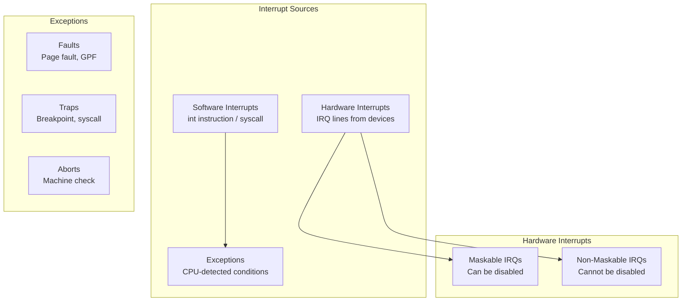
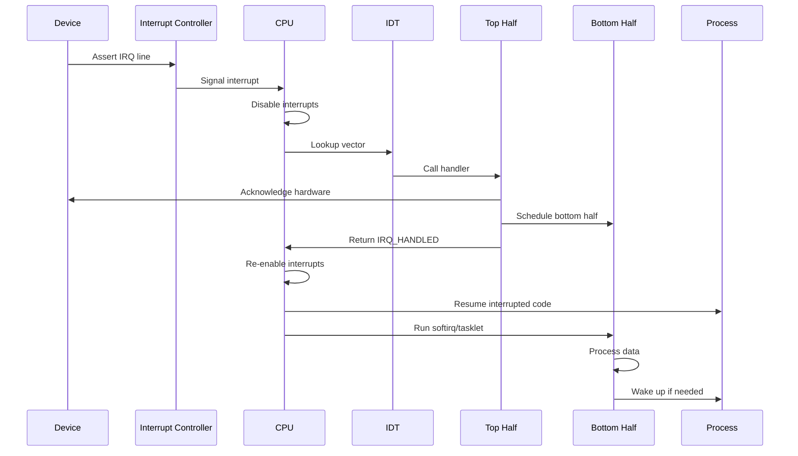
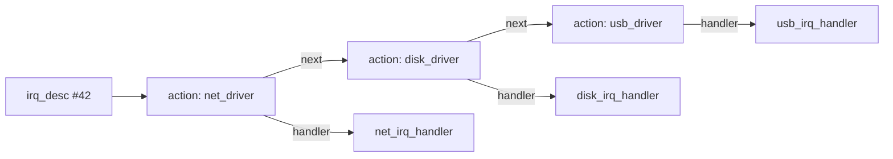

# Chapter 110: Interrupts

## Intuition

Imagine you're reading a book when someone taps you on the shoulder. You pause, handle whatever they need, then resume reading exactly where you left off. That's essentially what an interrupt does to a CPU — it signals "something important happened, stop what you're doing and deal with it."

Interrupts are the fundamental mechanism by which hardware communicates with the CPU. Every keystroke, network packet, disk completion, and timer tick arrives as an interrupt. Without them, the CPU would have to constantly poll ("is there data yet? is there data yet?"), wasting enormous amounts of power and time.

The challenge for an operating system is handling interrupts efficiently. An interrupt handler must execute quickly (because interrupts are often disabled while it runs), yet the work required may be substantial. Linux solves this with the **top half / bottom half** architecture: the top half (hardirq) does the bare minimum — acknowledges the hardware, copies data to a buffer, schedules the bottom half — while the bottom half (softirq, tasklet, or workqueue) does the heavy lifting at a convenient time.

Understanding interrupts is essential for anyone writing device drivers, debugging latency issues, or understanding why a system occasionally "stutters."

## Architecture

### Interrupt Types



### Interrupt Delivery Path

```
Hardware Device
      │
      ▼
Interrupt Controller (APIC/GIC)
      │
      ▼
CPU Core (IRQ line asserted)
      │
      ▼
IDT (Interrupt Descriptor Table)
      │
      ▼
IRQ Handler (top half / hardirq)
      │
      ▼
Bottom Half (softirq / tasklet / workqueue)
```

## Kernel Implementation

### Interrupt Descriptor Table (IDT)

The IDT is a table of 256 entries that maps interrupt vectors to handler functions:

```c
// arch/x86/kernel/idt.c
/*
 * The IDT table is set up in head_64.S and then extended in
 * idt.c with the various IST and non-IST entries.
 */

// Gate descriptors (x86-64)
struct gate_struct {
    u16 offset_low;     // Offset bits 0..15
    u16 segment;        // Segment selector
    unsigned ist : 3;   // IST (for IST entries)
    unsigned zero : 5;
    unsigned type : 5;  // Gate type
    unsigned dpl : 2;   // Descriptor privilege level
    unsigned p : 1;     // Present
    u16 offset_middle;  // Offset bits 16..31
    u32 offset_high;    // Offset bits 32..63
    u32 reserved;
};

// IDT initialization
void __init idt_setup_from_table(gate_desc *idt,
                                  const struct idt_data *t,
                                  int size, bool sys)
{
    gate_desc desc;

    for (; size > 0; t++, size--) {
        idt_init_desc(&desc, t);
        write_idt_entry(idt, t->vector, &desc);
    }
}
```

### IRQ Descriptor

Each IRQ has a descriptor that tracks its state and handlers:

```c
// include/linux/irq.h
struct irq_desc {
    struct irq_common_data  irq_common_data;
    struct irq_data         irq_data;
    unsigned int __percpu   *kstat_irqs;    // Per-CPU stats
    irq_flow_handler_t      handle_irq;     // Flow handler
    struct irqaction        *action;        // Handler chain
    unsigned int            status_use_accessors;
    unsigned int            depth;          // Disable depth
    unsigned int            irq_count;      // Interrupt count
    const char              *name;
    raw_spinlock_t          lock;
    struct cpumask          *percpu_enabled;
    // ...
};

// IRQ action — registered handler
struct irqaction {
    irq_handler_t       handler;        // Handler function
    void                *dev_id;        // Device ID (for shared IRQs)
    void __percpu       *percpu_dev_id;
    struct irqaction    *next;          // Next in chain (shared IRQs)
    irq_handler_t       thread_fn;      // Threaded IRQ handler
    struct task_struct  *thread;        // Handler thread
    unsigned int        irq;            // IRQ number
    unsigned int        flags;          // IRQF_* flags
    unsigned long       name;
    void                *cookie;        // Cookie for shared IRQs
    struct irqaction    *secondary;     // Secondary action
};
```

### Registering an Interrupt Handler

```c
// include/linux/interrupt.h
// Register an interrupt handler
static inline int __must_check
request_irq(unsigned int irq, irq_handler_t handler,
            unsigned long flags, const char *name, void *dev)
{
    return request_threaded_irq(irq, handler, NULL, flags, name, dev);
}

// More flexible version with threaded handler
int request_threaded_irq(unsigned int irq,
                         irq_handler_t handler,
                         irq_handler_t thread_fn,
                         unsigned long irqflags,
                         const char *devname,
                         void *dev_id);

// Example: register a handler for IRQ 42
static irqreturn_t my_irq_handler(int irq, void *dev_id)
{
    struct my_device *dev = dev_id;

    // Read status register (acknowledge interrupt)
    u32 status = readl(dev->regs + STATUS_REG);

    if (!(status & IRQ_PENDING))
        return IRQ_NONE;    // Not our interrupt (shared IRQ)

    // Acknowledge
    writel(status, dev->regs + STATUS_REG);

    // Schedule bottom half
    tasklet_schedule(&dev->tasklet);

    return IRQ_HANDLED;     // We handled it
}

// Registration
ret = request_irq(dev->irq, my_irq_handler,
                  IRQF_SHARED, "my_device", dev);
```

### Interrupt Entry Points (x86-64)

```asm
# arch/x86/entry/entry_64.S (simplified)
SYM_CODE_START(asm_common_interrupt)
    /* Save registers */
    PUSH_REGS

    /* Switch to kernel GS base */
    SWITCH_TO_KERNEL_CR3 scratch_reg=%rax

    /* Load kernel stack if needed */
    movq %rsp, %rdi          /* pt_regs pointer */

    /* Call C handler */
    call do_IRQ

    /* Restore registers */
    POP_REGS

    /* Return from interrupt */
    jmp irq_return
SYM_CODE_END(asm_common_interrupt)
```

### do_IRQ() — The C Handler

```c
// arch/x86/kernel/irq.c
__visible void __irq_entry do_IRQ(struct pt_regs *regs)
{
    struct pt_regs *old_regs = set_irq_regs(regs);

    // Enter interrupt context
    irq_enter();

    // Handle the interrupt
    handle_irq(regs);

    // Exit interrupt context
    irq_exit();

    set_irq_regs(old_regs);
}

// kernel/irq/handle.c
irqreturn_t handle_irq_event_percpu(struct irq_desc *desc,
                                     struct irqaction *action)
{
    irqreturn_t retval = IRQ_NONE;
    unsigned int flags = 0;

    // Call each handler in the chain
    do {
        irqreturn_t res;

        // Call the handler
        trace_irq_handler_entry(desc->irq_data.irq, action);
        res = action->handler(desc->irq_data.irq, action->dev_id);
        trace_irq_handler_exit(desc->irq_data.irq, action, res);

        if (WARN_ONCE(!irqs_disabled(), "irq %u handler %pS enabled interrupts\n",
                      desc->irq_data.irq, action->handler))
            local_irq_disable();

        retval |= res;
        action = action->next;
    } while (action);

    // Handle IRQ_WAKE_THREAD
    if (flags & IRQF_ONESHOT)
        irq_finalize_oneshot(desc, irq);

    return retval;
}
```

### Top Half / Bottom Half Architecture

```c
// Top half: runs with interrupts disabled (or IRQ line masked)
// Must be fast — typically just acknowledges hardware and schedules bottom half
static irqreturn_t my_top_half(int irq, void *dev_id)
{
    struct my_device *dev = dev_id;

    // 1. Acknowledge hardware interrupt
    u32 status = readl(dev->regs + INT_STATUS);
    writel(status, dev->regs + INT_CLEAR);

    // 2. Read data from device
    dev->pending_data = readl(dev->regs + DATA_REG);

    // 3. Schedule bottom half
    tasklet_schedule(&dev->my_tasklet);

    return IRQ_HANDLED;
}

// Bottom half: runs with interrupts enabled
// Can take time, sleep, etc.
static void my_bottom_half(unsigned long data)
{
    struct my_device *dev = (struct my_device *)data;

    // Process data (can be slow)
    process_data(dev->pending_data);

    // Wake up waiting processes
    wake_up_interruptible(&dev->wait_queue);
}
```

### /proc/interrupts

The `/proc/interrupts` file shows per-CPU interrupt counts:

```
           CPU0       CPU1       CPU2       CPU3
  0:         17          0          0          0   IO-APIC   2-edge      timer
  1:          0          0          0        237   IO-APIC   1-edge      i8042
  8:          0          0          0          1   IO-APIC   8-edge      rtc0
  9:          0          0          0          0   IO-APIC   9-fasteoi   acpi
 16:          0          0          0          0   IO-APIC  16-fasteoi   ehci_hcd:usb1
 23:          0          0          0          0   IO-APIC  23-fasteoi   ehci_hcd:usb2
 42:      15832          0          0          0   PCI-MSI  524289-edge  nvme0q1
 43:          0      12045          0          0   PCI-MSI  524290-edge  nvme0q2
 44:          0          0       8923          0   PCI-MSI  524291-edge  nvme0q3
 45:          0          0          0       7654   PCI-MSI  524292-edge  nvme0q4
NMI:         12         15         11         13   Non-maskable interrupts
LOC:     284532     281234     279876     282345   Local timer interrupts
SPU:          0          0          0          0   Spurious interrupts
PMI:         12         15         11         13   Performance monitoring interrupts
IWI:          0          0          0          0   IRQ work interrupts
RTR:          0          0          0          0   APIC ICR read retries
RES:       2345       2567       2123       2456   Rescheduling interrupts
CAL:       1234       1345       1456       1567   Function call interrupts
TLB:       5678       5432       5890       5123   TLB shootdowns
TRM:          0          0          0          0   Thermal event interrupts
THR:          0          0          0          0   Threshold APIC interrupts
DFR:          0          0          0          0   Deferred Error APIC interrupts
MCE:          0          0          0          0   Machine check exceptions
MCP:         12         15         11         13   Machine check polls
ERR:          0
MIS:          0
PIN:          0          0          0          0   Posted-interrupt notification event
NPI:          0          0          0          0   Nested posted-interrupt event
PIW:          0          0          0          0   Posted-interrupt wakeup event
```

### Interrupt Context vs. Process Context

```c
// Check if in interrupt context
static inline bool in_interrupt(void)
{
    // Check both hardirq and softirq contexts
    return (preempt_count() & (HARDIRQ_MASK | SOFTIRQ_MASK |
            NMI_MASK)) != 0;
}

static inline bool in_irq(void)
{
    // Only hardirq context
    return (preempt_count() & HARDIRQ_MASK) != 0;
}

static inline bool in_softirq(void)
{
    // Only softirq context
    return (preempt_count() & SOFTIRQ_MASK) != 0;
}
```

### IRQ Affinity

```bash
# Set IRQ affinity
echo 1 > /proc/irq/42/smp_affinity      # CPU 0 only
echo 2 > /proc/irq/42/smp_affinity      # CPU 1 only
echo f > /proc/irq/42/smp_affinity      # All CPUs

# View current affinity
cat /proc/irq/42/smp_affinity_list
```

## Source Code References

| File | Description |
|------|-------------|
| `kernel/irq/handle.c` | IRQ handling core |
| `kernel/irq/manage.c` | IRQ management (request/free) |
| `kernel/irq/chip.c` | IRQ chip abstraction |
| `kernel/irq/devres.c` | Device resource IRQ management |
| `arch/x86/kernel/irq.c` | x86 IRQ handling |
| `arch/x86/kernel/idt.c` | IDT initialization |
| `arch/x86/entry/entry_64.S` | x86-64 interrupt entry points |
| `include/linux/interrupt.h` | IRQ API |
| `include/linux/irq.h` | IRQ descriptor structures |

## Data Structures

### IRQ Chip Operations

```c
// include/linux/irq.h
struct irq_chip {
    struct device   *parent_device;
    const char      *name;
    IRQCHIP_IRQ_STARTUP         (*irq_startup)(struct irq_data *data);
    void                        (*irq_shutdown)(struct irq_data *data);
    void                        (*irq_enable)(struct irq_data *data);
    void                        (*irq_disable)(struct irq_data *data);

    void                        (*irq_ack)(struct irq_data *data);
    void                        (*irq_mask)(struct irq_data *data);
    void                        (*irq_mask_ack)(struct irq_data *data);
    void                        (*irq_unmask)(struct irq_data *data);
    void                        (*irq_eoi)(struct irq_data *data);

    int                         (*irq_set_affinity)(struct irq_data *data,
                                                     const struct cpumask *dest,
                                                     bool force);
    int                         (*irq_set_type)(struct irq_data *data,
                                                 unsigned int flow_type);
    int                         (*irq_set_wake)(struct irq_data *data,
                                                unsigned int on);
    // ...
};
```

## Diagrams

### Interrupt Handling Flow



### IRQ Descriptor Chain (Shared IRQ)



## Performance

### Interrupt Latency

Interrupt latency is the time from hardware signal to handler execution:

| Component | Typical Latency |
|-----------|----------------|
| Hardware delivery (APIC) | 100-500 ns |
| CPU interrupt response | 1-10 cycles |
| IDT lookup | 10-50 ns |
| Register save | 50-200 ns |
| Handler entry | 100-500 ns |
| **Total** | **0.5-5 μs** |

### Measuring Interrupt Latency

```bash
# Using cyclictest (from rt-tests)
cyclictest -t1 -p80 -i1000 -l10000 -m

# Using ftrace
echo 1 > /sys/kernel/debug/tracing/events/irq/irq_handler_entry/enable
echo 1 > /sys/kernel/debug/tracing/events/irq/irq_handler_exit/enable
cat /sys/kernel/debug/tracing/trace_pipe
```

### Interrupt Load Balancing

```bash
# Enable IRQ balancing
systemctl start irqbalance

# Manual balancing
cat /proc/interrupts | sort -k2 -nr | head -20
```

## Security

### Interrupt-Based Attacks

1. **Interrupt storms**: Flooding the CPU with interrupts causes denial of service
2. **SMI (System Management Interrupts)**: Firmware-generated interrupts that are invisible to the OS
3. **APIC vulnerabilities**: Local APIC can be exploited for privilege escalation
4. **Interrupt remapping attacks**: DMA-based interrupt injection on VT-d systems

### Mitigation

```bash
# Disable problematic interrupts
echo "disable" > /sys/firmware/acpi/interrupts/gpeXX

# Monitor SMI latency
echo 1 > /sys/kernel/debug/tracing/events/smi/enable
```

## Common Pitfalls

1. **Sleeping in interrupt context**: You cannot call `schedule()`, `kmalloc(GFP_KERNEL)`, or any blocking function in a hardirq handler
2. **Forgetting to acknowledge hardware**: If the interrupt isn't acknowledged, it will fire repeatedly
3. **Long top halves**: Keep top halves minimal; defer work to bottom halves
4. **Shared IRQ conflicts**: Shared IRQs must check if the interrupt is theirs
5. **Not disabling local IRQs when accessing shared data**: Use `local_irq_save()`/`local_irq_restore()`

## Best Practices

1. **Use threaded IRQs**: `request_threaded_irq()` runs the handler in a kernel thread, allowing sleeping
2. **Use devm_request_irq()**: Automatic cleanup when the device is removed
3. **Keep top halves short**: <100μs is a good guideline
4. **Use IRQF_SHARED for shared lines**: Let multiple devices share an IRQ
5. **Set appropriate affinity**: Pin high-throughput device IRQs to specific CPUs
6. **Monitor with /proc/interrupts**: Watch for interrupt storms or imbalances

## Exercises

1. **IRQ registration**: Write a kernel module that registers an interrupt handler (use a virtual device or timer)
2. **Interrupt counting**: Read `/proc/interrupts` before and after generating I/O; count the difference
3. **Affinity tuning**: Pin a network card's IRQ to a specific CPU and measure throughput
4. **Latency measurement**: Use `cyclictest` to measure interrupt latency on your system
5. **ftrace**: Trace interrupt handlers using ftrace and analyze the output
6. **Top half / bottom half**: Write a driver with a top half that schedules a tasklet bottom half

## References

1. `Documentation/core-api/irq/irq-domain.rst` — IRQ domain documentation.
2. `Documentation/driver-api/genericirq.rst` — Generic IRQ handling.
3. Love, R. *Linux Kernel Development*, Chapter 7.
4. Bovet, D. P., and Cesati, M. *Understanding the Linux Kernel*, Chapter 4.
5. `include/linux/interrupt.h` — IRQ API documentation.
6. `Documentation/trace/ftrace.rst` — IRQ tracing.
7. https://www.kernel.org/doc/html/latest/core-api/irq/ — IRQ subsystem docs.
