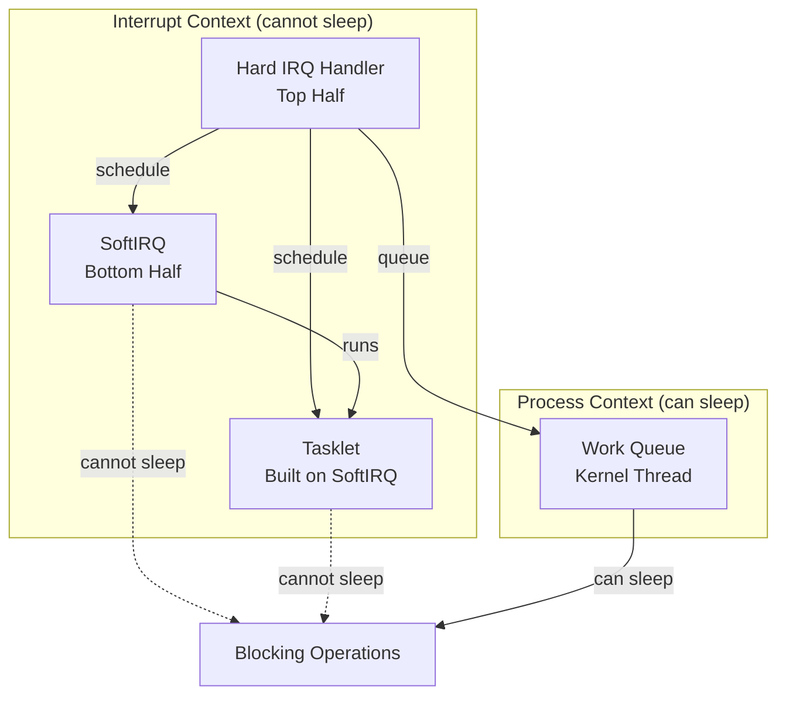
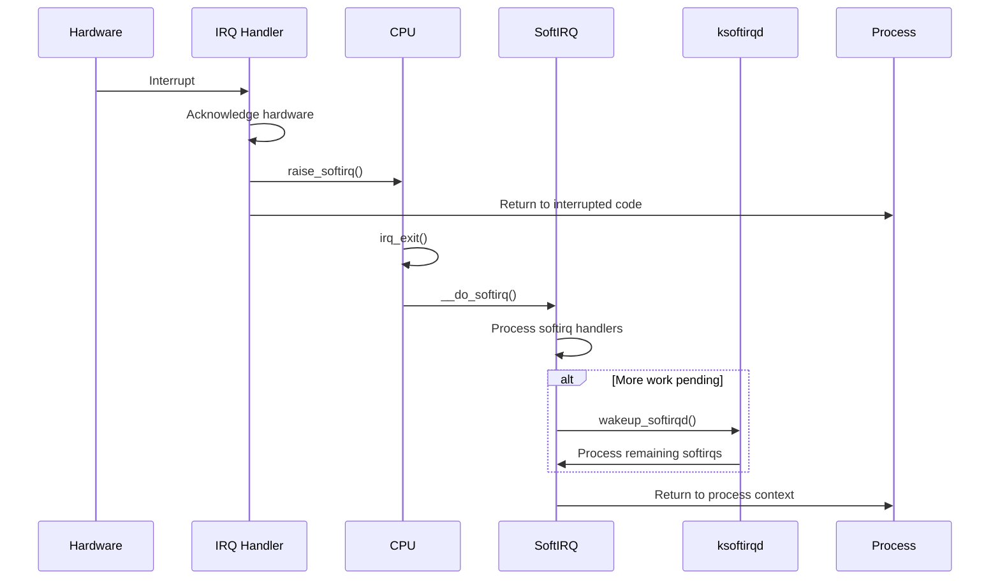
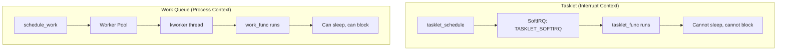
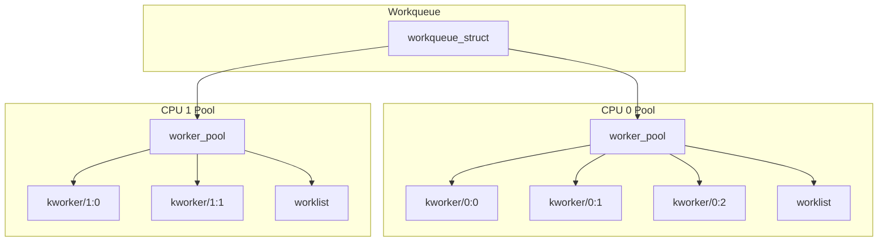

# Chapter 111: SoftIRQ, Tasklets, and Work Queues

## Intuition

When an interrupt fires, the CPU stops everything to handle it. But interrupt handlers have a severe constraint: they run with interrupts disabled (or at least the current IRQ line masked), so they must complete as fast as possible. What about all the work that needs to happen *after* acknowledging the hardware — processing network packets, completing disk I/O, updating statistics?

This is where **bottom halves** come in. Linux provides three mechanisms for deferring work from interrupt context:

1. **SoftIRQs**: Static, per-CPU, high-performance deferred handlers
2. **Tasklets**: Dynamic, flexible wrappers around softirqs
3. **Work Queues**: Thread-based deferred work that can sleep

Think of it like a restaurant kitchen. The interrupt handler (top half) is the waiter who takes your order and rings the bell. The softirq/tasklet (bottom half) is the line cook who immediately starts preparing your dish. The work queue is the prep cook who handles the slower tasks — washing vegetables, making sauces — that don't need to happen right this second.

## Architecture

### Bottom Half Hierarchy



### When to Use Which

| Mechanism | Context | Can Sleep? | Performance | Use Case |
|-----------|---------|------------|-------------|----------|
| SoftIRQ | Interrupt | No | Highest | High-frequency, per-CPU (networking, block I/O) |
| Tasklet | Interrupt | No | High | General deferred work |
| Work Queue | Process | Yes | Moderate | Slow work that needs process context |

## Kernel Implementation

### SoftIRQs

SoftIRQs are statically defined at compile time. There are a limited number (currently 10):

```c
// include/linux/interrupt.h
enum {
    HI_SOFTIRQ = 0,        // High-priority tasklets
    TIMER_SOFTIRQ,          // Timer softirq
    NET_TX_SOFTIRQ,         // Network transmit
    NET_RX_SOFTIRQ,         // Network receive
    BLOCK_SOFTIRQ,          // Block I/O
    IRQ_POLL_SOFTIRQ,       // IRQ polling
    TASKLET_SOFTIRQ,        // Normal tasklets
    SCHED_SOFTIRQ,          // Scheduler
    HRTIMER_SOFTIRQ,        // High-resolution timers
    RCU_SOFTIRQ,            // RCU
};
```

#### SoftIRQ Action Structure

```c
// kernel/softirq.c
struct softirq_action {
    void (*action)(struct softirq_action *);
};

static struct softirq_action softirq_vec[NR_SOFTIRQS] __cacheline_aligned_in_smp;
```

#### Raising a SoftIRQ

```c
// kernel/softirq.c
void raise_softirq(unsigned int nr)
{
    unsigned long flags;

    local_irq_save(flags);
    raise_softirq_irqoff(nr);
    local_irq_restore(flags);
}

void raise_softirq_irqoff(unsigned int nr)
{
    __raise_softirq_irqoff(nr);

    // If not in interrupt context, wake ksoftirqd
    if (!in_interrupt())
        wakeup_softirqd();
}

inline void __raise_softirq_irqoff(unsigned int nr)
{
    or_softirq_pending(1UL << nr);
}
```

#### Processing SoftIRQs

```c
// kernel/softirq.c
asmlinkage __visible void __softirq_entry __do_softirq(void)
{
    unsigned long end = jiffies + MAX_SOFTIRQ_TIME;
    unsigned long old_flags = current->flags;
    int max_restart = MAX_SOFTIRQ_RESTART;
    struct softirq_action *h;
    bool in_hardirq;
    __u32 pending;
    int softirq_bit;

    // Get pending softirqs
    pending = local_softirq_pending();
    softirq_begin();

    // Account for softirq processing
    account_irq_enter_time(current);
    __local_bh_disable_ip(_RET_IP_, SOFTIRQ_OFFSET);
    in_hardirq = lockdep_softirq_start();

    // Clear pending bits on local CPU
    set_softirq_pending(0);

    local_irq_enable();

    h = softirq_vec;

    // Process each pending softirq
    while ((softirq_bit = ffs(pending))) {
        unsigned int vec_nr;
        int prev_count;

        h += softirq_bit - 1;
        vec_nr = h - softirq_vec;
        pending >>= softirq_bit;
        pending <<= softirq_bit;

        prev_count = preempt_count();

        kstat_incr_softirqs_this_cpu(vec_nr);

        // Call the softirq handler
        trace_softirq_entry(vec_nr);
        h->action(h);
        trace_softirq_exit(vec_nr);

        if (unlikely(prev_count != preempt_count())) {
            pr_err("huh, entered softirq %u %s %p with preempt_count %08x, exited with %08x?\n",
                   vec_nr, softirq_to_name[vec_nr], h->action, prev_count,
                   preempt_count());
            preempt_count_set(prev_count);
        }

        h++;
        pending >>= softirq_bit;
    }

    local_irq_disable();

    // Check for more pending softirqs
    pending = local_softirq_pending();
    if (pending) {
        if (time_before(jiffies, end) && !need_resched() &&
            --max_restart)
            goto restart;

        wakeup_softirqd();
    }

    lockdep_softirq_end(in_hardirq);
    account_irq_exit_time(current);
    __local_bh_enable(SOFTIRQ_OFFSET);
    local_irq_restore(old_flags);
}
```

#### ksoftirqd

When softirq processing takes too long, remaining work is deferred to the `ksoftirqd` kernel thread:

```c
// kernel/softirq.c
static struct task_struct __percpu *ksoftirqd;

static int ksoftirqd_should_run(unsigned int cpu)
{
    return local_softirq_pending();
}

static void run_ksoftirqd(struct irq_work *irq_work)
{
    __do_softirq();
}

static void wakeup_softirqd(void)
{
    struct task_struct *tsk = __this_cpu_read(ksoftirqd);

    if (tsk && tsk->state != TASK_RUNNING)
        wake_up_process(tsk);
}
```

### Tasklets

Tasklets are built on top of softirqs and provide a more flexible interface:

```c
// include/linux/interrupt.h
struct tasklet_struct {
    struct tasklet_struct *next;
    unsigned long state;            // TASKLET_STATE_SCHED or TASKLET_STATE_RUN
    atomic_t count;                 // Atomic count (0 = enabled)
    void (*func)(unsigned long);    // Handler function
    unsigned long data;             // Data passed to handler
};

// Tasklet states
enum {
    TASKLET_STATE_SCHED,    // Tasklet is scheduled
    TASKLET_STATE_RUN,      // Tasklet is running
};
```

#### Creating and Scheduling Tasklets

```c
// Static initialization
DECLARE_TASKLET(my_tasklet, my_tasklet_func, data);

// Dynamic initialization
tasklet_init(&my_tasklet, my_tasklet_func, data);

// Schedule for execution
tasklet_schedule(&my_tasklet);

// High-priority tasklet
tasklet_hi_schedule(&my_tasklet);

// Handler function
void my_tasklet_func(unsigned long data)
{
    struct my_device *dev = (struct my_device *)data;

    // Process data (cannot sleep)
    process_data(dev);

    // Wake up processes if needed
    wake_up(&dev->wait_queue);
}
```

#### Tasklet Implementation

```c
// kernel/softirq.c
static void tasklet_action(struct softirq_action *a)
{
    struct tasklet_struct *list;

    // Move local tasklet list to temporary list
    local_irq_disable();
    list = __this_cpu_read(tasklet_vec.head);
    __this_cpu_write(tasklet_vec.head, NULL);
    __this_cpu_write(tasklet_vec.tail, this_cpu_ptr(&tasklet_vec.head));
    local_irq_enable();

    // Process all tasklets
    while (list) {
        struct tasklet_struct *t = list;
        list = list->next;

        // Check if tasklet is already running on another CPU
        if (tasklet_trylock(t)) {
            // Check if tasklet is enabled (count == 0)
            if (!atomic_read(&t->count)) {
                // Clear scheduled state
                if (!test_and_clear_bit(TASKLET_STATE_SCHED, &t->state))
                    BUG();

                // Call the handler
                t->func(t->data);

                // Release lock
                tasklet_unlock(t);
                continue;
            }
            tasklet_unlock(t);
        }

        // Tasklet was busy or disabled, reschedule
        local_irq_disable();
        t->next = NULL;
        *__this_cpu_read(tasklet_vec.tail) = t;
        __this_cpu_write(tasklet_vec.tail, &(t->next));
        __raise_softirq_irqoff(TASKLET_SOFTIRQ);
        local_irq_enable();
    }
}
```

### Work Queues

Work queues run work items in process context using kernel threads:

```c
// include/linux/workqueue.h
struct work_struct {
    atomic_long_t data;
    struct list_head entry;
    work_func_t func;
#ifdef CONFIG_LOCKDEP
    struct lockdep_map lockdep_map;
#endif
};

struct delayed_work {
    struct work_struct work;
    struct timer_list timer;
    struct workqueue_struct *wq;
    int cpu;
};

// Work function type
typedef void (*work_func_t)(struct work_struct *work);
```

#### Using Work Queues

```c
// Static initialization
DECLARE_WORK(my_work, my_work_func);
DECLARE_DELAYED_WORK(my_delayed_work, my_delayed_work_func);

// Dynamic initialization
INIT_WORK(&my_work, my_work_func);
INIT_DELAYED_WORK(&my_delayed_work, my_delayed_work_func);

// Queue work
schedule_work(&my_work);                    // On system wq
queue_work(my_wq, &my_work);               // On custom wq

// Queue delayed work
schedule_delayed_work(&my_delayed_work, HZ);  // After 1 second
queue_delayed_work(my_wq, &my_delayed_work, HZ);

// Work handler
void my_work_func(struct work_struct *work)
{
    struct my_device *dev = container_of(work, struct my_device, work);

    // Can sleep, allocate memory, etc.
    mutex_lock(&dev->mutex);
    process_pending_data(dev);
    mutex_unlock(&dev->mutex);
}

// Cancel work
cancel_work_sync(&my_work);
cancel_delayed_work_sync(&my_delayed_work);
```

#### Creating Custom Work Queues

```c
// Create a workqueue with specific attributes
struct workqueue_struct *wq;

// Single-threaded workqueue
wq = create_singlethread_workqueue("my_wq");

// Multi-threaded workqueue (one thread per CPU)
wq = create_workqueue("my_wq");

// Modern API with more control
wq = alloc_workqueue("my_wq", WQ_MEM_RECLAIM, 0);
wq = alloc_workqueue("my_wq", WQ_HIGHPRI | WQ_CPU_INTENSIVE, 0);
wq = alloc_ordered_workqueue("my_wq", WQ_MEM_RECLAIM);

// Workqueue flags
// WQ_HIGHPRI       - High priority work
// WQ_CPU_INTENSIVE  - CPU-intensive work (doesn't block CPU)
// WQ_MEM_RECLAIM    - Can be used in memory reclaim path
// WQ_FREEZABLE     - Freezable during suspend
// WQ_UNBOUND       - Not bound to any CPU
// WQ_ORDERED       - Serializes work items
```

#### Workqueue Implementation

```c
// kernel/workqueue.c
static int worker_thread(void *__worker)
{
    struct worker *worker = __worker;
    struct worker_pool *pool = worker->pool;

    // Tell the allocator that a worker is ready
    worker->task->flags |= PF_WQ_WORKER;
    woke_up:
    raw_spin_lock_irq(&pool->lock);

    // Main loop
    for (;;) {
        struct work_struct *work;

        // Check for work
        if (need_to_create_worker(pool)) {
            create_worker(pool);
        }

        // Get next work item
        work = get_next_work_item(pool);

        if (work) {
            // Execute work
            worker->current_work = work;
            worker->current_func = work->func;
            worker->current_pool = pool;

            raw_spin_unlock_irq(&pool->lock);

            // Call the work function
            worker->current_func(work);

            raw_spin_lock_irq(&pool->lock);
            worker->current_work = NULL;
            worker->current_func = NULL;
        }

        // No more work, sleep
        set_current_state(TASK_INTERRUPTIBLE);
        raw_spin_unlock_irq(&pool->lock);
        schedule();
        raw_spin_lock_irq(&pool->lock);
    }
}
```

## Source Code References

| File | Description |
|------|-------------|
| `kernel/softirq.c` | SoftIRQ and tasklet implementation |
| `kernel/workqueue.c` | Workqueue implementation |
| `include/linux/interrupt.h` | SoftIRQ/tasklet/work API |
| `include/linux/workqueue.h` | Workqueue API |
| `kernel/timer.c` | Timer softirq |

## Data Structures

### Per-CPU SoftIRQ State

```c
// kernel/softirq.c
struct tasklet_head {
    struct tasklet_struct *head;
    struct tasklet_struct **tail;
};

static DEFINE_PER_CPU(struct tasklet_head, tasklet_vec);
static DEFINE_PER_CPU(struct tasklet_head, tasklet_hi_vec);
```

### Workqueue Pool

```c
// kernel/workqueue.c
struct worker_pool {
    raw_spinlock_t      lock;
    int                 cpu;
    int                 node;
    int                 id;
    unsigned int        flags;
    unsigned long       watchdog_ts;

    struct list_head    worklist;
    int                 nr_workers;
    int                 nr_idle;
    struct list_head    idle_list;
    struct timer_list   idle_timer;
    struct timer_list   mayday_timer;

    struct worker       *manager;
    struct list_head    workers;

    // ...
};
```

## Diagrams

### SoftIRQ Processing Flow



### Tasklet vs Work Queue



### Workqueue Pool Architecture



## Performance

### SoftIRQ Performance

- **Overhead**: Minimal — just a function call
- **Throughput**: Can process thousands of softirqs per second
- **Latency**: Very low (<1μs from raise to execution)
- **Limitation**: Cannot sleep, cannot allocate with GFP_KERNEL

### Tasklet Performance

- **Overhead**: Slight (list manipulation + softirq scheduling)
- **Throughput**: Good for moderate-frequency work
- **Latency**: Low (runs at next softirq processing opportunity)
- **Limitation**: Same as softirq (no sleeping)

### Workqueue Performance

- **Overhead**: Higher (thread wake-up, context switch)
- **Throughput**: Good for slow work
- **Latency**: Higher (thread scheduling involved)
- **Advantage**: Can sleep, allocate memory, use mutexes

### Tuning

```bash
# View softirq statistics
cat /proc/softirqs

# View workqueue statistics
cat /proc/workqueue

# Adjust ksoftirqd priority
chrt -p -f 50 $(pgrep ksoftirqd)
```

## Security

### Bottom Half Security Considerations

1. **Interrupt context restrictions**: No sleeping means no GFP_KERNEL allocation, limiting what security checks can be performed
2. **Race conditions**: Bottom halves can preempt process context; careful locking is required
3. **Privilege escalation**: Work queues running with elevated privileges can be exploited
4. **Denial of service**: Excessive softirq processing can starve user-space processes

## Common Pitfalls

1. **Sleeping in softirq/tasklet context**: This causes kernel panics. Use work queues if you need to sleep.
2. **Forgetting to disable bottom halves**: When sharing data with bottom halves, use `spin_lock_bh()` or `spin_lock_irqsave()`
3. **Not flushing work queues**: Call `flush_workqueue()` or `cancel_work_sync()` during cleanup
4. **Stack overflow**: Softirqs can nest; deep nesting can overflow the kernel stack
5. **Starvation**: High-frequency softirqs can prevent user-space processes from running; `ksoftirqd` handles this

## Best Practices

1. **Use softirqs only for high-frequency work**: Networking and block I/O are the main users
2. **Use tasklets for simple deferred work**: When you don't need process context
3. **Use work queues for everything else**: Especially when you need to sleep or allocate memory
4. **Use `alloc_workqueue()`**: The modern API with better control over worker behavior
5. **Use `cancel_work_sync()`**: Ensures the work function has finished before cleanup
6. **Use `INIT_WORK()` carefully**: Don't re-initialize a work item that's currently executing

## Exercises

1. **SoftIRQ statistics**: Read `/proc/softirqs` and identify which softirqs are most active on your system
2. **Tasklet module**: Write a kernel module that creates a tasklet, schedules it, and prints a message from the handler
3. **Work queue module**: Write a kernel module that uses a work queue to perform a delayed operation
4. **Performance comparison**: Compare the latency of softirqs, tasklets, and work queues using `ftrace`
5. **Custom workqueue**: Create a custom ordered workqueue and submit multiple work items; verify they execute serially
6. **ksoftirqd tuning**: Monitor ksoftirqd CPU usage under heavy network load and adjust its priority

## References

1. `Documentation/core-api/workqueue.rst` — Workqueue documentation.
2. Love, R. *Linux Kernel Development*, Chapter 8.
3. `kernel/softirq.c` — SoftIRQ implementation.
4. `kernel/workqueue.c` — Workqueue implementation.
5. `include/linux/interrupt.h` — Bottom half API.
6. `Documentation/networking/napi.rst` — NAPI (softirq-based networking).
