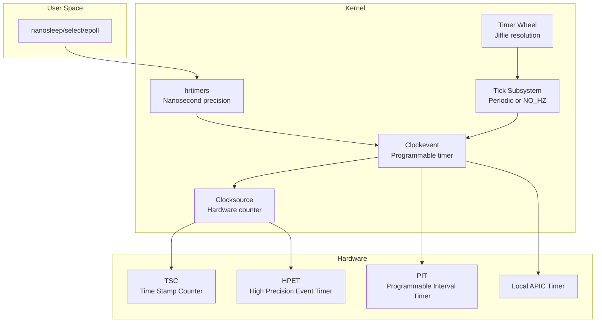
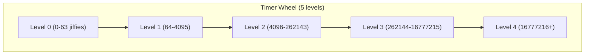
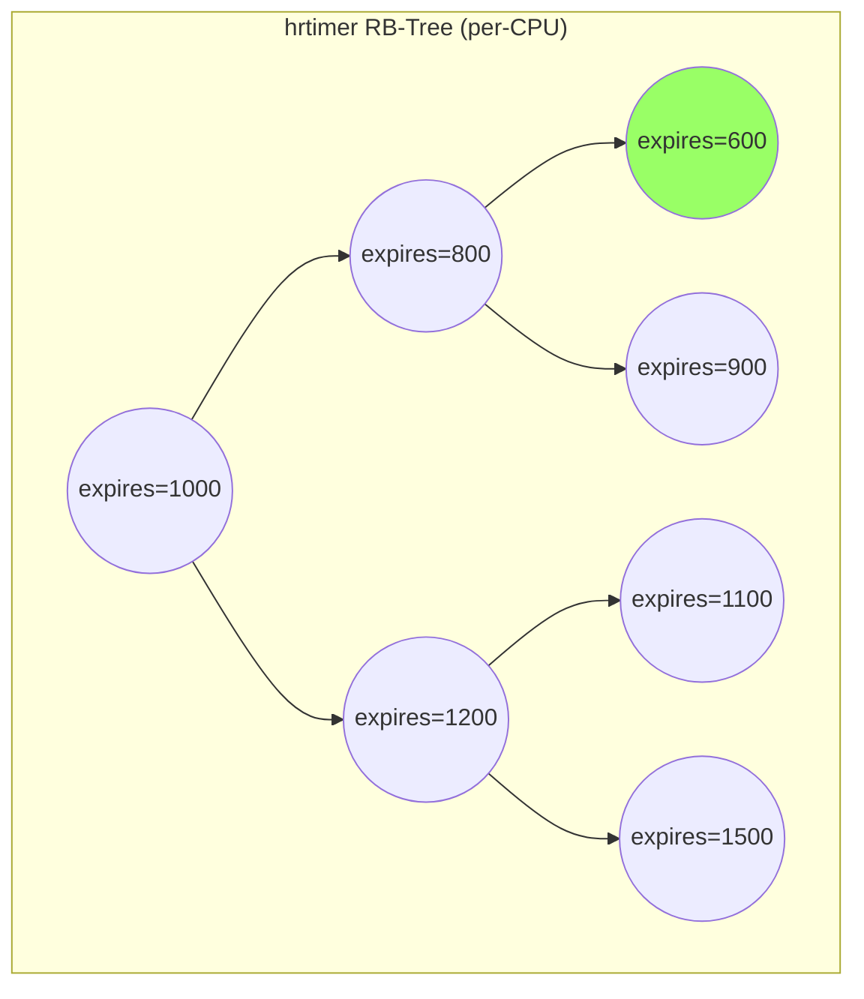
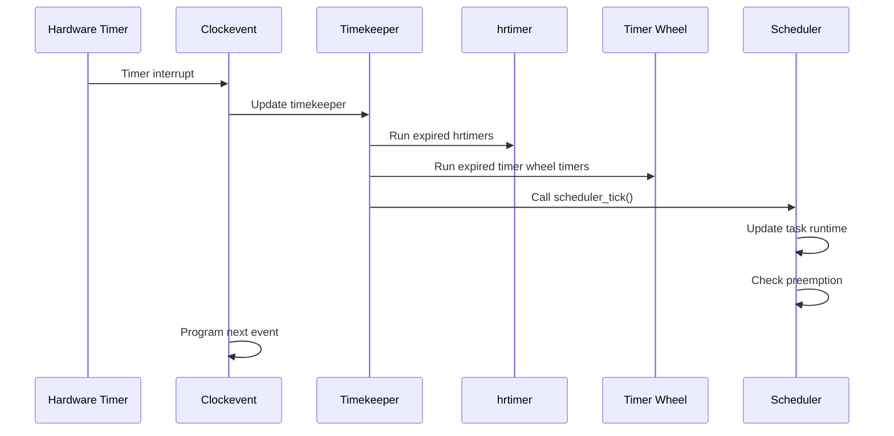

# Chapter 112: Kernel Timers

## Intuition

Time is one of the most fundamental abstractions in computing. Every operating system needs to know: How long has it been since boot? When should this process be woken up? How often should the scheduler run? When does this network packet timeout?

Kernel timers provide the mechanism for scheduling work to happen at a future time. They're used everywhere: the scheduler tick, network timeouts, device polling, delayed work queues, and user-space timers like `nanosleep()` and `epoll_wait()`.

The kernel's timer subsystem is layered: at the bottom, hardware timers generate periodic interrupts (ticks). On top of that, the **clocksource** framework provides monotonic time. The **hrtimer** (high-resolution timer) subsystem provides nanosecond-precision timers. And the **tick** subsystem can operate in periodic mode (fixed tick rate) or tickless mode (`NO_HZ`), where the timer interrupt is suppressed when idle.

## Architecture

### Timer Subsystem Layers



## Kernel Implementation

### Clocksource

The clocksource framework provides a monotonic hardware counter:

```c
// include/linux/clocksource.h
struct clocksource {
    u64 (*read)(struct clocksource *cs);    // Read counter
    u64 mask;                               // Counter mask
    u32 mult;                               // Multiplier for ns conversion
    u32 shift;                              // Shift for ns conversion
    u64 max_idle_ns;                        // Maximum idle time
    u32 maxadj;                             // Maximum adjustment
    u32 archdata;                           // Architecture-specific
    const char *name;                       // Clocksource name
    struct list_head list;                  // List node
    int rating;                             // Quality rating
    u64 cycle_last;                         // Last cycle count
    u64 cs_id;                              // Clocksource ID
    enum vdso_clock_mode vdso_clock_mode;   // vDSO mode
    u32 (*mult_adj)(struct clocksource *cs, u32 mult, u32 adj);
    void (*suspend)(struct clocksource *cs);
    void (*resume)(struct clocksource *cs);
    // ...
};
```

#### Clocksource Registration

```c
// kernel/time/clocksource.c
static struct clocksource clocksource_tsc = {
    .name = "tsc",
    .rating = 300,
    .read = read_tsc,
    .mask = CLOCKSOURCE_MASK(64),
    .flags = CLOCK_SOURCE_IS_CONTINUOUS |
             CLOCK_SOURCE_VALID_FOR_HRES,
    .archdata = { .vdso_clock_mode = VDSO_CLOCKMODE_TSC },
};

// Registration
clocksource_register_hz(&clocksource_tsc, tsc_khz * 1000);
```

#### Time Conversion

```c
// Convert clock cycles to nanoseconds
u64 cyc2ns(struct clocksource *cs, u64 cycles)
{
    return mul_u64_u32_shr(cycles, cs->mult, cs->shift);
}

// Read current time
ktime_t ktime_get(void)
{
    struct timekeeper *tk = &tk_core.timekeeper;
    unsigned int seq;
    ktime_t base;
    u64 nsecs;

    do {
        seq = read_seqcount_begin(&tk_core.seq);
        base = tk->tkr_mono.base;
        nsecs = timekeeping_get_ns(&tk->tkr_mono);
    } while (read_seqcount_retry(&tk_core.seq, seq));

    return ktime_add_ns(base, nsecs);
}
```

### Clockevent Devices

Clockevent devices are programmable timers that generate interrupts at specified times:

```c
// include/linux/clockchips.h
struct clock_event_device {
    void (*event_handler)(struct clock_event_device *dev);
    int (*set_next_event)(unsigned long evt, struct clock_event_device *dev);
    int (*set_next_ktime)(ktime_t expires, struct clock_event_device *dev);
    ktime_t next_event;
    u64 max_delta_ns;
    u64 min_delta_ns;
    u32 mult;
    u32 shift;
    enum clock_event_state state_use_accessors;
    unsigned int features;
    unsigned long retries;
    const char *name;
    int rating;
    int irq;
    int bound_on;
    const struct cpumask *cpumask;
    struct list_head list;
    // ...
};
```

### hrtimers — High-Resolution Timers

hrtimers provide nanosecond-precision timers using a red-black tree:

```c
// include/linux/hrtimer.h
struct hrtimer {
    struct timerqueue_node      node;       // RB-tree node
    ktime_t                     _softexpires; // Soft expiry time
    enum hrtimer_restart        (*function)(struct hrtimer *);
    struct hrtimer_clock_base   *base;      // Clock base
    u8                          state;      // Timer state
    u8                          is_rel;     // Relative timer
    u8                          is_soft;    // Softirq-based
    // ...
};

enum hrtimer_state {
    HRTIMER_STATE_INACTIVE = 0x00,
    HRTIMER_STATE_ENQUEUED = 0x01,
    HRTIMER_STATE_CALLBACK = 0x02,
    HRTIMER_STATE_MIGRATE = 0x04,
};

// Timer restart
enum hrtimer_restart {
    HRTIMER_NORESTART,      // Don't restart
    HRTIMER_RESTART,        // Restart timer
};
```

#### Using hrtimers

```c
// Initialize
struct hrtimer my_timer;
hrtimer_init(&my_timer, CLOCK_MONOTONIC, HRTIMER_MODE_REL);
my_timer.function = my_timer_callback;

// Start timer (100ms from now)
hrtimer_start(&my_timer, ms_to_ktime(100), HRTIMER_MODE_REL);

// Cancel timer
hrtimer_cancel(&my_timer);

// Timer callback
enum hrtimer_restart my_timer_callback(struct hrtimer *timer)
{
    // Do work (runs in hardirq or softirq context)
    do_something();

    // Restart timer for another 100ms
    return HRTIMER_RESTART;

    // Or return HRTIMER_NORESTART to stop
}
```

#### hrtimer Internals

```c
// kernel/time/hrtimer.c
static void __run_hrtimer(struct hrtimer_cpu_base *cpu_base,
                          struct hrtimer *timer,
                          ktime_t *now, unsigned long flags)
    __releases(&cpu_base->lock)
    __acquires(&cpu_base->lock)
{
    enum hrtimer_restart (*fn)(struct hrtimer *);
    int restart;

    // Remove from queue
    __remove_hrtimer(timer, cpu_base, HRTIMER_STATE_CALLBACK, 0);

    // Get callback function
    fn = timer->function;

    // Call the timer function
    trace_hrtimer_expire_entry(timer, now);
    restart = fn(timer);
    trace_hrtimer_expire_exit(timer);

    // Handle restart
    if (restart != HRTIMER_NORESTART) {
        enqueue_hrtimer(timer, cpu_base, HRTIMER_MODE_ABS);
    }

    timer->state &= ~HRTIMER_STATE_CALLBACK;
}
```

### Timer Wheel — Low-Resolution Timers

The timer wheel provides jiffie-resolution timers (typically 1-10ms):

```c
// include/linux/timer.h
struct timer_list {
    struct hlist_node entry;
    unsigned long expires;
    void (*function)(struct timer_list *);
    u32 flags;
    // ...
};

// Modern API (no more 'data' field)
#define TIMER_INITIALIZER(_function, _flags) { \
    .function = (_function), \
    .flags = (_flags), \
}

// Using timers
struct timer_list my_timer;

// Initialize
timer_setup(&my_timer, my_timer_func, 0);

// Start timer (expires in 1 second)
mod_timer(&my_timer, jiffies + HZ);

// Cancel timer
del_timer_sync(&my_timer);

// Timer callback
void my_timer_func(struct timer_list *t)
{
    // Runs in softirq context (TIMER_SOFTIRQ)
    // Cannot sleep
    do_something();
}
```

### The Tick Subsystem

The tick subsystem generates periodic scheduler interrupts:

```c
// kernel/time/tick-common.c
void tick_setup_sched_timer(void)
{
    struct tick_sched *ts = this_cpu_ptr(&tick_cpu_sched);

    // Create a hrtimer for the scheduler tick
    hrtimer_init(&ts->sched_timer, CLOCK_MONOTONIC, HRTIMER_MODE_ABS);
    ts->sched_timer.function = tick_sched_timer;

    // Program the first tick
    tick_nohz_restart_sched_tick();
}

// Tick handler
static enum hrtimer_restart tick_sched_timer(struct hrtimer *timer)
{
    struct tick_sched *ts =
        container_of(timer, struct tick_sched, sched_timer);

    // Call the scheduler tick
    tick_sched_handle(ts, regs);

    // Return HRTIMER_RESTART for periodic tick
    return HRTIMER_RESTART;
}
```

### NO_HZ — Tickless Operation

The kernel can suppress the timer interrupt when idle or when there's only one runnable task:

```c
// kernel/time/tick-sched.c
// NO_HZ_IDLE: suppress tick when CPU is idle
void tick_nohz_idle_enter(void)
{
    struct tick_sched *ts = this_cpu_ptr(&tick_cpu_sched);

    // Stop the tick
    tick_nohz_stop_tick(ts, ktime_get());
}

// NO_HZ_FULL: suppress tick even when running tasks
// (requires CONFIG_NO_HZ_FULL and boot parameter nohz_full=)
```

#### NO_HZ Modes

```bash
# NO_HZ_IDLE (default)
# Timer stops when CPU is idle
# Boot parameter: (none needed, default)

# NO_HZ_FULL (optional)
# Timer stops even with one runnable task
# Boot parameter: nohz_full=1-7 (CPUs 1-7 are tickless)

# Check current mode
cat /sys/devices/system/cpu/nohz_full
```

## Source Code References

| File | Description |
|------|-------------|
| `kernel/time/hrtimer.c` | hrtimer implementation |
| `kernel/time/timer.c` | Timer wheel implementation |
| `kernel/time/clocksource.c` | Clocksource framework |
| `kernel/time/clockevents.c` | Clockevent framework |
| `kernel/time/tick-common.c` | Tick subsystem |
| `kernel/time/tick-sched.c` | Tickless (NO_HZ) implementation |
| `kernel/time/timekeeping.c` | Timekeeping core |
| `include/linux/hrtimer.h` | hrtimer API |
| `include/linux/timer.h` | Timer wheel API |

## Data Structures

### Timekeeper

```c
// kernel/time/timekeeping_internal.h
struct timekeeper {
    struct tk_read_base tkr_mono;   // Monotonic clock base
    struct tk_read_base tkr_raw;    // Raw clock base
    ktime_t offs_real;              // Real-time offset
    ktime_t offs_boot;              // Boot-time offset
    ktime_t offs_tai;               // TAI offset

    s32 tai_offset;                 // TAI offset from UTC
    unsigned int clock_was_set_seq; // Clock set sequence
    u8 cs_was_changed_seq;          // Clocksource change seq

    ktime_t base_mono;              // Monotonic base time
    ktime_t base_raw;               // Raw base time
    ktime_t base_real;              // Real base time
    ktime_t base_boot;              // Boot base time

    struct timespec64 wall_to_monotonic; // Wall to monotonic offset

    ktime_t (*read_time)(const struct tk_read_base *t);

    // ...
};
```

### Per-CPU Tick Scheduler

```c
// kernel/time/tick-sched.h
struct tick_sched {
    struct hrtimer      sched_timer;
    unsigned long       check_clocks;
    enum tick_nohz_mode nohz_mode;

    ktime_t             last_tick;
    ktime_t             next_tick;
    unsigned int        inidle : 1;
    unsigned int        tick_stopped : 1;
    unsigned int        idle_active : 1;
    unsigned int        do_timer_last : 1;

    ktime_t             idle_expires;
    ktime_t             idle_waketime;
    u64                 idle_sleeptime;
    u64                 iowait_sleeptime;
    unsigned long       last_jiffies;
    u64                 timer_expires;
    u64                 timer_expires_base;
    u64                 next_timer;
    ktime_t             last_tick_jiffies;
    unsigned long       nr_events;
    // ...
};
```

## Diagrams

### Timer Wheel Structure



### hrtimer Red-Black Tree



### Tick Subsystem Flow



## Performance

### Timer Resolution

| Timer Type | Resolution | Overhead | Use Case |
|-----------|-----------|----------|----------|
| Timer wheel | 1-10 ms (HZ) | Low | Long timeouts |
| hrtimer | 1 ns | Medium | Precise timing |
| Busy-wait | 1 ns | High | Ultra-precise |

### Timer Overhead

```bash
# View timer statistics
cat /proc/timer_list | head -50

# Count active timers
grep -c "expires" /proc/timer_list

# hrtimer statistics
cat /proc/timer_stats
```

### Performance Impact of NO_HZ

```bash
# Measure power savings with NO_HZ_IDLE
# Compare idle power consumption with and without NO_HZ_FULL

# Measure latency impact
cyclictest -t1 -p80 -i1000 -l10000 -m
```

## Security

### Timer-Based Attacks

1. **Timer channel attacks**: Cores can infer activity on other cores by observing timer behavior
2. **TOCTOU via timers**: Using timer expiry to create race conditions
3. **Timer flooding**: Creating excessive timers to cause resource exhaustion

### Mitigation

```bash
# Limit timer creation rate
# Monitor timer counts
cat /proc/timer_list | grep -c "timer"

# Use hrtimer max-hang-time
# Limits how long a CPU can run hrtimers
echo 500000 > /proc/sys/kernel/hung_task_timeout_secs
```

## Common Pitfalls

1. **Using jiffies for precise timing**: Jiffies resolution is limited by HZ (typically 1-10ms)
2. **Not handling timer re-arming**: If you restart a timer, ensure the callback handles all cases
3. **Forgetting del_timer_sync()**: Timer callbacks may be running when you free resources
4. **Timer callback context**: Timer callbacks run in softirq context; you cannot sleep
5. **Clock source instability**: Some hardware clocks drift significantly; use NTP

## Best Practices

1. **Use hrtimers for precise timing**: Even if you don't need nanosecond precision, hrtimers are more flexible
2. **Use timer_setup()**: The modern timer API is safer than the old init_timer()
3. **Always use del_timer_sync()**: Ensures the callback isn't running on another CPU
4. **Use ktime_t**: The kernel's time type handles overflow correctly
5. **Use NO_HZ for power savings**: Enable NO_HZ_IDLE on battery-powered systems
6. **Monitor timer activity**: Watch `/proc/timer_list` for timer storms

## Exercises

1. **hrtimer module**: Write a kernel module that creates an hrtimer that fires every 100ms
2. **Timer wheel module**: Write a kernel module using the timer wheel API
3. **Clocksource comparison**: List available clocksources on your system (`/sys/devices/system/clocksource/`)
4. **NO_HZ experiment**: Compare idle CPU usage with and without NO_HZ
5. **Timer statistics**: Use `/proc/timer_list` to count and categorize active timers
6. **Latency measurement**: Use cyclictest to measure timer resolution on your system

## References

1. `Documentation/timers/hrtimers.rst` — hrtimer documentation.
2. `Documentation/timers/no_hz.rst` — NO_HZ documentation.
3. Love, R. *Linux Kernel Development*, Chapter 10.
4. `kernel/time/hrtimer.c` — hrtimer implementation.
5. `Documentation/timers/` — Timer subsystem documentation.
6. `include/linux/ktime.h` — ktime_t API.
