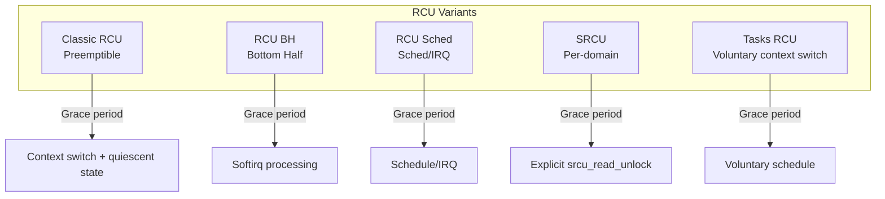
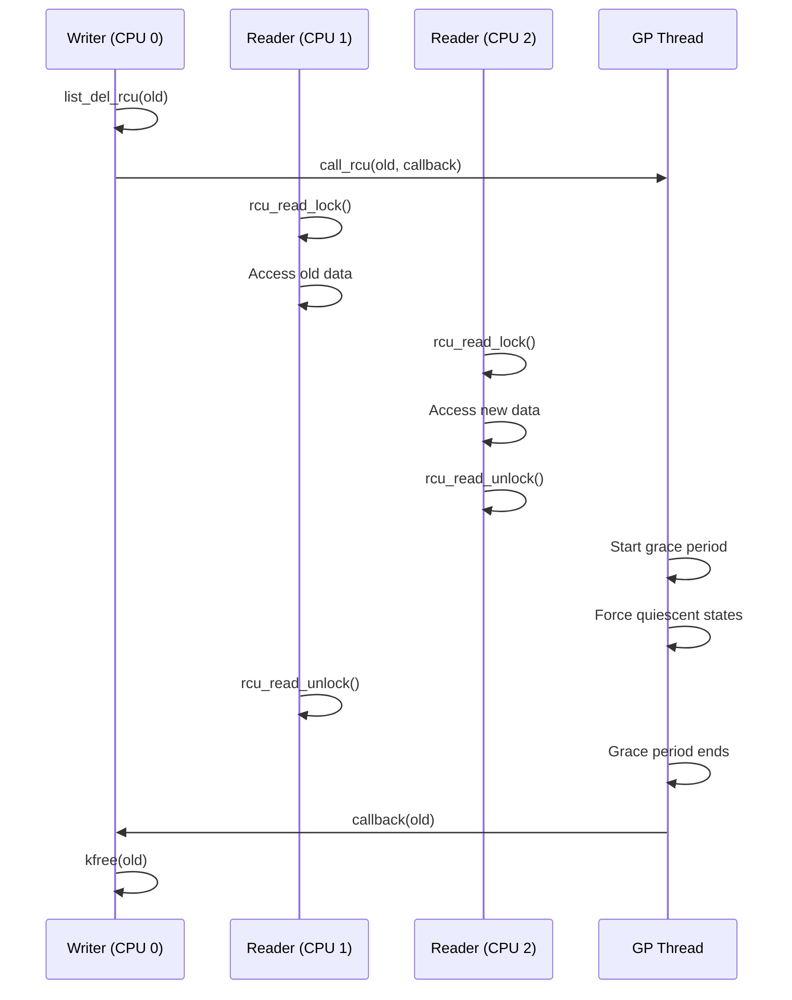
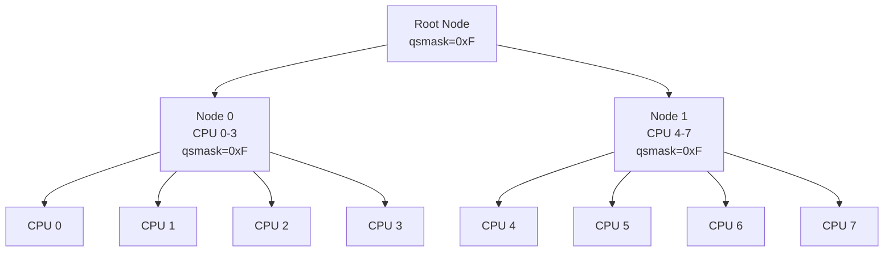

# Chapter 113: RCU — Read-Copy-Update

## Intuition

Imagine a bulletin board where people constantly read the posted information, but updates are rare. You could lock the entire board every time someone wants to read it, but that would be terribly slow when there are thousands of readers and only one updater. A better approach: leave the old information up, prepare the new information on the side, then swap them atomically. Readers who started before the swap keep reading the old version; new readers see the new version. Once all old readers are done, you can safely remove the old information.

That's exactly what RCU does. It's a synchronization mechanism optimized for read-heavy workloads: read operations are essentially free (no locks, no atomic operations, no memory barriers on most architectures), while write operations pay a higher cost to ensure readers see a consistent view.

RCU is one of the most innovative and complex synchronization mechanisms in the Linux kernel. It's used extensively in the networking stack, filesystem VFS layer, process descriptor lookup, and many other hot paths. Understanding RCU requires a shift in thinking: instead of "lock, access, unlock," it's "read, check if still valid, continue."

## Architecture

### RCU Design Principles

1. **Readers never block**: `rcu_read_lock()` and `rcu_read_unlock()` are essentially no-ops
2. **Readers never retry**: Once a reader accesses data, it's guaranteed to see valid data
3. **Writers synchronize**: Writers wait for all existing readers to finish before freeing old data
4. **Grace period**: The time between a writer removing data and actually freeing it

### Grace Periods

```
     CPU 0          CPU 1          CPU 2          CPU 3
     ──────         ──────         ──────         ──────
     rcu_read_lock()
     │
     │              rcu_read_lock()
     │              │
     │              │              synchronize_rcu()
     │              │              │ (blocks)
     │              │              │
     │              │              │
     rcu_read_unlock()
     │              │              │
     │              │              │
     │              rcu_read_unlock()
     │              │              │
     │              │              │ ← All readers done
     │              │              │   Grace period ends
     │              │              synchronize_rcu() returns
```

### RCU Flavors



## Kernel Implementation

### Core RCU API

```c
// include/linux/rcupdate.h

// Read-side critical section
rcu_read_lock();
// ... access RCU-protected data ...
rcu_read_unlock();

// Dereference RCU-protected pointer
rcu_dereference(ptr);

// Assign RCU-protected pointer
rcu_assign_pointer(ptr, new_value);

// Wait for grace period
synchronize_rcu();

// Asynchronous grace period
call_rcu(&obj->rcu, my_callback);

// SRCU variant
idx = srcu_read_lock(&my_srcu);
// ... access data ...
srcu_read_unlock(&my_srcu, idx);
synchronize_srcu(&my_srcu);
```

### RCU Read-Side Primitives

```c
// kernel/rcu/tree.c
// Note: In many configurations, rcu_read_lock() is a no-op

#ifdef CONFIG_PREEMPT_RCU
void __rcu_read_lock(void)
{
    current->rcu_read_lock_nesting++;
    barrier();
}

void __rcu_read_unlock(void)
{
    barrier();
    current->rcu_read_lock_nesting--;
}
#else
// Non-preemptible RCU: rcu_read_lock() disables preemption
static inline void __rcu_read_lock(void)
{
    preempt_disable();
}

static inline void __rcu_read_unlock(void)
{
    preempt_enable();
}
#endif
```

### RCU Dereference

```c
// include/linux/rcupdate.h
// rcu_dereference() ensures proper memory ordering

#ifdef __CHECKER__
#define rcu_dereference(p) \
    __rcu_dereference_check(p, __rcu_read_lock_held())
#else
#define rcu_dereference(p) \
    rcu_dereference_check(p, rcu_read_lock_held())
#endif

// The actual barrier
#define rcu_dereference_raw(p) \
    __rcu_dereference_check(p, 1)

// In practice, this expands to:
// On most architectures: READ_ONCE(p) + dependency barrier
// On DEC Alpha: smp_read_barrier_depends()
```

### RCU Assignment

```c
// include/linux/rcupdate.h
// rcu_assign_pointer() ensures the new data is visible
// before the pointer is updated

#define rcu_assign_pointer(p, v) \
    smp_store_release(&p, RCU_INITIALIZER(v))

// This ensures:
// 1. All writes to the new object are complete
// 2. The pointer update is visible to other CPUs
// 3. Readers will see the new data after seeing the new pointer
```

### Grace Period Detection

```c
// kernel/rcu/tree.c
// The grace period detection is the core of RCU

struct rcu_node {
    raw_spinlock_t lock;
    unsigned long gp_seq;
    unsigned long gp_seq_needed;
    unsigned long qsmask;       // Quiescent state mask
    unsigned long expmask;      // Expedited mask
    unsigned long qsmaskinit;
    unsigned long grpmask;
    int grplo;
    int grphi;
    u8 grpnum;
    u8 level;
    bool wait_blkd_tasks;
    struct rcu_node *parent;
    struct list_head blkd_tasks;
    // ...
};

struct rcu_data {
    unsigned long gp_seq;
    unsigned long gp_seq_needed;
    bool cpu_no_qs;
    unsigned long core_needs_qs;
    unsigned long touched;
    struct rcu_node *mynode;
    // ...
};
```

### Grace Period Processing

```c
// kernel/rcu/tree.c
static int __noreturn rcu_gp_kthread(void *arg)
{
    struct rcu_state *rsp = arg;
    struct rcu_node *rnp = rcu_get_root();

    for (;;) {
        // Wait for grace period request
        wait_event_interruptible(rsp->gp_wq,
                                 rcu_gp_fqs_check_wake(rsp));

        // Start grace period
        rcu_gp_init(rsp);

        // Wait for quiescent states from all CPUs
        while (!rcu_gp_is_completed(rsp)) {
            // Force quiescent states
            rcu_gp_fqs(rsp);
        }

        // End grace period
        rcu_gp_cleanup(rsp);
    }
}

// Force quiescent state
static void rcu_gp_fqs(struct rcu_state *rsp)
{
    struct rcu_node *rnp;
    unsigned long flags;
    int cpu;

    // Send IPIs to force quiescent states
    for_each_rcu_node_breadth_first(rnp) {
        raw_spin_lock_irqsave_rcu_node(rnp, flags);
        rcu_for_each_leaf_node_possible_cpu(rnp, cpu) {
            if (rcu_fqs_is_gp_kthread())
                continue;
            // Send resched IPI
            smp_call_function_single_async(cpu, &rnp->fqs_data);
        }
        raw_spin_unlock_irqrestore_rcu_node(rnp, flags);
    }
}
```

### call_rcu() — Asynchronous Grace Period

```c
// kernel/rcu/tree.c
void call_rcu(struct rcu_head *head, rcu_callback_t func)
{
    unsigned long flags;
    struct rcu_data *rdp;

    head->func = func;
    head->next = NULL;

    local_irq_save(flags);
    rdp = this_cpu_ptr(&rcu_data);

    // Add to callback list
    *rdp->nxttail[RCU_NEXT_TAIL] = head;
    rdp->nxttail[RCU_NEXT_TAIL] = &head->next;

    // Request grace period if needed
    if (__rcu_reclaim(rsp->name, head))
        rcu_segcblist_enqueue(&rdp->cblist, head);

    local_irq_restore(flags);
}
```

### SRCU — Sleepable RCU

```c
// kernel/rcu/srcutree.c
struct srcu_struct {
    struct srcu_node *sda;
    unsigned long srcu_size_state;
    struct mutex srcu_cb_mutex;
    struct mutex srcu_gp_mutex;
    unsigned int srcu_idx;
    unsigned long srcu_gp_seq;
    unsigned long srcu_gp_seq_needed;
    unsigned long srcu_gp_seq_needed_exp;
    // ...
};

int __srcu_read_lock(struct srcu_struct *ssp)
{
    int idx;

    idx = READ_ONCE(ssp->srcu_idx) & 0x1;
    this_cpu_inc(ssp->sda->srcu_lock_count[idx]);
    smp_mb();  // Order vs. following SRCU read-side critical section
    return idx;
}

void __srcu_read_unlock(struct srcu_struct *ssp, int idx)
{
    smp_mb();  // Order preceding SRCU read-side critical section vs. following
    this_cpu_inc(ssp->sda->srcu_unlock_count[idx]);
}
```

### Using RCU — Linked List Example

```c
// include/linux/rculist.h
// Adding to RCU-protected list
static inline void list_add_rcu(struct list_head *new,
                                 struct list_head *head)
{
    __list_add_rcu(new, head, head->next);
}

// Removing from RCU-protected list
static inline void list_del_rcu(struct list_head *entry)
{
    __list_del_entry(entry);
    entry->prev = LIST_POISON2;
}

// Iterating RCU-protected list
#define list_for_each_entry_rcu(pos, head, member) \
    for (pos = list_entry_rcu((head)->next, typeof(*pos), member); \
         &pos->member != (head); \
         pos = list_entry_rcu(pos->member.next, typeof(*pos), member))

// Example: RCU-protected linked list
struct my_data {
    int value;
    struct list_head list;
    struct rcu_head rcu;
};

LIST_HEAD(my_list);
DEFINE_SPINLOCK(my_list_lock);

// Reader (no locks!)
int read_data(void)
{
    struct my_data *p;
    int result = 0;

    rcu_read_lock();
    list_for_each_entry_rcu(p, &my_list, list) {
        if (p->value > result)
            result = p->value;
    }
    rcu_read_unlock();

    return result;
}

// Writer (with spinlock)
void add_data(int value)
{
    struct my_data *new = kmalloc(sizeof(*new), GFP_KERNEL);
    new->value = value;

    spin_lock(&my_list_lock);
    list_add_rcu(&new->list, &my_list);
    spin_unlock(&my_list_lock);
}

// Remove and free (wait for grace period)
void remove_data(struct my_data *target)
{
    spin_lock(&my_list_lock);
    list_del_rcu(&target->list);
    spin_unlock(&my_list_lock);

    // Wait for all readers to finish
    synchronize_rcu();

    // Now safe to free
    kfree(target);
}

// Or use asynchronous callback
void remove_data_async(struct my_data *target)
{
    spin_lock(&my_list_lock);
    list_del_rcu(&target->list);
    spin_unlock(&my_list_lock);

    // Free after grace period
    call_rcu(&target->rcu, free_data_rcu);
}

void free_data_rcu(struct rcu_head *rh)
{
    struct my_data *p = container_of(rh, struct my_data, rcu);
    kfree(p);
}
```

## Source Code References

| File | Description |
|------|-------------|
| `kernel/rcu/tree.c` | Classic RCU implementation |
| `kernel/rcu/srcutree.c` | SRCU implementation |
| `kernel/rcu/update.c` | RCU common code |
| `kernel/rcu/rcu.h` | RCU internal headers |
| `include/linux/rcupdate.h` | RCU API |
| `include/linux/rculist.h` | RCU-protected lists |
| `include/linux/srcu.h` | SRCU API |
| `Documentation/RCU/` | RCU documentation |

## Data Structures

### RCU State

```c
// kernel/rcu/tree.c
struct rcu_state {
    struct rcu_node node[NUM_RCU_NODES];
    struct rcu_node *level[RCU_NUM_LVLS + 1];
    int ncpus;
    unsigned long gp_seq;
    struct task_struct *gp_kthread;
    unsigned long gp_max;
    unsigned long gp_state;
    unsigned long gp_wake_time;
    // ...
};
```

### RCU Segmented Callback List

```c
// kernel/rcu/rcu_segcblist.h
struct rcu_segcblist {
    struct rcu_head *head;
    struct rcu_head **tails[RCU_CBLIST_NSEGS];
    unsigned long gp_seq[RCU_CBLIST_NSEGS];
    long len;
    long len_lazy;
    // ...
};
```

## Diagrams

### Grace Period Lifecycle



### RCU Tree Hierarchy



## Performance

### RCU Performance Characteristics

| Operation | Overhead | Notes |
|-----------|----------|-------|
| rcu_read_lock() | ~0 (no-op) | On most configs |
| rcu_read_unlock() | ~0 (no-op) | On most configs |
| rcu_dereference() | ~0 (READ_ONCE) | Dependency barrier only |
| rcu_assign_pointer() | ~0 (store release) | Ensures ordering |
| synchronize_rcu() | ~ms | Blocks until grace period |
| call_rcu() | ~ns | Queues callback |

### When to Use RCU

| Scenario | Use RCU? | Alternative |
|----------|----------|-------------|
| Read-heavy, write-rare | Yes | — |
| Read-write balanced | Maybe | rwlock/rwsem |
| Write-heavy | No | spinlock/mutex |
| Long read critical sections | Maybe (SRCU) | rwsem |
| Can't disable preemption | SRCU | — |

## Security

### RCU Security Considerations

1. **Use-after-free prevention**: RCU prevents use-after-free by deferring destruction
2. **Memory ordering**: `rcu_dereference()` and `rcu_assign_pointer()` provide proper ordering
3. **Grace period attacks**: If a reader never exits its critical section, the grace period never ends
4. **SRCU for untrusted code**: SRCU limits the impact of untrusted readers

## Common Pitfalls

1. **Blocking in RCU read-side**: `rcu_read_lock()` disables preemption (or does nothing); you cannot sleep
2. **Forgetting rcu_dereference()**: Direct pointer access without `rcu_dereference()` breaks memory ordering
3. **Not waiting for grace period**: Calling `kfree()` without `synchronize_rcu()` or `call_rcu()` causes use-after-free
4. **Using RCU for write-heavy data**: RCU is designed for read-heavy workloads
5. **Nesting depth**: Deep RCU read-side nesting can cause issues on some configurations

## Best Practices

1. **Use RCU for read-mostly data**: Linked lists, hash tables, and other read-heavy structures
2. **Always use rcu_dereference()**: Never access RCU pointers directly
3. **Use call_rcu() for latency-sensitive paths**: Avoids blocking in `synchronize_rcu()`
4. **Use SRCU when you need to sleep**: SRCU allows sleeping in read-side critical sections
5. **Combine with other locks**: RCU protects reads; spinlocks/mutexes protect writes
6. **Use rcu_dereference_protected()**: When you know you're in a write-side critical section

## Exercises

1. **RCU linked list**: Implement an RCU-protected linked list with concurrent readers and writers
2. **Grace period measurement**: Measure `synchronize_rcu()` latency on your system
3. **SRCU example**: Write a kernel module using SRCU that allows sleeping in the read-side
4. **Performance comparison**: Compare RCU vs. rwlock for read-heavy workloads
5. **RCU debugging**: Enable `CONFIG_RCU_TRACE` and examine `/sys/kernel/debug/tracing/rcu/`
6. **rcutorture**: Load the rcutorture module and observe its behavior

## References

1. McKenney, P. "RCU Usage In the Linux Kernel: One Decade Later," 2013.
2. McKenney, P. "Is Parallel Programming Still Hard, and, If So, What Can You Do About It?" 2015.
3. `Documentation/RCU/` — Comprehensive RCU documentation.
4. `Documentation/RCU/whatisRCU.rst` — What is RCU?
5. `Documentation/RCU/rcu_dereference.rst` — rcu_dereference documentation.
6. McKenney, P. *Is Parallel Programming Hard, And, If So, What Can You Do About It?* — Chapter on RCU.
7. https://lwn.net/Articles/262464/ — LWN article on RCU.
