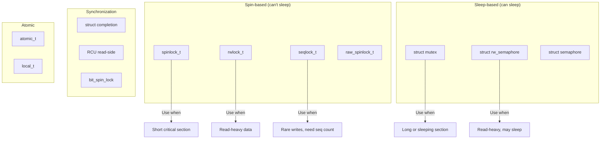
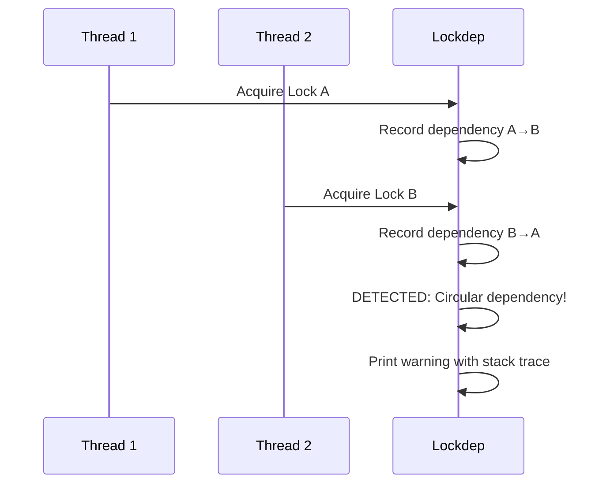

# Chapter 114: Locking

## Intuition

Imagine a busy intersection without traffic lights. Cars from all directions would crash into each other. Traffic lights ensure that only one direction flows at a time, preventing collisions while still allowing efficient traffic flow.

Kernel locking works the same way. The kernel is fundamentally concurrent: multiple CPUs execute simultaneously, interrupts can fire at any time, and kernel threads run in parallel. Without synchronization, two CPUs could write to the same data structure at the same time, corrupting it in ways that are extremely difficult to debug.

The kernel provides a rich set of locking primitives, each optimized for different scenarios. Choosing the right lock for the job is one of the most important skills in kernel development: too little locking causes data corruption; too much locking kills performance.

## Architecture

### Locking Primitives Overview



### When to Use Which Lock

| Scenario | Lock Type | Notes |
|----------|-----------|-------|
| Short critical section, no sleep | `spinlock_t` | Most common |
| Read-heavy, no sleep | `rwlock_t` | Multiple readers |
| Long critical section | `mutex` | Can sleep |
| Read-heavy, can sleep | `rw_semaphore` | VFS, page cache |
| Rare writes, need consistency | `seqlock` | Time, statistics |
| Wait for event | `completion` | I/O completion |
| Simple flag | `atomic_t` | Single variable |

## Kernel Implementation

### spinlock_t

A spinlock busy-waits until the lock is available:

```c
// include/linux/spinlock_types.h
typedef struct spinlock {
    union {
        struct raw_spinlock rlock;
#ifdef CONFIG_DEBUG_LOCK_ALLOC
# define LOCK_PADDING  \
        unsigned int padding[LOCK_PADDING_SIZE];
#endif
    };
} spinlock_t;

// Initialize
DEFINE_SPINLOCK(my_lock);

// Or dynamic
spin_lock_init(&my_lock);

// Usage
spin_lock(&my_lock);
// ... critical section ...
spin_unlock(&my_lock);

// Interrupt-safe variants
spin_lock_irq(&my_lock);           // Disables interrupts
spin_unlock_irq(&my_lock);

spin_lock_irqsave(&my_lock, flags); // Saves and disables
spin_unlock_irqrestore(&my_lock, flags);

// Try-lock (non-blocking)
if (spin_trylock(&my_lock)) {
    // Got the lock
    spin_unlock(&my_lock);
} else {
    // Lock was busy
}

// Bottom-half safe
spin_lock_bh(&my_lock);           // Disables softirqs
spin_unlock_bh(&my_lock);
```

#### Spinlock Implementation (x86-64)

```c
// arch/x86/include/asm/spinlock.h
static __always_inline void spin_lock(spinlock_t *lock)
{
    raw_spin_lock(&lock->rlock);
}

// kernel/locking/spinlock.c
static __always_inline void raw_spin_lock(raw_spinlock_t *lock)
{
    preempt_disable();
    spin_acquire(&lock->dep_map, 0, 0, _RET_IP_);
    LOCK_CONTENDED(lock, do_raw_spin_trylock, do_raw_spin_lock);
}

// arch/x86/include/asm/qspinlock.h
static __always_inline void do_raw_spin_lock(raw_spinlock_t *lock)
{
    arch_spin_lock(&lock->raw_lock);
}

// Actual locking (queued spinlock)
// Uses a combination of xchg and MCS queue
void queued_spin_lock_slowpath(struct qspinlock *lock, u32 val)
{
    struct mcs_spinlock *node = this_cpu_ptr(&qnodes[0].mcs);
    u32 old, tail;
    int idx;

    // Try to set _Q_PENDING_LOCKED
    if (val == 0) {
        old = atomic_cmpxchg(&lock->val, 0, _Q_PENDING_LOCKED);
        if (old == 0)
            return;  // Got the lock
    }

    // Queue-based spinning (MCS)
    tail = encode_tail(smp_processor_id(), idx);
    node->locked = 0;
    node->next = NULL;

    // Add to MCS queue
    old = xchg(&lock->tail, tail);
    // ... queue management ...
}
```

### rwlock_t

Readers can acquire the lock simultaneously; writers get exclusive access:

```c
// include/linux/rwlock_types.h
typedef struct {
    arch_rwlock_t raw_lock;
} rwlock_t;

// Initialize
DEFINE_RWLOCK(my_rwlock);

// Read lock (multiple readers allowed)
read_lock(&my_rwlock);
// ... read-only critical section ...
read_unlock(&my_rwlock);

// Write lock (exclusive)
write_lock(&my_rwlock);
// ... read-write critical section ...
write_unlock(&my_rwlock);

// Interrupt-safe
read_lock_irq(&my_rwlock);
read_unlock_irq(&my_rwlock);

write_lock_irqsave(&my_rwlock, flags);
write_unlock_irqrestore(&my_rwlock, flags);
```

### struct mutex

A sleeping lock that blocks the caller if contended:

```c
// include/linux/mutex.h
struct mutex {
    atomic_long_t owner;
    raw_spinlock_t wait_lock;
#ifdef CONFIG_MUTEX_SPIN_ON_OWNER
    struct optimistic_spin_queue osq;
#endif
    struct list_head wait_list;
#ifdef CONFIG_DEBUG_MUTEXES
    void *magic;
#endif
#ifdef CONFIG_DEBUG_LOCK_ALLOC
    struct lockdep_map dep_map;
#endif
};

// Initialize
DEFINE_MUTEX(my_mutex);

// Or dynamic
mutex_init(&my_mutex);

// Usage
mutex_lock(&my_mutex);
// ... critical section (can sleep!) ...
mutex_unlock(&my_mutex);

// Try-lock
if (mutex_trylock(&my_mutex)) {
    // Got the lock
    mutex_unlock(&my_mutex);
} else {
    // Lock was busy
}

// Interruptible (can be interrupted by signals)
if (mutex_lock_interruptible(&my_mutex)) {
    // Interrupted by signal
    return -ERESTARTSYS;
}

// Killable (can be killed by fatal signals)
if (mutex_lock_killable(&my_mutex)) {
    // Killed
    return -EINTR;
}
```

#### Mutex Implementation

```c
// kernel/locking/mutex.c
void __sched mutex_lock(struct mutex *lock)
{
    might_sleep();

    if (!__mutex_trylock_fast(lock))
        __mutex_lock_slowpath(lock);
}

static __always_inline bool __mutex_trylock_fast(struct mutex *lock)
{
    unsigned long curr = (unsigned long)current;
    unsigned long zero = 0UL;

    if (atomic_long_try_cmpxchg_acquire(&lock->owner, &zero, curr))
        return true;

    return false;
}

static noinline void __sched __mutex_lock_slowpath(struct mutex *lock)
{
    __mutex_lock(lock, TASK_UNINTERRUPTIBLE, 0, NULL, _RET_IP_);
}

// Waiter-based locking
static int __sched __mutex_lock(struct mutex *lock, unsigned int state,
                                unsigned int subclass,
                                struct lockdep_map *nest_lock,
                                unsigned long ip)
{
    struct mutex_waiter waiter;

    // Try optimistic spinning
    if (!mutex_optimistic_spin(lock, &waiter))
        return 0;

    // Add to wait list and sleep
    raw_spin_lock(&lock->wait_lock);
    list_add_tail(&waiter.list, &lock->wait_list);
    waiter.task = current;

    for (;;) {
        // Try to acquire
        if (__mutex_trylock(lock))
            break;

        // Prepare to sleep
        set_current_state(state);

        raw_spin_unlock(&lock->wait_lock);
        schedule_preempt_disabled();
        raw_spin_lock(&lock->wait_lock);
    }

    __set_current_state(TASK_RUNNING);
    list_del(&waiter.list);
    raw_spin_unlock(&lock->wait_lock);

    return 0;
}
```

### struct rw_semaphore

Read-write semaphore allowing multiple readers or one writer:

```c
// include/linux/rwsem.h
struct rw_semaphore {
    atomic_long_t count;
    atomic_long_t owner;
    struct optimistic_spin_queue osq;
    raw_spinlock_t wait_lock;
    struct list_head wait_list;
};

// Initialize
DECLARE_RWSEM(my_rwsem);

// Read lock
down_read(&my_rwsem);
// ... read-only critical section ...
up_read(&my_rwsem);

// Write lock
down_write(&my_rwsem);
// ... read-write critical section ...
up_write(&my_rwsem);

// Try variants
if (down_read_trylock(&my_rwsem)) {
    up_read(&my_rwsem);
}

// Killable
if (down_write_killable(&my_rwsem)) {
    return -EINTR;
}
```

### seqlock

A lock where readers never block but may need to retry:

```c
// include/linux/seqlock.h
typedef struct {
    unsigned sequence;
    spinlock_t lock;
} seqlock_t;

// Initialize
DEFINE_SEQLOCK(my_seqlock);

// Writer
write_seqlock(&my_seqlock);
// ... update data ...
write_sequnlock(&my_seqlock);

// Reader (must retry if sequence changed)
unsigned int seq;
do {
    seq = read_seqbegin(&my_seqlock);
    // ... read data ...
} while (read_seqretry(&my_seqlock, seq));

// Example: timekeeping
struct timespec64 xtime_seqlock_read(void)
{
    unsigned int seq;
    struct timespec64 ts;

    do {
        seq = read_seqbegin(&xtime_lock);
        ts = xtime;
    } while (read_seqretry(&xtime_lock, seq));

    return ts;
}
```

### completion

A one-shot synchronization primitive for waiting for an event:

```c
// include/linux/completion.h
struct completion {
    unsigned int done;
    wait_queue_head_t wait;
};

// Initialize
DECLARE_COMPLETION(my_completion);

// Or dynamic
init_completion(&my_completion);

// Wait for completion
wait_for_completion(&my_completion);

// Interruptible wait
if (wait_for_completion_interruptible(&my_completion))
    return -ERESTARTSYS;

// Timed wait
unsigned long timeout = wait_for_completion_timeout(&my_completion, HZ);
if (!timeout)
    return -ETIMEDOUT;

// Signal completion
complete(&my_completion);          // Wake one waiter
complete_all(&my_completion);      // Wake all waiters
```

## Source Code References

| File | Description |
|------|-------------|
| `kernel/locking/spinlock.c` | Spinlock implementation |
| `kernel/locking/mutex.c` | Mutex implementation |
| `kernel/locking/rwsem.c` | RW semaphore implementation |
| `kernel/locking/qrwlock.c` | Queued RW lock |
| `kernel/locking/qspinlock.c` | Queued spinlock |
| `kernel/locking/lockdep.c` | Lock dependency validator |
| `include/linux/spinlock.h` | Spinlock API |
| `include/linux/mutex.h` | Mutex API |
| `include/linux/rwsem.h` | RW semaphore API |
| `include/linux/seqlock.h` | Seqlock API |

## Data Structures

### Lock Dependency Validator

```c
// include/linux/lockdep.h
struct lockdep_map {
    struct lock_class_key *key;
    struct lock_class *class_cache[NR_LOCKDEP_CACHING_CLASSES];
    const char *name;
    int wait_type_outer;
    int wait_type_inner;
};

struct held_lock {
    u64 prev_chain_key;
    unsigned long acquire_ip;
    struct lockdep_map *instance;
    struct lock_class_key *lock_class;
    unsigned int irq_context;
    u8 nest_lock;
    u8 waittime_type;
    u8 read;
    u8 check;
    u8 hardirqs_off;
    int references;
};
```

## Diagrams

### Lock Acquisition Flow

```mermaid
flowchart TD
    A[Try to acquire lock] --> B{Lock available?}
    B -->|Yes| C[Acquire lock]
    C --> D[Enter critical section]
    D --> E[Exit critical section]
    E --> F[Release lock]

    B -->|No| G{Lock type?}
    G -->|spinlock| H[Spin (busy-wait)]
    H --> B
    G -->|mutex| I[Sleep on wait queue]
    I --> J[Woken up]
    J --> B
    G -->|rwsem read| K{Writer waiting?}
    K -->|No| L[Queue as reader]
    K -->|Yes| M[Wait for writer]
    M --> L
```

### Lock Ordering


### Deadlock Detection (Lockdep)



## Performance

### Lock Performance Characteristics

| Lock Type | Uncontended | Contended | Can Sleep | Overhead |
|-----------|------------|-----------|-----------|----------|
| spinlock | ~10 ns | Busy-wait | No | Very low |
| rwlock | ~10 ns | Busy-wait | No | Low |
| mutex | ~30 ns | Sleep | Yes | Low |
| rwsem | ~30 ns | Sleep | Yes | Low |
| seqlock (read) | ~5 ns | Retry | No | Minimal |
| seqlock (write) | ~30 ns | Busy-wait | No | Low |
| RCU (read) | ~0 ns | N/A | No | None |

### Lock Contention Detection

```bash
# Enable lockstat
echo 1 > /proc/lock_stat

# View statistics
cat /proc/lock_stat

# Lock contention profiling with perf
perf lock record -- sleep 5
perf lock report
```

## Security

### Locking Security Considerations

1. **Deadlock as DoS**: A deadlock can freeze the system
2. **Priority inversion**: Low-priority task holds lock needed by high-priority task
3. **Lockdep**: Prevents deadlocks by detecting lock ordering violations at runtime
4. **Lock elision**: Hardware lock elision (TSX) can be exploited for side channels

## Common Pitfalls

1. **Forgetting to unlock**: Every `spin_lock()` must have a matching `spin_unlock()`
2. **Sleeping while holding spinlock**: This causes scheduling-while-atomic bugs
3. **Lock ordering violations**: Always acquire locks in the same order to prevent deadlocks
4. **Using wrong lock for context**: Don't use spinlock when you need to sleep
5. **Double locking**: Don't acquire the same lock twice (unless it's designed for it)
6. **Missing interrupt protection**: If a lock is shared with interrupt context, use `spin_lock_irqsave()`

## Best Practices

1. **Keep critical sections short**: Minimize the code between lock and unlock
2. **Use lockdep**: Always enable `CONFIG_PROVE_LOCKING` during development
3. **Document lock ordering**: Comment which locks must be held and in what order
4. **Use the most restrictive lock possible**: Prefer spinlock over mutex if you don't need to sleep
5. **Use `spin_trylock()` when possible**: Avoids deadlocks in complex scenarios
6. **Use RCU for read-mostly data**: Avoids locking overhead entirely for readers

## Exercises

1. **Lockdep experiment**: Write a module that intentionally violates lock ordering and observe lockdep output
2. **Spinlock vs mutex**: Benchmark a shared counter with spinlock vs. mutex under contention
3. **Seqlock time**: Implement a seqlock-protected data structure with concurrent readers and writers
4. **Deadlock simulation**: Write code that deadlocks and use lockdep to diagnose it
5. **Lock profiling**: Use `perf lock` to find the most contended locks on your system
6. **Completion example**: Write a producer-consumer pattern using completions

## References

1. `Documentation/locking/` — Locking documentation.
2. `Documentation/locking/lockdep-design.rst` — Lockdep design.
3. Love, R. *Linux Kernel Development*, Chapter 9 and 10.
4. `kernel/locking/` — Locking subsystem source.
5. `Documentation/locking/locktypes.rst` — Lock type selection guide.
6. https://lwn.net/Articles/263735/ — Lockless patterns.
