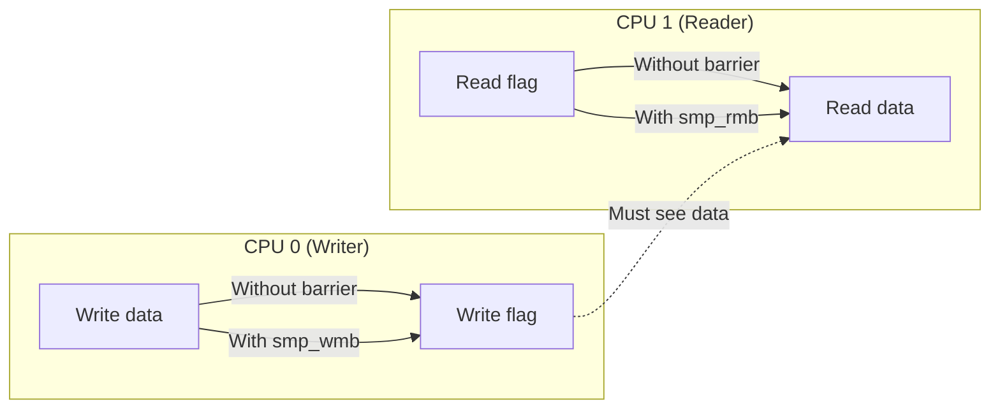
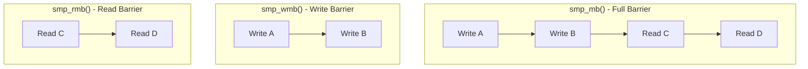

# Chapter 115: Atomic Operations and Memory Barriers

## Intuition

On a single CPU, reading and writing a variable seems instant and indivisible. But on a multi-core system, things get much more complicated. Two CPUs can write to the same variable simultaneously, reads can be reordered by the CPU pipeline, and writes to different variables may become visible to other CPUs in a different order than you wrote them.

Atomic operations ensure that a read-modify-write sequence (like incrementing a counter) happens indivisibly — no other CPU can interfere in the middle. Memory barriers ensure that operations are seen in the correct order by other CPUs — for example, ensuring that data is written to memory before a flag is set to announce the data is ready.

These are the lowest-level synchronization primitives in the kernel. Everything else — spinlocks, mutexes, RCU — is built on top of them. Understanding atomics and barriers is essential for writing correct lock-free code and for understanding how the kernel's synchronization primitives work internally.

## Architecture

### Atomic vs. Non-Atomic Operations

```c
// Non-atomic (DANGEROUS on multi-core!)
counter++;  // May be: read counter → increment → write counter
            // Another CPU can interfere between read and write

// Atomic (safe on multi-core)
atomic_inc(&counter);  // Hardware guarantees indivisibility
```

### Memory Ordering

Without barriers, CPUs and compilers can reorder operations:

```
// Original code:
data = 42;
flag = 1;

// CPU 0 might execute as:
flag = 1;      // Reordered! flag set before data
data = 42;

// Without a barrier, CPU 1 might see flag=1 but data=0
```

## Kernel Implementation

### Atomic Types

```c
// include/linux/types.h
typedef struct {
    int counter;
} atomic_t;

typedef struct {
    s64 counter;
} atomic64_t;

typedef struct {
    int counter;
} atomic_long_t;
```

### Atomic Operations API

```c
// include/linux/atomic.h

// Read and write
int atomic_read(const atomic_t *v);
void atomic_set(atomic_t *v, int i);

// Arithmetic
void atomic_add(int i, atomic_t *v);
void atomic_sub(int i, atomic_t *v);
void atomic_inc(atomic_t *v);
void atomic_dec(atomic_t *v);

// Return the result
int atomic_add_return(int i, atomic_t *v);
int atomic_sub_return(int i, atomic_t *v);
int atomic_inc_return(atomic_t *v);
int atomic_dec_return(atomic_t *v);

// Conditional
int atomic_add_unless(atomic_t *v, int a, int u);
int atomic_inc_not_zero(atomic_t *v);

// Compare and swap
int atomic_cmpxchg(atomic_t *v, int old, int new);
int atomic_xchg(atomic_t *v, int new);

// Bitwise
void atomic_and(int mask, atomic_t *v);
void atomic_or(int mask, atomic_t *v);
void atomic_xor(int mask, atomic_t *v);
```

### Atomic Operations Implementation (x86-64)

```c
// arch/x86/include/asm/atomic.h
// x86 has native atomic support via LOCK prefix

static __always_inline void arch_atomic_add(int i, atomic_t *v)
{
    asm volatile(LOCK_PREFIX "addl %1,%0"
                 : "+m" (v->counter)
                 : "ir" (i)
                 : "memory");
}

static __always_inline int arch_atomic_add_return(int i, atomic_t *v)
{
    return i + xadd(&v->counter, i);
}

static __always_inline int arch_atomic_cmpxchg(atomic_t *v,
                                                int old, int new)
{
    return cmpxchg(&v->counter, old, new);
}

// The LOCK prefix ensures:
// 1. Exclusive access to the cache line
// 2. Full memory barrier before and after
// 3. Atomicity of the read-modify-write
```

### xadd — Exchange and Add

```c
// arch/x86/include/asm/cmpxchg.h
#define xadd(ptr, inc)                          \
({                                              \
    typeof(ptr) __ptr = (ptr);                  \
    typeof(*__ptr) __ret = *(ptr);              \
    switch (sizeof(*__ptr)) {                   \
    case 1:                                     \
        asm volatile("xaddb %b0, %1\n"          \
                     : "+r" (__ret), "+m" (*__ptr) \
                     : : "memory", "cc");       \
        break;                                  \
    case 2:                                     \
        asm volatile("xaddw %w0, %1\n"          \
                     : "+r" (__ret), "+m" (*__ptr) \
                     : : "memory", "cc");       \
        break;                                  \
    case 4:                                     \
        asm volatile("xaddl %0, %1\n"           \
                     : "+r" (__ret), "+m" (*__ptr) \
                     : : "memory", "cc");       \
        break;                                  \
    case 8:                                     \
        asm volatile("xaddq %q0, %1\n"          \
                     : "+r" (__ret), "+m" (*__ptr) \
                     : : "memory", "cc");       \
        break;                                  \
    }                                           \
    __ret;                                      \
})
```

### Memory Barriers

```c
// include/asm-generic/barrier.h

// Full memory barrier (all reads and writes before are
// visible before any reads and writes after)
#define smp_mb()    __smp_mb()

// Write barrier (all writes before are visible before
// any writes after)
#define smp_wmb()   __smp_wmb()

// Read barrier (all reads before are visible before
// any reads after)
#define smp_rmb()   __smp_rmb()

// Compiler barrier (prevents compiler reordering only)
#define barrier()   __asm__ __volatile__("" : : : "memory")

// Data dependency barrier (for dependent reads)
#define smp_read_barrier_depends()  __smp_read_barrier_depends()
```

### x86 Memory Barriers

```c
// arch/x86/include/asm/barrier.h
// x86 has strong ordering — most barriers are no-ops

#define __smp_mb()  asm volatile("mfence" : : : "memory")
#define __smp_wmb() asm volatile("" : : : "memory")  // x86 is WMB-ordered
#define __smp_rmb() asm volatile("" : : : "memory")  // x86 is RMB-ordered

// Note: x86 provides:
// - Total Store Ordering (TSO): stores are seen in order
// - Reads are not reordered with other reads
// - Writes are not reordered with older reads
// But: reads CAN be reordered with older writes
```

### ARM64 Memory Barriers

```c
// arch/arm64/include/asm/barrier.h
// ARM64 has weak ordering — barriers are real instructions

#define __smp_mb()  asm volatile("dmb ish" : : : "memory")
#define __smp_wmb() asm volatile("dmb ishst" : : : "memory")
#define __smp_rmb() asm volatile("dmb ishld" : : : "memory")
```

### READ_ONCE / WRITE_ONCE

```c
// include/asm-generic/rwonce.h
// Prevent compiler from optimizing away or reordering accesses

#define READ_ONCE(x)                                    \
({                                                      \
    union { typeof(x) __val; char __c[1]; } __u =       \
        { .__c = { 0 } };                               \
    __read_once_size(&(x), __u.__c, sizeof(x));          \
    __u.__val;                                          \
})

#define WRITE_ONCE(x, val)                              \
({                                                      \
    union { typeof(x) __val; char __c[1]; } __u =       \
        { .__val = (val) };                              \
    __write_once_size(&(x), __u.__c, sizeof(x));         \
    __u.__val;                                          \
})

// Usage:
// Prevent compiler from caching, merging, or reordering
val = READ_ONCE(shared_variable);
WRITE_ONCE(shared_variable, new_value);
```

### smp_store_release / smp_load_acquire

```c
// include/asm-generic/barrier.h
// Acquire/release semantics (lighter than full barriers)

#define smp_store_release(p, v)                         \
do {                                                    \
    typeof(p) __p = (p);                                \
    typeof(*__p) __v = (v);                             \
    // Ensure all prior stores complete before this store
    __smp_store_release(__p, __v);                      \
} while (0)

#define smp_load_acquire(p)                             \
({                                                      \
    typeof(p) __p = (p);                                \
    typeof(*__p) __v;                                   \
    // Ensure this load completes before subsequent loads
    __v = __smp_load_acquire(__p);                      \
    __v;                                                \
})

// Example usage:
// Producer:
WRITE_ONCE(data, value);            // Write data
smp_store_release(&flag, 1);        // Release: data visible before flag

// Consumer:
if (smp_load_acquire(&flag)) {      // Acquire: see data after flag
    val = READ_ONCE(data);          // Guaranteed to see the data
}
```

### Atomic Bit Operations

```c
// include/asm-generic/bitops/atomic.h
void set_bit(int nr, volatile unsigned long *addr);
void clear_bit(int nr, volatile unsigned long *addr);
void change_bit(int nr, volatile unsigned long *addr);

// Test and set (return old value)
int test_and_set_bit(int nr, volatile unsigned long *addr);
int test_and_clear_bit(int nr, volatile unsigned long *addr);
int test_and_change_bit(int nr, volatile unsigned long *addr);

// Test (non-atomic read)
int test_bit(int nr, const volatile unsigned long *addr);

// Non-atomic variants (caller must ensure exclusivity)
void __set_bit(int nr, volatile unsigned long *addr);
void __clear_bit(int nr, volatile unsigned long *addr);
int __test_and_set_bit(int nr, volatile unsigned long *addr);
```

## Source Code References

| File | Description |
|------|-------------|
| `include/linux/atomic.h` | Atomic API |
| `include/asm-generic/atomic-instrumented.h` | Instrumented atomics |
| `arch/x86/include/asm/atomic.h` | x86 atomic implementation |
| `arch/x86/include/asm/barrier.h` | x86 barriers |
| `include/asm-generic/barrier.h` | Generic barriers |
| `include/asm-generic/rwonce.h` | READ_ONCE/WRITE_ONCE |
| `include/linux/bitops.h` | Bit operations |
| `Documentation/memory-barriers.txt` | Comprehensive barrier documentation |

## Data Structures

### Atomic Long (optimized for 64-bit)

```c
// include/linux/atomic/atomic-long.h
typedef struct {
    long counter;
} atomic_long_t;

static inline long atomic_long_read(atomic_long_t *l)
{
    return READ_ONCE(l->counter);
}

static inline void atomic_long_set(atomic_long_t *l, long i)
{
    WRITE_ONCE(l->counter, i);
}
```

## Diagrams

### Atomic Increment on x86

```mermaid
sequenceDiagram
    participant CPU0 as CPU 0
    participant CPU1 as CPU 1
    participant CACHE as Cache Line

    Note over CACHE: counter = 5

    CPU0->>CACHE: LOCK; INC (counter)
    Note over CACHE: Exclusive access guaranteed
    Note over CACHE: counter = 6

    CPU1->>CACHE: LOCK; INC (counter)
    Note over CACHE: Exclusive access guaranteed
    Note over CACHE: counter = 7
```

### Memory Ordering



### Barrier Types



## Performance

### Atomic Operation Costs

| Operation | x86-64 Cost | ARM64 Cost | Notes |
|-----------|-------------|------------|-------|
| atomic_read() | ~1 ns | ~1 ns | Normal load |
| atomic_set() | ~1 ns | ~1 ns | Normal store |
| atomic_add() | ~5-20 ns | ~10-30 ns | LOCK prefix |
| atomic_cmpxchg() | ~5-20 ns | ~10-30 ns | LOCK prefix |
| atomic_xchg() | ~5-20 ns | ~10-30 ns | LOCK prefix |
| smp_mb() | ~20 ns | ~20 ns | mfence/dmb |
| smp_wmb() | ~0 ns | ~20 ns | No-op on x86 |
| smp_rmb() | ~0 ns | ~20 ns | No-op on x86 |

### Cache Line Contention

```c
// BAD: False sharing (different variables on same cache line)
struct {
    atomic_t cpu0_counter;  // 4 bytes
    atomic_t cpu1_counter;  // 4 bytes — same 64-byte cache line!
};

// GOOD: Separate cache lines
struct {
    atomic_t cpu0_counter __cacheline_aligned;
    atomic_t cpu1_counter __cacheline_aligned;
};
```

## Security

### Atomic Operation Security

1. **Speculative execution**: Atomic operations may be speculatively executed and then rolled back
2. **Side channels**: Cache line contention from atomic operations can leak information
3. **TOCTOU**: Using atomic operations correctly prevents time-of-check-to-time-of-use races

## Common Pitfalls

1. **Using `=` instead of `atomic_set()`**: Non-atomic writes to atomic variables break the contract
2. **Forgetting memory barriers**: Lock-free algorithms often need explicit barriers
3. **Assuming sequential consistency**: Without barriers, operations may appear reordered to other CPUs
4. **False sharing**: Variables accessed by different CPUs on the same cache line cause contention
5. **Overusing atomics**: Not every variable needs to be atomic — use them only when shared

## Best Practices

1. **Use `READ_ONCE()`/`WRITE_ONCE()`**: For any variable shared between CPUs or with interrupts
2. **Use `smp_store_release()`/`smp_load_acquire()`**: For producer-consumer patterns
3. **Use full `smp_mb()` sparingly**: It's expensive; prefer acquire/release
4. **Align to cache lines**: Use `__cacheline_aligned` for frequently accessed shared variables
5. **Document your memory ordering requirements**: Comment which barriers are needed and why
6. **Read `Documentation/memory-barriers.txt`**: The definitive guide to kernel memory ordering

## Exercises

1. **Atomic counter**: Write a kernel module with an atomic counter incremented from multiple CPUs
2. **Barrier experiment**: Write code that demonstrates reordering without barriers (on weakly-ordered arch)
3. **Compare-and-swap**: Implement a lock-free stack using `atomic_cmpxchg()`
4. **False sharing**: Measure the performance impact of false sharing vs. cache-line-aligned variables
5. **READ_ONCE/WRITE_ONCE**: Write a shared flag variable and observe compiler behavior with and without these macros
6. **Acquire/release**: Implement a producer-consumer using `smp_store_release()` and `smp_load_acquire()`

## References

1. `Documentation/memory-barriers.txt` — Comprehensive memory barrier guide.
2. `Documentation/atomic_t.txt` — Atomic operations API.
3. Love, R. *Linux Kernel Development*, Chapter 10.
4. McKenney, P. *Memory Barriers: A Hardware View for Software Hackers*.
5. `include/linux/atomic.h` — Atomic API reference.
6. Intel/AMD Architecture manuals — x86 memory ordering.
7. ARM Architecture Reference Manual — ARM64 memory ordering.
