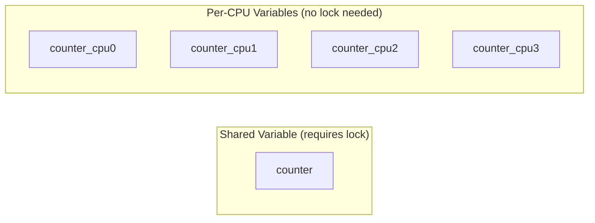
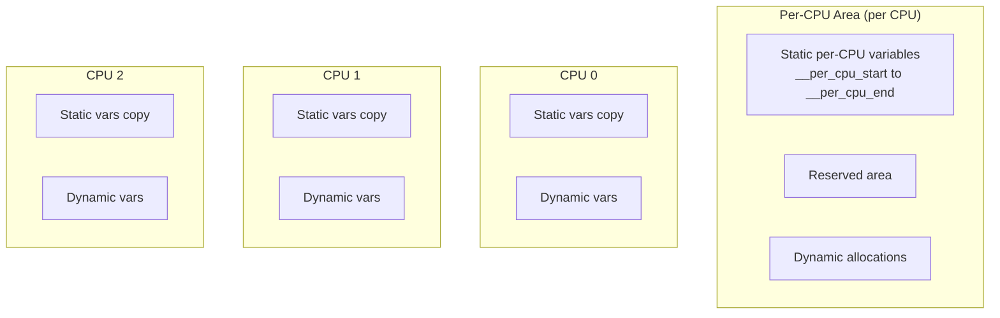
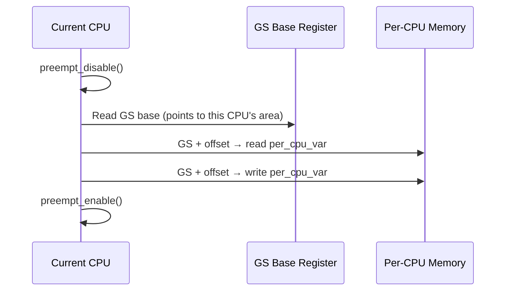

# Chapter 116: Per-CPU Variables

## Intuition

Imagine a filing cabinet that each employee has at their own desk. No one else touches your cabinet, so you never need to lock it. You can open it, grab a file, update it, and close it without any fear of someone else interfering. That's essentially what per-CPU variables provide — each CPU gets its own private copy of a variable, eliminating the need for synchronization.

Per-CPU variables are one of the kernel's most important scalability mechanisms. When a variable is accessed primarily by the CPU it's local to, there's no contention, no cache-line bouncing, and no need for locks. The trade-off is memory — you have one copy per CPU instead of one shared copy — and the need to aggregate values when you need a global view.

The kernel uses per-CPU variables extensively: scheduler run queues, network statistics, memory allocator caches, interrupt counters, and many more. Understanding per-CPU variables is essential for writing scalable kernel code.

## Architecture

### Per-CPU Variable Concept



### How Per-CPU Works

Each CPU has its own copy of the variable, accessed via a segment register:

```
CPU 0: fs:per_cpu_var → copy_0
CPU 1: fs:per_cpu_var → copy_1
CPU 2: fs:per_cpu_var → copy_2
CPU 3: fs:per_cpu_var → copy_3
```

On x86-64, the GS base register points to the per-CPU area for the current CPU.

## Kernel Implementation

### Defining Per-CPU Variables

```c
// include/linux/percpu-defs.h

// Static per-CPU variable (at compile time)
DEFINE_PER_CPU(int, my_counter);
DEFINE_PER_CPU(struct my_struct, my_data);

// Static per-CPU variable, initially zero
DEFINE_PER_CPU(int, my_zero_counter);

// Read-mostly per-CPU variable (better cache behavior)
DEFINE_PER_CPU_READ_MOSTLY(struct my_struct, my_readmostly);

// Declaration (for use in headers)
DECLARE_PER_CPU(int, my_counter);

// Aligned to cache line
DEFINE_PER_CPU_ALIGNED(struct my_cache_aligned, my_aligned);
```

### Accessing Per-CPU Variables

```c
// Get the value on the current CPU
int val = get_cpu_var(my_counter);  // Disables preemption
put_cpu_var(my_counter);            // Re-enables preemption

// Or using this_cpu operations (often more efficient)
int val = this_cpu_read(my_counter);
this_cpu_write(my_counter, new_val);

// Increment
this_cpu_inc(my_counter);
this_cpu_dec(my_counter);
this_cpu_add(my_counter, 5);

// More complex operations
int old = this_cpu_xchg(my_counter, new_val);
int cmp = this_cpu_cmpxchg(my_counter, old, new_val);

// Access a specific CPU's copy (NOT recommended, use get_cpu_var)
int val = per_cpu(my_counter, cpu_id);
```

### Preemption Considerations

```c
// WRONG: Preemption may move us to another CPU between read and write
val = this_cpu_read(my_counter);
val++;
this_cpu_write(my_counter, val);  // May be on different CPU!

// RIGHT: Disable preemption
preempt_disable();
val = this_cpu_read(my_counter);
val++;
this_cpu_write(my_counter, val);
preempt_enable();

// RIGHT: Use get_cpu_var (disables preemption automatically)
get_cpu_var(my_counter)++;
put_cpu_var(my_counter);

// RIGHT: Use atomic this_cpu operations
this_cpu_inc(my_counter);  // Atomic on the current CPU
```

### Dynamic Per-CPU Allocation

```c
// For dynamically allocated per-CPU variables
int __percpu *my_dynamic_var;

// Allocate
my_dynamic_var = __alloc_percpu(sizeof(int), __alignof__(int));

// Or with flags
my_dynamic_var = __alloc_percpu_gfp(sizeof(int), __alignof__(int),
                                     GFP_KERNEL);

// Access
*per_cpu_ptr(my_dynamic_var, get_cpu()) = 42;
put_cpu();

// Or use this_cpu_ptr
*this_cpu_ptr(my_dynamic_var) = 42;

// Free
free_percpu(my_dynamic_var);
```

### Per-CPU Allocator Internals

```c
// mm/percpu.c
struct pcpu_chunk {
    struct list_head list;
    int free_bytes;
    struct pcpu_block_md chunk_md;
    void *base_addr;
    unsigned long *bound_map;
    unsigned long *decided_hint;
    unsigned long *lazy_free_bitmap;
    // ...
};

// Per-CPU area management
struct pcpu_alloc_info {
    size_t static_size;
    size_t reserved_size;
    size_t dyn_size;
    size_t unit_size;
    size_t atom_size;
    size_t alloc_size;
    size_t __ai_size;
    int nr_groups;
    struct pcpu_group_info groups[];
};
```

### Summing Per-CPU Variables

```c
// To get a global view, sum across all CPUs
int total = 0;
int cpu;

for_each_possible_cpu(cpu) {
    total += per_cpu(my_counter, cpu);
}

// Or use the helper
int total = 0;
for_each_online_cpu(cpu) {
    total += per_cpu(my_counter, cpu);
}

// Note: this is NOT atomic — for approximate counts only
// For exact counts, use this_cpu_add and read with preemption disabled
```

## Source Code References

| File | Description |
|------|-------------|
| `include/linux/percpu-defs.h` | Per-CPU definition macros |
| `include/linux/percpu.h` | Per-CPU allocator API |
| `mm/percpu.c` | Per-CPU allocator implementation |
| `arch/x86/include/asm/percpu.h` | x86 per-CPU access |
| `include/asm-generic/percpu.h` | Generic per-CPU access |
| `include/linux/sched.h` | `task_struct` uses per-CPU |

## Data Structures

### Per-CPU Chunk Allocator

```c
// mm/percpu.c
static struct pcpu_chunk *pcpu_first_chunk;
static struct pcpu_chunk *pcpu_reserved_chunk;

// Per-CPU chunk structure
struct pcpu_chunk {
    struct list_head list;          // Chunk list
    int free_bytes;                 // Free space
    struct pcpu_block_md chunk_md;  // Metadata
    void *base_addr;                // Base address
    unsigned long *bound_map;       // Boundary map
    unsigned long *decided_hint;    // Allocation hint
    unsigned long *lazy_free_bitmap; // Lazy free tracking
    int nr_pages;                   // Number of pages
    struct page **pages;            // Page array
    // ...
};
```

## Diagrams

### Per-CPU Memory Layout



### Per-CPU Access Pattern



## Performance

### Per-CPU vs. Shared Variable

| Approach | Read/Write | Cache Behavior | Scalability |
|----------|-----------|----------------|-------------|
| Shared atomic | ~20 ns | Cache-line bouncing | Poor |
| Shared + spinlock | ~50 ns | Cache-line bouncing | Poor |
| Per-CPU | ~5 ns | Local cache | Excellent |

### When to Use Per-CPU

| Scenario | Use Per-CPU? | Notes |
|----------|-------------|-------|
| Per-CPU statistics | Yes | Classic use case |
| Per-CPU caches | Yes | SLUB allocator |
| Per-CPU work queues | Yes | Workqueue pools |
| Shared counter (exact) | Maybe | Need atomic sum |
| Read-only data | No | Use const or RCU |
| Rarely accessed | No | Overhead not worth it |

## Security

### Per-CPU Security

1. **Isolation**: Per-CPU data is inherently isolated between CPUs
2. **No locking needed**: Eliminates a class of synchronization bugs
3. **Information leakage**: Per-CPU variables are in kernel memory, protected from user space

## Common Pitfalls

1. **Preemption bugs**: Accessing per-CPU variables with preemption enabled can cause data corruption
2. **Forgetting put_cpu_var()**: Always pair `get_cpu_var()` with `put_cpu_var()`
3. **Using per_cpu() directly**: Prefer `this_cpu_read()`/`this_cpu_write()` for safety
4. **Assuming atomicity**: `per_cpu(var, cpu)++` is NOT atomic
5. **Memory overhead**: Each copy uses memory; don't use per-CPU for large, rarely-accessed structures

## Best Practices

1. **Use this_cpu operations**: They're safer and often more efficient
2. **Use DEFINE_PER_CPU_READ_MOSTLY**: For data that's read often but written rarely
3. **Align to cache lines**: Use `DEFINE_PER_CPU_ALIGNED` to avoid false sharing between CPUs
4. **Aggregate carefully**: When summing, be aware of races with concurrent updates
5. **Use per-CPU for statistics**: Network counters, scheduler stats, etc.
6. **Consider the memory cost**: Each per-CPU variable costs `sizeof(var) × num_CPUs`

## Exercises

1. **Per-CPU counter**: Write a kernel module with a per-CPU counter incremented from multiple CPUs
2. **Global aggregation**: Implement a function to safely sum all per-CPU counter values
3. **Performance comparison**: Benchmark per-CPU counter vs. atomic counter
4. **Dynamic per-CPU**: Write a module using `__alloc_percpu()` for dynamic per-CPU allocation
5. **Cache alignment**: Compare performance of aligned vs. unaligned per-CPU variables
6. **Scheduler statistics**: Examine per-CPU scheduler statistics in `/proc/schedstat`

## References

1. `Documentation/percpu-rw-semaphore.rst` — Per-CPU RW semaphore.
2. `mm/percpu.c` — Per-CPU allocator source.
3. Love, R. *Linux Kernel Development*, Chapter 10.
4. `include/linux/percpu-defs.h` — Per-CPU definition macros.
5. `arch/x86/include/asm/percpu.h` — x86 per-CPU implementation.
