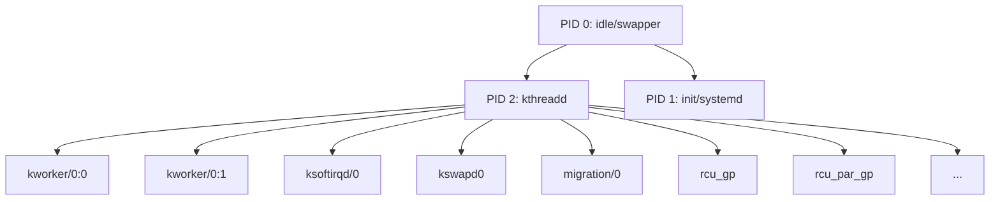
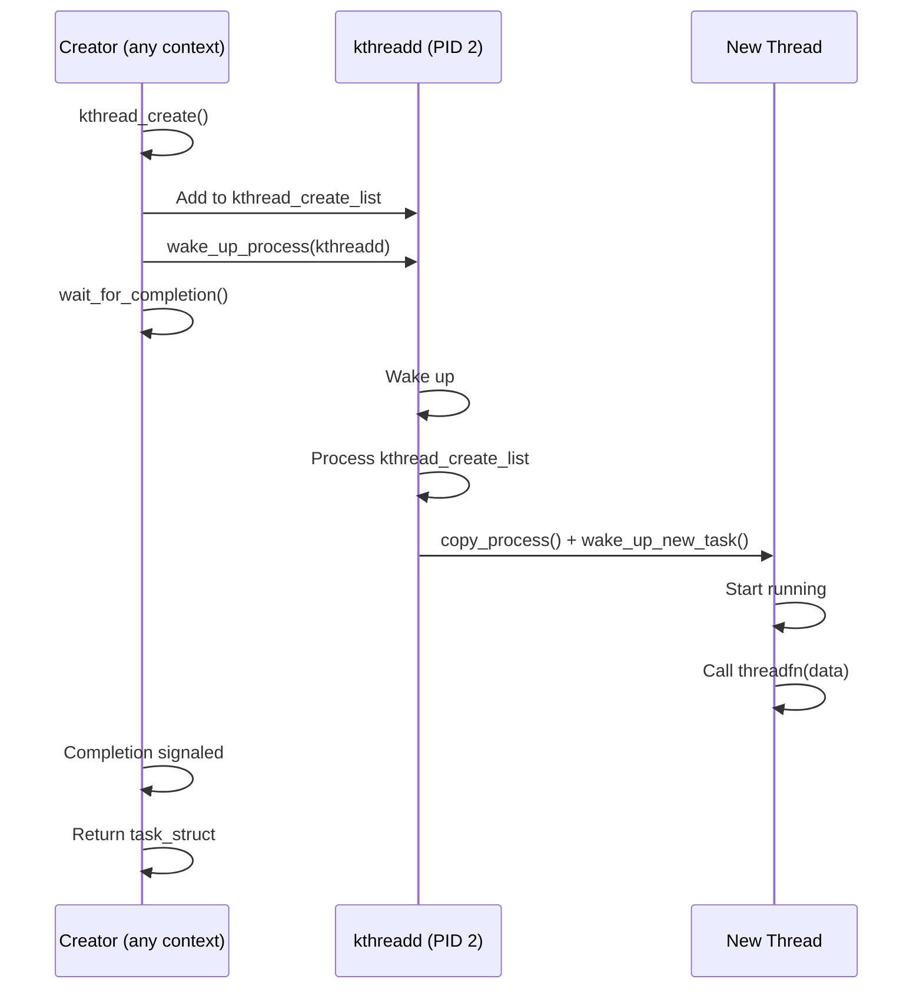
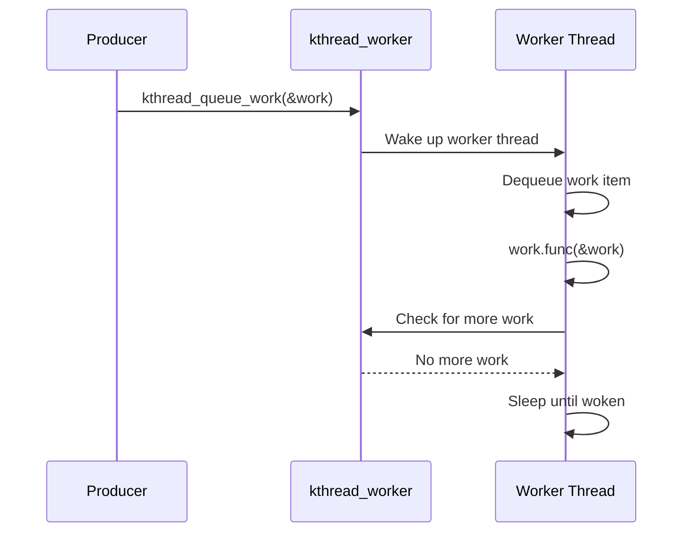

# Chapter 117: Kernel Threads

## Intuition

When the kernel needs to do something that takes time — flushing dirty pages to disk, handling network packet processing, or managing memory compaction — it can't just block a user-space process to do it. Instead, it creates its own threads that run in kernel space, independent of any user process.

Kernel threads are like the behind-the-scenes workers of the operating system. You never interact with them directly, but they're constantly running in the background, keeping the system healthy. When you run `ps aux` and see processes like `[kworker/0:1]`, `[ksoftirqd/0]`, or `[kswapd0]`, those are kernel threads.

Unlike user-space threads, kernel threads have full access to the kernel's memory and APIs. They don't have a user address space (`mm` is NULL), they don't appear in `/proc/[pid]/exe`, and they can't be killed with `kill -9`. They exist solely to serve the kernel's needs.

## Architecture

### Kernel Thread Hierarchy



### kthreadd — The Thread Creator

All kernel threads (except PID 0 and 1) are created by `kthreadd` (PID 2). This ensures proper namespace and cgroup setup.

## Kernel Implementation

### Creating Kernel Threads

```c
// include/linux/kthread.h

// Create and wake a kernel thread
struct task_struct *kthread_create(int (*threadfn)(void *data),
                                   void *data,
                                   const char namefmt[],
                                   ...);

// Create and start immediately
struct task_struct *kthread_run(int (*threadfn)(void *data),
                                void *data,
                                const char namefmt[],
                                ...);

// Stop a kernel thread
int kthread_stop(struct task_struct *k);
bool kthread_should_stop(void);

// Example
static int my_thread_fn(void *data)
{
    struct my_device *dev = data;

    while (!kthread_should_stop()) {
        // Do work
        process_data(dev);

        // Sleep until woken or should stop
        set_current_state(TASK_INTERRUPTIBLE);
        if (!kthread_should_stop())
            schedule();
        set_current_state(TASK_RUNNING);
    }

    return 0;
}

// Create and start
struct task_struct *task;
task = kthread_run(my_thread_fn, dev, "my_thread_%d", dev->id);
if (IS_ERR(task)) {
    pr_err("Failed to create thread\n");
    return PTR_ERR(task);
}

// Stop
kthread_stop(task);
```

### kthread_create() Implementation

```c
// kernel/kthread.c
struct task_struct *kthread_create_on_node(int (*threadfn)(void *data),
                                           void *data,
                                           int node,
                                           const char namefmt[],
                                           ...)
{
    struct kthread_create_info create;

    create.threadfn = threadfn;
    create.data = data;
    create.node = node;
    init_completion(&create.done);
    INIT_LIST_HEAD(&create.list);

    // Wake up kthreadd to create the thread
    spin_lock(&kthread_create_lock);
    list_add_tail(&create.list, &kthread_create_list);
    spin_unlock(&kthread_create_lock);

    // Signal kthreadd
    wake_up_process(kthreadd_task);

    // Wait for thread creation
    wait_for_completion(&create.done);

    if (!IS_ERR(create.result)) {
        // Set the thread name
        struct task_struct *task = create.result;
        va_list args;
        va_start(args, namefmt);
        vsnprintf(task->comm, sizeof(task->comm), namefmt, args);
        va_end(args);
    }

    return create.result;
}
```

### kthreadd — The Thread Manager

```c
// kernel/kthread.c
int kthreadd(void *unused)
{
    struct task_struct *tsk = current;

    // Set up kthreadd
    set_task_comm(tsk, "kthreadd");
    ignore_signals(tsk);
    set_cpus_allowed_ptr(tsk, cpu_all_mask);
    set_mems_allowed(node_states[N_MEMORY]);

    current->flags |= PF_NOFREEZE;

    for (;;) {
        // Check for thread creation requests
        set_current_state(TASK_INTERRUPTIBLE);
        if (list_empty(&kthread_create_list))
            schedule();

        __set_current_state(TASK_RUNNING);

        spin_lock(&kthread_create_lock);
        while (!list_empty(&kthread_create_list)) {
            struct kthread_create_info *create;

            create = list_entry(kthread_create_list.next,
                                struct kthread_create_info, list);
            list_del_init(&create->list);
            spin_unlock(&kthread_create_lock);

            // Create the thread
            create->result = create_kthread(create);

            spin_lock(&kthread_create_lock);
        }
        spin_unlock(&kthread_create_lock);
    }

    return 0;
}

static struct task_struct *create_kthread(struct kthread_create_info *create)
{
    struct task_struct *task;

    // Create the thread
    task = copy_process(CLONE_FS | CLONE_FILES, ...);
    if (IS_ERR(task))
        return task;

    // Set up the thread
    task->flags |= PF_KTHREAD;
    task->mm = NULL;  // No user address space

    // Set the stack and entry point
    ((struct kthread *)task->stack)->threadfn = create->threadfn;
    ((struct kthread *)task->stack)->data = create->data;

    // Start the thread
    wake_up_new_task(task);

    return task;
}
```

### kthread Worker Framework

For more structured kernel thread usage:

```c
// include/linux/kthread.h
struct kthread_worker {
    struct task_struct *task;
    struct list_head work_list;
    struct list_head delayed_work_list;
    spinlock_t lock;
    int current_work_seq;
};

struct kthread_work {
    struct list_head node;
    kthread_work_func_t func;
    struct kthread_worker *worker;
    int canceling;
};

struct kthread_delayed_work {
    struct kthread_work work;
    struct timer_list timer;
};

// Initialize
DEFINE_KTHREAD_WORKER(my_worker);
DEFINE_KTHREAD_WORK(my_work, my_work_func);

// Create worker thread
struct task_struct *worker_task;
worker_task = kthread_run(kthread_worker_fn, &my_worker,
                          "my_worker");

// Queue work
kthread_queue_work(&my_worker, &my_work);

// Queue delayed work
kthread_queue_delayed_work(&my_worker, &my_delayed_work, HZ);

// Cancel
kthread_cancel_work_sync(&my_work);
kthread_cancel_delayed_work_sync(&my_delayed_work);
```

### Common Kernel Threads

```c
// ksoftirqd — Handles softirqs when they take too long
static int ksoftirqd_should_run(unsigned int cpu)
{
    return local_softirq_pending();
}

// kswapd — Memory reclaim
static int kswapd(void *p)
{
    unsigned int balance_classzone_idx;

    for (;;) {
        // Wait for memory pressure
        wait_event_interruptible(pgdat->kswapd_wait,
                                 pgdat_kswapd_needed(pgdat));

        // Reclaim memory
        balance_classzone_idx = kswapd_shrink_node(pgdat);

        // ...
    }
}

// kworker — Workqueue worker threads
static int worker_thread(void *__worker)
{
    struct worker *worker = __worker;

    for (;;) {
        // Wait for work
        prepare_to_wait(&worker->more_work, &wait,
                        TASK_INTERRUPTIBLE);
        if (!need_more_work(worker))
            schedule();
        finish_wait(&worker->more_work, &wait);

        // Process work items
        process_scheduled_works(worker);
    }
}

// migration — CPU migration threads
static int migration_thread(void *data)
{
    struct rq *rq = data;

    for (;;) {
        // Wait for migration requests
        wait_for_completion(&rq->migration_done);

        // Migrate tasks
        __migrate_task(rq);
    }
}
```

### Per-CPU Kernel Threads

Many kernel threads are created per-CPU:

```c
// kernel/softirq.c
static __init int spawn_ksoftirqd(void)
{
    cpuhp_setup_state_nocalls(CPUHP_SOFTIRQ_DEAD,
                              "softirq:dead", NULL,
                              takeover_tasklets);
    for_each_possible_cpu(cpu) {
        // Create ksoftirqd for each CPU
        struct task_struct *p;

        p = kthread_create_on_node(run_ksoftirqd, NULL,
                                    cpu_to_node(cpu),
                                    "ksoftirqd/%d", cpu);
        kthread_bind(p, cpu);
        per_cpu(ksoftirqd, cpu) = p;
        wake_up_process(p);
    }
    return 0;
}
```

## Source Code References

| File | Description |
|------|-------------|
| `kernel/kthread.c` | Kernel thread implementation |
| `include/linux/kthread.h` | Kernel thread API |
| `kernel/workqueue.c` | kworker threads |
| `kernel/softirq.c` | ksoftirqd |
| `mm/vmscan.c` | kswapd |
| `kernel/sched/core.c` | migration threads |
| `kernel/rcu/tree.c` | RCU threads |

## Data Structures

### kthread Internal Structure

```c
// kernel/kthread.c
struct kthread {
    int (*threadfn)(void *data);
    void *data;
    int node;
    unsigned int flags;
    struct completion parked;
    struct completion exited;
};

#define to_kthread(ts) \
    ((struct kthread *)(ts->stack))

// Per-CPU kthread storage
DEFINE_PER_CPU(struct task_struct *, ksoftirqd);
DEFINE_PER_CPU(struct task_struct *, kworker);
```

## Diagrams

### kthread Creation Flow



### kthread Worker Pattern



## Performance

### Kernel Thread Overhead

| Component | Cost | Notes |
|-----------|------|-------|
| Thread creation | ~10-50 μs | copy_process + wake |
| Context switch | ~1-5 μs | Same as regular threads |
| Per-thread memory | ~8-16 KB | Kernel stack |
| Per-CPU threads | ~8 KB × num_CPUs | Significant on large systems |

### Tuning

```bash
# View kernel threads
ps -eLf | grep '\[.*\]'

# Count kernel threads
ps -eLf | grep '\[.*\]' | wc -l

# Set kernel thread priority
chrt -p -f 50 $(pgrep kswapd)

# Bind kernel thread to CPU
taskset -p 1 $(pgrep ksoftirqd/0)
```

## Security

### Kernel Thread Security

1. **Privileged context**: Kernel threads run with full kernel privileges
2. **No user isolation**: Kernel threads are not subject to user-space security policies
3. **cgroup control**: Kernel threads can be placed in cgroups for resource control
4. **Namespaces**: Kernel threads are in the initial namespace

## Common Pitfalls

1. **Not checking kthread_should_stop()**: Without this check, the thread can't be cleanly stopped
2. **Forgetting kthread_stop()**: Leaks the kernel thread
3. **Not handling signals**: Use `ignore_signals()` or handle them explicitly
4. **Creating too many threads**: Each thread consumes stack memory and adds scheduling overhead
5. **Not pinning to CPU**: Per-CPU work should be pinned to the correct CPU

## Best Practices

1. **Use kthread_run()**: Simpler than `kthread_create()` + `wake_up_process()`
2. **Always check kthread_should_stop()**: In the thread's main loop
3. **Use kthread_worker**: For structured work processing
4. **Name threads descriptively**: Helps with debugging
5. **Pin to CPU when appropriate**: Use `kthread_bind()` for per-CPU work
6. **Handle errors**: Check `IS_ERR()` on the return value of `kthread_create()`

## Exercises

1. **Simple kernel thread**: Write a module that creates a kernel thread that prints a message every second
2. **kthread_stop**: Implement proper cleanup with `kthread_should_stop()` and `kthread_stop()`
3. **kthread_worker**: Write a module using the kthread_worker framework
4. **Per-CPU threads**: Create per-CPU kernel threads that process per-CPU data
5. **Thread monitoring**: Use `ps` and `/proc/[pid]/status` to examine kernel thread properties
6. **Error handling**: Write a module that handles all error paths in kernel thread creation

## References

1. `kernel/kthread.c` — Kernel thread implementation.
2. `include/linux/kthread.h` — Kernel thread API.
3. Love, R. *Linux Kernel Development*, Chapter 8.
4. `Documentation/driver-api/basics.rst` — Driver basics including kernel threads.
5. `kernel/workqueue.c` — Workqueue (kworker) implementation.
