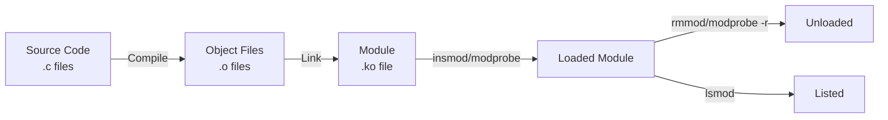
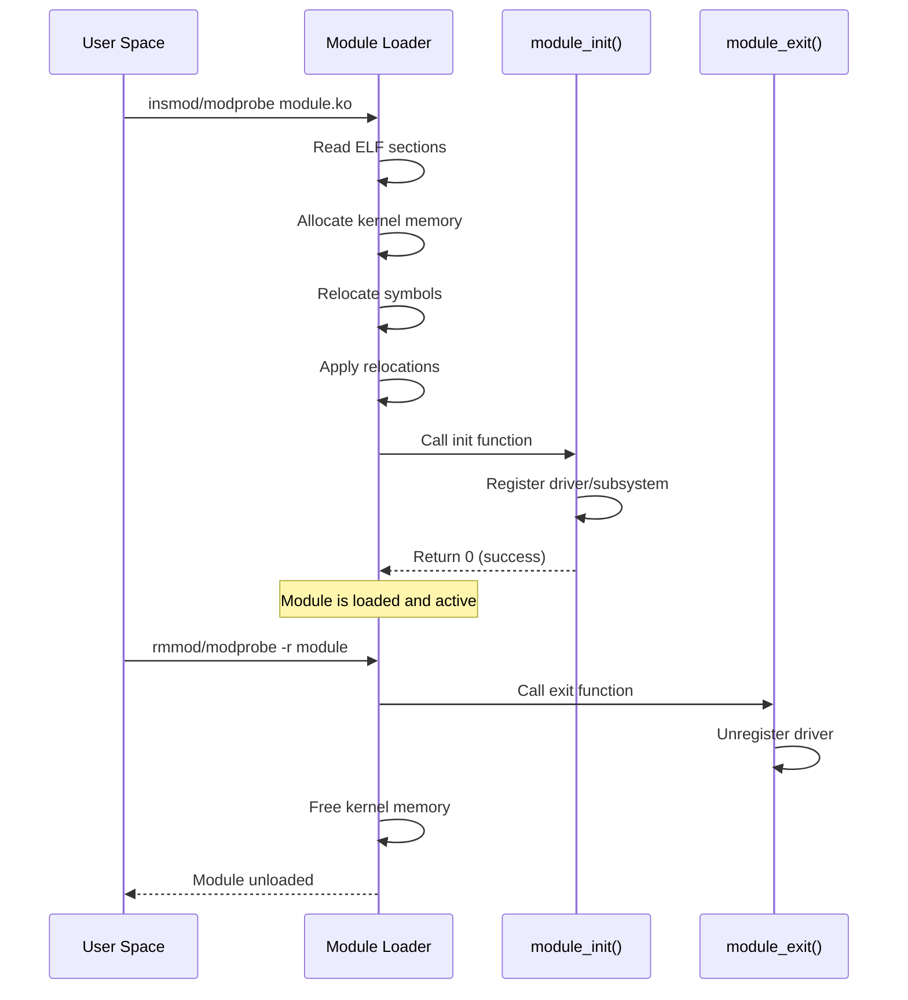
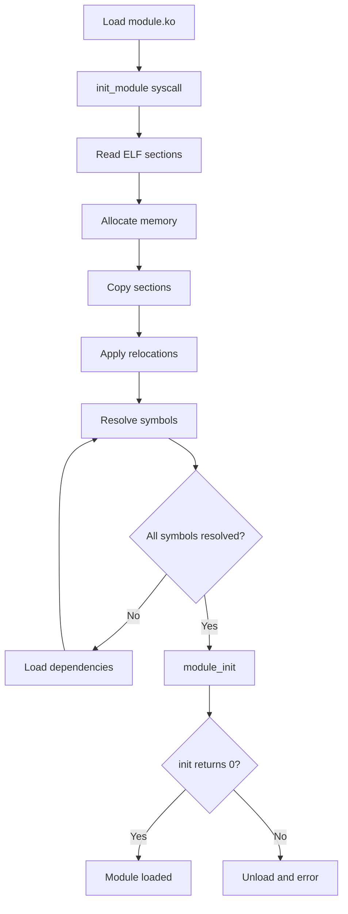
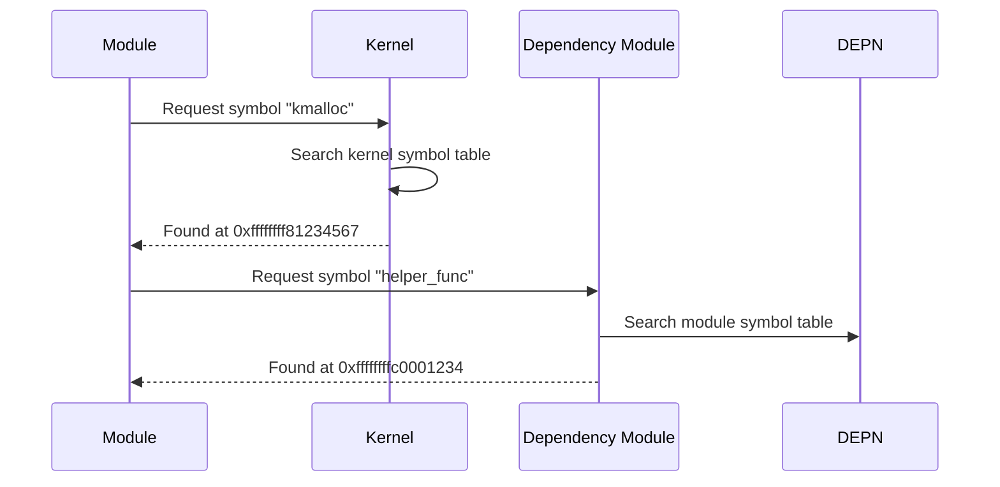

# Chapter 118: Kernel Modules

## Intuition

Imagine if every time you wanted to add a new feature to your car — a GPS, a dashcam, a new stereo — you had to rebuild the entire car from scratch. That would be absurd. Instead, you just plug in the new device and it works.

Kernel modules provide the same plug-and-play capability for the Linux kernel. Instead of rebuilding the entire kernel to add support for a new device, filesystem, or protocol, you compile the code into a module (`.ko` file) and load it at runtime. When you're done, you can unload it to free resources.

Modules are the primary way device drivers are delivered. When you plug in a USB device, the kernel loads the appropriate module automatically. When you install a new graphics driver, it's typically a kernel module. The module system makes the kernel flexible and extensible without requiring a rebuild for every configuration change.

## Architecture

### Module Lifecycle



### Module Loading Flow



## Kernel Implementation

### Module Source Code

```c
// hello.c — Simple kernel module
#include <linux/module.h>
#include <linux/kernel.h>
#include <linux/init.h>

static int __init hello_init(void)
{
    pr_info("Hello, kernel module!\n");
    return 0;
}

static void __exit hello_exit(void)
{
    pr_info("Goodbye, kernel module!\n");
}

module_init(hello_init);
module_exit(hello_exit);

MODULE_LICENSE("GPL");
MODULE_AUTHOR("Example Author");
MODULE_DESCRIPTION("A simple kernel module");
MODULE_VERSION("1.0");
```

### Module Makefile

```makefile
# Makefile for kernel module
obj-m := hello.o

# For multiple source files
# obj-m := mymodule.o
# mymodule-objs := main.o helper.o utils.o

KDIR ?= /lib/modules/$(shell uname -r)/build

all:
	$(MAKE) -C $(KDIR) M=$(PWD) modules

clean:
	$(MAKE) -C $(KDIR) M=$(PWD) clean

install:
	$(MAKE) -C $(KDIR) M=$(PWD) modules_install
	depmod -a
```

### Module Initialization

```c
// include/linux/init.h
// __init — function is called only during initialization
// The memory is freed after init completes
static int __init my_init(void)
{
    // Initialization code
    // This memory is freed after the function returns
    return 0;  // 0 = success, negative = error
}

// __exit — function is called only during unload
// Not called if module is built-in
static void __exit my_exit(void)
{
    // Cleanup code
}

// Register init/exit functions
module_init(my_init);
module_exit(my_exit);

// Alternate naming (auto-detection)
// If your functions are named init_module/cleanup_module,
// the module_init/module_exit macros are not needed
int init_module(void) { ... }
void cleanup_module(void) { ... }
```

### Module Parameters

```c
#include <moduleparam.h>

// Module parameters (set at load time)
static int my_int = 42;
module_param(my_int, int, 0644);
MODULE_PARM_DESC(my_int, "An integer parameter");

static char *my_string = "default";
module_param(my_string, charp, 0644);
MODULE_PARM_DESC(my_string, "A string parameter");

static int my_array[3] = {1, 2, 3};
module_param_array(my_array, int, NULL, 0644);
MODULE_PARM_DESC(my_array, "An array parameter");

// Permission bits:
// 0644 = owner rw, group r, other r
// 0444 = read-only for all
// 0200 = write-only for owner
// Use 0644 for parameters that can be changed at runtime
// Use 0444 for read-only parameters
```

### Exporting Symbols

```c
// Make a symbol visible to other modules
EXPORT_SYMBOL(my_function);
EXPORT_SYMBOL_GPL(my_function);  // GPL-only export

// Example
int my_helper_function(int arg)
{
    return arg * 2;
}
EXPORT_SYMBOL(my_helper_function);

// Other modules can now call my_helper_function()
```

### Module Dependencies

```c
// If module B depends on module A:
// Module A must export the symbols B needs
// Module B uses EXPORT_SYMBOL_GPL or EXPORT_SYMBOL from A

// modprobe handles dependencies automatically via modules.dep
// Generated by: depmod -a
```

### Character Device Module

```c
#include <linux/module.h>
#include <linux/fs.h>
#include <linux/cdev.h>
#include <linux/uaccess.h>

#define DEVICE_NAME "mychardev"
#define BUFFER_SIZE 1024

static dev_t devno;
static struct cdev my_cdev;
static char buffer[BUFFER_SIZE];
static size_t buffer_len;

static int my_open(struct inode *inode, struct file *filp)
{
    pr_info("mychardev: opened\n");
    return 0;
}

static int my_release(struct inode *inode, struct file *filp)
{
    pr_info("mychardev: closed\n");
    return 0;
}

static ssize_t my_read(struct file *filp, char __user *ubuf,
                        size_t count, loff_t *ppos)
{
    if (*ppos >= buffer_len)
        return 0;

    if (count > buffer_len - *ppos)
        count = buffer_len - *ppos;

    if (copy_to_user(ubuf, buffer + *ppos, count))
        return -EFAULT;

    *ppos += count;
    return count;
}

static ssize_t my_write(struct file *filp, const char __user *ubuf,
                         size_t count, loff_t *ppos)
{
    if (count > BUFFER_SIZE)
        count = BUFFER_SIZE;

    if (copy_from_user(buffer, ubuf, count))
        return -EFAULT;

    buffer_len = count;
    *ppos = count;
    return count;
}

static const struct file_operations my_fops = {
    .owner = THIS_MODULE,
    .open = my_open,
    .release = my_release,
    .read = my_read,
    .write = my_write,
};

static int __init mychardev_init(void)
{
    int ret;

    // Allocate device number
    ret = alloc_chrdev_region(&devno, 0, 1, DEVICE_NAME);
    if (ret < 0) {
        pr_err("mychardev: failed to allocate device number\n");
        return ret;
    }

    // Initialize cdev
    cdev_init(&my_cdev, &my_fops);
    my_cdev.owner = THIS_MODULE;

    // Add cdev
    ret = cdev_add(&my_cdev, devno, 1);
    if (ret < 0) {
        pr_err("mychardev: failed to add cdev\n");
        unregister_chrdev_region(devno, 1);
        return ret;
    }

    pr_info("mychardev: registered with major %d, minor %d\n",
            MAJOR(devno), MINOR(devno));
    return 0;
}

static void __exit mychardev_exit(void)
{
    cdev_del(&my_cdev);
    unregister_chrdev_region(devno, 1);
    pr_info("mychardev: unregistered\n");
}

module_init(mychardev_init);
module_exit(mychardev_exit);
MODULE_LICENSE("GPL");
```

### Module Information Macros

```c
// Required: License
MODULE_LICENSE("GPL");              // GPL v2
MODULE_LICENSE("GPL v2");           // GPL v2
MODULE_LICENSE("Dual BSD/GPL");     // Dual license
MODULE_LICENSE("Proprietary");      // Proprietary (tainted kernel)

// Optional information
MODULE_AUTHOR("Name <email>");
MODULE_DESCRIPTION("Description of the module");
MODULE_VERSION("1.0.0");
MODULE_ALIAS("alias-name");         // Module alias
MODULE_DEVICE_TABLE(type, table);   // Device table for auto-loading

// Supported licenses:
// "GPL" — GNU General Public License v2
// "GPL v2" — GNU General Public License v2
// "Dual BSD/GPL" — Dual BSD/GPL
// "Dual MIT/GPL" — Dual MIT/GPL
// "Proprietary" — Proprietary (taints kernel)
```

## Source Code References

| File | Description |
|------|-------------|
| `kernel/module.c` | Module loader core |
| `kernel/module/main.c` | Main module code |
| `kernel/module/decompress.c` | Module decompression |
| `include/linux/module.h` | Module structures |
| `include/linux/moduleparam.h` | Module parameters |
| `scripts/Makefile.modpost` | Module post-link |
| `scripts/mod/modpost.c` | Module post-processing |

## Data Structures

### Module Structure

```c
// include/linux/module.h
struct module {
    enum module_state state;

    struct list_head list;
    char name[MODULE_NAME_LEN];

    struct module_kobject mkobj;
    struct module_attribute *modinfo_attrs;
    const char *version;
    const char *srcversion;
    struct kobject *holders_dir;

    const struct kernel_symbol *syms;       // Exported symbols
    const s32 *crcs;
    unsigned int num_syms;

    struct mutex param_lock;
    struct kernel_param *kp;                // Module parameters
    unsigned int num_kp;

    unsigned int num_gpl_syms;
    const struct kernel_symbol *gpl_syms;
    const s32 *gpl_crcs;

    // Init/exit functions
    int (*init)(void);
    void (*exit)(void);

    // ...
};

enum module_state {
    MODULE_STATE_LIVE,      // Normal state
    MODULE_STATE_COMING,    // Being loaded
    MODULE_STATE_GOING,     // Being unloaded
    MODULE_STATE_UNFORMED,  // Being created
};
```

## Diagrams

### Module Loading Process



### Module Symbol Resolution



## Performance

### Module Loading Performance

| Operation | Time | Notes |
|-----------|------|-------|
| Module load (small) | ~1-10 ms | Depends on size |
| Module load (large, e.g., GPU) | ~100-500 ms | Device initialization |
| Symbol resolution | ~1-100 μs per symbol | Depends on symbol table size |
| Module unload | ~1-10 ms | Cleanup time |

### Module Size Optimization

```bash
# Strip debug symbols
strip --strip-debug module.ko

# Use CONFIG_MODULES_COMPRESS
# Gzip or XZ compression of modules

# Check module size
ls -la /lib/modules/$(uname -r)/kernel/
```

## Security

### Module Security

1. **Module signing**: Only signed modules can load with secure boot
2. **Module verification**: `CONFIG_MODULE_SIG` enforces signatures
3. **Tainted kernels**: Proprietary modules "taint" the kernel
4. **Lockdown mode**: Prevents loading unsigned modules in secure boot
5. **CAP_SYS_MODULE**: Required to load modules (root or capable)

```bash
# Check if module is signed
modinfo module_name | grep sig

# Verify module signature
scripts/sign-file -v signing_key.pem module.ko

# Check kernel taint
cat /proc/sys/kernel/tainted
```

## Common Pitfalls

1. **Not checking return values**: Always check if `module_init()` returns an error
2. **Forgetting module_exit()**: Without it, the module can't be unloaded
3. **Memory leaks**: Free all allocated memory in the exit function
4. **Using GPL-only symbols**: Non-GPL modules can't use `EXPORT_SYMBOL_GPL` symbols
5. **Not handling dependencies**: Use `modprobe` instead of `insmod` for automatic dependency resolution
6. **ABI instability**: Kernel modules must be rebuilt for each kernel version

## Best Practices

1. **Use `modprobe`**: Handles dependencies and modprobe.d configuration
2. **Use `__init` and `__exit`:** Saves memory after initialization
3. **Export only necessary symbols**: Minimize the module's interface
4. **Use MODULE_LICENSE("GPL")**: Required for GPL-only symbols
5. **Handle all error paths**: Clean up on failure in init
6. **Use devm_ functions**: Automatic resource cleanup
7. **Test with different kernel versions**: Use `#if LINUX_VERSION_CODE` checks

## Exercises

1. **Hello module**: Write, compile, and load a simple "Hello World" kernel module
2. **Module parameters**: Add integer and string parameters to your module
3. **Character device**: Write a module that creates a character device in `/dev`
4. **Module dependencies**: Create two modules where one depends on the other's exported symbol
5. **Module signing**: Sign a module and verify it loads with module signing enabled
6. **Error handling**: Write a module that properly handles all error paths in init

## References

1. `Documentation/kbuild/modules.rst` — Building modules.
2. `Documentation/admin-guide/module-signing.rst` — Module signing.
3. Love, R. *Linux Kernel Development*, Chapter 2.
4. `include/linux/module.h` — Module structures.
5. `kernel/module.c` — Module loader source.
6. https://tldp.org/LDP/lkmpg/2.6/html/ — Linux Kernel Module Programming Guide.
