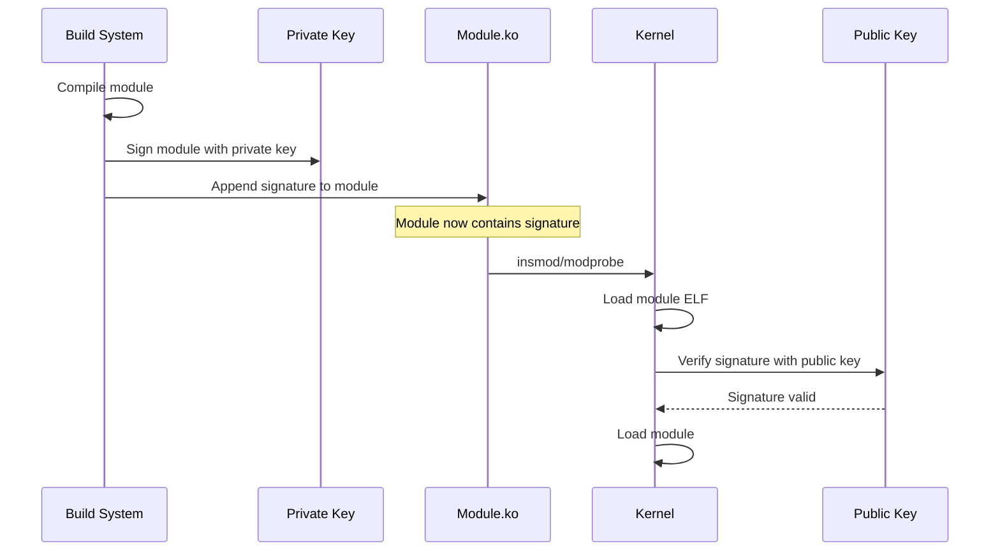
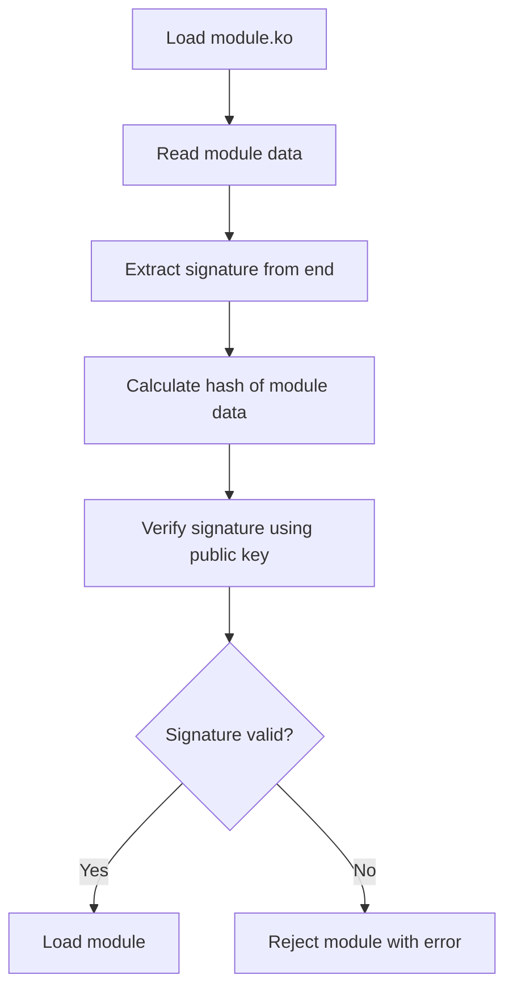
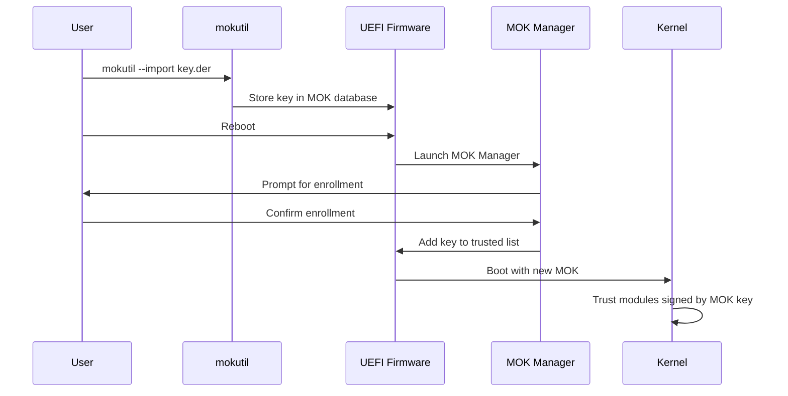

# Chapter 119: Module Signing

## Intuition

When you download a program from the internet, how do you know it hasn't been tampered with? Digital signatures provide the answer: the author signs the code with their private key, and you verify it with their public key. If the signature matches, you know the code is authentic and hasn't been modified.

Module signing applies this same principle to kernel modules. A malicious kernel module has complete control over the system — it can read all memory, bypass all security mechanisms, and hide itself from detection. Module signing ensures that only modules signed by a trusted key can be loaded into the kernel, preventing attackers from loading malicious code even if they gain root access.

This is particularly important with UEFI Secure Boot, where the firmware verifies the bootloader, the bootloader verifies the kernel, and the kernel verifies its modules. This creates a chain of trust from the hardware to the running system.

## Architecture

### Chain of Trust

```mermaid
graph TD
    HW[Hardware / Firmware] -->|Verifies| UEFI[UEFI Secure Boot]
    UEFI -->|Verifies| BOOTLOADER[Bootloader (GRUB)]
    BOOTLOADER -->|Verifies| KERNEL[Kernel Image]
    KERNEL -->|Verifies| MODULES[Kernel Modules]
    KERNEL -->|Verifies| INITRAMFS[Initramfs]

    style HW fill:#f96
    style UEFI fill:#f96
    style BOOTLOADER fill:#ff6
    style KERNEL fill:#6f6
    style MODULES fill:#6f6
```

### Module Signing Flow



## Kernel Implementation

### Kernel Configuration

```kconfig
# Kernel configuration for module signing
CONFIG_MODULE_SIG=y              # Enable module signing
CONFIG_MODULE_SIG_FORCE=y        # Reject unsigned modules
CONFIG_MODULE_SIG_ALL=y          # Sign all modules during build
CONFIG_MODULE_SIG_SHA256=y       # Use SHA-256 for signing

# Key configuration
CONFIG_MODULE_SIG_KEY="certs/signing_key.pem"  # Signing key
CONFIG_SYSTEM_TRUSTED_KEYS="debian/certs/debian-uefi-certs.pem"
CONFIG_SYSTEM_TRUSTED_KEYRING=y  # Use system keyring

# Secure Boot integration
CONFIG_EFI_SECURE_BOOT_LOCK_DOWN=y
CONFIG_SECURITY_LOCKDOWN_LSM=y
```

### Signing Process

```bash
# During kernel build, modules are signed automatically:
# make modules → scripts/Makefile.modpost → scripts/sign-file

# Manual signing:
scripts/sign-file <hash-algo> <private-key> <certificate> module.ko

# Example:
scripts/sign-file sha256 certs/signing_key.pem certs/signing_key.x509 module.ko

# Signing algorithms:
# sha1, sha224, sha256, sha384, sha512
# Default: sha256
```

### sign-file Implementation

```c
// scripts/sign-file.c (simplified)
int main(int argc, char **argv)
{
    const char *hash_algo = argv[1];
    const char *private_key = argv[2];
    const char *x509 = argv[3];
    const char *module = argv[4];

    // 1. Read the module
    module_data = read_file(module);

    // 2. Calculate hash of module contents
    hash = calculate_hash(module_data, hash_algo);

    // 3. Sign the hash with private key
    signature = sign_hash(hash, private_key);

    // 4. Create PKCS#7 signed data
    pkcs7 = create_pkcs7(signature, x509);

    // 5. Append signature to module
    append_signature(module_data, pkcs7);
}
```

### Module Verification

```c
// kernel/module/signing.c
int mod_verify_sig(const void *mod, struct load_info *info)
{
    struct module_signature ms;
    struct public_key_signature sig;
    const void *sig_data;
    size_t sig_len;
    int ret;

    // 1. Extract signature from module
    ret = mod_extract_sig(mod, info->len, &ms, &sig_data, &sig_len);
    if (ret)
        return ret;

    // 2. Verify the signature
    ret = verify_pkcs7_signature(mod, info->len - sig_len,
                                  sig_data, sig_len,
                                  NULL, VERIFYING_MODULE_SIGNATURE,
                                  NULL, NULL);

    return ret;
}
```

### MOK (Machine Owner Key)

For UEFI Secure Boot, MOK allows users to add their own trusted keys:

```bash
# List current MOK
mokutil --list-enrolled

# Import a new MOK
mokutil --import signing_key.der

# After reboot, the MOK manager will prompt for enrollment

# Check if Secure Boot is enabled
mokutil --sb-state

# Disable module signature enforcement (for testing)
mokutil --disable-validation
```

### Key Generation

```bash
# Generate a signing key pair for module signing
# During kernel build, keys are generated automatically:
# x509.genkey → openssl → signing_key.pem + signing_key.x509

# Manual key generation:
openssl req -new -nodes -utf8 -sha256 -days 36500 \
    -batch -x509 -config x509.genkey \
    -outform DER -out signing_key.x509 \
    -keyout signing_key.pem

# x509.genkey configuration file:
cat > x509.genkey << EOF
[ req ]
default_bits = 4096
distinguished_name = req_distinguished_name
prompt = no
string_mask = utf8only
x509_extensions = myexts

[ req_distinguished_name ]
O = My Organization
CN = Module Signing Key
emailAddress = admin@example.com

[ myexts ]
basicConstraints=critical,CA:FALSE
keyUsage=digitalSignature
subjectKeyIdentifier=hash
authorityKeyIdentifier=keyid
EOF
```

## Source Code References

| File | Description |
|------|-------------|
| `kernel/module/signing.c` | Module signature verification |
| `kernel/module/main.c` | Module loading (calls verification) |
| `scripts/sign-file.c` | Signing tool |
| `scripts/Makefile.modpost` | Build-time signing |
| `certs/` | Certificate management |
| `include/crypto/pkcs7.h` | PKCS#7 API |
| `crypto/asymmetric_keys/` | Asymmetric key support |

## Data Structures

### Module Signature

```c
// include/linux/module_signature.h
struct module_signature {
    uint8_t algo;       // Public-key crypto algorithm
    uint8_t hash;       // Digest algorithm
    uint8_t id_type;    // Key identifier type
    uint8_t signer_len; // Length of signer
    uint8_t key_id_len; // Length of key identifier
    uint8_t __pad[3];
    uint32_t sig_len;   // Length of signature
};

// Signature appended to module:
// [module data] [module_signature] [signature data]
```

### Public Key

```c
// include/linux/public_key.h
struct public_key {
    const void *key;
    u32 keylen;
    const char *id_type;
    const char *algo;
};

struct public_key_signature {
    struct asymmetric_key_id *auth_ids[2];
    u8 *s;              // Signature data
    u32 s_size;         // Signature size
    u8 *digest;         // Digest
    u8 digest_size;
    const char *pkey_algo;
    const char *hash_algo;
};
```

## Diagrams

### Module Signature Verification



### MOK Enrollment Flow



## Performance

### Module Signing Overhead

| Operation | Time | Notes |
|-----------|------|-------|
| Signing (build time) | ~10-100 ms | One-time cost |
| Verification (load time) | ~1-10 ms | Per module load |
| RSA-2048 verification | ~1-5 ms | Typical |
| RSA-4096 verification | ~5-20 ms | Stronger key |
| ECDSA verification | ~0.5-2 ms | Faster alternative |

## Security

### Module Signing Security Considerations

1. **Key protection**: The private signing key must be kept secure
2. **Key rotation**: Plan for key expiration and rotation
3. **Revocation**: No built-in revocation mechanism; rely on key removal
4. **Secure Boot interaction**: Module signing is part of the Secure Boot chain
5. **Lockdown mode**: When enabled, prevents loading unsigned modules even with root

### Security Policies

```bash
# Check kernel lockdown status
cat /sys/kernel/security/lockdown

# Module signing modes:
# CONFIG_MODULE_SIG_FORCE=y — All modules must be signed
# CONFIG_MODULE_SIG=y — Signing available but not enforced
# CONFIG_MODULE_SIG=n — No signing support

# Check module signature
modinfo -F sig_id module_name

# Verify module signature manually
scripts/sign-file -v signing_key.pem module.ko
```

## Common Pitfalls

1. **Forgetting to sign modules**: Modules must be signed before loading with `CONFIG_MODULE_SIG_FORCE`
2. **Key mismatch**: The kernel's public key must match the private key used for signing
3. **Secure Boot conflicts**: Module signing may conflict with Secure Boot if keys aren't enrolled
4. **Build system issues**: Ensure the build system has access to signing keys
5. **Testing with enforced signing**: Use `module.sig_enforce=0` during development

## Best Practices

1. **Use strong keys**: RSA-4096 or ECDSA-P384
2. **Protect private keys**: Store them securely, use hardware security modules (HSMs)
3. **Automate signing**: Integrate into the build system
4. **Test without enforcement**: Use `module.sig_enforce=0` during development
5. **Document key management**: Document key generation, storage, and rotation procedures
6. **Use MOK for custom keys**: Enroll your keys via MOK for Secure Boot compatibility

## Exercises

1. **Key generation**: Generate a signing key pair for kernel modules
2. **Module signing**: Sign a kernel module and verify the signature
3. **Enforcement testing**: Enable `CONFIG_MODULE_SIG_FORCE` and test loading unsigned modules
4. **MOK enrollment**: Enroll a custom key using mokutil
5. **Signature verification**: Use modinfo and scripts/sign-file to verify module signatures
6. **Secure Boot**: Test module signing with UEFI Secure Boot enabled

## References

1. `Documentation/admin-guide/module-signing.rst` — Module signing documentation.
2. `Documentation/admin-guide/LSM/lockdown.rst` — Lockdown documentation.
3. `scripts/sign-file.c` — Signing tool source.
4. `kernel/module/signing.c` — Verification source.
5. `Documentation/admin-guide/secure-boot.rst` — Secure Boot documentation.
