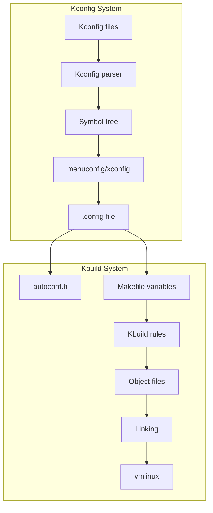
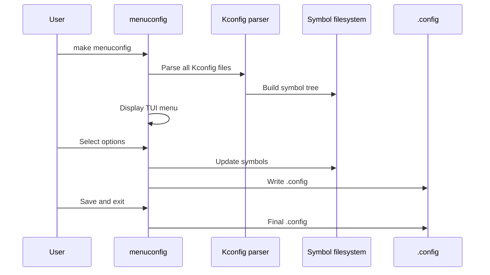

# Chapter 120: Kernel Configuration

## Intuition

The Linux kernel is one of the most configurable software projects in existence. A single kernel source tree can produce kernels for everything from tiny embedded devices with 16MB of RAM to supercomputers with thousands of CPUs. This flexibility comes from a powerful configuration system that lets you enable, disable, or modularize virtually every feature.

The configuration system is built on two components: **Kconfig**, which defines the available options and their dependencies, and **Kbuild**, which uses the configuration to compile the kernel. Together, they form a system that manages over 15,000 configuration options across hundreds of source directories.

Understanding kernel configuration is essential for anyone building custom kernels, optimizing for specific hardware, or developing kernel features. Whether you're building a minimal embedded kernel or a full-featured server kernel, the configuration system is your control panel.

## Architecture

### Configuration Workflow

```mermaid
flowchart TD
    A[Kconfig files<br>in each directory] -->|make menuconfig| B[.config]
    B -->|scripts/kconfig| C[include/generated/autoconf.h]
    B --> D[include/config/]
    B --> E[Makefile variables]

    C --> F[C preprocessor<br>#define CONFIG_*]
    D --> G[Tristate values<br>y/m/n]
    E --> H[Kbuild system]

    H --> I[make -j$(nproc)]
    I --> J[vmlinux / bzImage]
    I --> K[*.ko modules]
```

### Configuration Options

Every configuration option has:
- **Name**: `CONFIG_FOO`
- **Type**: bool (y/n), tristate (y/m/n), int, hex, string
- **Default**: Default value
- **Dependencies**: Other options that must be set
- **Help text**: Documentation

## Kernel Implementation

### Kconfig Language

```kconfig
# Boolean option (y or n)
config DEBUG_KERNEL
    bool "Kernel debugging"
    help
      Say Y here if you want to debug kernel issues. This
      enables various debugging features.

# Tristate (y, m, or n)
config EXT4_FS
    tristate "The Extended 4 (ext4) filesystem"
    depends on BLOCK
    select CRC32
    select JBD2
    help
      This is the journaling filesystem from ext3.

# Integer
config NR_CPUS
    int "Maximum number of CPUs"
    range 2 8192
    default 8 if X86_64
    default 4 if SMP
    default 1
    help
      Maximum number of CPUs the kernel can support.

# Hex
config PAGE_OFFSET
    hex
    default 0xC0000000 if VMSPLIT_3G
    default 0x80000000 if VMSPLIT_2G
    default 0x40000000 if VMSPLIT_1G

# String
config DEFAULT_HOSTNAME
    string "Default hostname"
    default "(none)"
    help
      Default hostname for the system.
```

### Dependencies

```kconfig
# depends on — Option only visible if dependency is met
config FOO
    bool "Foo support"
    depends on BAR && BAZ

# select — Force-enable another option when this is enabled
config FOO
    bool "Foo support"
    select BAR if BAZ

# imply — Suggest enabling another option (can be overridden)
config FOO
    bool "Foo support"
    imply BAR

# if/endif blocks
if FOO
config BAR
    bool "Bar support"
endif

# visible if — Option visible but value overridden
config FOO
    bool "Foo support" if !EXPERT
    default y
```

### Menu Structure

```kconfig
# menu...endmenu — Creates a menu
menu "Power management options"
    depends on PM

config PM_SLEEP
    bool "Allow suspend/resume and hibernation"
    depends on SUSPEND || HIBERNATE_CALLBACKS
    select PM
    help
      Allow the system to enter sleep states.

endmenu

# comment — Adds a comment
comment "WARNING: This option is dangerous!"
    depends on EXPERIMENTAL

# menuconfig — A config option that also acts as a menu
menuconfig NET
    bool "Networking support"
    help
      Unless you really know what you are doing, you should
      say Y here.

if NET

config NET_CORE
    tristate "Network core support"
    default y

endif # NET
```

### Configuration Tools

```bash
# ncurses-based terminal UI (most common)
make menuconfig

# Qt-based GUI
make xconfig

# GTK-based GUI
make gconfig

# Simple command-line interface
make config

# Generate default configuration
make defconfig

# Generate minimal configuration
make tinyconfig

# Enable all options (for testing)
make allyesconfig

# Disable all options
make allnoconfig

# Random configuration (for testing)
make randconfig

# Load from a specific defconfig
make x86_64_defconfig

# Modify specific options
scripts/config --enable CONFIG_FOO
scripts/config --disable CONFIG_BAR
scripts/config --module CONFIG_BAZ
scripts/config --set-val CONFIG_INT 42
scripts/config --set-str CONFIG_STR "value"

# Show current value
scripts/config --state CONFIG_FOO
```

### Defconfig Files

```bash
# Architecture defconfigs
ls arch/x86/configs/
# x86_64_defconfig
# i386_defconfig
# tinyconfig

ls arch/arm64/configs/
# defconfig
# tinyconfig

ls arch/arm/configs/
# multi_v7_defconfig
# versatile_defconfig

# Vendor defconfigs
ls arch/arm/configs/
# bcm2711_defconfig (Raspberry Pi)
# exynos_defconfig (Samsung)
# omap2plus_defconfig (TI)

# Using a defconfig
make ARCH=arm64 CROSS_COMPILE=aarch64-linux-gnu- defconfig
make ARCH=arm64 CROSS_COMPILE=aarch64-linux-gnu- -j$(nproc)
```

### Configuration Fragments

```bash
# Create a configuration fragment
cat > my_config.fragment << 'EOF'
CONFIG_DEBUG_KERNEL=y
CONFIG_DEBUG_INFO=y
CONFIG_KASAN=y
CONFIG_LOCKDEP=y
EOF

# Merge fragment with existing config
scripts/kconfig/merge_config.sh .config my_config.fragment

# Or use make with fragment
make KCONFIG_CONFIG=.config:my_config.fragment olddefconfig
```

### .config File Format

```bash
# Automatically generated file; DO NOT EDIT.
# Linux/x86 6.1.0 Kernel Configuration
#
CONFIG_CC_VERSION_TEXT="gcc (Ubuntu 12.2.0-3ubuntu1) 12.2.0"
CONFIG_CC_IS_GCC=y
CONFIG_GCC_VERSION=120200
# CONFIG_COMPILE_TEST is not set
# CONFIG_WERROR is not set
CONFIG_LOCALVERSION=""
# CONFIG_LOCALVERSION_AUTO is not set
CONFIG_BUILD_SALT=""
CONFIG_HAVE_KERNEL_GZIP=y
CONFIG_HAVE_KERNEL_BZIP2=y
CONFIG_HAVE_KERNEL_LZMA=y
CONFIG_HAVE_KERNEL_XZ=y
CONFIG_HAVE_KERNEL_LZO=y
CONFIG_HAVE_KERNEL_LZ4=y
CONFIG_HAVE_KERNEL_ZSTD=y

#
# General setup
#
CONFIG_INIT_ENV_ARG_LIMIT=32
# CONFIG_COMPILE_TEST is not set
CONFIG_WERROR=y
CONFIG_LOCALVERSION=""
# CONFIG_LOCALVERSION_AUTO is not set
CONFIG_BUILD_SALT=""
CONFIG_DEFAULT_HOSTNAME="(none)"
CONFIG_SWAP=y
CONFIG_SYSVIPC=y
CONFIG_SYSVIPC_SYSCTL=y
# CONFIG_POSIX_MQUEUE is not set
# CONFIG_WATCH_QUEUE is not set
CONFIG_CROSS_MEMORY_ATTACH=y
# CONFIG_USELIB is not set
# CONFIG_AUDIT is not set

CONFIG_HAVE_ARCH_AUDITSYSCALL=y

#
# IRQ subsystem
#
CONFIG_GENERIC_IRQ_PROBE=y
CONFIG_GENERIC_IRQ_SHOW=y
CONFIG_GENERIC_IRQ_EFFECTIVE_AFF_MASK=y
CONFIG_GENERIC_PENDING_IRQ=y
CONFIG_GENERIC_IRQ_MIGRATION=y
CONFIG_HARDIRQS_SW_RESEND=y
GENERIC_IRQ_CHIP
```

## Source Code References

| File | Description |
|------|-------------|
| `scripts/kconfig/` | Kconfig parser and tools |
| `scripts/kconfig/conf.c` | Configuration tool |
| `scripts/kconfig/mconf.c` | menuconfig TUI |
| `scripts/kconfig/qconf.c` | xconfig Qt GUI |
| `scripts/kconfig/gconf.c` | gconfig GTK GUI |
| `scripts/kconfig/lexer.l` | Kconfig lexer |
| `scripts/kconfig/parser.y` | Kconfig parser |
| `scripts/Makefile.build` | Kbuild rules |
| `scripts/Makefile.lib` | Kbuild helper macros |
| `Documentation/kbuild/` | Kbuild documentation |

## Data Structures

### Kconfig Internal Representation

```c
// scripts/kconfig/expr.h
struct symbol {
    enum symbol_type type;
    enum symbol_visibility vis;
    struct property *prop;
    struct expr_value rev_dep;
    struct expr_value rev_dep_dir;
    struct expr *dep;
    struct menu *menu;
    const char *name;
    int flags;
    // ...
};

struct menu {
    struct menu *next;
    struct menu *parent;
    struct menu *list;
    struct symbol *sym;
    struct property *prompt;
    struct expr *dep;
    struct expr *visibility;
    // ...
};

struct property {
    enum prop_type type;
    const char *text;
    struct expr_value expr;
    struct menu *menu;
    struct file *file;
    // ...
};
```

## Diagrams

### Configuration System Architecture



### Configuration Tool Interaction



## Performance

### Configuration Performance

```bash
# Time the configuration process
time make defconfig
time make oldconfig
time make menuconfig

# Generate compile_commands.json for IDE support
scripts/clang-tools/gen_compile_commands.py

# Show all available targets
make help

# Show current configuration
make listnewconfig
make olddefconfig
```

### Build Time Optimization

```bash
# Parallel build
make -j$(nproc)

# Incremental build (only recompile changed)
make -j$(nproc)

# ccache for faster rebuilds
export CC="ccache gcc"
make -j$(nproc)

# Distcc for distributed builds
export CC="distcc gcc"
make -j$(nproc)
```

## Security

### Security Configuration Options

```kconfig
# Key security options
config SECURITY
    bool "Enable different security models"
    select SECURITYFS
    help
      This enables different security models.

config SECURITY_SELINUX
    tristate "NSA SELinux Support"
    depends on SECURITY
    select AUDIT
    select NETWORK_SECMARK

config SECURITY_APPARMOR
    tristate "AppArmor support"
    depends on SECURITY
    select AUDIT
    select NETWORK_SECMARK

config HARDENED_USERCOPY
    bool "Harden memory copies between kernel and userspace"
    default y
    depends on HAVE_HARDENED_USERCOPY_ALLOCATOR

config FORTIFY_SOURCE
    bool "Harden common str/mem functions against buffer overflows"
    default y
    depends on HAVE_FORTIFY_SOURCE

config INIT_STACK_ALL_ZERO
    bool "Force all heap and stack variables to be zeroed"
    default GCC_PLUGIN_STACKLEAK || INIT_STACK_ALL_ZERO
```

## Common Pitfalls

1. **Editing .config directly**: Use `make menuconfig` or `scripts/config` instead
2. **Forgetting `make olddefconfig`**: After editing .config, run `make olddefconfig` to resolve dependencies
3. **Not saving .config**: Back up your .config before `make mrproper`
4. **Using wrong ARCH**: Set `ARCH=` for cross-compilation
5. **Ignoring dependency warnings**: Kconfig warnings often indicate real problems

## Best Practices

1. **Start with defconfig**: Use architecture defconfig as a base
2. **Use fragments**: Create configuration fragments for customization
3. **Use `make olddefconfig`**: After changing options, resolve dependencies
4. **Version control .config**: Track your configuration changes
5. **Use `scripts/config`**: For scripted configuration changes
6. **Test configurations**: Use `make randconfig` for testing

## Exercises

1. **menuconfig exploration**: Use `make menuconfig` to explore the kernel configuration
2. **Configuration fragments**: Create a configuration fragment and merge it
3. **Minimal kernel**: Build the smallest possible kernel using `make tinyconfig`
4. **Cross-compilation**: Build a kernel for a different architecture
5. **Configuration comparison**: Compare `tinyconfig` vs `defconfig` vs `allyesconfig`
6. **Scripts/config**: Use `scripts/config` to enable/disable options programmatically

## References

1. `Documentation/kbuild/kconfig.rst` — Kconfig language documentation.
2. `Documentation/kbuild/` — Kbuild documentation.
3. `scripts/kconfig/` — Kconfig source code.
4. `Documentation/admin-guide/README.rst` — Build instructions.
5. `Documentation/process/changes.rst` — Minimum software requirements.
