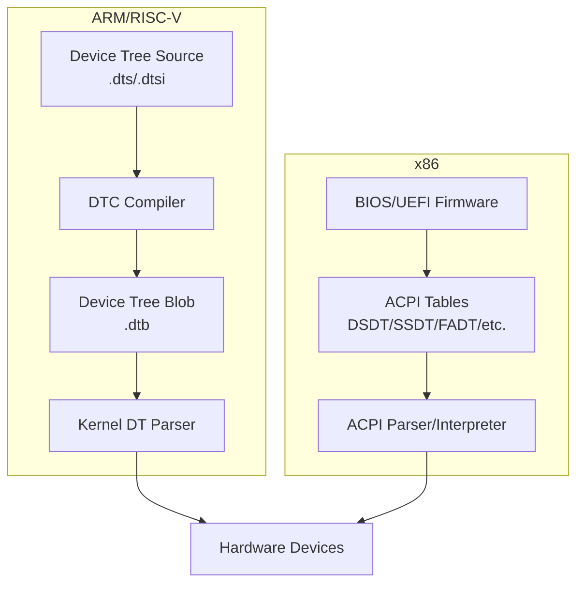
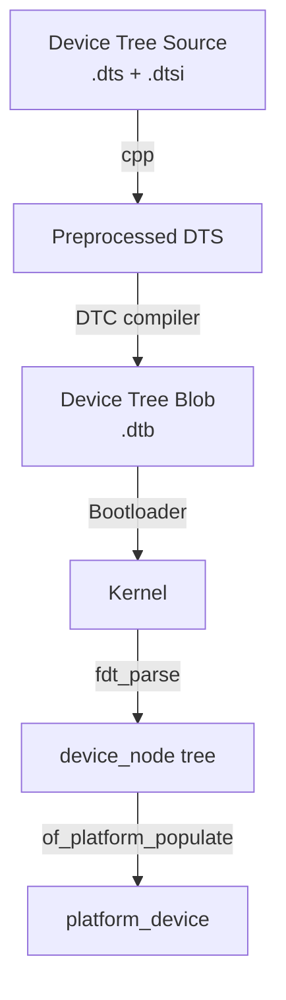
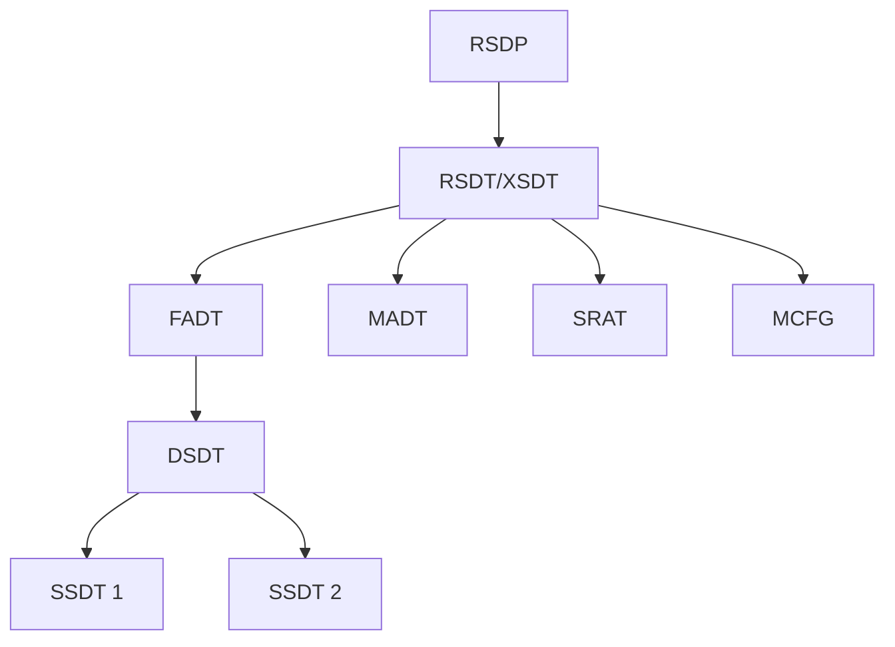

# Chapter 121: Device Tree and ACPI

## Intuition

When the kernel boots, it needs to know what hardware is in the system: how many CPUs are there, where is the memory, what devices are connected, and how are they wired together. On x86 PCs, this information comes from the BIOS/UEFI and ACPI tables. But on ARM and RISC-V systems, there's no standardized firmware interface — instead, the hardware description comes from a **Device Tree** (DT).

The Device Tree is a data structure that describes the hardware layout of a system. It's like a blueprint that tells the kernel "there's a UART at address 0x10000000, it uses interrupt 42, and it's connected to a 115200 baud serial port." The kernel reads this blueprint during boot and creates the appropriate device objects.

ACPI (Advanced Configuration and Power Interface) serves a similar purpose on x86 systems but is much more complex — it includes executable bytecode (AML) that the kernel interprets to discover and configure hardware.

## Architecture

### Device Tree vs. ACPI



### Device Tree Structure

```
/ {
    #address-cells = <2>;
    #size-cells = <2>;

    cpus {
        #address-cells = <1>;
        #size-cells = <0>;

        cpu@0 {
            device_type = "cpu";
            compatible = "arm,cortex-a53";
            reg = <0x0>;
        };

        cpu@1 {
            device_type = "cpu";
            compatible = "arm,cortex-a53";
            reg = <0x1>;
        };
    };

    memory@80000000 {
        device_type = "memory";
        reg = <0x0 0x80000000 0x0 0x40000000>;
    };

    soc {
        #address-cells = <2>;
        #size-cells = <2>;
        compatible = "simple-bus";

        uart@10000000 {
            compatible = "ns16550a";
            reg = <0x0 0x10000000 0x0 0x1000>;
            interrupts = <0 42 4>;
            clock-frequency = <24000000>;
        };

        i2c@10010000 {
            compatible = "snps,designware-i2c";
            reg = <0x0 0x10010000 0x0 0x1000>;
            interrupts = <0 43 4>;

            sensor@48 {
                compatible = "ti,tmp102";
                reg = <0x48>;
            };
        };
    };
};
```

## Kernel Implementation

### Device Tree Parsing

```c
// drivers/of/base.c
// Parse the device tree and create device nodes
struct device_node *of_find_node_by_name(struct device_node *from,
                                          const char *name);

struct device_node *of_find_compatible_node(struct device_node *from,
                                             const char *type,
                                             const char *compat);

// Get properties
int of_property_read_u32(const struct device_node *np,
                          const char *propname, u32 *out_value);

int of_property_read_u32_array(const struct device_node *np,
                                const char *propname,
                                u32 *out_values, size_t sz);

int of_property_read_string(const struct device_node *np,
                             const char *propname,
                             const char **out_string);

bool of_property_read_bool(const struct device_node *np,
                            const char *propname);
```

### Device Tree Bindings

```c
// Example: UART driver with DT support
static const struct of_device_id my_uart_of_match[] = {
    { .compatible = "ns16550a" },
    { .compatible = "ns16550" },
    { /* sentinel */ },
};
MODULE_DEVICE_TABLE(of, my_uart_of_match);

static int my_uart_probe(struct platform_device *pdev)
{
    struct device_node *np = pdev->dev.of_node;
    struct resource *res;
    u32 clock_freq;
    int irq;

    // Get memory resource from DT
    res = platform_get_resource(pdev, IORESOURCE_MEM, 0);
    if (!res)
        return -ENODEV;

    // Map registers
    void __iomem *base = devm_ioremap_resource(&pdev->dev, res);
    if (IS_ERR(base))
        return PTR_ERR(base);

    // Get clock frequency from DT
    if (of_property_read_u32(np, "clock-frequency", &clock_freq)) {
        dev_err(&pdev->dev, "Missing clock-frequency\n");
        return -EINVAL;
    }

    // Get interrupt from DT
    irq = platform_get_irq(pdev, 0);
    if (irq < 0)
        return irq;

    // Register the driver
    // ...
    return 0;
}

static struct platform_driver my_uart_driver = {
    .probe = my_uart_probe,
    .remove = my_uart_remove,
    .driver = {
        .name = "my-uart",
        .of_match_table = my_uart_of_match,
    },
};
```

### ACPI Implementation

```c
// drivers/acpi/
// ACPI table parsing
struct acpi_table_header {
    char signature[4];          // Table signature (DSDT, SSDT, etc.)
    u32 length;
    u8 revision;
    u8 checksum;
    char oem_id[6];
    char oem_table_id[8];
    u32 oem_revision;
    u32 compiler_id;
    u32 compiler_revision;
};

// ACPI device matching
static const struct acpi_device_id my_acpi_match[] = {
    { "MYACPI0001", 0 },
    { "", 0 },
};
MODULE_DEVICE_TABLE(acpi, my_acpi_match);

// ACPI device probing
static int my_acpi_probe(struct platform_device *pdev)
{
    struct acpi_device *adev = ACPI_COMPANION(&pdev->dev);
    acpi_status status;
    u64 sta;

    // Check device status (_STA method)
    status = acpi_evaluate_integer(adev->handle, "_STA", NULL, &sta);
    if (ACPI_FAILURE(status)) {
        dev_err(&pdev->dev, "Failed to evaluate _STA\n");
        return -ENODEV;
    }

    if (!(sta & ACPI_STA_DEVICE_ENABLED))
        return -ENODEV;

    // Get current resources (_CRS method)
    struct acpi_buffer buf = { ACPI_ALLOCATE_BUFFER, NULL };
    status = acpi_evaluate_object(adev->handle, "_CRS", NULL, &buf);
    if (ACPI_FAILURE(status))
        return -ENODEV;

    // Parse resources
    // ...

    return 0;
}
```

### ACPI Tables

```c
// Common ACPI tables:
// RSDP — Root System Description Pointer
// RSDT/XSDT — Root/Extended System Description Table
// FADT — Fixed ACPI Description Table
// DSDT — Differentiated System Description Table
// SSDT — Secondary System Description Table
// MADT — Multiple APIC Description Table
// SRAT — System Resource Affinity Table
// SLIT — System Locality Information Table
// MCFG — PCI Express Memory Mapped Configuration

// Accessing ACPI tables
struct acpi_table_fadt *fadt;
acpi_get_table(ACPI_SIG_FADT, 0,
               (struct acpi_table_header **)&fadt);
```

## Source Code References

| File | Description |
|------|-------------|
| `drivers/of/` | Device Tree subsystem |
| `drivers/of/base.c` | DT base functions |
| `drivers/of/fdt.c` | FDT (flattened DT) parsing |
| `drivers/acpi/` | ACPI subsystem |
| `drivers/acpi/bus.c` | ACPI bus driver |
| `drivers/acpi/osl.c` | OS layer |
| `include/linux/of.h` | DT API |
| `include/linux/acpi.h` | ACPI API |
| `arch/arm64/boot/dts/` | ARM64 device trees |
| `Documentation/devicetree/` | DT documentation |

## Data Structures

### Device Tree Node

```c
// include/linux/of.h
struct device_node {
    const char *name;
    phandle phandle;
    const char *full_name;
    struct fwnode_handle fwnode;
    struct property *properties;
    struct property *deadprops;
    struct device_node *parent;
    struct device_node *child;
    struct device_node *sibling;
    struct kobject kobj;
    unsigned long _flags;
    void *data;
};

struct property {
    char *name;
    int length;
    void *value;
    struct property *next;
};
```

### ACPI Device

```c
// include/acpi/acpi_bus.h
struct acpi_device {
    int device_type;
    acpi_handle handle;
    struct acpi_device *parent;
    struct list_head children;
    struct list_head node;
    struct list_head wakeup_list;
    struct acpi_device_status status;
    struct acpi_device_flags flags;
    struct acpi_device_pnp pnp;
    struct acpi_device_power power;
    struct acpi_device_wakeup wakeup;
    struct acpi_device_perf performance;
    struct acpi_device_dir dir;
    struct acpi_scan_handler *handler;
    struct acpi_driver *driver;
    void *driver_data;
    struct device dev;
    // ...
};
```

## Diagrams

### Device Tree Compilation Flow



### ACPI Table Relationships



## Performance

### Device Tree Parsing

| Operation | Time | Notes |
|-----------|------|-------|
| FDT parsing | ~1-10 ms | Depends on DT size |
| Node creation | ~1-100 μs per node | Memory allocation |
| Property parsing | ~1-10 μs per property | String handling |
| Total DT init | ~10-100 ms | Typical embedded system |

### ACPI Initialization

| Operation | Time | Notes |
|-----------|------|-------|
| ACPI table parsing | ~10-100 ms | Depends on table size |
| AML interpretation | ~1-100 μs per method | Complex methods slower |
| Device enumeration | ~100-1000 ms | Depends on device count |

## Security

### Device Tree Security

1. **DT integrity**: The device tree is trusted data; tampering can compromise the system
2. **Signed DTBs**: Some systems sign device tree blobs
3. **DT overlays**: Dynamic overlays can modify the DT at runtime
4. **Firmware protection**: DTBs loaded by the bootloader should be verified

### ACPI Security

1. **AML security**: ACPI methods can execute arbitrary code
2. **Custom DSDT**: Some BIOS vendors include buggy or malicious AML
3. **ACPI lockdown**: In lockdown mode, some ACPI operations are restricted
4. **ACPI table override**: Can be used for debugging but also for attacks

## Common Pitfalls

1. **DT binding mismatches**: The driver's `compatible` string must match the DT exactly
2. **Missing DT properties**: Always check return values of `of_property_read_*()`
3. **ACPI method failures**: Handle `ACPI_FAILURE()` gracefully
4. **DT overlay conflicts**: Overlays can conflict with the base DT
5. **Platform-specific code**: DT code is architecture-specific; ACPI is x86-centric

## Best Practices

1. **Use standard bindings**: Follow `Documentation/devicetree/bindings/`
2. **Validate DT properties**: Always check return values
3. **Use `devm_` functions**: Automatic resource management
4. **Support both DT and ACPI**: Use `fwnode` for generic code
5. **Test with different DTBs**: Use QEMU to test with different device trees
6. **Document bindings**: Create DT binding documentation for new drivers

## Exercises

1. **DT compilation**: Compile a device tree source to a DTB
2. **DT inspection**: Use `fdtdump` or `dtc -I dtb -O dts` to examine a DTB
3. **DT overlays**: Create a device tree overlay and apply it
4. **ACPI tables**: Use `acpidump` to dump ACPI tables from your system
5. **DT driver**: Write a simple platform driver that reads properties from the device tree
6. **QEMU testing**: Boot a kernel in QEMU with a custom device tree

## References

1. `Documentation/devicetree/` — Device Tree documentation.
2. `Documentation/devicetree/bindings/` — DT binding documentation.
3. `Documentation/firmware-guide/acpi/` — ACPI documentation.
4. `drivers/of/` — Device Tree subsystem source.
5. `drivers/acpi/` — ACPI subsystem source.
6. https://devicetree.org/ — Device Tree specification.
7. https://uefi.org/specifications — ACPI specification.
