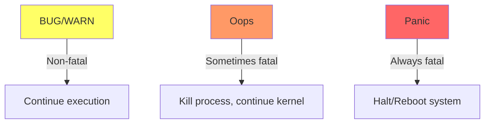
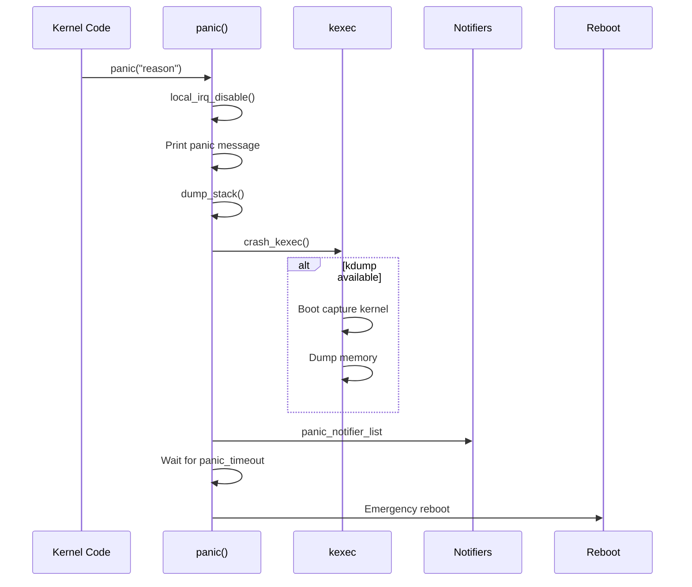

# Chapter 122: Kernel Panic and Oops

## Intuition

When a user-space program crashes — a segmentation fault, a null pointer dereference — the kernel kills the process and moves on. But what happens when the *kernel itself* crashes? There's no higher authority to catch the error and continue. The kernel has two options:

1. **Oops**: A non-fatal kernel error. The kernel logs the error, kills the offending process, and continues running (though in a potentially unstable state).
2. **Panic**: A fatal kernel error. The kernel cannot continue safely, so it halts the system (or reboots after a timeout).

Understanding kernel panics and oopses is essential for debugging kernel issues. The crash output — register values, stack traces, memory dumps — contains the information needed to identify the bug, whether it's a null pointer dereference, a use-after-free, a stack overflow, or a deadlock.

## Architecture

### Error Severity Levels



### Error Flow

```mermaid
flowchart TD
    A[Kernel code] --> B{Error type?}
    B -->|BUG()| C[Print trace, kill task]
    B -->|WARN()| D[Print trace, continue]
    B -->|Oops| E[Print registers, stack trace]
    B -->|Panic| F[Print everything, halt]

    C --> G[Continue if possible]
    D --> G
    E --> H{panic_on_oops?}
    H -->|Yes| F
    H -->|No| G
    F --> I[Reboot after timeout]
```

## Kernel Implementation

### BUG() and BUG_ON()

```c
// include/asm-generic/bug.h
// BUG() — Unconditional kernel bug (always fatal)
#define BUG()                                   \
do {                                            \
    printk("BUG: failure at %s:%d/%s()!\n",     \
           __FILE__, __LINE__, __func__);        \
    barrier_before_unreachable();               \
    __builtin_trap();                           \
} while (0)

// BUG_ON() — Conditional bug
#define BUG_ON(condition)                       \
do {                                            \
    if (unlikely(condition))                    \
        BUG();                                  \
} while (0)

// Example:
BUG_ON(ptr == NULL);  // Panics if ptr is NULL
```

### WARN() and WARN_ON()

```c
// include/asm-generic/bug.h
// WARN() — Warning (prints trace but continues)
#define WARN(condition, format...)              \
({                                              \
    int __ret_warn_on = !!(condition);          \
    if (unlikely(__ret_warn_on))                \
        __WARN_printf(format);                  \
    unlikely(__ret_warn_on);                    \
})

// WARN_ON() — Simple warning
#define WARN_ON(condition)                      \
({                                              \
    int __ret_warn_on = !!(condition);          \
    if (unlikely(__ret_warn_on))                \
        __WARN();                               \
    unlikely(__ret_warn_on);                    \
})

// WARN_ONCE() — Print warning only once
#define WARN_ON_ONCE(condition)                 \
({                                              \
    static bool __section(.data.once) __warned; \
    int __ret_warn_on = !!(condition);          \
    if (unlikely(__ret_warn_on && !__warned)) { \
        __warned = true;                        \
        WARN_ON(1);                             \
    }                                           \
    unlikely(__ret_warn_on);                    \
})
```

### Oops Handling

```c
// arch/x86/kernel/dumpstack.c
void die(const char *str, struct pt_regs *regs, long err)
{
    // Prevent recursion
    oops_enter();

    // Print the oops header
    printk(KERN_EMERG "BUG: unable to handle kernel %s at %lx\n",
           str, regs->ip);

    // Print register values
    show_registers(regs);

    // Print stack trace
    show_stack(regs, NULL, KERN_EMERG);

    // Print memory around instruction pointer
    show_instructions(regs);

    // Mark task as dying
    if (regs->flags & X86_VM_MASK)
        pr_emerg("Kernel panic - not syncing: Attempted to kill init!\n");

    // Check if we should panic
    if (panic_on_oops)
        panic("Oops in interrupt handler");

    // Otherwise, kill the offending task
    oops_exit();
    do_exit(SIGSEGV);
}
```

### panic()

```c
// kernel/panic.c
void panic(const char *fmt, ...)
{
    static char buf[1024];
    va_list args;
    long i, i_next = 0;
    int state = 0;

    // Disable interrupts
    local_irq_disable();

    // Print the panic message
    va_start(args, fmt);
    vsnprintf(buf, sizeof(buf), fmt, args);
    va_end(args);

    pr_emerg("Kernel panic - not syncing: %s\n", buf);

    // Print stack trace
    dump_stack();

    // Trigger kexec if available
    crash_kexec(NULL);

    // Send panic notification
    atomic_notifier_call_chain(&panic_notifier_list, 0, buf);

    // Blink the keyboard LEDs
    if (panic_blink)
        while (i++ < 1000000)
            state ^= panic_blink();

    // Wait for reboot
    if (panic_timeout > 0) {
        pr_emerg("Reboot in %d seconds...\n", panic_timeout);
        for (;;) {
            mdelay(1000 * panic_timeout);
        }
    }

    // Halt
    for (;;)
        halt();
}
```

### Kernel Crash Dumps (kdump)

```c
// When a panic occurs, kexec can boot a "capture kernel"
// that dumps the memory of the crashed kernel

// Enable kdump:
// 1. Install kexec-tools
// 2. Load the capture kernel: kexec -p /path/to/vmlinuz --initrd=/path/to/initrd
// 3. Configure /etc/kdump.conf
// 4. Set kernel.panic = 10 in /etc/sysctl.conf

// Crash dump analysis:
// crash /path/to/vmlinux /path/to/vmcore
```

### Debugging with Crash

```bash
# Analyze a crash dump
crash /usr/lib/debug/boot/vmlinux-$(uname -r) /var/crash/*/vmcore

# Inside crash:
crash> bt              # Backtrace of current task
crash> bt -a           # Backtrace of all CPUs
crash> log             # Kernel log
crash> ps              # Process list
crash> vm              # Virtual memory info
crash> kmem            # Kernel memory info
crash> struct task_struct <address>  # Examine structure
crash> dis <address>   # Disassemble
crash> rd <address>    # Read memory
```

## Source Code References

| File | Description |
|------|-------------|
| `kernel/panic.c` | panic() implementation |
| `arch/x86/kernel/dumpstack.c` | x86 stack dumping |
| `include/asm-generic/bug.h` | BUG/WARN macros |
| `kernel/kexec_core.c` | kexec/kdump support |
| `arch/x86/kernel/traps.c` | Exception handlers |
| `kernel/watchdog.c` | Hung task detection |
| `kernel/hung_task.c` | Hung task warnings |
| `Documentation/admin-guide/bug-hunting.rst` | Bug hunting guide |

## Data Structures

### pt_regs — Register Dump

```c
// arch/x86/include/asm/ptrace.h
struct pt_regs {
    unsigned long r15;
    unsigned long r14;
    unsigned long r13;
    unsigned long r12;
    unsigned long bp;
    unsigned long bx;
    unsigned long r11;
    unsigned long r10;
    unsigned long r9;
    unsigned long r8;
    unsigned long ax;
    unsigned long cx;
    unsigned long dx;
    unsigned long si;
    unsigned long di;
    unsigned long orig_ax;
    unsigned long ip;
    unsigned long cs;
    unsigned long flags;
    unsigned long sp;
    unsigned long ss;
};
```

## Diagrams

### Oops Output Anatomy

```mermaid
graph TD
    subgraph "Oops Header"
        H1[BUG: unable to handle kernel NULL pointer dereference]
        H2[Oops: 0000 [#1] SMP]
    end

    subgraph "Register Dump"
        R1[CPU: 0 PID: 1234 Comm: my_process]
        R2[RIP: 0010:my_function+0x42/0x100]
        R3[RSP: 0018:ffff88003fc03e08]
    end

    subgraph "Stack Trace"
        S1[Call Trace:]
        S2[my_function+0x42/0x100]
        S3[caller_function+0x24/0x50]
    end

    subgraph "Code Dump"
        C1[Code: 48 8b 45 00 48 89 ...]
    end
```

### Panic Flow



## Performance

### Oops vs. Panic Impact

| Event | Impact | Recovery |
|-------|--------|----------|
| BUG() | Process killed | Continue (unstable) |
| WARN() | Warning only | Continue |
| Oops | Process killed | Continue (unstable) |
| Panic | System halted | Reboot required |

### Crash Dump Performance

| Operation | Time | Notes |
|-----------|------|-------|
| kdump boot | ~10-30 s | Capture kernel boot |
| Memory dump | ~1-10 min | Depends on RAM size |
| Analysis | Variable | Depends on issue complexity |

## Security

### Kernel Panic Security

1. **DoS via panic**: Attackers can trigger panics to cause denial of service
2. **panic_on_oops**: Setting this to 1 causes any oops to panic (more secure but less available)
3. **Crash dumps**: May contain sensitive data (passwords, keys) — secure dump files
4. **SysRq**: Magic key sequences can trigger panics — restrict access

```bash
# Restrict SysRq
echo 0 > /proc/sys/kernel/sysrq  # Disable
echo 176 > /proc/sys/kernel/sysrq  # Allow some operations

# Configure panic behavior
echo 1 > /proc/sys/kernel/panic_on_oops  # Oops = panic
echo 10 > /proc/sys/kernel/panic_on_warn  # WARN = panic
echo 10 > /proc/sys/kernel/panic          # Auto-reboot after 10s
```

## Common Pitfalls

1. **Not saving crash dumps**: Configure kdump before you need it
2. **Ignoring WARN()**: WARNs indicate potential bugs that may become panics
3. **panic_on_oops=0**: Running with this in production can lead to data corruption
4. **Not analyzing crash dumps**: Use `crash` tool to find the root cause
5. **Stack overflows**: Deep recursion can cause silent corruption before a panic

## Best Practices

1. **Enable kdump**: Essential for debugging production panics
2. **Use WARN() not BUG()**: BUG() is too aggressive; prefer WARN() for recoverable errors
3. **Use pr_err() with context**: Include device name, function name, and error details
4. **Test panic paths**: Deliberately trigger panics to verify kdump works
5. **Secure crash dumps**: They may contain sensitive data
6. **Use lockup detectors**: `CONFIG_SOFTLOCKUP_DETECTOR` and `CONFIG_HARDLOCKUP_DETECTOR`

## Exercises

1. **Oops simulation**: Write a kernel module that triggers an Oops (NULL pointer dereference)
2. **Panic simulation**: Write a module that triggers a panic and observe the output
3. **WARN vs BUG**: Write modules that use both and compare the output
4. **kdump setup**: Configure kdump on a test system and trigger a crash
5. **Crash analysis**: Analyze a crash dump using the `crash` tool
6. **SysRq**: Use SysRq keys to trigger a panic and reboot

## References

1. `Documentation/admin-guide/bug-hunting.rst` — Bug hunting guide.
2. `Documentation/admin-guide/kdump/` — kdump documentation.
3. `kernel/panic.c` — panic() source.
4. `arch/x86/kernel/dumpstack.c` — Stack dumping.
5. https://crash-utility.github.io/ — Crash tool documentation.
6. `Documentation/admin-guide/sysctl/kernel.rst` — Kernel sysctl parameters.
