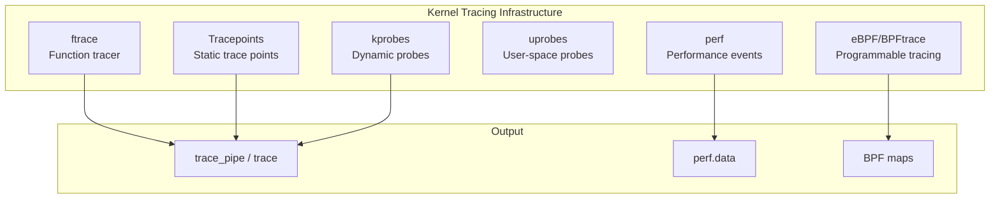
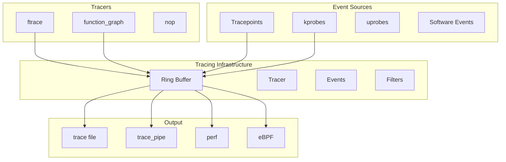
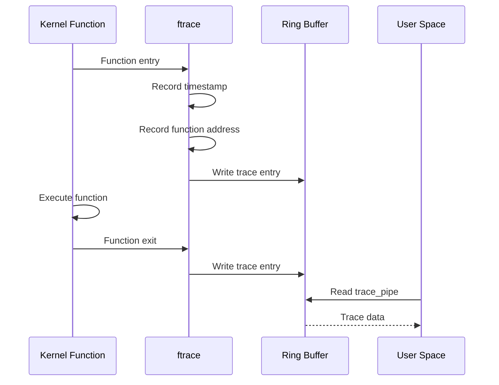

# Chapter 123: Kernel Tracing

## Intuition

When debugging a user-space program, you might use a debugger (GDB) to step through code, set breakpoints, and inspect variables. But debugging the kernel is fundamentally different — you can't pause the entire system to step through code. The kernel is always running, managing hardware, handling interrupts, and serving processes. You need a way to observe what the kernel is doing in real-time, without stopping it.

Kernel tracing provides exactly this capability. It's like having X-ray vision into the kernel — you can see which functions are being called, how long they take, what events are occurring, and what data is flowing through the system. The Linux kernel includes a powerful tracing infrastructure built around **ftrace**, **tracepoints**, **kprobes**, and **eBPF**.

Understanding kernel tracing is essential for performance analysis, debugging, and understanding kernel behavior. It's the difference between guessing what the kernel is doing and *knowing*.

## Architecture

### Tracing Subsystems



### Tracing Interface

```bash
# All tracing goes through debugfs/tracefs
/sys/kernel/debug/tracing/
# or
/sys/kernel/tracing/

# Key files:
# trace           — Read trace output
# trace_pipe      — Streaming trace output
# current_tracer  — Set the active tracer
# set_ftrace_filter — Filter functions to trace
# tracing_on      — Enable/disable tracing
# events/         — Tracepoint events
```

## Kernel Implementation

### ftrace — Function Tracer

ftrace traces kernel function calls. It works by replacing the first instruction of each function with a call to a tracing routine.

```bash
# List available tracers
cat /sys/kernel/debug/tracing/available_tracers
# nop function function_graph

# Enable function tracer
echo function > /sys/kernel/debug/tracing/current_tracer

# Start tracing
echo 1 > /sys/kernel/debug/tracing/tracing_on

# Read trace output
cat /sys/kernel/debug/tracing/trace

# Example output:
# # tracer: function
# #
# # entries-in-buffer/entries-written: 1000/10000   #P:8
# #
# #                           TASK-PID     CPU#  TIMESTAMP       FUNCTION
# #                              | |         |    |              |
#              <idle>-0     [000]  1234.567890: schedule <-__schedule
#              <idle>-0     [000]  1234.567891: pick_next_task_fair <-__schedule
#           sshd-1234   [001]  1234.567892: tcp_sendmsg <-sock_sendmsg

# Stop tracing
echo 0 > /sys/kernel/debug/tracing/tracing_on
echo nop > /sys/kernel/debug/tracing/current_tracer
```

#### Function Graph Tracer

```bash
# Function graph tracer (shows call graph with timing)
echo function_graph > /sys/kernel/debug/tracing/current_tracer

# Set max depth
echo 5 > /sys/kernel/debug/tracing/max_graph_depth

# Read output
cat /sys/kernel/debug/tracing/trace

# Example output:
#  1)               |  open_ctree() {
#  1)   0.234 us    |    btrfs_alloc_path();
#  1)   0.123 us    |    btrfs_read_lock_root_node();
#  1)               |    btrfs_search_slot() {
#  1)   0.045 us    |      btrfs_item_key_to_cpu();
#  1)   0.234 us    |    }
#  1)   1.567 us    |  }
```

### Tracepoints

Tracepoints are static instrumentation points placed in the kernel code by developers.

```bash
# List available tracepoints
ls /sys/kernel/debug/tracing/events/

# Categories include:
# block/    — Block I/O events
# net/      — Networking events
# sched/    — Scheduler events
# irq/      — Interrupt events
# syscalls/ — System call events
# task/     — Task events

# Enable a specific tracepoint
echo 1 > /sys/kernel/debug/tracing/events/sched/sched_switch/enable

# Enable all tracepoints in a category
echo 1 > /sys/kernel/debug/tracing/events/sched/enable

# Read tracepoint format
cat /sys/kernel/debug/tracing/events/sched/sched_switch/format
# name: sched_switch
# ID: 247
# format:
#  field:unsigned short common_type;
#  field:unsigned char common_flags;
#  field:unsigned char common_preempt_count;
#  field:int common_pid;
#  field:char prev_comm[16];
#  field:pid_t prev_pid;
#  field:int prev_prio;
#  field:long prev_state;
#  field:char next_comm[16];
#  field:pid_t next_pid;
#  field:int next_prio;
```

### Tracepoint Definition

```c
// include/trace/events/sched.h
TRACE_EVENT(sched_switch,

    TP_PROTO(bool preempt,
             struct task_struct *prev,
             struct task_struct *next),

    TP_ARGS(preempt, prev, next),

    TP_STRUCT__entry(
        __array(char, prev_comm, TASK_COMM_LEN)
        __field(pid_t, prev_pid)
        __field(int, prev_prio)
        __field(long, prev_state)
        __array(char, next_comm, TASK_COMM_LEN)
        __field(pid_t, next_pid)
        __field(int, next_prio)
    ),

    TP_fast_assign(
        memcpy(__entry->next_comm, next->comm, TASK_COMM_LEN);
        __entry->prev_pid = prev->pid;
        __entry->prev_prio = prev->prio;
        __entry->prev_state = prev->__state;
        memcpy(__entry->next_comm, next->comm, TASK_COMM_LEN);
        __entry->next_pid = next->pid;
        __entry->next_prio = next->prio;
    ),

    TP_printk("prev_comm=%s prev_pid=%d prev_prio=%d prev_state=%s%s ==> next_comm=%s next_pid=%d next_prio=%d",
        __entry->prev_comm, __entry->prev_pid, __entry->prev_prio,
        __entry->prev_state & TASK_STATE_MAX ? __print_flags(__entry->prev_state & TASK_STATE_MAX, "|", TASK_STATE_TO_CHAR_STR) : "R",
        __entry->prev_state & TASK_STATE_MAX ? "+" : "",
        __entry->next_comm, __entry->next_pid, __entry->next_prio)
);
```

### kprobes — Dynamic Probes

kprobes allow you to dynamically instrument any kernel function.

```bash
# List available kprobe events
ls /sys/kernel/debug/tracing/events/kprobes/

# Add a kprobe
echo 'p:myprobe do_sys_open filename=+0(%si):string' \
    > /sys/kernel/debug/tracing/kprobe_events

# Enable the kprobe
echo 1 > /sys/kernel/debug/tracing/events/kprobes/myprobe/enable

# Read output
cat /sys/kernel/debug/tracing/trace

# kretprobe (return probe)
echo 'r:myretprobe do_sys_open ret=$retval' \
    > /sys/kernel/debug/tracing/kprobe_events
```

### BPF Tracing

```bash
# Using bpftrace (high-level tracing language)
# Trace system calls
bpftrace -e 'tracepoint:syscalls:sys_enter_openat { printf("%s %s\n", comm, str(args->filename)); }'

# Histogram of read() bytes
bpftrace -e 'tracepoint:syscalls:sys_exit_read /args->ret > 0/ { @bytes = hist(args->ret); }'

# Count function calls
bpftrace -e 'kprobe:tcp_sendmsg { @[comm] = count(); }'

# Latency histogram
bpftrace -e 'kprobe:do_sys_open { @start[tid] = nsecs; } kretprobe:do_sys_open /@start[tid]/ { @usecs = hist((nsecs - @start[tid]) / 1000); delete(@start[tid]); }'
```

### perf — Performance Analysis

```bash
# Record function call graph
perf record -g -a sleep 10

# Report
perf report

# Top functions
perf top

# Trace specific events
perf trace -e open,read,write

# System-wide profiling
perf stat -a sleep 5

# Cache misses
perf stat -e cache-misses,cache-references sleep 5

# CPU cycles
perf stat -e cycles,instructions,branches,branch-misses sleep 5
```

## Source Code References

| File | Description |
|------|-------------|
| `kernel/trace/ftrace.c` | ftrace core |
| `kernel/trace/trace.c` | Tracing core |
| `kernel/trace/trace_events.c` | Trace events |
| `kernel/trace/trace_kprobe.c` | kprobes |
| `kernel/trace/trace_uprobe.c` | uprobes |
| `kernel/trace/bpf_trace.c` | BPF tracing |
| `include/linux/ftrace.h` | ftrace API |
| `include/trace/events/` | Tracepoint definitions |
| `include/linux/kprobes.h` | kprobes API |
| `tools/perf/` | perf tool source |
| `tools/bpf/bpftrace/` | bpftrace source |

## Data Structures

### Trace Event

```c
// include/linux/tracepoint.h
struct tracepoint {
    const char *name;
    struct static_key key;
    struct tracepoint_func *funcs;
};

struct tracepoint_func {
    void *func;
    void *data;
    int prio;
};
```

### kprobe

```c
// include/linux/kprobes.h
struct kprobe {
    struct hlist_node hlist;
    struct list_head list;
    unsigned long nmissed;
    kprobe_opcode_t *addr;
    const char *symbol_name;
    unsigned int offset;
    kprobe_pre_handler_t pre_handler;
    kprobe_post_handler_t post_handler;
    kprobe_fault_handler_t fault_handler;
    kprobe_break_handler_t break_handler;
    kprobe_opcode_t opcode;
    struct arch_specific_insn ainsn;
    u32 flags;
};

struct kretprobe {
    struct kprobe kp;
    kretprobe_handler_t handler;
    kretprobe_handler_t entry_handler;
    int maxactive;
    int nmissed;
    struct kretprobe_instance __percpu *rp;
};
```

## Diagrams

### Tracing Architecture



### ftrace Function Call Tracing



## Performance

### Tracing Overhead

| Tracer | Overhead | Notes |
|--------|----------|-------|
| nop | 0 | Disabled |
| function | ~1-5% | Per-function call overhead |
| function_graph | ~5-10% | Includes timing |
| tracepoint (disabled) | 0 | Static branch optimization |
| tracepoint (enabled) | ~10-50 ns | Per event |
| kprobe | ~10-100 ns | Dynamic instrumentation |
| eBPF | ~100-1000 ns | Depends on program complexity |

### Tracing Best Practices

```bash
# Use filters to reduce overhead
echo 'prev_pid == 1234' > /sys/kernel/debug/tracing/events/sched/sched_switch/filter

# Use per-CPU buffers
echo 8192 > /sys/kernel/debug/tracing/buffer_size_kb

# Use instance isolation
mkdir /sys/kernel/debug/tracing/instances/mytrace
echo function > /sys/kernel/debug/tracing/instances/mytrace/current_tracer
```

## Security

### Tracing Security

1. **Root required**: Most tracing operations require root privileges
2. **Information leakage**: Tracing can expose sensitive data (file names, network data)
3. **Performance impact**: Tracing can significantly impact system performance
4. **Kernel lockdown**: In lockdown mode, tracing may be restricted
5. **eBPF security**: BPF programs are verified before execution

```bash
# Restrict tracing access
chmod 700 /sys/kernel/debug/tracing

# Use perf_event_paranoid
echo 2 > /proc/sys/kernel/perf_event_paranoid

# Lockdown mode
cat /sys/kernel/security/lockdown
```

## Common Pitfalls

1. **Forgetting to disable tracing**: Always disable tracing when done
2. **Not filtering**: Tracing all functions generates enormous output
3. **Ring buffer overflow**: Use `tracing_on` carefully; the ring buffer has limited size
4. **kprobe address errors**: Invalid kprobe addresses cause crashes
5. **Not using trace_pipe for streaming**: `trace` file blocks; `trace_pipe` streams

## Best Practices

1. **Start with tracepoints**: They're stable, documented, and have low overhead
2. **Use function_graph for timing**: Better than function tracer for understanding call patterns
3. **Use bpftrace for ad-hoc tracing**: Quick and powerful for one-off investigations
4. **Use perf for profiling**: Best for performance analysis
5. **Filter aggressively**: Only trace what you need
6. **Use trace-cmd**: Simplifies ftrace usage

## Exercises

1. **ftrace basics**: Enable the function tracer and trace a simple command
2. **function_graph**: Use the function_graph tracer to measure function call depth
3. **Tracepoints**: Enable scheduler tracepoints and analyze context switches
4. **kprobes**: Create a kprobe on a kernel function and observe the output
5. **bpftrace**: Write a bpftrace script to trace file opens
6. **perf profiling**: Use `perf` to profile a workload and find hot functions

## References

1. `Documentation/trace/ftrace.rst` — ftrace documentation.
2. `Documentation/trace/events.rst` — Trace events documentation.
3. `Documentation/trace/kprobes.rst` — kprobes documentation.
4. `Documentation/trace/tracepoint-architecture.rst` — Tracepoint architecture.
5. https://bpftrace.org/ — bpftrace documentation.
6. https://perf.wiki.kernel.org/ — perf documentation.
7. Gregg, B. *BPF Performance Tools*. Addison-Wesley, 2019.
8. Rostedt, S. "ftrace: Tracing the kernel," LinuxCon, 2010.
